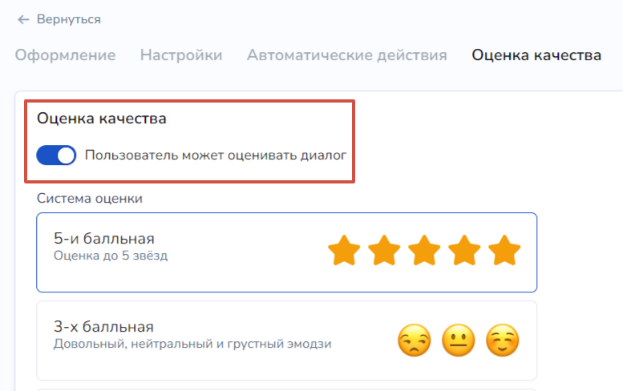

# Аналитика для онлайн-чата

С помощью вкладки "Онлайн-чат" можно провести оценку и качество оказываемой поддержки на вашем курсе или на сайте, к которому вы привязали чат.&#x20;

<figure><figcaption></figcaption></figure>

Если у вас уже есть существующий онлайн-чат, то перейдите в настройках во вкладку "Оценка качества":

<figure><figcaption></figcaption></figure>


Как настроить создать и настроить онлайн-чат, читайте в [одноименной статье](/broken/pages/-M1KvJVpNh4GFYbYGYgQ).&#x20;


Далее можно настроить оценку качества по своему усмотрению.&#x20;

### Как пользователь оценивает диалог?

После того, как оператор завершил диалог с клиентом, пользователю направляется форма оценки качества работы сотрудника.&#x20;


Оператор не видит форму оценки качества, также и не видит, какую ему оценку поставил клиент.


Далее все статистические данные отображаются во вкладке "Онлайн-чат" в аналитике. При этом, даже если клиент не оставил никакую оценку, это также отобразится в статистике:

<figure><figcaption></figcaption></figure>

Также вы сможете увидеть в этом же разделе аналитики отзывы на диалоги чуть ниже.&#x20;

### Фильтры аналитики онлайн-чата

При переходе в раздел "Онлайн-чат" без примененных фильтров отображается все оценки работы кураторов/операторов во всех онлайн-чатах:

<figure><figcaption></figcaption></figure>

Можно просмотреть аналитику по различным периодам — для этого необходимо выбрать дату, с которой нужно просмотреть оценки:

<figure><figcaption></figcaption></figure>

Также, если у вас создано и подключено несколько онлайн-чатов, то можно выбрать данные только для определенного чата:

<figure><figcaption></figcaption></figure>

Далее можно просмотреть оценки только для определенного сотрудника (оператора, куратора и пр.):

<figure><figcaption></figcaption></figure>

И также выбрать оценки работы вашего онлайн-чата:

<figure><figcaption></figcaption></figure>

После того, как вы выбрали необходимые фильтры, нажмите "Применить".
