# Аналитика клиентов

Раздел "Клиенты" представлен в виде виджетов, установленных по умолчанию, а также конструктора виджета, где можно отобразить любые необходимые данные. Данный раздел состоит из следующих подразделов:

В разделе клиенты вы можете наблюдать сводку по рассылкам, отправленным и полученным сообщениям, а также соотношение клиентов в круговой диаграмме по подключенным каналам.&#x20;

<figure><figcaption></figcaption></figure>

По умолчанию в разделе "Аналитика" - "Клиенты" существуют три виджета, о которых расскажем подробнее далее:

1. [Сводка](analitika-klientov.md#vidzhet-svodka);
2. [Клиенты](analitika-klientov.md#vidzhet-klienty);
3. [Клиенты по каналам](analitika-klientov.md#vidzhet-klienty-po-kanalam).

Виджеты можно менять местами друг с другом: для этого потяните виджет за такую кнопку:

<figure><figcaption></figcaption></figure>

Затем расположите виджет в нужное место.

## Виджеты по умолчанию

### **Виджет "Сводка"**

Виджет по умолчанию "Сводка" представляет собой краткий обзор аналитики по клиентам, подразделяющийся на несколько частей:

* Обзор количества новых клиентов по каналам за определенный период:

<figure><figcaption></figcaption></figure>

На примере выше видно, какое количество и из каких мессенджеров (каналов) пришли клиенты за выбранный временной промежуток.

* Данные по рассылкам и сообщениям, где видно количество отправленных и полученных сообщений по мессенджерам и количество осуществленных рассылок:

<figure><figcaption></figcaption></figure>

* Выбранный период времени сводки:

<figure>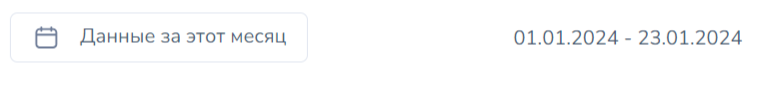<figcaption></figcaption></figure>

Если необходимо просмотреть сводку по другому промежутку времени (нынешний или предыдущий день; месяц, год или иной период), необходимо кликнуть по иконке календаря, затем выбрать подходящий период:

<figure>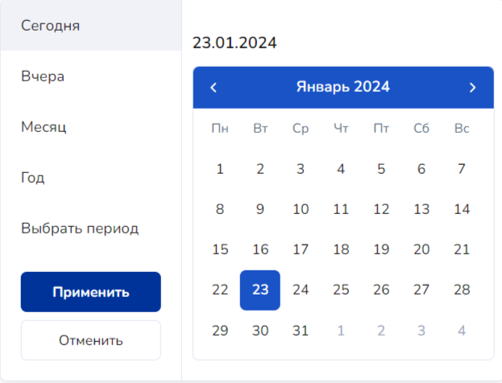<figcaption></figcaption></figure>

При просмотре статистики в виджетах, вы можете заметить напротив цифр, выделенным черным цветом и обозначающих общее количество сообщений/рассылок за весь период, зеленый кружочек - это данные за выбранный промежуток времени:

<figure>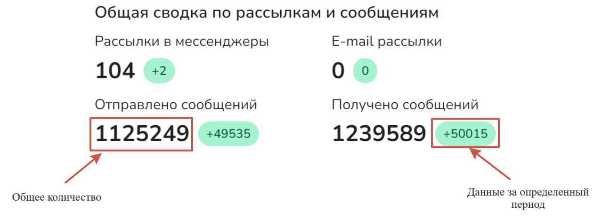<figcaption></figcaption></figure>

### **Виджет "Клиенты"**

<figure>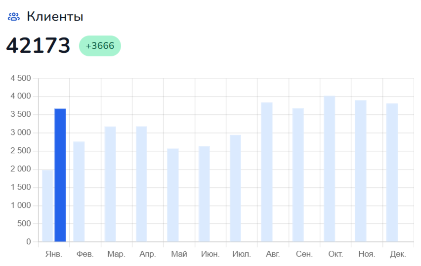<figcaption></figcaption></figure>

Данный виджет также условно можно подразделить на две составляющие:

а) Общее количество клиентов за год и за месяц, отображаемое вверху диаграммы:

<figure>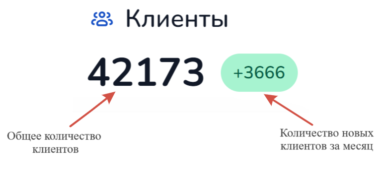<figcaption></figcaption></figure>

б) Столбчатая диаграмма, в которой отображен период с января по декабрь:

<figure>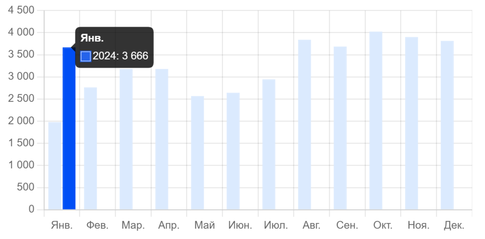<figcaption></figcaption></figure>

Нынешний учетный месяц в диаграмме, за который высчитывается количество новых клиентов и отображается вверху виджета, выделен синим цветом, остальные подучетные месяцы - голубым.&#x20;

В данном виджете также можно менять цвета столбцов для большей наглядности:

<figure><figcaption></figcaption></figure>

Здесь же, в настройках виджета, можно применить иные фильтры отображения статистики:

* По спискам и меткам:

<figure><figcaption></figcaption></figure>

Чтобы выбрать нужные списки и метки, кликните на галочку напротив каждой необходимой позиции.

* По каналам:

<figure><figcaption></figcaption></figure>

* По блоку воронки:

<figure><figcaption></figcaption></figure>

* По клиентам:

<figure><figcaption></figcaption></figure>

* По тегу:

<figure><figcaption></figcaption></figure>

Тег - это системная переменная, которая указывается в настройках сайта. Тег присваивается клиенту, если он запустил бота с сайта и если вы указали тег в настройках сайта.&#x20;


Подробнее о теге рассказали в разделе "[ТЕГ](/broken/pages/2TrIRoeYDBBvuN7VZouE#teg)" в настройках страницы сайта.


### **Виджет "Клиенты по каналам"**

<figure><figcaption></figcaption></figure>

Данный виджет представлен в виде круговой диаграммы, где отображены соотношение количества клиентов по различным каналам (мессенджерам) друг к другу.&#x20;

Из виджета, представленного в качестве примера, видно:

а) общее количество новых клиентов за отчетный период (в данном случае это с 01.01.2024 по 23.01.2024);

б) диаграмму, отображающую соотношения числа клиентов по различным мессенджерам;

в) мессенджеры, по которым осуществляется выборка для статистики и количество клиентов напротив наименования канала (мессенджера);

г) отчетный период (нажав на иконку календаря, можно выбрать нынешний или предыдущий день, месяц, год или иной промежуток времени).&#x20;

#### Видео-разбор



## **Как создать виджет в разделе "Клиенты"**

Для того чтобы создать свой виджет, нужно нажать на кнопку "Добавить виджет", где можно применить необходимый функционал и отобразить все в нужном ключе.&#x20;

<figure>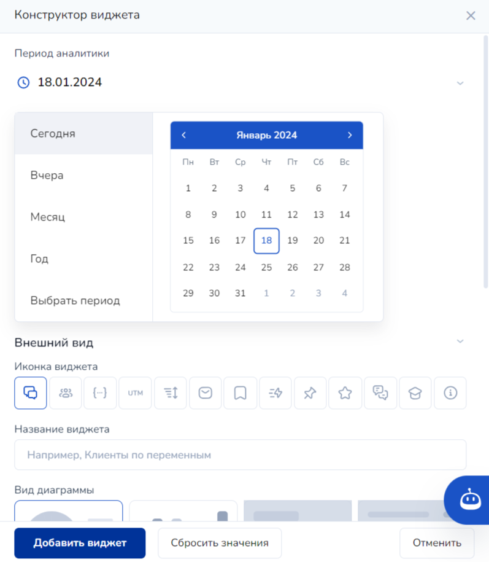<figcaption></figcaption></figure>

В данном случае откроется дополнительное окно конструктора виджета, где:

1. Вы сами выбираете период, который будет отображаться в статистике: это может быть день (нынешний или предыдущий); месяц, год или любой другой период, который предпочтете необходимым.&#x20;
2. Настроить внешний вид виджета также можно по своему усмотрению:&#x20;

* выбор для вида иконки виджета: например, для учета количества сообщений можно выбрать диалоговую иконку, если для обучения - то соответственно иконку с конфедераткой и т.п.
* вид диаграммы для отображения статистики: круговая, столбчатая, линейчатая и упрощенная:

<figure>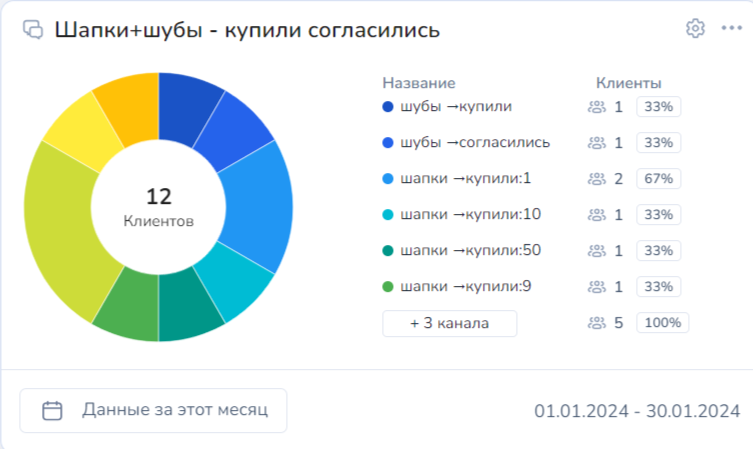<figcaption>
Круговая диаграмма
</figcaption></figure> <figure>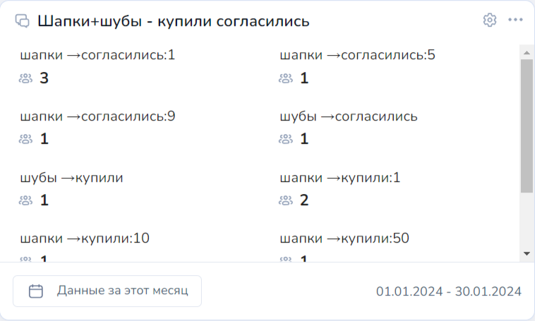<figcaption>
Упрощенная диаграмма
</figcaption></figure>

<figure>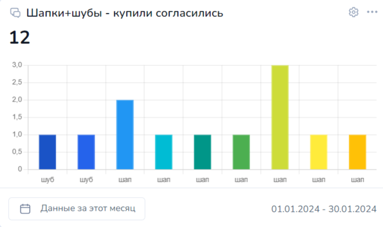<figcaption>
Столбчатая диаграмма
</figcaption></figure> <figure>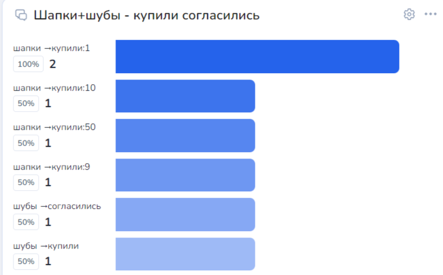<figcaption>
Линейчатая диаграмма
</figcaption></figure>

В конструкторе виджетов вы можете настроить отображение по переменным, а также использовать отдельно конверсию:

<figure><figcaption></figcaption></figure>

### Переменные

Во вкладке "Переменные" необходимо указать значения переменной для учета статистики:

<figure>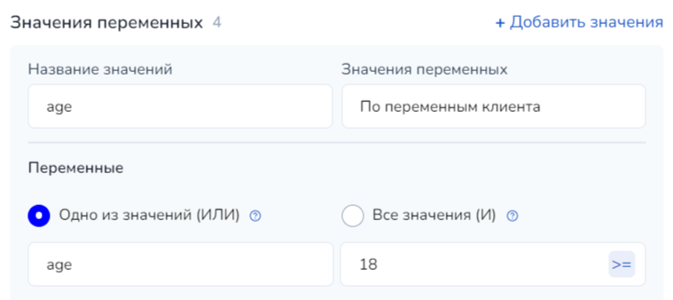<figcaption></figcaption></figure>

На примере выше мы указали переменную age, в которую записывается возраст клиента в боте. Поскольку нами указано "По переменным клиента", система будет считывать значения клиентов именно по данной переменной и будет учитывать только тех, кому 18 и старше.&#x20;

В своем проекте вы можете использовать самые разные переменные, которые существуют в вашем проекте: это может быть и сумма оплат, например, если вы хотите высчитывать статистику по определенному тарифу; город проживания и т.п.&#x20;


Каждая строка в отображаемом виджете соответствует значению переменной, которую вы обозначили при его настройке.&#x20;

Максимальное количество строк (значений переменной) - 6.&#x20;


#### Операторы "И" и "ИЛИ"

<figure>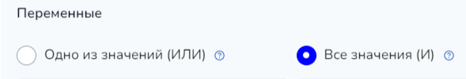<figcaption></figcaption></figure>

Если вы передаете для аналитики одно значение, то можно выбрать любой из операторов. Однако в случае, если передаете несколько значений, то стоит разобраться, в чем различие данных фильтров:

1. Фильтрация по оператору "И" обозначает включение значений всех переменных.&#x20;

То есть, если вы выбрали "И", то система будет осуществлять поиск и включение в статистику только тех, у кого есть <mark style="color:red;">**сразу несколько выбранных значений**</mark> переменных.&#x20;

Например, если вы выбрали переменную age, присвоили ей значений 18, а также выбрали переменную gender, присвоив ей значение male (мужчина), и поставили фильтрацию "И", то система осуществит выборку только по тем клиентам, которые являются мужчинами старше 18 лет.&#x20;

<figure>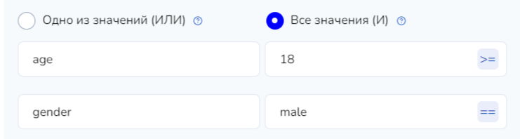<figcaption></figcaption></figure>

Условно система понимает, что нужен клиент И старше 18, И мужчина. Других клиентов система не включит в статистику.&#x20;

**Как работает И:**

Можно также делать поиск только по одной переменной.

<figure>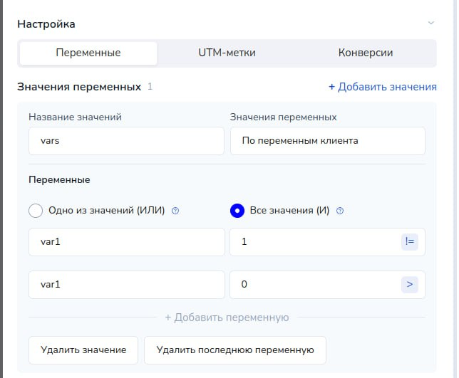<figcaption></figcaption></figure>

Если написать var1 = 1, var2 = 2, система вернет 0: это сделано для того, чтобы можно было ставить некоторые условия типа var1 != 1 **И** var1 > 0 - в таком случае система вернет тех клиентов, чьи переменные не равны одному и больше нулю (со значениями 2, 3, 4 и т.п.).&#x20;


Обращаем внимание!

Название переменной для **оператора И** для всех строчек должно быть одним.

Например:

per1 = 1 AND pre2 = 2 - является НЕверным!&#x20;

per1 < 400 AND per1 > 4 - верное написание для переменных.&#x20;



Если Вам необходимо использовать переменные следующим образом:

per1 = 1 AND pre2 = 2, то воспользуйтесь оператором ИЛИ.&#x20;


2. Фильтрация по оператору "ИЛИ" включает одно из несколько значений (или несколько).&#x20;

Такой фильтр применяется в том случае, если вам нужна выборка клиентов с различными значениями переменных: например, вам нужны клиенты либо старше 18 лет, либо проживающие в городе Москве.&#x20;

Тогда оператор "ИЛИ" включит в выборку всех, у кого есть одна из двух переменных age или city:

То есть, условно система понимает, что нужны те, кто ИЛИ старше 18, ИЛИ проживающие в Москве.&#x20;

**Как работает ИЛИ**:&#x20;

<figure><figcaption></figcaption></figure>

Переменные : var1 = 1, var2 = 2 , где система ищет любого клиента, у которого хоть одна из них совпадает с выбранным значением (_можно передать без значения - тогда система просто смотрит ее наличие_)


Что такое переменные и как с ними работать, прочтите в статье "[Переменные](/broken/pages/-LxpXZscJeU6Wb2MlqSH)".&#x20;


Далее можно выбрать каналы, статистика которых будет принята в учет в данном виджете:

<figure>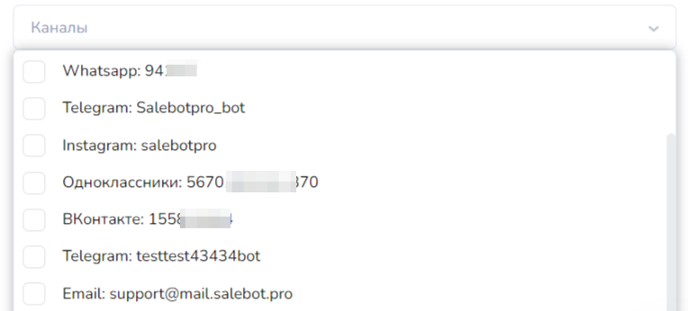<figcaption></figcaption></figure>

Учет статистики можно вести по определенным спискам и меткам, присвоенным клиентам:

<figure>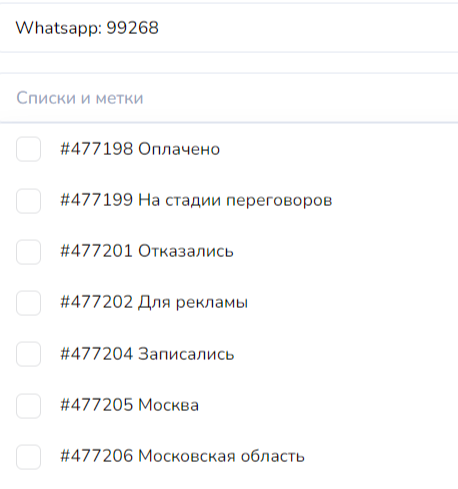<figcaption></figcaption></figure>

Безусловно можно использовать и схему конструктора для учета клиентов, находящихся в определенном состоянии воронки:

<figure>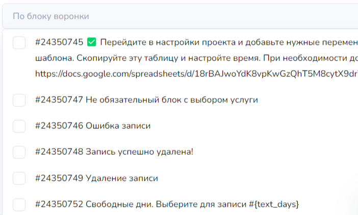<figcaption></figcaption></figure>

Например, исходя из изображения выше, мы можем учесть клиентов, которые удалили запись на прием, а впоследствии просмотреть процент удавшихся сделок, что поможет понять, как именно улучшить качество вашего бизнеса и предпринять необходимые меры.&#x20;

Далее можно применить фильтр отображения клиентов по отпискам или наоборот исключить их:

<figure>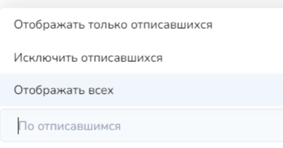<figcaption></figcaption></figure>

Следующим критерием, по которому можно осуществить отображение статистики, является тег.

Тег - это системная переменная, которую можно найти в диалоге с клиентами (ее нельзя изменять).&#x20;

<figure>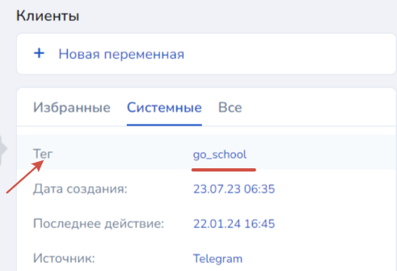<figcaption></figcaption></figure>

Тег нужно вписать в соответствующее поле:

<figure>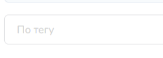<figcaption></figcaption></figure> <figure>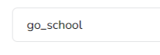<figcaption></figcaption></figure>

### UTM-метки

<figure><figcaption></figcaption></figure>


Чтобы узнать, что такое UTM-метки и как ими пользоваться, рекомендуем прочитать статью "[Как передать параметры и UTM-метки](/broken/pages/Pxm5JZT5yourOOU5bU7K)".


В первом поле "Название значений" вы прописываете необходимое для отображения результатов в диаграмме наименование:

<figure>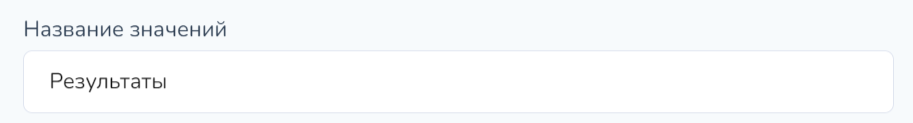<figcaption></figcaption></figure>

Далее в поле с выбором UTM-метки вам будут представлены уже существующие в проекте:

<figure>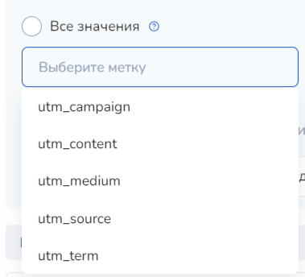<figcaption></figcaption></figure>

Далее вписываете необходимое значение метки - это может быть любое присвоенное значение для данных меток:

<figure>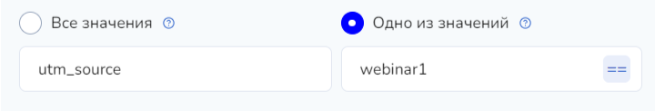<figcaption></figcaption></figure>

Аналогично созданию виджета по переменным, здесь существует выбор фильтрации "все значения" и "одно из значений"


Если вы создаете виджет по нескольким UTM-меткам и вам необходимо, чтобы итоговый результат включал в себя ВСЕ значения, то используйте оператор "Все значения".

Если вам необходимо отображение результатов по одному из значений, используйте оператор "Одно из значений".&#x20;


<figure>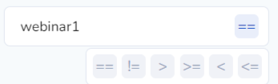<figcaption></figcaption></figure>

При вводе значения для метки можно установить соответствие:&#x20;

1. равно;
2. не равно;
3. больше;
4. больше или равно;
5. меньше;
6. меньше или равно.


Всего в одном виджете можно передать 6 значений и не больше.


Далее вы выбираете из каких каналов учитывать UTM-метки для статистики:

<figure>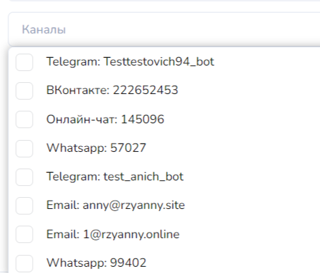<figcaption></figcaption></figure>

Можно выбрать сразу несколько каналов или совсем один - по своему усмотрению.

Также для отображения в виджете можно использовать только тех клиентов, которые включены в какой-либо список или им присвоена метка (НЕ UTM):

<figure>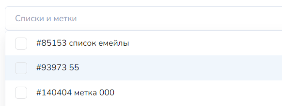<figcaption></figcaption></figure>

Далее доступны поля для использования в диаграмме блоков воронки: также можно выбрать любое количество блоков, просто поставив галочку напротив нужного:

<figure>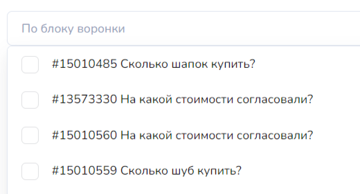<figcaption></figcaption></figure>

В случае, если вам необходимо учитывать определенные категории пользователей (например, тех, кто отписался или наоборот исключить их), то можно воспользоваться следующим фильтром:

<figure>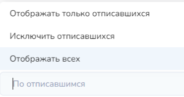<figcaption></figcaption></figure>

Далее доступно поля для ввода **тега**: как было написано ранее в разделе "По переменным", тег - это системная переменная, которую можно найти в диалоге с клиентом (ее нельзя изменять).

<figure><figcaption></figcaption></figure>

#### Конверсия

Чтобы рассчитать конверсию, воспользуйтесь одноименной вкладкой в конструкторе виджета:

<figure>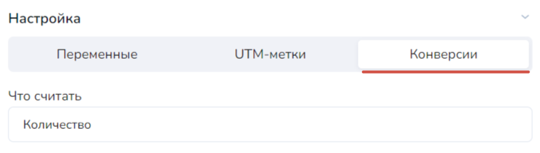<figcaption></figcaption></figure>

Поле "Что считать" поможет отобразит конверсию по 4 критериям:

1. **Количество** - подсчет числа клиентов за определенный период времени и по определенному событию/категории или сайту.

При подсчете количества можно выбрать, каким образом считать значения для клиентов:

a) все прохождения клиентов

b)  уникальные клиенты (т.е. впервые посетившие за определенный промежуток времени):

<figure>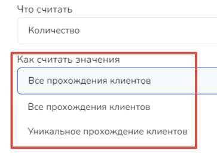<figcaption></figcaption></figure>

1. **Сумма значений** - система складывает количественные показатели значений, которые необходимо учесть для статистики;&#x20;
2. **Среднее значение** - сумма всех значений чисел, поделенных на их количество. То есть, например, было три выплаты: первая выплата - 1999, вторая выплата -2455, а третья -3455. Среднее значение будет равно 2 636 (сложили все три выплаты и поделили на их количество - три). &#x20;
3. **Медианное значение** - то число, которое является серединным значением для множества чисел: возьмем пример выплат с предыдущими значениями, где первая выплата 1999, вторая - 2455, а третья - 3455. Медианным значением в таком случае будет число 2455, стоящее строго среди множества чисел.&#x20;

Наглядно покажем разницу отображения виджета с разными значениями для поля "Что считать": возьмем в пример виджет:

<figure>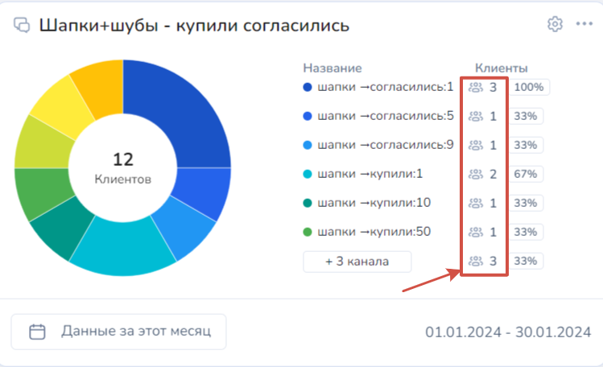<figcaption>
"Что считать" ➡️ Количество
</figcaption></figure>

В данном случае видно, что высчитывает система - это количество клиентов, которые купили/согласились купить шапки.&#x20;

Теперь изменим "Что считать" на сумму значений:

<figure>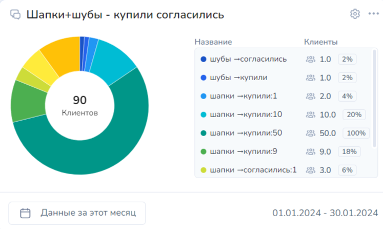<figcaption>
"Что считать" ➡️ Сумма значений
</figcaption></figure>

Теперь система высчитывает значения, присвоенные клиентам: то есть сколько всего шапок купили или согласились купить 10 клиентов.&#x20;

Далее поменяем "Что считать" на среднее значение:

<figure>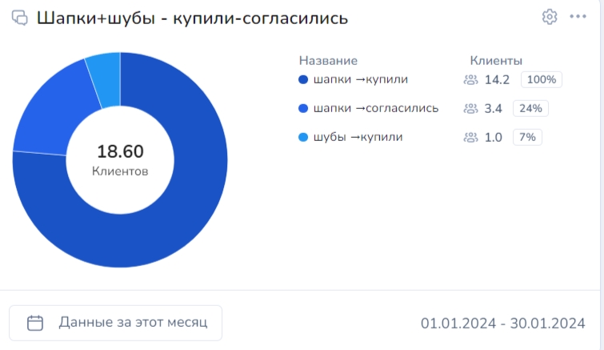<figcaption>
"Что считать" ➡️ Среднее значение
</figcaption></figure>

На примере выше видно, среднее значение количества купленных шапок на количество клиентов.

Далее рассмотрим разницу отображения количества и медианного значения:

<figure>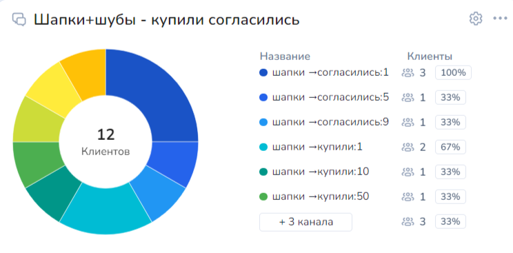<figcaption>
Количество
</figcaption></figure> <figure>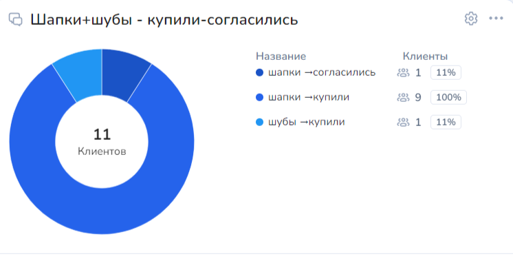<figcaption>
Медианное значение
</figcaption></figure>

В обеих диаграммах видно итоговое количество, однако показатели в колонке клиентов разнятся: во втором случае отображается срединное, то есть медианное значение.

В поле "Как считать" вы выбираете подсчет процентов либо от первого шага либо от предыдущего. Вне зависимости от выбора, каким именно образом осуществлять подсчет, откроется настройка шага:

<figure><figcaption></figcaption></figure>

Здесь можно выбрать подсчет данных по воронке или по сайту.

Чтобы конверсия работала по воронке, необходимо устанавливать блоки с "Аналитикой" с настройками категорий событий и событиями в схеме конструктора.&#x20;

<figure><figcaption>
Настройки блока в конструкторе воронок
</figcaption></figure>


Подробнее об этом в статье "Что в редакторе означает каждое поле" в разделе "[Вкладка 'Аналитика'](https://docs.salebot.pro/osnovnye-ponyatiya.-kak-sozdavat-botov-na-salebot.pro/chto-v-redaktore-oznachaet-kazhdoe-pole#vkladka-analitika)".&#x20;


<figure>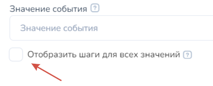<figcaption></figcaption></figure>

**Чекбокс "Отобразить шаги для всех значений"** необходим для того, чтобы полностью отображать значения при подсчете статистики в диаграмме, если вам нужна более подробная информация в виджете:

<figure>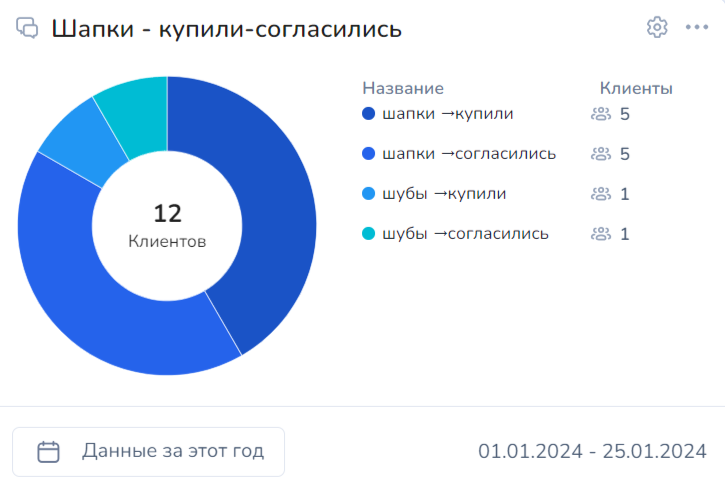<figcaption>
Чекбокс не активирован
</figcaption></figure> <figure>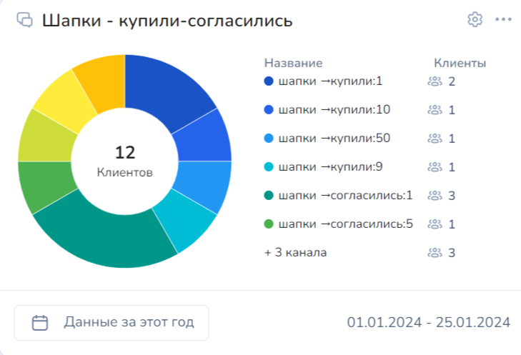<figcaption>
Чекбокс активирован
</figcaption></figure>

В случае если необходимо отображать конверсию по сайту, то в поле "Название шага" можно прописать необходимое наименование (либо оставить по умолчанию - тогда название сгенерируется автоматически) и выбрать необходимый сайт:

<figure>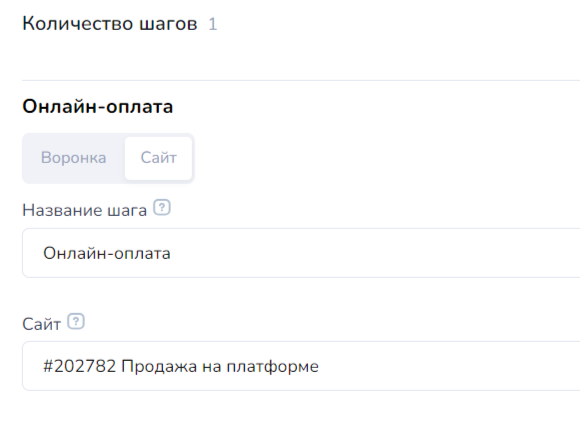<figcaption></figcaption></figure>

Для того чтобы учитывалась статистика по сайту, необходимо в настройках сайта в разделе "Аналитика" поставить галочку для сохранения данных:

<figure>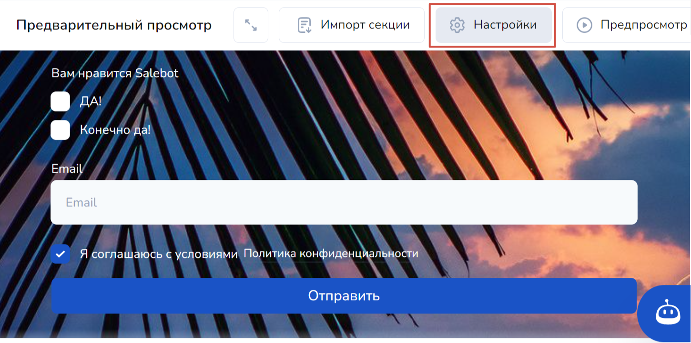<figcaption></figcaption></figure> <figure>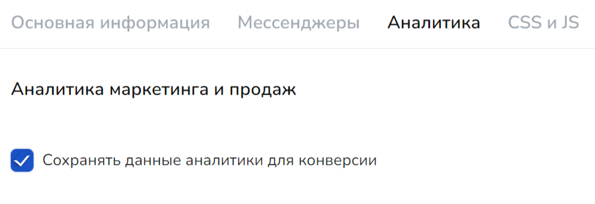<figcaption></figcaption></figure>

В таком случае статистика будет учитывать количество посещений сайта (НЕ уникальных клиентов).

### Фильтры

Виджет в виде фильтра поможет отобразить данные, отфильтрованные определенным образом по установленным значениям.&#x20;

<figure>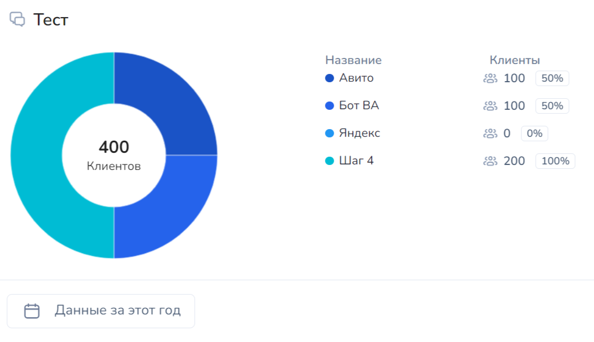<figcaption></figcaption></figure>

Например, у вас есть несколько списков, в которые включены клиенты. Данный тип виджета поможет отобразить точное количество клиентов, которые присутствуют в каждом из списков и отобразит их на виджете.&#x20;

#### Как настраивать виджет?

Для начала необходимо добавить необходимое количество значений для отображения данных в виджете:

<figure>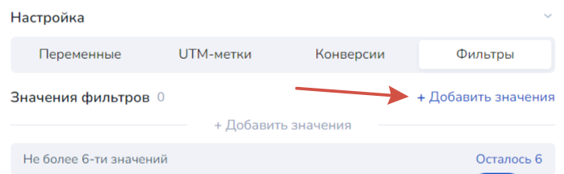<figcaption></figcaption></figure>


Всего виджет может принимать не более 6 значений.&#x20;


После этого выберите необходимый фильтр для отображения количества клиентов:

<figure>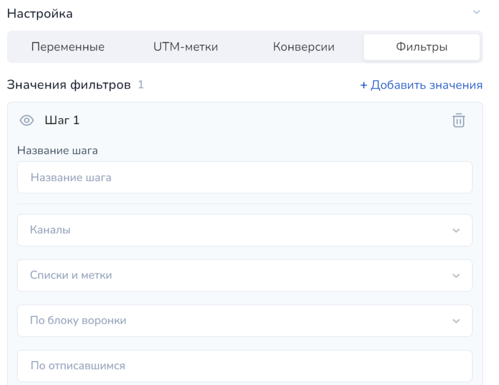<figcaption></figcaption></figure>

Если вы не установите название шага, то по умолчанию он будет обозначен как "Шаг 1", "Шаг 2" и т.п.

Затем выберите необходимые фильтры для отображения:

1. Каналы - будет выведено количество клиентов из определенного канала.&#x20;

Например, в проекте у вас подключено несколько Телеграм-каналов: в фильтре можно отобразить значение для каждого.

<figure>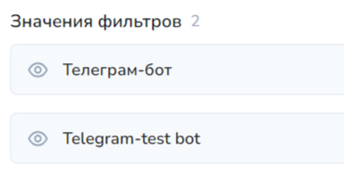<figcaption></figcaption></figure> <figure>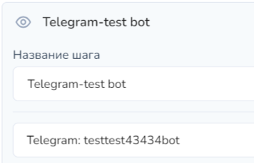<figcaption></figcaption></figure> <figure>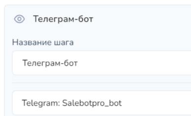<figcaption></figcaption></figure>

2. Списки и метки - значение отображает количество клиентов соответственно в определенных вами списках и метках.

<figure>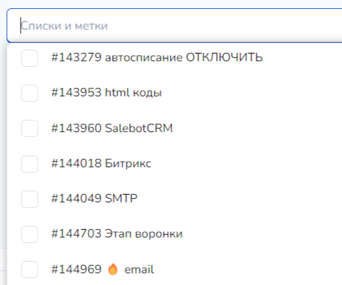<figcaption></figcaption></figure>

Аналогично каналам, можно выбрать сразу несколько списков/меток для отображения клиента по фильтрам.

3. Блок воронки - шаг выразит количество клиентов по соответствующему (соответствующим) блокам воронки.&#x20;

<figure>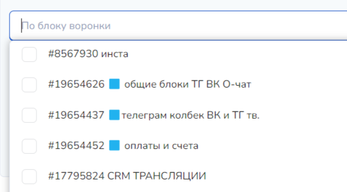<figcaption></figcaption></figure>

4. По  клиентам: отписавшимся, с их исключением или отображением всех.

Можно применить как дополнительный фильтр в значении для клиентов: например, для просмотра данных по отписавшимся клиентам в определенных каналах.


Обращаем внимание!&#x20;

При использовании фильтра "Отображать только отписавшихся" будут отображаться клиенты, добавленные в указанный промежуток времени,  со статусом "Отписка" независимо от того, когда он отписался.


<figure>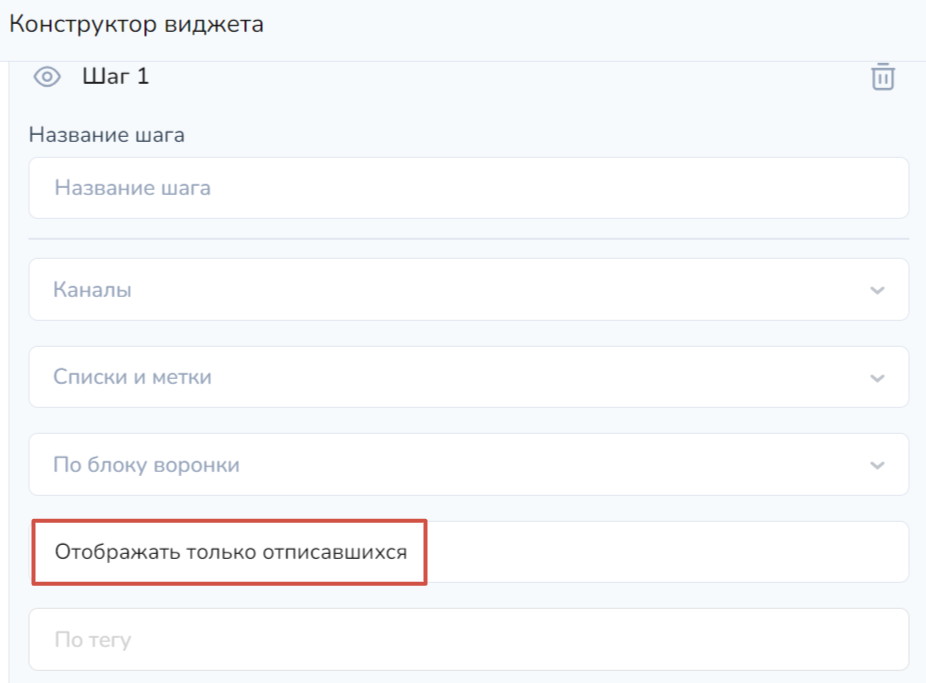<figcaption>
Отобразятся клиенты, добавленные со статусом "Отписка", незавимо от того, когда пользователь отписался.
</figcaption></figure>

5. По тегу - системной переменной, присваиваемой клиенту.&#x20;

## Пример работы с конверсиями

В настройках блока схемы чат-бота создайте блок, в котором необходимо настроить события в аналитике:

<figure><figcaption></figcaption></figure>

При клике на кнопку "Аналитика" открывается форма ввода данных:

<figure><figcaption></figcaption></figure>

с полями:

* категория события - обобщенное название для каких-либо событий в боте:

<figure><figcaption></figcaption></figure>

Например, к категориям в боте можно отнести:\
а)  обобщенные действия: пришли, купили, оплатили; \
б) обобщенные категории товаров: одежда женская, одежда мужская, обувь, хозтовары и пр.\
в) категории услуги: стрижки, маникюр и т.д.

Является необязательным полем для настройки. &#x20;

* название события, для которого будет собираться статистика (Обязательное поле!)

<figure><figcaption></figcaption></figure>

Частное из обобщенной категории.&#x20;

Например, в категории обобщенных действий:

а) пришли: из бота ТГ, из бота ВК, из бота Whatsapp; \
б) купили: товар1, товар2, товар3 и т.п.&#x20;

Является обязательным полем.&#x20;

* значение события - число или переменная клиента/сделки, указанная в формате #{cost}:

<figure><figcaption>
Указание числового значения
</figcaption></figure> <figure><figcaption>
Указание значения через переменную
</figcaption></figure>


Данные группируются (суммируются) по названию и категории события.



<mark style="color:red;">**Внимание:**</mark>**&#x20;в разделе Конверсии -&#x20;**<mark style="color:red;">**"Текущий момент"**</mark>**&#x20; события&#x20;**<mark style="color:red;">**НЕ считаются**</mark>**&#x20;в блоках&#x20;**<mark style="color:red;">**не состояний:**</mark>

* Не состояние передача данных
* Не состояние конец сбора данных
* Не состояние с условием
* Не состояние


Далее при прохождении клиента через блок, в котором настроены события, просмотреть данные можно в разделе "Аналитика":

<figure><figcaption></figcaption></figure>

Необходимо создать виджет в разделе "Клиенты":

<figure><figcaption></figcaption></figure>

Далее выбрать необходимые настройки:

<figure><figcaption></figcaption></figure>

1\) указать период аналитики

2\) прописать название виджета;

3\) выбрать вид отображения данных для аналитики (круговая диаграмма, столбчатая и тп)

4\) выбрать данные, которые будут отображены в виджете:

Шаг 1. Выберите вкладку конверсии:

<figure><figcaption></figcaption></figure>

Шаг 2. Укажите способы подсчета данных Аналитики:

<figure><figcaption></figcaption></figure>

**Что считать** - параметры подсчета каждого шага:

<figure><figcaption></figcaption></figure>

* **Количество** - сколько клиентов прошло через выбранное событие
* **Сумму значений** - сумма значений события для всех клиентов, прошедших через него. Может показать количество проданного товара или заработанную сумму от продажи.
* **Среднее значение** - среднее значение события для всех клиентов, прошедших через него. Может показать сколько единиц товара в среднем продается одному клиенту.
* **Медианное значение** - медианное значение события для всех клиентов, прошедших через него. Может показать честное среднее значение, поскольку исключает пиковые значения.

**Как считать** - параметры для подсчета количества прохождения клиента

<figure><figcaption></figcaption></figure>

* Уникальное прохождение - подсчет уникальных пользователей, которые впервые прошли через воронку (данный блок, в котором настроена Аналитики);&#x20;
* Все прохождения - подсчет всех прохождений (как первых, так и повторных) через данный блок воронки.

**Как считать %**

<figure><figcaption></figcaption></figure>

* подсчет с первого шага.
* подсчет с последнего шага.

Шаг 3. Добавьте шаг для подсчета:

<figure><figcaption></figcaption></figure>

Шаг 4. Выберите категорию (если есть) и событие, которое ранее указали в блоке бота и сохранили его:

<figure><figcaption></figcaption></figure>

Если необходимо отображать только определенное значение событий, то пропишите необходимое значение в строке "Значение событий":

<figure><figcaption></figcaption></figure>

Если нужно отображать все значения, то оставьте поле пустым.&#x20;


О других возможностях аналитики в Сейлбот рассказали в статье "[Аналитика Salebot](/broken/pages/wYAWtCPmmg5M9uDmeUPE)".



Готово! Вы ознакомились с редактором схемы чат-бота в Сейлбот!&#x20;


### Видеообзор: Конверсии в чат-боте



## Удалить данные конверсий

Удалить данные конверсий можно в разделе Аналитика - Клиенты -  кнопка "Удалить данные конверсий":

<figure><figcaption></figcaption></figure>

При клике по кнопке открывается форма, где можно выбрать, какие именно данные необходимо удалить:

<figure>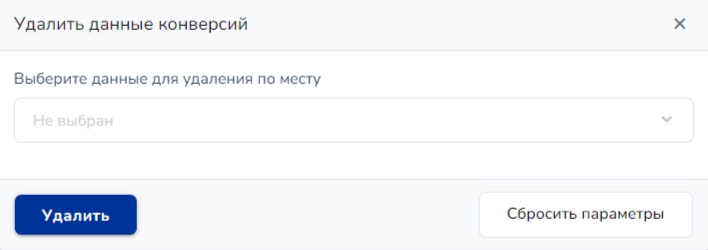<figcaption></figcaption></figure> <figure>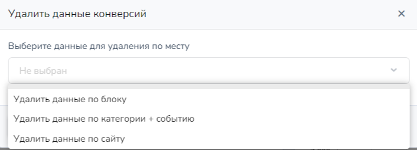<figcaption></figcaption></figure>

1. **Удалить данные по блоку**

В данном случае при выборе удаления данных по блоку, открываются поля для выбора блоков, по которым необходимо очистить данные конверсии, а также клиентов.&#x20;

<figure><figcaption></figcaption></figure>

Как видно из примера выше, можно выбрать один или несколько блоков, по которым вы ранее высчитывали конверсию в виджете.

Затем можно выбрать категории клиентов, по которым необходимо очистить данные:

<figure>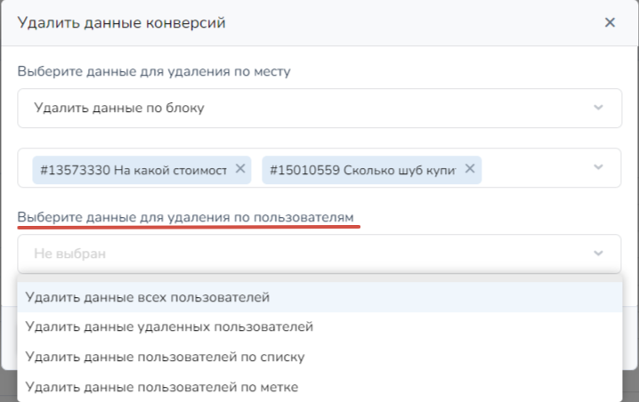<figcaption></figcaption></figure>

В случае, если вы из выпадающего списка выберите "Удалить данные пользователей по списку" (метке) , откроется дополнительное поле с выбором списка клиентов или меток, данные по которым собираетесь удалить:

<figure>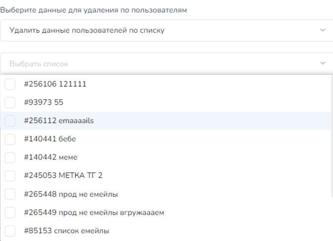<figcaption></figcaption></figure>

2. **Удалить данные по категории + событию**

В данном случае открываются поля соответственно с категорией и событием, а также аналогичные предыдущему поля для выбора удаления конверсии по различным критериям клиентов (удаленные, по метке и т.п.):

<figure>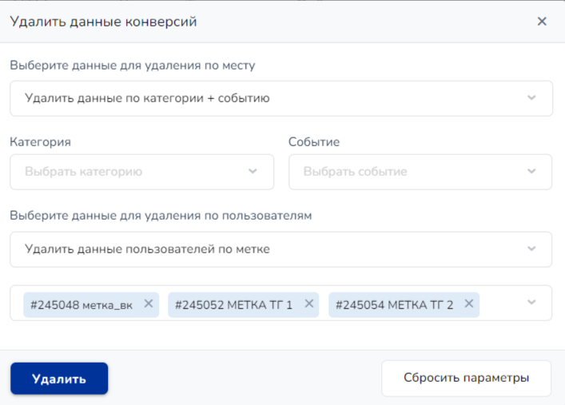<figcaption></figcaption></figure>

Удаление конверсии можно осуществить как по одной отдельной категории, так и по всем вместе взятым:

<figure><figcaption></figcaption></figure>

Соответственно, при выборе **удалить все категории** по умолчанию во втором поле "Событие" выбирается удаление всех событий.&#x20;

<figure>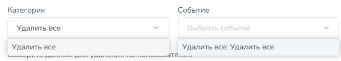<figcaption></figcaption></figure>

В случае, если была выбрана одна категория, то во втором поле "Событие" также можно выбрать либо удаление конверсии по всем событиям, либо по отдельному.&#x20;

<figure>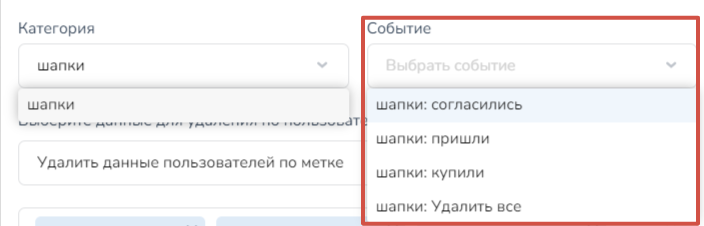<figcaption></figcaption></figure>

3. Удалить данные по сайту

При выборе удаления данных конверсии по сайту откроется соответствующее поле для выбора необходимого сайта: одного или нескольких.

<figure>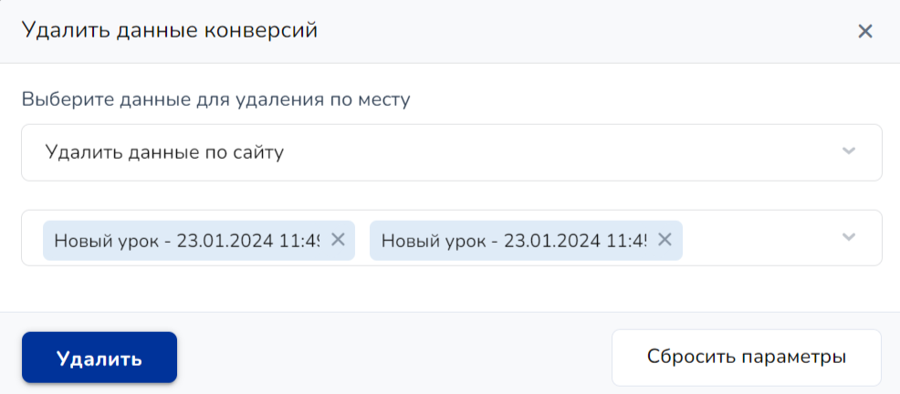<figcaption></figcaption></figure>

После того как вами были выбраны необходимые критерии для удаления данных конверсии, необходимо нажать на кнопку "Удалить", после чего появится уведомление следующего вида:

<figure>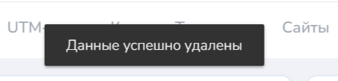<figcaption></figcaption></figure>

ff
