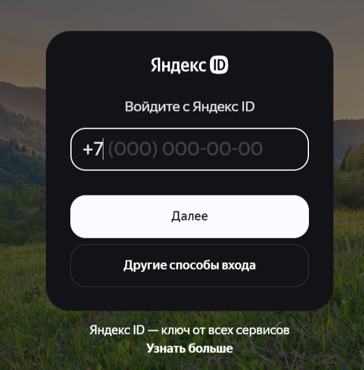

# Аналитика рекламы

Авторизуйтесь в Salebot через ВК аккаунт, чтобы данные рекламного кабинета ВК могли быть загружены в раздел Реклама.


Добавлена возможность выгрузить данные рекламной кампании ВКонтакте в формате csv.


В разделе Реклама доступно 2 кабинета:

1. Кабинет Реклама ВК
2. Кабинет Я.Директ

<figure><figcaption></figcaption></figure>

#### Подключение Яндекс.Директ

Чтобы авторизоваться через Я.Директ нажмите на:

<figure><figcaption></figcaption></figure>

Если у вас еще нет авторизованного кабинета в Яндекс.директе, то необходимо будет зарегистрироваться на платформе в открывшемся окне:

<figure><figcaption></figcaption></figure>

После регистрации вы вернетесь обратно во вкладку реклама, где Яндекс.Директ уже будет подключен к разделу Аналитика.&#x20;

#### Подключение Реклама ВК

Нажмите на авторизоваться в новом РК:

<figure><figcaption></figcaption></figure>

Далее войдите в аккаунт, привязанный к РК, и разрешите доступы:

<figure><figcaption></figcaption></figure>

#### Дополнительно

Кнопки, используемые в разделе:

1. "**Обновить данные**" - кнопка для обновления данных по кампаниям.&#x20;
2. "**Отключить кабинет**" - кнопка для отключения рекламного кабинета от раздела Аналитика.
