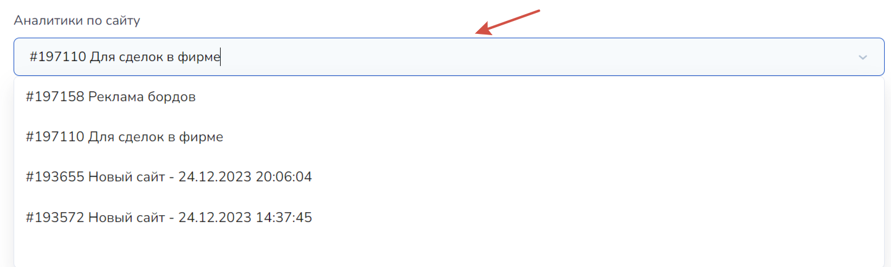
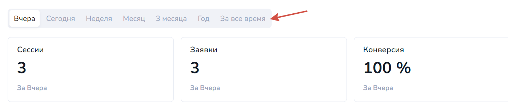
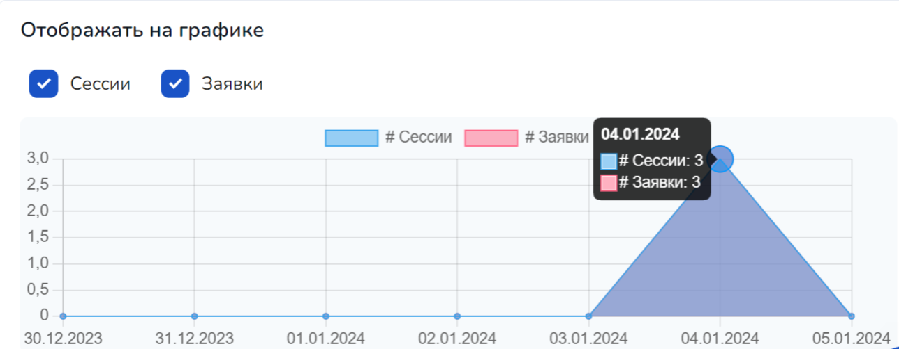
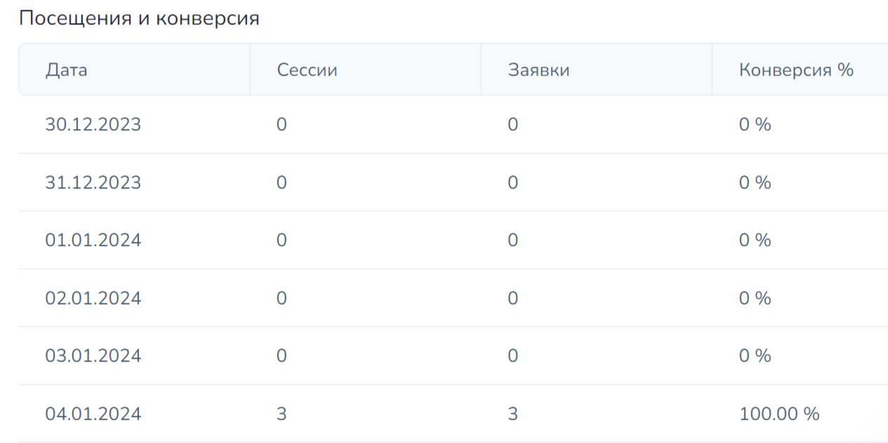

# Аналитика сайта

Аналитика сайтов в Salebot помогает узнать количество посетителей за определенный период времени, а также количество отправленных заявок в форме отправки сайта. Это позволяет выявить конверсию любого из созданных вами минилендингов (сайтов) в определенный промежуток времени или за все время:

<figure><figcaption></figcaption></figure>

Для этого выберите соответствующий сайт, аналитику которого необходимо отследить, а также нужный период.

Аналитика и конверсия на сайтах являются важными показателями успешности ваших проектов: они позволяют оценить эффективность работы сайта и выявить возможности для улучшения пользовательского опыта и повышения продаж (например, сбор информации от пользователей с помощью соответствующей формы опроса).

На примере мы видим поле, в котором можно выбрать сайт, необходимый для аналитики:

<figure><figcaption></figcaption></figure>

Следом идет выбор периода, за который необходимо отследить аналитику сайта:

<figure><figcaption></figcaption></figure>

На примере выше видно количество сессий и заявок за определенный период, а также отношение числа _**сессий**_ (посетителей сайта) к количеству _**заявок**_ (то есть, например, отправленных через установленные на сайте ответы форм заявки на подписку, на приобретение товара, сделок в CRM и т.п.), выраженное в процентах, - что называется _**конверсией**_.&#x20;

Далее можно увидеть график, в котором наглядно можно отследить изменения по выбранному периоду времени и количеству заявок и(или) сессий:

<figure><figcaption></figcaption></figure>

Чекбоксы (галочки) напротив "Сессий" и "Заявки" позволяют отобразить сессии и заявки на сайте отдельно или в совокупности.&#x20;

После графика находится таблица, в которой отображены все показатели аналитики минилендинга (сайта):

<figure><figcaption></figcaption></figure>

Сайт, аналитику которого мы решили просмотреть, в качестве примера был создан 4 января, соответственно показатели до создания сайта отображаются в виде нуля. Уже с 4 января в таблице видно количество сессий, заявок и их соотношение в процентах.&#x20;

Так в таблице можно отобразить показатели за день (сегодня или вчера), за неделю, месяц и т.п.&#x20;

### Видеогид


