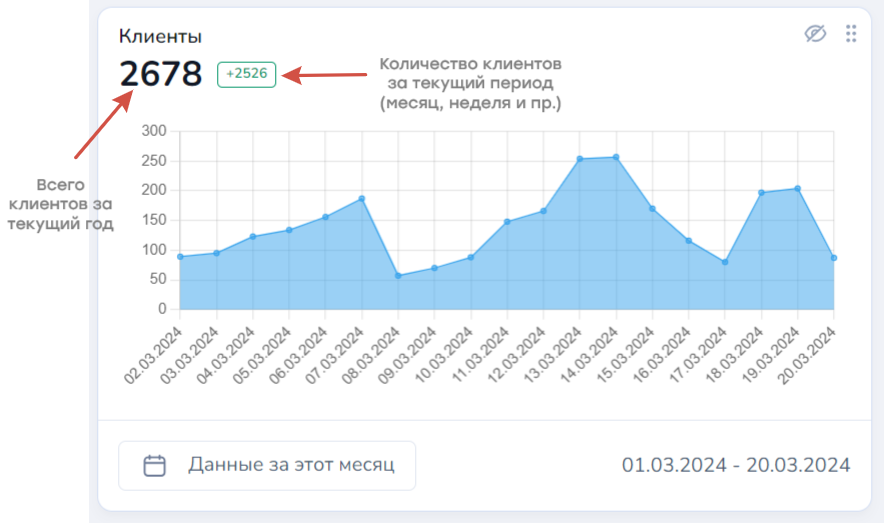
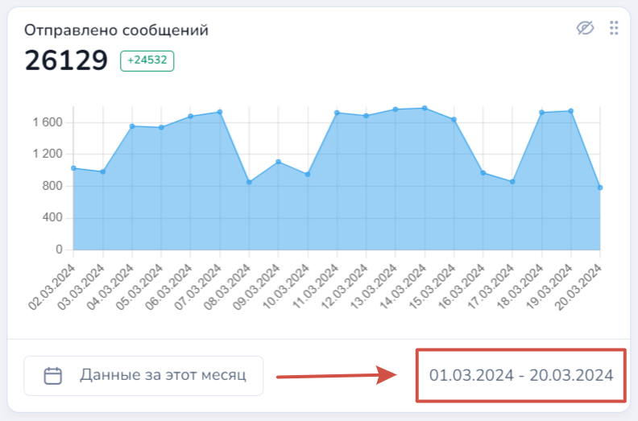
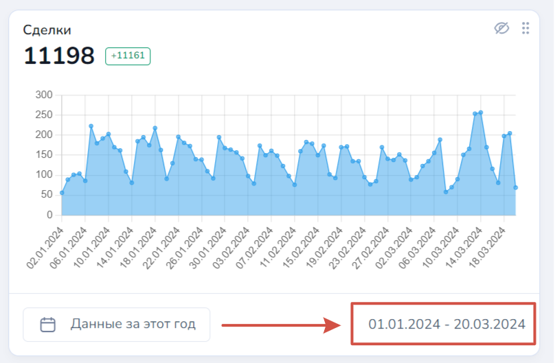
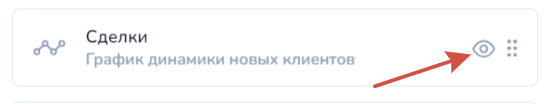
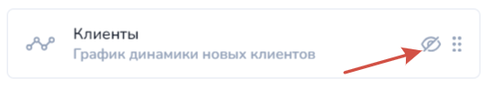
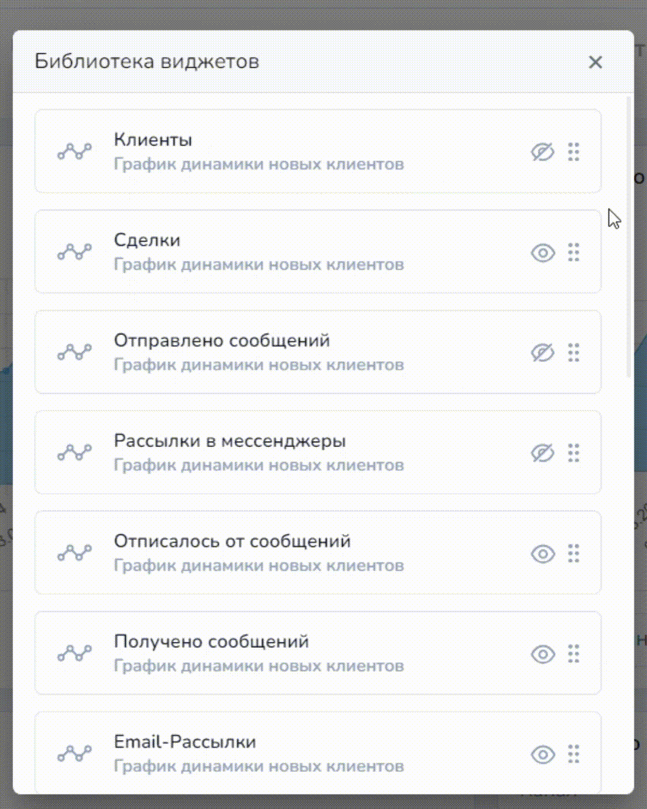
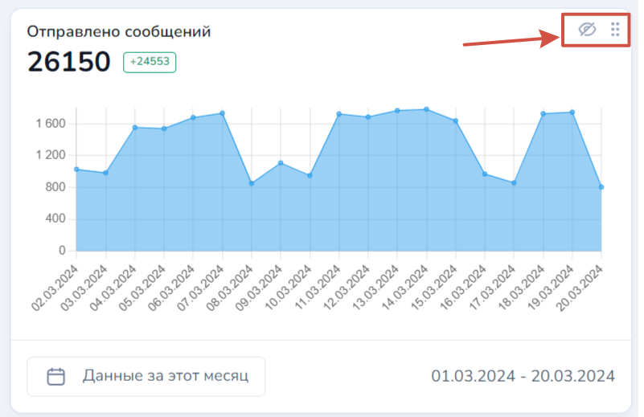
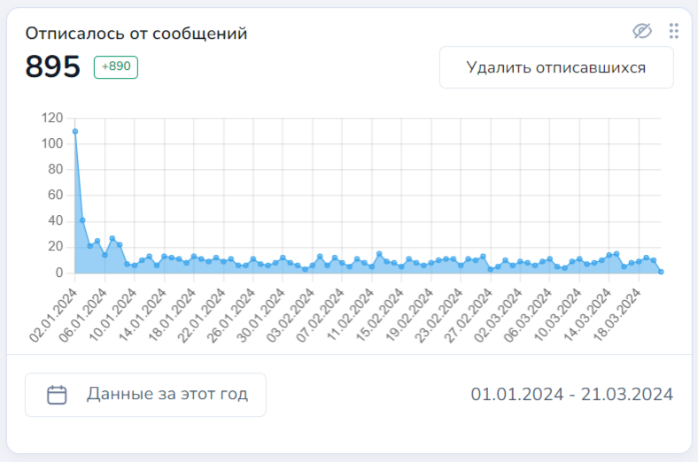

# Дашборды

Раздел "Аналитика" представлен в виде отдельных вкладок по функционалу Salebot, где отображены различные статистические данные по существующему проекту.&#x20;

<figure><figcaption></figcaption></figure>

В данном разделе можно отследить аналитику по любому разделу со всего проекта. Подробнее разберем каждый раздел "Аналитики" далее. &#x20;

## Дашборды

Дашборд  - это инструмент для визуализации и анализа статистических данных, который позволяет отображать показатели бизнес-проекта в Сейлбот. Дашборды представляют собой интерактивные панели, содержащие графики, диаграммы, которые помогают быстро понять текущее состояние дел и выявить положительные или отрицательные тенденции.

<figure><figcaption></figcaption></figure>

Преимущества использования дашбордов:

1. Улучшение принятия решений: Дашборды предоставляют информацию в удобном и доступном формате, что позволяет владельцу проекта и администраторам принимать более обоснованные решения на основе собранных данных.
2. Повышение производительности: Дашборды помогают сотрудникам быстро и легко получать доступ к необходимой информации, что снижает затраты времени на поиск и анализ данных и повышает общую производительность.
3. Оптимизация расходов: Дашборды уже интегрированы в ваш проект, что сокращает затраты на создание и поддержку отдельных систем сбора и аналитики данных.

### Функционал

Любой дашборд в разделе отобразит данные в виде графика с числовыми обозначениями и временным диапазоном:

<figure><figcaption></figcaption></figure>

<mark style="color:green;">**Пример:**</mark> Дашборд "Клиенты" \
Темным цветом отображается общее количество новых клиентов за период текущего года (диапазон с 1 января по 2024 по 20 марта 2024) было 2678 новых клиентов. \
В период с 1 марта 2024 года приток новых клиентов составил 2526 человек.&#x20;

В каждом виджете в разделе Дашборды можно настроить вывод данных за определенный  период отдельно друг от друга:

<figure><figcaption></figcaption></figure> <figure><figcaption></figcaption></figure>


Дашборд "Клиенты" отражает количество клиентов, которые существуют в мессенджерах и каналах (ботах), подключенных к проекту, — то есть это люди (представители организаций), которые написали вам в мессенджер, подключенный к Сейлбот, или в онлайн-чат на сайте.

Дашборд "Сделки" отображает количество сделок из CRM-системы с вашими клиентами.&#x20;

У одного клиента может быть несколько сделок или вообще ни одной. Сделка без созданного клиента существовать не может.&#x20;

При создании сделки автоматически создается новый клиент.&#x20;



Внимание!&#x20;

В крупных проектах с большим количеством данных, чем больше временной диапазон расчета статистики по периоду, тем дольше осуществляется пересчет аналитики.&#x20;


Также при необходимости вы можете перенести необходимые виджеты из раздела "Клиенты" в "Дашборды". \
Для этого нажмите на кнопку "Настройки виджетов":

<figure><figcaption></figcaption></figure>

Далее откроется Библиотека виджетов:

<figure><figcaption></figcaption></figure>

Пролистайте вниз до окошка "Выберите виджет для добавления" и добавьте необходимый виджет:

<figure><figcaption></figcaption></figure>

Также в настройках вы можете скрывать или наоборот отображать уже скрытые виджеты, менять их местами друг с другом:

<figure><figcaption>
Виджет отображен
</figcaption></figure> <figure><figcaption>
Виджет скрыт
</figcaption></figure>


Внимание!\
Виджеты из раздела "Клиенты" во вкладке "Дашборды" можно удалять и менять в них период подсчета статистики. \
Другие настройки отображения статистических данных (например, переменные, фильтры, UTM-метки и пр.) изменить НЕВОЗМОЖНО! \
Если вам нужно отобразить иные данные в виджете и отобразить его в разделе "Дашборды", необходимо создать новый виджет с необходимыми настройками.&#x20;


Чтобы поменять местами виджеты достаточно потянуть его в нужное место, зажав данную кнопку:

<figure><figcaption></figcaption></figure>

С помощью таких же кнопок можно скрыть виджет и отобразить его, а также перенести на другое место на основной вкладке дашбордов:

<figure><figcaption></figcaption></figure>


Обращаем внимание!&#x20;

В виджете "Отписалось от сообщений" график строится по дате отписки клиента без учета момента, когда клиент был добавлен.


<figure><figcaption>
Виджет "Отписалось от сообщений"
</figcaption></figure>

f
