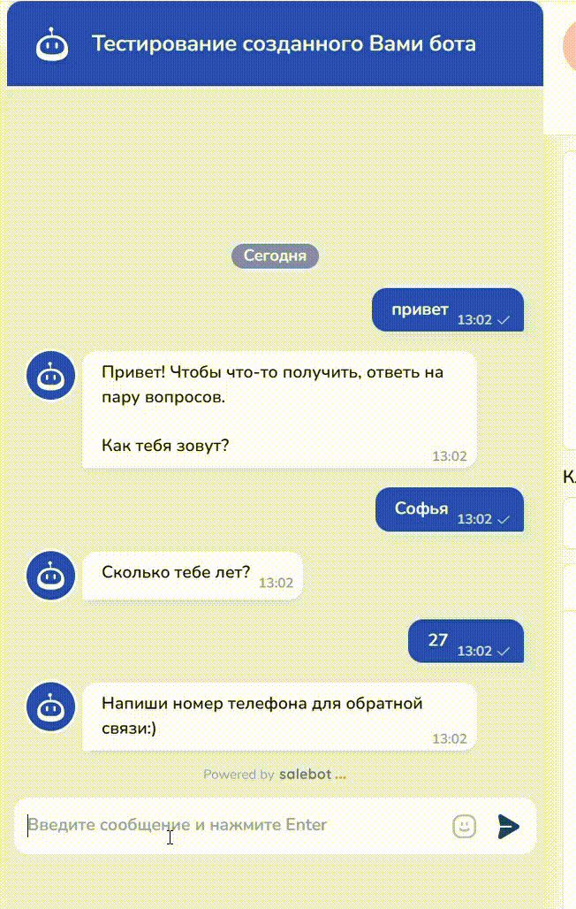
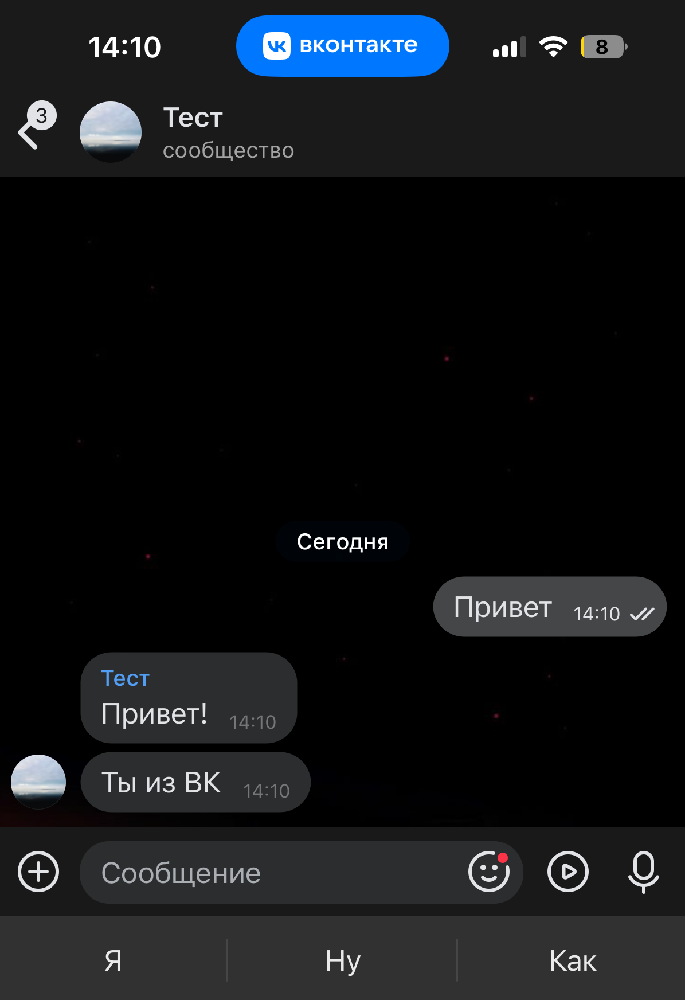

# FAQ

## ЧАТ-БОТ

### Что делать если бот работает в тестовом окне, но не работает в мессенджере?

У вас не оплачен тариф или оплачен не тот.&#x20;


Также причиной того, что бот не работает в мессенджерах, может быть ошибка подключения Канала.&#x20;

В этом случае рекомендуем проверить настройку подключения [по инструкциям подключения мессенджеров.](/broken/pages/-M6-dPO2gBhwzPgf2pVT)


### Как получить корректный номер телефона клиента?

Необходимо добавить проверку вводимого номера через регулярные выражения.&#x20;

_Регулярные выражения_ — это условие, с помощью которого бот может проверять формат введенных данных (например, что человек ввел именно номер телефона, а не что-то иное).

Как сделать проверку?

В процессе диалога с клиентами часто возникает необходимость последующего общения с клиентом по телефону, однако возникает вопрос: каким образом можно настроить Чат-бота для автоматического сбора информации о клиенте? Конечно же с использованием регулярных выражений.&#x20;

Чтобы воспользоваться функцией сбора номера телефона (или email), используйте следующие регулярные выражения:

1. Номер телефона (Россия): ^((\\+7|7|8)+(\[0-9]){10})$&#x20;
2. Номер телефона (с кодом любой страны): ^(\\+)?((\d{2,3}) ?\d|\d)((\[ -]?\d)|( ?(\d{2,3}) ?)){5,12}\d$
3. Email: ^\[-\w.]+@(\[A-z0-9]\[-A-z0-9]+\\.)+\[A-z]{2,4}$


Убедитесь, что в условии стрелки перед регулярным выражением не стоит пробел!&#x20;

Иначе схема Чат-бота будет работать с ошибками.&#x20;



В схеме мы использовали регулярное выражение для номеров телефонов любой страны.&#x20;


Аналогично тому, как бот записывал имя и возраст клиента, в систему добавится и номер телефона пользователя (или его email при выборе соответствующего регулярного выражения).&#x20;

Создайте блок, где с помощью бота будете направлять сообщение клиенту с просьбой отправить номер телефона (или email) пользователю:

<figure><figcaption>
Блок с сообщением для получения номера телефона клиента
</figcaption></figure>

Далее протяните стрелку из этого блока, где в условии стрелки необходимо прописать соответствующее регулярное выражение.&#x20;

<figure><figcaption></figcaption></figure>


Как отмечалось ранее, не забывайте устанавливать выбор соответствия "Регулярное выражение" во избежание ошибок работы Чат-бота.&#x20;


С условием, где прописаны регулярные выражения, Чат-бот примет только значения номера телефона в виде цифр, а в случае с почтовым адресом - только установленные стандартизированные виды почтовых адресов.&#x20;

Если клиент отправил сообщение, не соответствующее значению номера телефона (email), можно создать блок, который будет сообщать клиенту о неверно введенных данных:

<figure><figcaption></figcaption></figure>

Для этого из блока, где вы прописали сообщение для того, чтобы клиент отправил номер телефона, проведите вторую стрелку и в создавшемся блоке пропишите необходимое сообщение, например, "Это не номер телефона. Пожалуйста, напиши номер телефона!":

<figure><figcaption></figcaption></figure>

Выберите тип блока "Не состояние" (скриншот выше). У такого блока нет условия как в блоке "Состояние диалога", но в него нельзя перейти.&#x20;

Применительно к нашей схеме блок "Не состояние" будет как нельзя кстати, поскольку тогда пользователь не будет переходить из предпоследнего блока, и для прохождения дальше по воронке ему нужно будет ввести номер телефона:

<figure><figcaption></figcaption></figure>


Про различные функцию блока "[Не состояние](/broken/pages/-M1G0tS64N7tDTadS8Ao)" можно узнать в одноименной статье.&#x20;



Подробнее о регулярных выражениях написано в статье "[Список полезных регулярных выражений](/broken/pages/-M0wjAtzg71YW7LB-2D8)".&#x20;


### Как узнать количество подписанных на бота?

В разделе "[Аналитика](/broken/pages/wYAWtCPmmg5M9uDmeUPE)" указано как общее количество клиентов, так и отдельно по мессенджерам:

<figure><figcaption></figcaption></figure>

<figure><figcaption></figcaption></figure>

### Как сделать, чтобы начало разговора инициировал сам бот

Для каждого мессенджера существует своя настройка для того, чтобы бот направлял первое сообщение.&#x20;


Статья "[Первое сообщение в мессенджерах](/broken/pages/-M1G8JhiblHfVMG4OKwP)".&#x20;


### Как отправить "догоняющее" сообщение?

Бывают случаи когда клиент по личным причинам перестал проходить путь по воронке. Чтобы напомнить клиенту о себе, можно отправить вслед догоняющее сообщение с помощью блока "Не состояние".

<figure><figcaption></figcaption></figure>

Этот блок отправит пользователю сообщение, но при этом не передвинет его никуда из основной воронки.


Подробнее о работе таких блоков можно прочитать в статье '[Блоки "Не состояние](/broken/pages/-M1G0tS64N7tDTadS8Ao)"'.


Также в стрелках используем таймер (задержку) и  ВКЛЮЧАЕМ переключатель “Отменить если покинул блок”.&#x20;

<figure><figcaption></figcaption></figure>

Переключатель "Отменить, если покинул блок" означает, что стрелка сработает только для тех пользователей, которые через указанное время всё еще не перешли в белый блок из зеленого.&#x20;

### Как сделать, чтобы открывалась сразу цепочка из 2-3 сообщений?

Необходимо блоки соединить стрелками и в настройках соединений (стрелок) в задержке указать 0 секунд.

<figure><figcaption></figcaption></figure>

### Когда в чат вступает оператор или менеджер, как можно отключить умные ответы, чтобы бот не отвечал?

Вам необходимо указать задержку после ответа оператора.

<figure><figcaption></figcaption></figure>

### Как отследить, перешел ли человек по ссылке из предыдущего сообщения

Можно использовать два способа: добавить ссылку в кнопку или воспользоваться функцией proxy().

1. Ссылка в кнопке

Добавьте в настройках блока кнопку:

<figure><figcaption></figcaption></figure>

В настройках кнопки оставьте функцию "По умолчанию", пропишите текст кнопки и укажите ссылку:

<figure><figcaption></figcaption></figure>

Далее обязательно отметьте галочкой "С уведомлением о клике" в настройках кнопки:

<figure><figcaption></figcaption></figure>

И нажмите "Добавить", а затем "Сохранить" для изменения настроек блока:

<figure><figcaption></figcaption></figure>

Теперь если клиент нажмет на кнопку, то вам придет уведомление в диалоге с данным клиентом:

<figure><figcaption></figcaption></figure>

2. Прокси-ссылка

В случае, если мессенджер не поддерживает кнопки, но вам нужно получать уведомление о клике по ссылке, можно воспользоваться функцией proxy('ваша ссылка')

В настройках блока в калькуляторе создадим переменную link (название переменной может быть любое), которой будет присвоено значение proxy() с вашей ссылкой:

<figure><figcaption></figcaption></figure>

Далее в сообщении оставим ссылку через конструкцию <mark style="color:yellow;">#{</mark><mark style="color:red;">**название\_вашей\_переменной**</mark><mark style="color:yellow;">}</mark>.&#x20;

Если клиент в чате перейдет по ссылке, то в диалоге с клиентом вы увидите уведомление подобного типа:

<figure><figcaption></figcaption></figure>


Колбек при клике на ссылку, которая лежит в функции proxy('ваша ссылка') аналогичен колбеку, который приходит, если клиент нажал на кнопку с уведомлением о клике.&#x20;


Далее, чтобы настроить реакцию на уведомление о клике по ссылке, укажите данный колбек в условии блока ("Стартовое условие" или "Не состояние с условием"):

1. Реакция на определенную ссылку

Если нужно настроить реакцию только на определенную ссылку (то есть чтобы бот отправлял ответное сообщение только в случае, если клиент перейдет по определенной ссылке), то укажите весь текст колбека в условии блока ("Стартовое условие" или "Не состояние с условием":

<figure><figcaption></figcaption></figure>

Выбор соответствия "Полное совпадение".

2. Реакция на колбек при переходе клиентом по любой ссылке, выдаваемой ботом.

Если нужно отправлять ответное сообщение на уведомление о клике по любой ссылке, укажите только часть колбека 'link\_was\_pressed':

<figure><figcaption></figcaption></figure>

С выбором соответствия в блоке "По наличию ключевых слов":

<figure><figcaption></figcaption></figure>

Видео-инструкция:



### Я хочу на этого бота запустить таргет. Где взять ссылку на него?

Вы можете создать сайт (лендинг): на нем будут ссылки на ботов.&#x20;

<figure><figcaption></figcaption></figure>

Сайт или лендинг использовать необязательно, можно просто взять прокси-ссылки.


Ссылки с кнопок минилендинга брать нельзя!


### Верно ли понимаю функцию "Задержка по времени", что сообщение будет отправлено в конкретное время в конкретную дату?

Все верно. Уйдет в установленные в настройках стрелки дату и время.

<figure><figcaption></figcaption></figure>

Если указана задержка перед отправкой, то данная задержка будет добавлена к тому времени, что вы указали (из примера, сообщение будет отправлено 21.07.2025 в 11:00, поскольку к установленному времени в поле "Время отправки" еще прибавляется задержка, установленная в поле "Задержка перед ответом").&#x20;

### Можно в пределах одного аккаунта создать два разных бота?

Можно создавать любое количество проектов на одном аккаунте.&#x20;

### Подскажите реально ли настроить, чтобы стрелка с таймером, если есть условие для перехода, не планировалась от каждого сообщения клиента?

Если по каким-либо причинам вы отключили "Отменить сообщения с таймером" и при этом используете переход по таймеру при соблюдении некоего условия, то рекомендуем прописать в "Строки, на которые не отвечать" прописать #{question}

<figure><figcaption></figcaption></figure>

### Почему текст \&para, написанный в блоке, заменяется на ¶

К сожалению, в данном случае срабатывает сам браузер, считая, что встретил ошибку и производит подмену \&para на \&para;, что в свою очередь поменяется символом ¶ для отображения. В качестве решения проблемы предлагаем писать \&Para

### Можно ли настроить отправку уведомлений нашему администратору, когда клиент отправляет сообщения в онлайн-чат?

Можно. Подробнее об этом в статье:



### **Можно ли сделать разные ссылки на бота с разной логикой**

Сообщение в поддержку:

"Добрый день) У нас такая ситуация, у нас есть 2 ссылки одинаковые которые ведут на один и тот же сайт, но разделения сделали, чтобы понимать, откуда идут заявки, можно как-то сделать это через 1 бота ?)) То есть одна будет в Телеграм в шапке профиля, а вторая будет в рекламе у нас стоять, и, чтобы развести эти 2 канала, но использовать один бот"

&#x20;Да, можно сделать 2 сайта (лендинга) в конструкторе, и в каждом прописать свой тег:

1. Создайте два сайта с разными тегами:

<figure><figcaption></figcaption></figure>

2. Далее в стартовых блоках пропишите теги в условии блока:

а) при переходе в мессенджер с лендинга "Сайт для курса" будет работать данная схема:

<figure><figcaption></figcaption></figure>

б) при переходе в мессенджер с лендинга "Обучение" будет запускаться вторая воронка:

<figure><figcaption></figcaption></figure>

### Можно ли отправить сообщение на следующий день после первого сообщения бота?

Сообщение в поддержку: 

"У меня такая ситуация: Человек переходит по рекламе и попадает в бота, ему приходит приветственное сообщение, и мне нужно конкретно на следующий день в 12 часов дня отправить ему ссылку , как так сделать?"

Да, можно. У стрелки в поле дата отправки необходимо указать переменную next\_day и нужное время отправки"

<figure><figcaption></figcaption></figure>

### Как настроить, чтобы бот не мешал общению с клиентами?

В **Настройках проекта** есть поле: _Время в минутах, на которое замирает бот после ответа оператора_

<figure><figcaption></figcaption></figure>

Отсчет начинается с момента отправки сообщения оператором. Если вы по ошибке установили больше значение, и бот для клиента выключился на очень долгий период, установите в указанное поле 0 и напишите клиенту.

### Как настроить отписку через чат-бота



## ВЛОЖЕННЫЕ ФАЙЛЫ

### **Можно ли вставлять картинки?**

Да, бот может отправлять изображения в сообщениях. Для этого в конструкторе выберите необходимый блок, вставку вложения и необходимый тип (например, изображение):

<figure><figcaption></figcaption></figure>


Подробнее об отправке [вложений рассказали здесь.](/broken/pages/yYSwWjAgADeJZAa4eZxl)


### Как отправить несколько картинок (файлов)?

В блоках добавлена возможность добавления нескольких вложений одного типа:

<figure><figcaption></figcaption></figure>

А также можно сделать подряд несколько блоков, в каждом из которых отправлять вложение, чтобы оно отправилось без текста, в поле ответ укажите переменную #{none}

### Почему вместо файлов приходят ссылки?

Это означает, что либо вы указали тип отправки файла ссылкой, либо произошла ошибка при отправке файла. Рекомендуется проверить, есть ли файл по ссылке.

Особенности отправки файлов:

1. При загрузке **файлы должны иметь разные названия**, так как они сохраняются на сервере. Для каждого проекта создается своя папка с файлами и одинаковые названия файлов недопустимы.
2. Если вы отправляете ссылкой, проверьте работоспособность данной ссылки.
3. Видеофайлы как "видео для просмотра" не отправляются.&#x20;
4. При удалении блока также удаляется и файл.

### Как сделать, чтобы отображалось превью ссылки?

При добавлении в текст сообщения ссылок можно включить отображение превью ссылки:

<figure><figcaption></figcaption></figure>

За преобразование ссылки в красивое превью при отправке ссылки в различные социальные сети или мессенджер&#x44B;_: **Telegram**, **WhatsApp**, **Facebook**, **VK**_ - отвечает Open Graph разметка.

> Open Graph разметка — дополнительные meta теги, содержащие заголовок (**og:title**), описание (**og:description**) и картинку (**og:image**)

При изменении изображения или описания для превью ссылки, **требуется обновить кеш** данных с помощью **специальных инструментов**.

### Какой максимальный размер файла?

При загрузке в конструктор 20 мб, при отправке ссылкой ограничения нет.

### Как отправить случайный текст или картинку?

Мы часто встречаем вопрос о том, как отправить значение, картинку и т.д., выбранное из набора данных случайным образом. Расскажем подробнее:

#### Формат функции:

**random(low, high)** -  для получения случайного числа. \
На вход функция принимает 2 параметра: нижняя граница и верхняя. \
Пример: `random(-10,10)`\
`Результат выполнения: целое число в промежутке от -10 до 10`

#### Получение случайного значения из набора данных

Под набором данных мы понимаем любой источник хранения информации - массив, словарь, таблица.

Рассмотрим на примере массива:

1. `Объявление массива:` \
   `text` _= {"1": "Вас ждет солнечная Италия", "2": "Думаю, модная Франция поднимет настроение", "3": "Пора-пора, на берега родного Крыма", "4": "Изведайте уголки своей родины"}_\
   picture={"1": "https://i.ibb.co/k4prZK0/itperv.jpg", "2": "https://i.ibb.co/mTthk8t/image.jpg", "3": "https://i.ibb.co/dJ1d6XK/5d42d4f8a593ad12cf3fb394-1.jpg", "4": "https://i.ibb.co/Y3YYGQD/DSCF6408-2.jpg"}
2. &#x20;_**Делаем выбор случайного значения**:_\
   _vibor=random(1,4)_
3. _Выбираем из массива значение по найденному числу:_\
   _txt = get(text, '#{vibor}')_\
   _pct = get(picture,'#{vibor}')_
4. _Выводим результаты клиенту._\
   \
   _Пример:_&#x20;

<figure><figcaption></figcaption></figure>

При работе с таблицами остается тот же подход, что и с массивами и словарями: Вам необходимо заполнить данные, а далее считывать из таблицы случайно выбранную строку.

## ВОРОНКА

### Как разделить воронку по мессенджерам?

Для определения мессенджера, с которого пришел клиент предусмотрены встроенные переменные #**{client\_type}** и **#{messenger}.** Обе переменные несут в себе информацию о мессенджере, но #{client\_type} – это число, а #{messenger} - название.

Пример: если человек пришел из Онлайн-чата, #{client\_type} вернет 5, а #{messenger} вернет «Online-чат».

Значения client\_type:

<table><thead><tr><th width="195.3359375">Значение</th><th width="211.8125">Мессенджер</th></tr></thead><tbody><tr><td>0 </td><td>для Вконтакте </td></tr><tr><td>1  </td><td>для Telegram </td></tr><tr><td>2  </td><td>для Viber</td></tr><tr><td>3  </td><td>для Facebook* </td></tr><tr><td>5  </td><td>для онлайн-чата</td></tr><tr><td>6 </td><td>whatsapp</td></tr><tr><td>7 </td><td>авито </td></tr><tr><td>8 </td><td>одноклассники</td></tr><tr><td>10</td><td>в Instagram*  </td></tr><tr><td>12 </td><td>Юла </td></tr><tr><td>13</td><td>Телефония</td></tr><tr><td>14 </td><td>e-mail </td></tr><tr><td>16</td><td>Telegram Business Account </td></tr><tr><td>19 </td><td>для Циан</td></tr><tr><td>20 </td><td>Max</td></tr><tr><td>21</td><td>Telegram account</td></tr><tr><td>22</td><td>TikTok</td></tr></tbody></table>


\*Принадлежит Meta, деятельность которой признана экстремистской и запрещена на территории Российской Федерации.&#x20;



**Подробнее о переменных** [**тут**](/broken/pages/-LxpXZscJeU6Wb2MlqSH)


Разберем на примерах:

Для анализа из какого мессенджера нам пишет клиент создадим 3 ветки, в "Переменная для сравнения" каждой стрелки пропишем соответствующие условия:

-client\__type==0 (т.е. пишет из ВКонтакте)_\
_-_&#x63;lient\__type==1_ (т.е. пишет из Telegram)\
-client\__type!=0 and_ client\__type!=1 (т.е. пишет из любого мессенджера, кроме ВКонтакте и Telegram)_

<figure><figcaption></figcaption></figure>

В зависимости от того, в каком мессенджере пишет клиент, он будет двигаться по воронке, попадая в соответствующий блок:

1. Если клиент пишет в Вконтакте, то попадает в блок "Ты из ВК":

<figure><figcaption></figcaption></figure>

2. Если пишет в Telegram, то попадает в блок "Ты из Telegram":

<figure><figcaption></figcaption></figure>

3. Если пишет из другого мессенджера или в онлайн-чате, то попадает в блок "Ты пришел не из ВК или ТГ":

<figure><figcaption></figcaption></figure>



### Как разделить воронку по разным логинам

Для тех, у кого подключено несколько аккаунтов одного мессенджера, бывает проблема разделить функционал воронки по аккаунтам. Для этого предусмотрена встроенная переменная #{group}. Она возвращает идентификатор аккаунта бота, с которым общается клиент.

<mark style="color:green;">**Пример:**</mark>

В разделе Каналы подключено два Telegram бота. Скопируйте group\_id:

<figure><figcaption></figcaption></figure>

Использовать сравнение значения переменной **group** можно как с блоках с условием, так и в стрелках. Для этого используем поле **Переменная для сравнения.**

_**Разделить воронки в стартовых блоках:**_&#x20;

В данных блоках условия для запуска воронки  - одинаковые, но в поле Переменная для сравнения идет проверка значения переменной **group**

Данный блок по условию "start" будет запускаться только в соответствующем боте:

<figure><figcaption></figcaption></figure>

<figure><figcaption></figcaption></figure>


Важно!&#x20;

Не ставьте пробел перед апострофом! Иначе блок не отработается.

<mark style="color:$danger;">**group == ' your\_bot' — неверно!**</mark>

<mark style="color:$success;">**group == 'your\_bot' — верно!**</mark>


Для того чтобы разделить воронку по логинам бота, также можно сравнивать значение переменной **group в соединениях** (стрелках). В этом случае в зависимости от того, в каком боте клиент проходит воронку, на определённом этапе пользователи будут получать разные сообщения.&#x20;

<figure><figcaption></figcaption></figure>


**Подробнее о переменных**[ **тут**](/broken/pages/-LxpXZscJeU6Wb2MlqSH)




### Как уведомить администратора, если пользователь написал что-то вне воронки?

Есть несколько способов решения этого вопроса.

1 вариант:&#x20;

Создать блок "Не состояние с условием", который будет реагировать на условия, которых нет в боте, и настроить  в калькуляторе:\
message(187235469,'Задал вопрос https://salebot.pro/projects/#{project\_id}/clients/#{client\_id}') где номер (первый параметр функции message  - client\_id менеджера.


Подробнее про работу функции message() можно узнать в [этой статье](https://docs.salebot.pro/peremennye-1/api-v-kalkulyatore#kak-otpravit-klientu-soobshenie).


2 вариант:

В настройках проекта, в поле "Сообщение, если бот не знает ответа" прописать так:

&#x20;\#{substring(message(187235469,'Задал вопрос https://salebot.pro/projects/#{project\_id}/clients/#{client\_id}'),4)}.

<figure><figcaption></figcaption></figure>

Тогда на любое сообщение, на которое бот не знает ответ, ваш администратор проекта получит уведомление.

## ДРУГОЕ

### Где взять номер проекта?

Номер проекта можно взять в адресной строке вашего браузера:

<figure><figcaption></figcaption></figure>

А также в списке проектов:

<figure><figcaption></figcaption></figure>

### Как обновить кеш-ссылки Open Graph?

#### Telegram

Запустите бота [@webpagebot](https://t.me/webpagebot) и отправьте нужную ссылку, далее сбросьте кеш, выбрав любую из команд \[**update …** ]

<figure><figcaption></figcaption></figure>

#### Facebook\*


**\*На территории Российской Федерации&#x20;**<mark style="color:red;">**запрещена деятельность**</mark>**&#x20;социальных сетей&#x20;**<mark style="color:red;">**Facebook**</mark>**&#x20;и&#x20;**<mark style="color:red;">**Instagram**</mark>**, принадлежащих компании Meta Platforms Inc**., признанные экстремистскими!


Перейдите [на страницу отладчика репостов](https://developers.facebook.com/tools/debug/), укажите ссылку в поле, нажмите **Отладка**. Далее **Повторите скрапинг**, чтобы обновить изображение и описание ссылки.

Для **WhatsApp** ссылки обычно обновляются автоматически:

<figure><figcaption></figcaption></figure>

<figure><figcaption></figcaption></figure>

#### VK

Для VKontakte [воспользуйтесь сторонним сервисом](https://get-vk.ru/vk-clear-cache). Укажите ссылку, нажмите кнопку. Авторизация необязательна.

<figure><figcaption></figcaption></figure>

<figure><figcaption></figcaption></figure>

### Как проверить состоит ли участник чата в определенном списке?

Функционал необходим для закрытых чатов/каналов в Telegram функция **some\_client\_in\_list(list\_id, recepient)**. \
Подробнее о том, как ее применить на практике:

Представьте: Вы выдали ссылку на закрытый чат. Да, ссылка одноразовая, но хитрый клиент заходит в чат не со своего аккаунта, а с чужого. Бот его в глаза не видел, а значит, выгнать после следующей НЕоплаты не может. Так и потребляет ваш контент бесплатно. \
\
Чтобы такого избежать:\
\- заносите оплативших в список\
\- создаете отдельный список для кураторов / админов / прочих vip лиц\
\- при новом вступлении в чат бот проверяет, состоит ли новенький в списках. Если не состоит - безжалостно исключаете.

Итак, функции, которые потребуются для работы: \
\- **add\_to\_list(номер списка)**- для добавления в список \
\- **tg\_create\_chat\_invite\_link(platform\_id, member\_limit=None, hours=None, request=None)**  - создание ссылки на вступление в чат (обработка колбека)\
\- **some\_client\_in\_list(list\_id, recepient)** - для проверки состоит ли участник в определенном списке\
\- **tg\_ban\_chat\_member(platform\_id, user\_id, hours=99999, revoke\_messages=True)** - блокировка пользователя чата

### Как получить ссылки на мессенджеры?

Можно использовать ссылку на вашего бота в мессенджере для приглашения клиентов.&#x20;

Ссылки на мессенджеры можно получить в разделе Каналы:&#x20;

<figure><figcaption></figcaption></figure>

Дальше необходимо выбрать мессенджер, на который вы ходите получить ссылку. У каждого подключенного мессенджера своя ссылка.

Также вы можете создать сайт, где сможете увидеть ссылки на мессенджеры:

<figure><figcaption></figcaption></figure>

Сайт или лендинг использовать необязательно, можно просто взять прокси-ссылки.
