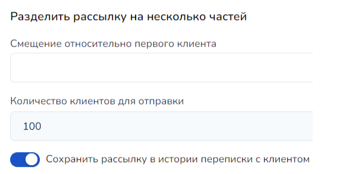

# Перемещение клиентов в другой блок

Работая с клиентами на платформе Salebot, пользователи могут столкнуться с необходимостью перемещения определенных групп клиентов между различными блоками. Это можно сделать двумя способами непосредственно в конструкторе воронок:

1. Через отправку сообщений
2. Без отправки сообщений


Доступно на тарифах "Бизнес" и "Инфобиз" (НЕ в тестовом периоде тарифа Инфобиз).&#x20;


Рассмотрим подробнее каждый из этих способов.&#x20;

## Перемещение через отправку сообщений

### Из одного блока в другой

Перед началом работы зайдите в раздел "Конструктор воронок", где следует найти нужный блок схемы, ИЗ которого вы хотите переместить группу определенных клиентов (или всех клиентов) в другой блок схемы.

Выберем блок, КУДА необходимо переместить клиентов, и блок, ИЗ которого необходимо переместить клиентов (например, выберем тех клиентов, которые были проверены ботом на наличие подписки (отмеченный на рис. 1), и переместим их в блок "Приходи на встречу!" (отмеченный на рис. 2)&#x20;

<figure><figcaption>
Рис. 1. Блок, из которого необходимо перенести клиентов
</figcaption></figure>

<figure><figcaption>
Рис. 2. Блок, в который необходимо перенести клиентов
</figcaption></figure>

Откроем настройки блока, где найдем иконку трех точек - меню дополнительных команд. В данном случае нам необходимо выбрать действие "Создать рассылку", которое в последствии перенаправит нас на новое окно - форму создания рассылки:

Запомните номер блока, из которого необходимо переместить клиентов. Он нам пригодится позднее.

<figure><figcaption>
Рис. 3. Копируем номер блока, из которого необходимо переместить клиентов
</figcaption></figure>

Для примера выберем рассылку в мессенджеры: далее перейдем в блок, в который нужно переместить клиентов:

<figure><figcaption>
Рис. 4. Нажмите на блок, в который необходимо переместить клиентов
</figcaption></figure>

Далее нажмите на дополнительное меню и создайте рассылку в мессенджеры:

<figure><figcaption>
Рис. 5. Создание рассылки в мессенджеры
</figcaption></figure>

Далее в открывшемся окне увидим три вкладки: "Получатели", "Сообщение" и "Отправка":

<figure><figcaption>
Рис. 6. Раздел настроек рассылки
</figcaption></figure>

В каждой вкладке нам необходимы лишь те настройки, которые будут применены для перемещения клиентов из одного блока в другой.&#x20;

Во вкладке получатели выберите необходимые настройки:

1. Поле "Название рассылк&#x438;_"_ необходимо для вашего удобства, чтобы в последующем ориентироваться уже в существующих рассылках в системе Salebot. Это необязательное поле.&#x20;
2. Найдите поле "Рассылка по клиентам из блоков":

<figure><figcaption>
Рис. 7. Выбираем блок, из которого необходимо перенести клиентов
</figcaption></figure>

Здесь нам пригодится номер блока, ИЗ которого необходимо переместить клиентов (ранее номер этого блока был скопирован на рис. 3). Скопировать номер можно в самом блоке и далее вставить его в поле рассылки:

<figure><figcaption>
Рис. 8. Номер блока, из которого перемещаем клиентов
</figcaption></figure>

<figure><figcaption>
Рис. 9. Вставка номера блока в поле рассылки
</figcaption></figure>

Поставьте галочку напротив номера необходимого блока. Так мы выбрали клиентов, находящихся в блоке "Подписан", для перемещения в другой блок:

<figure><figcaption>
Рис. 10. В фильтре выбран блок, из которого необходимо переместить клиентов
</figcaption></figure>

### Вкладки "Сообщение" и "Отправка"

#### Вкладка "Сообщение"

После того как вы выбрали получателей сообщения из Чат-бота, переходим во вкладку "Сообщение", где все необходимые настройки уже применены в соответствии с настройками блока, в который нужно переместить клиентов, что значительно облегчает работу:

<figure><figcaption>
Рис. 11. Вкладка "Сообщение"
</figcaption></figure>

Данную вкладку редактировать НЕ НУЖНО: на рис. 11 видно, что текст сообщения уже принял настройки блока схемы, как и остальные поля ввода данной вкладки. Сообщения и все действия, предусмотренные рассылкой, будут осуществлены в соответствии с настройками блока.

В этой же вкладке мы видим номер блока, в который переместятся клиенты после рассылки им сообщений из Чат-бота (перемещения клиента в необходимый блок):

<figure><figcaption>
Рис. 12. Плашка с информацией, куда будут переведены клиенты
</figcaption></figure>

<figure><figcaption>
Рис. 13. Блок, из которого была создана рассылка и в который перейдут клиенты
</figcaption></figure>


ВАЖНО!&#x20;

Не меняйте и не изменяйте расширенные настройки кнопок, если в этом нет острой необходимости.

Если вам необходимо изменить кнопки блока, перейдите в настройки блока в конструкторе и сделайте необходимые изменения в настройках самого блока!&#x20;


#### Вкладка "Отправка"

<figure><figcaption>
Рис. 14. Вкладка "Отправка"
</figcaption></figure>

В данной вкладке вы можете применить настройки для отправки сообщения в определенную дату, а также выбрать любое удобное время либо отправить немедленно.

Также можно разделить рассылку по частям, сместив ее относительно клиента, либо выбрать определенное количество клиентов:

<figure><figcaption>
Рис. 15. Количество клиентов,  которые переместятся в блок
</figcaption></figure>

При необходимости отключите переключатель "Сохранить рассылку в истории переписки с клиентом".&#x20;

После всех необходимых настроек вы можете запустить рассылку клиентам, тем самым они переместятся в нужный вам блок в Чат-боте.

### Дополнительно: Другие фильтры для перемещения клиентов в блок

Можно использовать другие фильтры для перемещения клиентов в блок во вкладке "Получатели":

<figure><figcaption>
Рис. 16. Вкладка "Получатели" в настройках рассылки
</figcaption></figure>


Важно! Используйте необходимые фильтры в зависимости от вашего проекта!&#x20;

Если вы не использовали какие-либо критерии для своих клиентов (например, не пользуетесь списками или метками, не делали сайт на Salebot и т.п.), то использовать такие фильтры не нужно!&#x20;


1. По состоянию в Salebot CRM:

<figure><figcaption>
Рис. 17. Рассылка по состоянию Salebot CRM
</figcaption></figure>

2. По подключенным мессенджерам:

<figure><figcaption>
Рис. 18. Отправка рассылки в зависимости от мессенджера
</figcaption></figure>

Рассылка будет отправлена только в выбранных мессенджерах.

3. По спискам/меткам (также можно исключить ненужные для перемещения списки/метки):

<figure><figcaption>
Рис. 19. Отправка рассылки только по отмеченным спискам и меткам
</figcaption></figure>

<figure><figcaption>
Рис. 20. Отправка рассылки всем, за исключением выбранных списков и меток
</figcaption></figure>

3. По переменным клиента (с исключением переменных клиента) / по переменным сделки (с исключением переменных сделки):

<figure><figcaption>
Рис. 21. Рассылка по клиентам, чьи переменные удовлетворяют значениям: 1) возраст - больше или равно 18 2) из города Пензы
</figcaption></figure>

<figure><figcaption>
Рис. 22. Рассылка с исключением клиентов, у которых переменная payment не равна значению true
</figcaption></figure>

Вы можете указать любые необходимые переменные, которые есть у вас в проекте. Например, в данном случае (рис. 13) у нас есть переменная age, в которой содержится возраст клиента. Если возраст больше или равен 18 (>=), то клиента переместят в блок с сообщением о встрече, если меньше или равно 17 (<=), то нет.&#x20;

5. По дате регистрации:

<figure><figcaption>
Рис. 23. Рассылка клиентам по дате регистрации 
</figcaption></figure>

Такую рассылку можно использовать, например, в случаях, если вы хотите предложить своим клиентам акции и скидки или иные бонусы в честь продолжительной работы с ними (например, от полугода).&#x20;

6. Добавить или исключить тегу (сайта/лендинга):

<figure><figcaption>
Рис. 24. Рассылка по тегу
</figcaption></figure>

В таком случае вам необходимо найти тег своего сайта (лендинга) в разделе "Сайты":

<figure><figcaption>
Рис. 25. Тег на плашке сайте
</figcaption></figure>

## Перемещение без отправки сообщения

Если вы не хотите отправлять сообщение клиенту при перемещении его в нужный блок, то в таком случае можно воспользоваться одним из двух способов:

1. Временно заменить текст на _#{none}_, а после перемещения вернуть обратно.&#x20;

В таком случае все настройки выполняются так же, как и при перемещении в блок с отправкой сообщения, однако вместо текста сообщение будет #{none}. Это активирует бота, но не отправит сообщение.

<figure><figcaption>
Рис. 26. Отправка пустого сообщения для перемещения клиентов в блок
</figcaption></figure>

2. Либо сделать полный клон блока со всеми связями и с текстом _#{none}_, из которого продолжится автоворонка со всеми вместе.

### Перемещение клиентов из  .csv-файла

В случае, если вам необходимо выгрузить клиентов из файла и добавить в воронку, воспользуйтесь данным способом.&#x20;

Шаг 1. Выберите необходимый блок, в который хотите переместить клиентов:

<figure><figcaption>
Рис. 27. Создание рассылки из блока воронки, в который нужно перевести клиентов из файла
</figcaption></figure>

Откройте меню дополнительных настроек и выберите рассылку в мессенджеры, после чего вы переместитесь в окно создания рассылки.&#x20;

Шаг 2. Во вкладке "Получатели" -> тип фильтра выберите "Загрузить из файла":

<figure><figcaption>
Рис. 28. Загрузка файла с клиентами для перевода в нужный блок
</figcaption></figure>

Для создания списка рассылки Вы можете[ скачать список клиентов ](https://salebot.pro/projects/200160/clients.csv?with_history=false), а затем отфильтровать его в Excel. Также можно загрузить csv-файл, в котором в первой колонке будут идентификаторы клиентов - client\_id. При этом выгруженный файл с клиентами имеет <mark style="color:red;">**!**</mark> кодировку UTF-8 и <mark style="color:red;">**!**</mark> разделитель - точку с запятой.


Для рассылки по whatsapp просто загрузите csv файл, в котором в первой колонке будут номера телефонов.


Шаг 3. Выберите csv-файл с клиентами, который необходимо загрузить в систему.&#x20;
