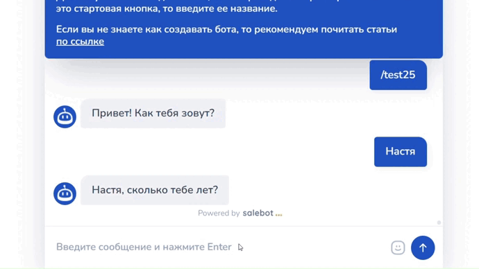

# Перевод клиента при без действии и работа с кнопками

В процессе диалога с клиентом может возникнуть проблема того, что он либо не выполняет целевое действие, либо застрял в последнем блоке воронки, и Чат-бот не реагирует на его действия. Чтобы не допустить такого, можно осуществить автоматический переход клиента в другой блок, не создавая повторных путей его движения.&#x20;

## Как автоматически запустить клиента по воронке?

Для примера осуществления функции автоматического движения клиента по воронке у нас будет небольшая схема Чат-бота, которая запрашивает у пользователя информацию - пойдет ли он на мероприятие:

<figure><figcaption>
Рис. 1. Схема чат-бота для записи на мероприятие
</figcaption></figure>

Из примера (рис. 1) видно, что клиент спустится дальше по воронке только при условии, что нажмет на кнопку "Да!", отправляемую предпоследним блоком (в других различных случаях триггером к дальнейшему движению по воронке может служить фактически что угодно в соответствии с условием вашей схемы чат-бота).&#x20;

Применительно к схеме (рис. 1), в процессе диалога выяснилось, что клиент Катя решила не нажимать кнопку в чат-боте, а диалог застрял в предпоследнем блоке воронки:

<figure><figcaption>
Рис. 2. Пример отработки схемы
</figcaption></figure>

Чтобы решить данную проблему, вам необходимо сделать пару простых действий в схеме: для продолжения диалога с клиентом или движения по воронке, например, через n-ное количество времени, можно провести еще одну стрелку из предпоследнего блока и установить промежуток времени, через который клиент автоматически спустится по воронке в следующий блок.

<figure><figcaption>
Рис. 3. Создаем вторую стрелку, ведущую в блок
</figcaption></figure>

В настройках стрелки устанавливается таймер с промежутком времени, чтобы клиент автоматически перешел в следующий блок:

<figure><figcaption>
Рис. 4. В настройках стрелки устанавливается таймер для перехода клиента в следующий блок
</figcaption></figure>

В обязательном порядке активизируйте переключатель "**Отменить, если покинул блок**" (рис. 3) во избежание повторного направления сообщения по истечению времени, если клиент все-таки перешел в следующий блок (например, с помощью нажатия кнопки).&#x20;

<figure><figcaption>
Рис. 5. Активируем чекбокс "Отменить, если покинул блок"
</figcaption></figure>

На примере выше видно, что бот автоматически перемещает клиента по воронке и направляет последнее сообщение, даже если он не нажал на кнопку.&#x20;

Теперь с помощью второй стрелки с установленным таймером клиент переместится дальше по воронке спустя определенный промежуток времени.&#x20;

## Как переместить клиента из последнего блока в другой?

На схеме (рис. 4) видно, что предпоследний блок предопределяет, в какой блок попадет ваш клиент в зависимости от нажатия им кнопки в блоке с двумя ветвлениями:

<figure><figcaption>
Рис. 6. Схема чат-бота
</figcaption></figure>

В случае, если клиент нажмет одну из двух кнопок, он остановится в последнем блоке и не сможет, например, в необходимых случаях вернуться обратно в предыдущий блок и выбрать другой вариант. Чат-бот попросту не будет реагировать на нажатие другой кнопки клиентом, поскольку пользователь уже переместился в последний блок, который не предусматривает перемещение клиента дальше по воронке (см. пример ниже).&#x20;

<figure><figcaption>
Рис. 7. Клиент переместился в последний блок, и Бот не реагирует на повторное нажатие кнопки
</figcaption></figure>

В таком случае проблему можно решить двумя способами:

1. С помощью блока "Не состояние" - данная функция оставит клиента в блоке с выбором кнопки без перехода в следующие блоки.&#x20;
2. С помощью callback-кнопок - данная функция переместит клиента в следующие блоки, однако при необходимости он все равно может изменить свой выбор в случае, если результат выбора его не устроил.

### Блок "Не состояние"

"Не состояние" — это серый блок. У него нет условия как в блоке "Состояние диалога", но в него нельзя перейти.&#x20;

Применительно к нашей схеме блок "Не состояние" будет как нельзя кстати, поскольку тогда пользователь не будет переходить из препоследнего блока и сможет нажимать иную кнопку, если выбор первой его не устроил.&#x20;

Для этого перейдем в настройки последних блоков и выберем тип блока "НЕ состояние" (не путайте с блоком "Не состояние с условием").

<figure><figcaption>
Рис. 8. Меняем тип блока на "Не состояние"
</figcaption></figure>

Далее нажмите "Сохранить", тогда тип блока будет изменен:

<figure><figcaption>
Рис. 9. Сохранение настроек для изменения типа блока
</figcaption></figure>

Таким же образом поменяйте второй блок на тип "Не состояние":

<figure><figcaption>
Рис. 10. Тип блока изменен на тип "Не состояние"
</figcaption></figure>

Чтобы протестировать работоспособность схемы, перейдем в тестировщик бота. Там мы увидим, что любая кнопка нажимается вне зависимости от того, какой выбор был осуществлен клиентом ранее:

<figure><figcaption>
Рис. 11. Тестирование схемы
</figcaption></figure>

### Callback-кнопки


Функционал доступен только для Телеграм и Вконтакте.&#x20;


В случае, если все же вам необходимо, чтобы клиент двигался дальше по воронке и переходил в другие блоки, поможет функционал callback-кнопок.&#x20;

Для этого удалим стрелки, ведущие к последним блокам схемы, и изменим их тип блока на "Стартовое условие":

<figure><figcaption>
Рис. 12. Изменение типа блока "Не состояние" на тип "Стартовое условие"
</figcaption></figure>

Чтобы удалить стрелку, наведите на нее и нажмите крестик:

<figure><figcaption>
Рис. 13. Удаление стрелки
</figcaption></figure>

Перейдем в настройки кнопок в блоке с кнопками:

<figure><figcaption>
Рис. 14. Настройки блока с кнопками
</figcaption></figure>

Откроется окно настройки кнопки "Да!", где проделаем следующие действия:

1. Выберем тип кнопки "Callback-кнопка"

<figure><figcaption>
Рис. 15. Изменяем тип кнопки на Callback-кнопку
</figcaption></figure>

2. В тексте ответного сообщения пропишем слова (фразы), необходимые для поля условия в блоке "Стартовое условие"

<figure><figcaption>
Рис. 16. Прописываем колбек
</figcaption></figure>

Аналогично настраиваем вторую кнопку (в нашей схеме - это кнопка "Нет, я передумал").&#x20;


Используйте разные тексты/слова для полей "текст ответного сообщения" в настройке кнопок в одном проекте во избежание ошибок работы Чат-бота.&#x20;


Далее переходим в настройки блоков первостепенная проверка условия, где необходимо в условиях прописать слова, которые вы ввели в поле "текст ответного сообщения" с типом совпадения "Полное совпадение":

<figure><figcaption>
Рис. 17. Прописываем текст ответного сообщения в поле "Условие" в блоке "Стартовое условие"
</figcaption></figure>

Аналогично настраиваем кнопку "Нет, я передумал":

<figure><figcaption>
Рис. 18. Настройка второй кнопки
</figcaption></figure>

И во втором блоке "Стартовое условие" прописываем текст ответного сообщения в поле "Условие":

<figure><figcaption>
Рис. 19. Настройка блока "Стартовое условие" для колбек-кнопки "Нет, я передумал"
</figcaption></figure>


Далее из блоков "Стартовое условие", в полях "Условие" которых вы прописали текст ответного сообщения, можно дальше строить схему по своему усмотрению.


Схема отрабатывает следующим образом:

<figure><figcaption>
Рис. 20. Отработка схемы (все данные и ситуации вымышлены, совпадения случайны)
</figcaption></figure>

В разделе клиенты текст ответного сообщения (колбек) выглядит следующим образом:

<figure><figcaption></figcaption></figure>


Ваш клиент не увидит текст ответного сообщения (колбека), поскольку такое сообщение является системным и уведомлением и понадобится для настройки реакций вашего бота.&#x20;

О настройки реакций на текст ответного сообщения (колбек) мы рассказали в данном разделе [Callback-кнопки](perevod-klienta-pri-bez-deistvii-i-rabota-s-knopkami.md#callback-knopki)


Таким образом, вы научились автоматически продвигать клиента по воронке тремя разными способами.&#x20;

## Видео-версия статьи


