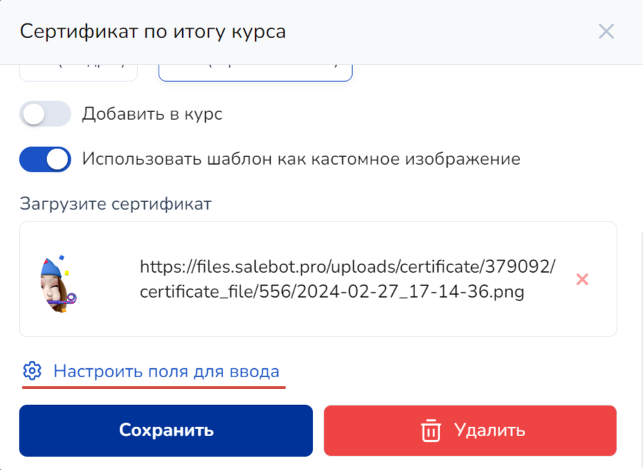
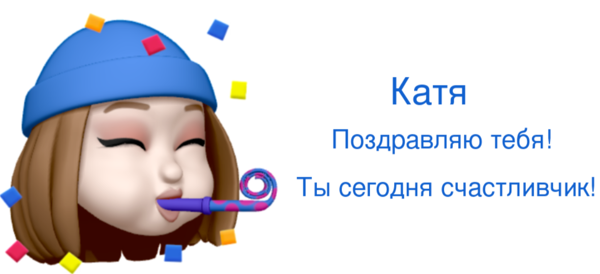

# Персонализированные изображения

Персонализированные изображения представляют собой иллюстрации или миниатюры, которые могут быть специально адаптированы для каждого конкретного пользователя в рамках вашего проекта. Эта адаптация может включает в себя изменение некоторых характеристик (а именно текста) изображения для различных целей.&#x20;

Например, созданное изображение может отображать имя пользователя в картинке для улучшения взаимодействия с аудиторией.&#x20;

Давайте попробуем создать изображения вместе.&#x20;

## Создание изображения

Для создания персонализированного изображения понадобится конструктор сертификатов: для этого войдите в раздел создания курсов.&#x20;

В конструкторе сертификатов можно настроить выдачу персонализированных изображений с помощью чат-бота.&#x20;

Для этого сначала настроим сертификат и текст в нем:


Обращаем внимание!

В тарифе "Инфобиз" персонализированное изображение создается в разделе "Курсы" во вкладке "Сертификаты.

В тарифе "Бизнес" раздел называется "Редактор изображений":

На бесплатном тарифе функционал недоступен.


Шаг 1. Создаем шаблон изображения: нажмите на "Создать сертификат" (на тарифе "Инфобиз") или "Создать шаблон" (на тарифе "Бизнес") и загрузите необходимое изображение.

<figure><figcaption>
Рис. 1. ДЛЯ ТАРИФА ИНФОБИЗ Создаем сертификат, загружаем изображение и ставим галочку "Использовать шаблон как кастомное изображение"
</figcaption></figure>

<figure><figcaption>
Рис. 1. ДЛЯ ТАРИФА БИЗНЕС Создаем шаблон, загружаем изображение и ставим галочку "Использовать шаблон как кастомное изображение"
</figcaption></figure>


Обязательно активируйте чекбокс "Использовать шаблон как кастомное изображение".&#x20;


Теперь перейдите в настройки изображения и расположите необходимые элементы в нужном вам порядке:

<figure><figcaption>
Рис. 3. Переходим в настройки полей ввода
</figcaption></figure>

Расположите имя получателя (в последствии через чат-бота имя будет изменено с помощью функции), также текст, который хотите прописать на картинке или выберите другие настройки:

<figure><figcaption>
Рис. 4. Добавляем поля с текстом
</figcaption></figure>

Можно играть с конструктором сертификатов по-разному: выбирать различные настройки цвета, шрифтов, самого изображения и прочее.&#x20;

Чтобы передавать такие изображения нам понадобится функция для чат-бота и непосредственно подключенный мессенджер к системе Сейлбот.

## Отправка файла через Чат-бот

Перейдите в схему Чат-бота, через которую вы хотите направлять персонализированные изображения.

Нам понадобится функция get\_custom\_image(image\_id, name\_on\_image, avatar)


Внимание!&#x20;

Использование функции в боте эквивалентно отправлению 10 сообщений.&#x20;


<table><thead><tr><th width="294">Параметр</th><th>Описание параметра</th></tr></thead><tbody><tr><td><mark style="color:red;">!</mark> image_id</td><td>ID изображения</td></tr><tr><td><mark style="color:red;">!</mark> name_on_image</td><td>имя пользователя</td></tr><tr><td>avatar </td><td>аватар пользователя.  Если необходимо передавать на персонализированном изображении, передайте значение "1". </td></tr></tbody></table>

ID изображения можно взять здесь:

<figure><figcaption>
Рис. 5. Копируем ID изображения
</figcaption></figure>

Для примера воспользуемся небольшой схемой Чат-бота, которая будет отправлять изображение в чате:

<figure><figcaption>
Рис. 6. Демонстрационная схема чат-бота для примера
</figcaption></figure>

Итак, во втором блоке мы спросим у клиента, как его зовут, а в настройках стрелки к третьему блоку отметим, что пользователь вводит данные и запишем его имя в переменную:

<figure><figcaption></figcaption></figure>

Настройки третьего блока, который направляет изображение:

1. В последнем блоке, который будет выдавать изображение, в калькуляторе пропишем нашу функцию, где будет лежать ID изображения и переменная name следующим образом:

<figure><figcaption></figcaption></figure>


Обращаем внимание!

Функция get\_custom\_image возвращает словарь с данными.

Если вам нужно отображать файл в диалоге, то в результате нужно выводить не саму переменную с присвоенным ей значением функции get\_custom\_image(в примере - это image\_1), а отображать результат переменной по ключу 'url' (в примере - это image\_for\_user)

Если все сделано верно, то в диалог придет сразу изображение.



Переменную image1 в калькуляторе вы можете назвать по-своему, главное - соблюдать правило:

1. только на латинице ("картинка = " - неправильно, "image = " правильно);
2. без пробелов ("apple on tabble = " - неправильно, "apple\_on\_tabble = " -правильно);
3. цифры в конце ("1apple = " - неправильно, "apple1 = " - правильно).&#x20;


Обратите внимание, что через конструкцию #{} мы вставили введенные пользователем значение в виде переменной full\_name.&#x20;

В результате в диалоге придут изображения с именем пользователя, которое введено было им в диалоге:

<figure><figcaption></figcaption></figure> <figure><figcaption></figcaption></figure>

