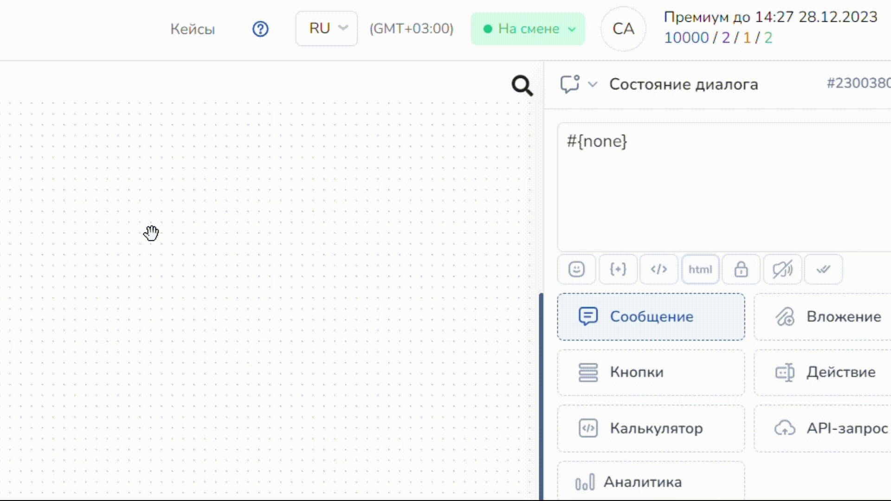
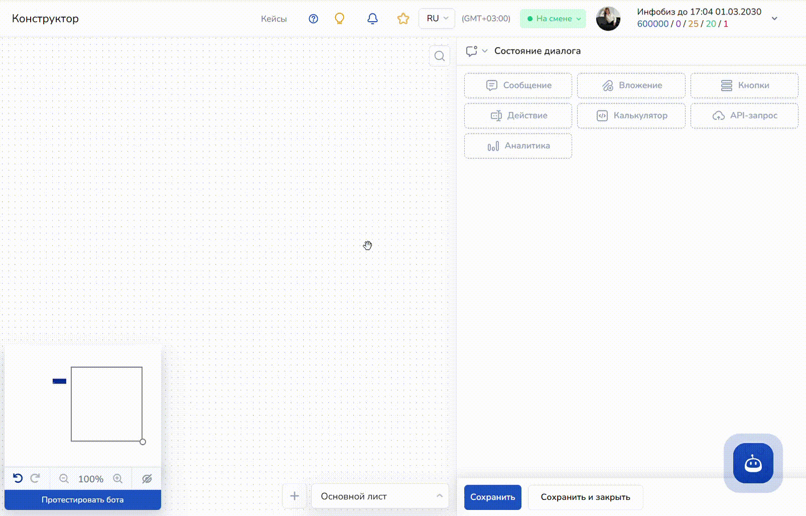
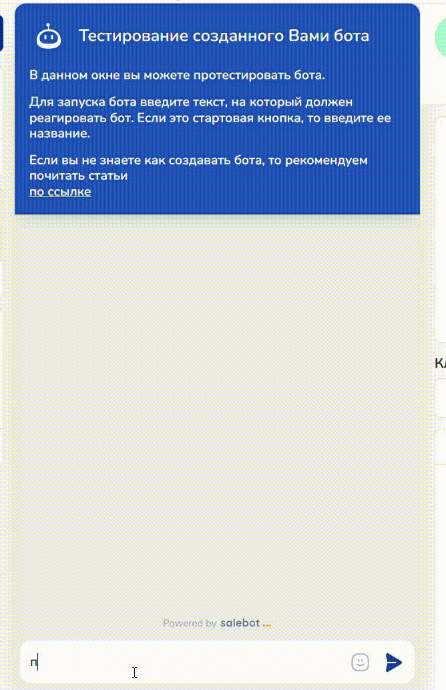
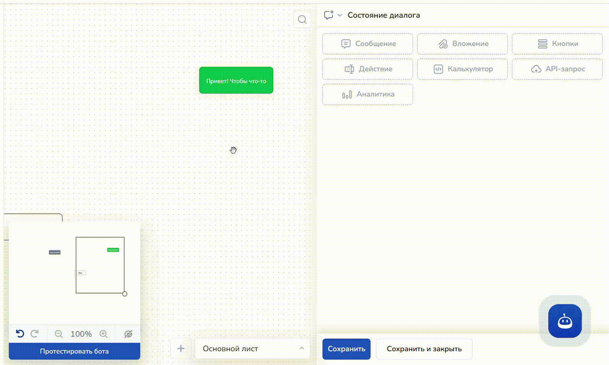
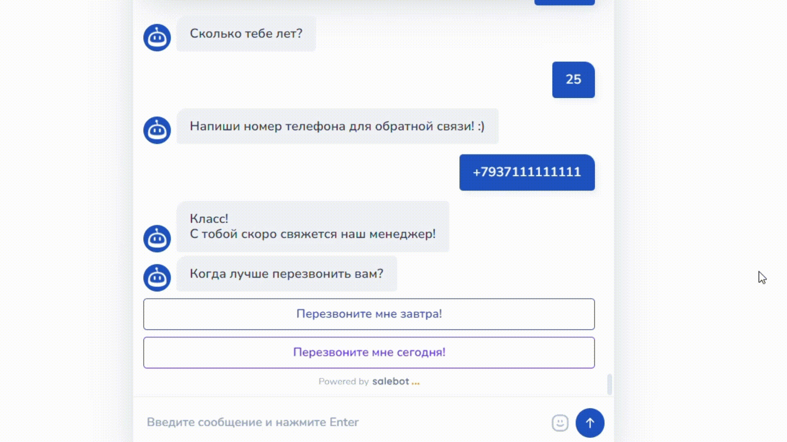

# Простого чат-бота

Создание чат-бота на платформе Salebot осуществляется достаточно просто, если вами был пройден раздел “[Как создать чат-бота](../../chat-boty/kak-sozdat-chat-bot-dlya-biznesa/konstruktor-chat-bota/kak-sozdat-chat-bota.md)”, где объясняются основы работы с конструктором воронок (редактором), с типами блоков и стрелок, с типами вложений, кнопками, а также калькулятором и т.п.


Перед тем как приступить к созданию просто Чат-бота, настоятельно рекомендуем изучить раздел “[Как создать чат-бота](../../chat-boty/kak-sozdat-chat-bot-dlya-biznesa/konstruktor-chat-bota/kak-sozdat-chat-bota.md)”!


## Как создать блок

Чтобы создать первый блок в воронке, необходимо кликнуть два раза левой кнопкой мыши по полю редактора:

<figure><figcaption>
Как создать блок кликом мыши
</figcaption></figure>

Как видно на примере выше, блок можно перемещать по всему редактору поля, выбрав любое удобное расположение.

Также блок можно создать просто нажав на "Сохранить" внизу экрана и выбрав его тип:

<figure><figcaption>
Создание блока с выбором типа
</figcaption></figure>

Можно выбрать следующий тип блока для старта работы Чат-бота: "Стартовое условие": &#x20;

<figure><figcaption></figcaption></figure>

Из статьи "[Создание блоков и их типы](/broken/pages/-LxaF6DgPjVFl2Gjvs6m)" нам известно, что тип блока "Стартовое условие" имеет наивысший приоритет: с него может запускаться цепочка схемы блоков вашего Чат-бота.&#x20;

При наличии в схеме Чат-бота блока с типом "Стартовое условие" и при вводе пользователем в процессе диалога ключевого слова (фразы) этого блока, беседа с клиентом продолжится именно с этого блока. Это позволяет обеспечить дополнительную гибкость структуры диалога, а клиенту сразу получить необходимое (например, заключить с вами сделку или зарегистрироваться на вашем курсе).&#x20;

В условиях блока необходимо прописать ключевое слово (например, Тег страницы сайта/сайта или иную фразу, необходимую для работы бота "Привет;здравствуйте через точку с запятой), на которое будет реагировать бот:

<figure><figcaption>
Пример заполнения блока для Чат-бота
</figcaption></figure>

Как видно на примере выше, в условии блока мы прописали тег страницы сайта, созданного на платформе Salebot, с которого будет происходить подписка, и в поле "Выбор соответствия" выбрали тип "Полное совпадение".&#x20;

При необходимости, можно прописать в условии ключевые слова иного типа (например, "Привет;Здравствуйте" и т.п.) - в таком случае выберите тип соответствия "Игнорируя ошибки и неточности", что поможет боту распознавать ключевые слова в сообщении ваших клиентов, написанных с опечатками или ошибками:

<figure><figcaption>
Реакция блока на ключевые фразы с ошибками
</figcaption></figure>

## Как создать следующий блок в схеме и прописать условия стрелки

Протяните стрелку из первого блока вниз: тем самым конструктор автоматически создает новый блок и с помощью стрелки соединяет блоки в одну схему, что позволит клиенту пройти дальше по воронке:

<figure><figcaption>
Создаем новый блок в схеме
</figcaption></figure>

В настройках стрелки укажем такие условия, чтобы Чат-бот собирал данные, вводимые пользователем, и сохранял их в необходимую нам переменную.

Для этого перейдите в настройки стрелки, где необходимо активизировать переключатель "Пользователь вводит данные", а также указать переменную, в которую Чат-бот сохранит данные клиента:

<figure><figcaption></figcaption></figure>

После того как пользователь отправит свое имя в сообщении, бот запишет его в необходимую переменную:

<figure><figcaption>
Карточка клиента с его данными
</figcaption></figure>

Во втором блоке схемы пропишем сообщение, которое будет запрашивать возраст вашего клиента. Для этого воспользуемся [регулярными выражениями](/broken/pages/-M0wjAtzg71YW7LB-2D8).&#x20;

> Регулярные выражения, которые будут использованы в данной статье:
>
> 1. номер телефона -> ^((\\+7|7|8)+(\[0-9]){10})$
> 2. email -> ^\[-\w.]+@(\[A-z0-9]\[-A-z0-9]+\\.)+\[A-z]{2,4}$
> 3. ввод цифр (для возраста) -> ^\[1-9]+\[0-9]\*$
>
> Полный список регулярных выражений смотрите [здесь](/broken/pages/-M0wjAtzg71YW7LB-2D8).&#x20;

В поле сообщения второго блока схемы Чат-бота пропишите необходимый вопрос: например, "Сколько тебе лет?":

<figure><figcaption>
Сообщение пользователю
</figcaption></figure>

Затем выполните следующие действия:

Шаг 1. Протяните стрелку из второго блока, чтобы создать следующий блок схемы аналогично тому, как был создан предыдущий.&#x20;

Шаг 2. В настройках стрелки в условии пропишите регулярное выражение вида ^\[1-9]+\[0-9]\*$ и выберите тип соответствия "Регулярное выражение"

<figure><figcaption>
Использование регулярного выражения
</figcaption></figure>


Помните, выбор соответствия при использовании регулярных выражений должен быть "Регулярное выражение", в противном случае схема чат-бота будет работать с ошибками!&#x20;


Шаг 3. В настройках стрелки активизируйте переключатель "Пользователь вводит данные" и пропишите имя переменной, куда Чат-бот будет сохранять данные клиента:

<figure><figcaption></figcaption></figure>

На скриншоте ниже видно, что Чат-бот записывает данные клиента в его карточку:

<figure><figcaption>
Карточка клиента с его данными
</figcaption></figure>

## Блок сбора данных клиента: номер телефона/email

В процессе диалога с клиентами часто возникает необходимость последующего общения с клиентом по телефону, однако возникает вопрос: каким образом можно настроить Чат-бота для автоматического сбора информации о клиенте? Конечно же с использованием регулярных выражений.&#x20;

Чтобы воспользоваться функцией сбора номера телефона (или email), используйте следующие регулярные выражения:

1. Номер телефона (Россия): ^((\\+7|7|8)+(\[0-9]){10})$&#x20;
2. Номер телефона (с кодом любой страны): ^(\\+)?((\d{2,3}) ?\d|\d)((\[ -]?\d)|( ?(\d{2,3}) ?)){5,12}\d$
3. Email: ^\[-\w.]+@(\[A-z0-9]\[-A-z0-9]+\\.)+\[A-z]{2,4}$


Убедитесь, что в условии стрелки перед регулярным выражением не стоит пробел!&#x20;

Иначе схема Чат-бота будет работать с ошибками.&#x20;



В схеме мы использовали регулярное выражение для номеров телефонов любой страны.&#x20;


Аналогично тому, как бот записывал имя и возраст клиента, в систему добавится и номер телефона пользователя (или его email при выборе соответствующего регулярного выражения).&#x20;

Создайте блок, где с помощью бота будете направлять сообщение клиенту с просьбой отправить номер телефона (или email) пользователю:

<figure><figcaption>
Блок с сообщением для получения номера телефона клиента
</figcaption></figure>

Далее протяните стрелку из этого блока, где в условии стрелки необходимо прописать соответствующее регулярное выражение.&#x20;

<figure><figcaption></figcaption></figure>


Как отмечалось ранее, не забывайте устанавливать выбор соответствия "Регулярное выражение" во избежание ошибок работы Чат-бота.&#x20;


С условием, где прописаны регулярные выражения, Чат-бот примет только значения номера телефона в виде цифр, а в случае с почтовым адресом - только установленные стандартизированные виды почтовых адресов.&#x20;

Если клиент отправил сообщение, не соответствующее значению номера телефона (email), можно создать блок, который будет сообщать клиенту о неверно введенных данных:

<figure><figcaption></figcaption></figure>

Для этого из блока, где вы прописали сообщение для того, чтобы клиент отправил номер телефона, проведите вторую стрелку и в создавшемся блоке пропишите необходимое сообщение, например, "Это не номер телефона. Пожалуйста, напиши номер телефона!":

<figure><figcaption></figcaption></figure>

Выберите тип блока "Не состояние" (скриншот выше). У такого блока нет условия как в блоке "Состояние диалога", но в него нельзя перейти.&#x20;

Применительно к нашей схеме блок "Не состояние" будет как нельзя кстати, поскольку тогда пользователь не будет переходить из предпоследнего блока, и для прохождения дальше по воронке ему нужно будет ввести номер телефона:

<figure><figcaption></figcaption></figure>


Про различные функцию блока "[Не состояние](/broken/pages/-M1G0tS64N7tDTadS8Ao)" можно узнать в одноименной статье.&#x20;


## Блоки последующего диалога бота с клиентом

Приступим к настройке блоков с кнопками, при нажатии на которые клиентом Чат-бот будет реагировать в соответствии с условиями кнопки (например, согласие на оплату; непосредственно оплата либо перенаправление на другой сторонний сайт и др. функции).&#x20;

Для этого из блока, отмеченного красным на скриншоте ниже, протяните стрелку ниже, где в настройках можно поставить таймер:

<figure><figcaption></figcaption></figure>

Чтобы поставить таймер, перейдите в настройки стрелки и выставьте необходимый временной промежуток, по прошествии которого Чат-бот направит сообщение клиенту:

<figure><figcaption></figcaption></figure>

В следующем блоке добавим кнопку "Перезвоните мне сегодня" и "Перезвоните мне завтра".


Подробнее про настройки кнопок в схеме Чат-бота читайте в этой [статье](/broken/pages/xeepnRj969zW3xRimkdg).&#x20;

Как подключить и настроить платежные системы для того, чтобы формировать оплату в кнопках (ссылках) в боте, читайте в разделе "Интеграции" → "[Эквайринг](../../platezhnye-sistemy/)".&#x20;


### Как добавить кнопки

Для того чтобы добавить кнопки, которые Чат-бот будет отправлять клиенту, нажмите на "Кнопки" внутри настройки блока:

<figure><figcaption></figcaption></figure>

Далее нажмите на "Добавить кнопку".&#x20;

<figure><figcaption></figcaption></figure>

Далее откроется окно для добавления кнопки, где необходимо прописать название кнопки и настроить ее в соответствии со своими требованиями:

<figure><figcaption></figcaption></figure>

Теперь данный блок будет направлять кнопки вашему клиенту, что позволит в последующем выявить момент (применительно к схеме, составляемой в данной статье), когда лучше будет связаться с ним:

<figure><figcaption>
Диалог бота во вкладке с тестированием
</figcaption></figure>

Диалог с клиентом будет отображаться во вкладке Клиенты, где вы можете проследить все изменения в диалогах с клиентами:

<figure><figcaption>
Вид диалога во вкладке "Клиенты"
</figcaption></figure>

После того как клиент нажмет на определенную кнопку, в диалог во вкладке "Клиенты" придет соответствующее сообщение: например, "перезвоните мне сегодня":

<figure><figcaption></figcaption></figure>

### Блоки окончания диалога с клиентом

После добавления кнопок необходимо каким-нибудь образом завершить диалог с клиентом, чтобы не оставлять его в неведении после того, как он нажмет на соответствующую кнопку.&#x20;

Для этого создадим два блока со стрелками, идущими от блока с кнопками:

<figure><figcaption>
Блоки завершения диалога
</figcaption></figure>

Теперь в условиях каждой стрелки пропишем название каждой кнопки:

<figure><figcaption></figcaption></figure>

В условиях созданных блоков пропишите необходимые сообщения, которые будет отправлять Чат-бот при нажатии клиентом кнопки:

<figure><figcaption>
Блок чат-бота, завершающий диалог
</figcaption></figure>

Теперь Чат-бот будет оповещать клиента о том, что его запрос принят.&#x20;

<figure><figcaption></figcaption></figure>

В разделе "Клиенты" вы сможете увидеть ответ клиента и перезвонить ему в удобное время, а также продолжить диалог в случае необходимости или уточнения деталей.&#x20;

Чтобы посмотреть данные, которые передал вам клиент, перейдите во вкладку "Клиенты":

<figure><figcaption>
Где взять данные клиента
</figcaption></figure>

Итоговая схема Чат-бота выглядит следующим образом:

<figure><figcaption></figcaption></figure>

Таким образом, мы создали простого Чат-бота, состоящего всего из восьми блоков, который получает информацию о клиенте и записывает их в переменные в виде имени, возраста и номера телефона, а также когда вашему менеджеру лучше связаться с пользователем.&#x20;
