# Реферальная программа

**Реферальная программа** - это механизм поощрения клиентов или партнеров компании, основанный на предложении вознаграждения или бонусов за привлечение новых участников.

С технической точки зрения, реферальная программа включает в себя несколько ключевых компонентов:

1. **Приглашающая ссылка**, то есть уникальный идентификатор, который позволяет пригласить других пользователей или клиентов для участия в программе. Пригласивший может распространять ссылку через различные каналы (например, в данной статье будет рассмотрена генерация ссылок через бота в WhatsApp, однако ссылки реферальных программ можно осуществлять с любого удобного вам мессенджера).
2. **База данных участников**, реализованная с помощью интеграции Salebot и функционала Google-таблиц, куда вносится информация о приглашенных и приглашающих пользователях.
3. **Система учета рефералов,** которая отслеживает действия, связанные с привлечением новых участников через реферальные ссылки. Система хранит данные обо всех рефералах: вы можете просмотреть, существует ли данный реферал в системе, как ранее приглашенный пользователь.


Настоятельно рекомендуем перед созданием схемы Чат-бота изучить раздел "Основы ботостроения на Salebot.pro", "Google-таблицы"


## Реферальная система в Whatsapp

В функционал создаваемого бота будут входить блоки, состоящие из следующих компонентов:

1. [генерация реферальной (партнерской) ссылки](referalnaya-programma.md#generaciya-referalnoi-ssylki);
2. [проверка на наличие нового пользователя в базе](referalnaya-programma.md#proverka-polzovatelya);
3. [оповещение пригласившего пользователя о новом реферале](referalnaya-programma.md#blok-s-uvedomleniem);
4. [запись пользователей в базу](referalnaya-programma.md#vnesenie-priglashennogo-i-priglasivshego-polzovatelei-v-bazu);
5. [запрос списка рефералов](referalnaya-programma.md#prosmotr-spiska-referalov).

### Генерация реферальной ссылки

Создадим блок со вложенной ссылкой, которую бот будет направлять пользователю по запросу "ссылка". Для этого создайте блок схемы одним из двух способов:

1. Двойным кликом по полю схемы конструктора:

<figure><figcaption>
Как создать блок двойным кликом мыши
</figcaption></figure>

2. С помощью кнопки сохранить внизу экрана и выбором типа блока:

<figure><figcaption>
Как создать блок с выбором типа 
</figcaption></figure>


Внимание!

Если в рабочей области конструктора еще нет блоков, то двойном клике будет создан блок "Стартовое условие" (зеленый блок).&#x20;

Если блоки уже существуют в рабочей области, то при двойном клике создается блок "Состояние" (белый блок).


После чего в условии блока пропишите слово "Ссылка" с выбором соответствия "Игнорируя ошибки и неточности" (необходимо в случаях опечаток или иных ошибок в сообщении от пользователя):&#x20;

<figure>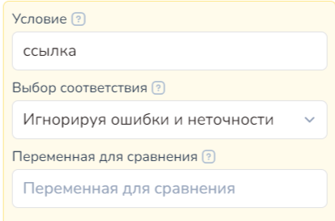<figcaption>
Рис. 1
</figcaption></figure>

Чтобы понимать от кого пришел пользователь, бот создаёт ссылку по шаблону: [https://wa.me/](https://wa.me/)(ваш номер телефона на котором подключен бот)?text=Вас%20порекомендовал%20#{phone}%20😌Здравствуйте

<figure>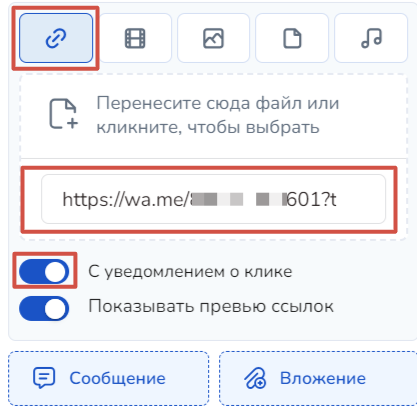<figcaption>
Рис. 2 Как вставить ссылку в блок схемы
</figcaption></figure>

Рассмотрим подробнее шаблонную ссылку:  https://wa.me/(ваш номер телефона, на котором подключен бот)?text=Вас%20порекомендовал%20#{phone}%20😌Здравствуйте, где

1. Вместо скобок "_(ваш номер телефона, на котором подключен бот)_" -> соответствующий номер телефона;
2. Вместо #{phone} автоматически подставляется номер телефона пользователя, который запросил свою партнерскую ссылку.

Сгенерированную ссылку мы отправляем не в тексте блока, а вложением -> ссылкой с уведомлением о клике (см. рис. 2 и рис. 3):

* выберите вставку вложения
* &#x20;тип - ссылка и вставьте ее в поле 'URL вложения':

<figure>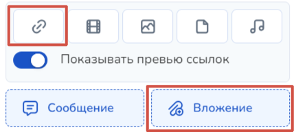<figcaption>
Рис. 3. Вложение -> тип -> ссылка
</figcaption></figure>

В таком случае визуально ссылка выглядит короткой:

Протестируем работоспособность ссылки через функцию "Протестировать бота":

<figure>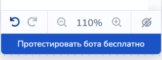<figcaption>
Рис. 5. Как тестировать бота
</figcaption></figure>

Получаем результат: ссылка перенаправляет пользователя в необходимый месседжер в чат по вашему номеру телефона:

<figure>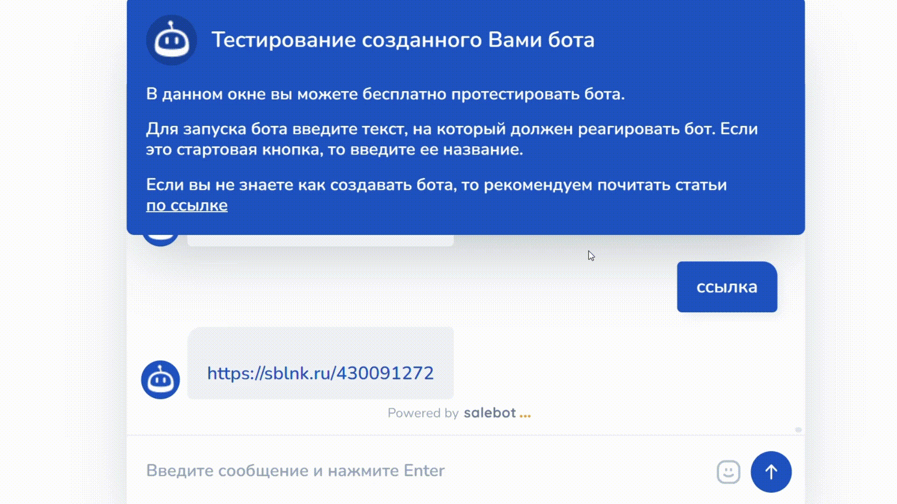<figcaption>
Тестируем работоспособность ссылки
</figcaption></figure>

Таким образом, у вас получилось сгенерировать ссылку-приглашение, по которой потенциальные пользователи попадают в чат-бота. Помимо этого, при клике на данную ссылку, пользователь перенаправляется к окну чата с предварительно заполненным сообщением. (см. рис. 6)

### Проверка пользователя&#x20;

#### Использование функций и регулярных выражений в блоке

Команда проверки и записи в базу сработает только в том случае, если бот найдет номер телефона в полученном сообщении от пользователя. Поэтому необходимо разделить полученную фразу на составляющие.&#x20;

Для этого существует функция splitter().&#x20;



**splitter(str, s, n)** -  для разделения строки на части. Функция возвращает массив элементов.

Параметры:

<mark style="color:red;">**!**</mark> <mark style="color:red;">**str**</mark> <mark style="color:red;"></mark><mark style="color:red;">- исходная строка</mark>

<mark style="color:red;">**!**</mark> <mark style="color:red;">**s**</mark> <mark style="color:red;"></mark><mark style="color:red;">- разделитель строки</mark>

**n** - максимальное количество элементов



Функция деления строки на части:

<figure><figcaption>
Рис. 8. Разделяем строку
</figcaption></figure>



Следующим шагом бот должен проверить, действительно ли набор цифр в строке представляет собой номер телефона. Для этого воспользуемся регулярным выражением следующего вида:

* Либо: ^(\\+)?((\d{2,3}) ?\d|\d)((\[ -]?\d)|( ?(\d{2,3}) ?)){5,12}\d$ -> номер телефона (любой)
* Либо: ^((\\+7|7|8)+(\[0-9]){10})$ -> номер телефона (только Россия)&#x20;

<figure>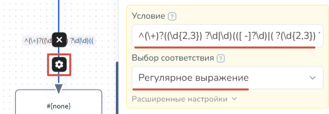<figcaption>
Рис. 9. Регулярное выражение для номера телефона
</figcaption></figure>


Как работать с регулярными выражениями читайте в одноименной [статье](/broken/pages/-M0wjAtzg71YW7LB-2D8).&#x20;


После того, как бот проверил, что набор цифр является именно номером телефона, сохраняем его из сообщения как переменную (например, #{reff}).

#### Проверка номера телефона пользователя, как реферала, в базе

Теперь необходимо проверить номер телефона пользователя, перешедшего по ссылке, не является ли он уже чьим-то рефералом (ранее приглашенным кем-то и записанным в нашу базу). Для этого в схеме создадим блок с функцией поиска по колонке.&#x20;

Воспользуемся функцией поиска по колонке. Для этого в блоке нажмите на "Api-запрос", где необходимо выставить значения по параметру:&#x20;

<figure>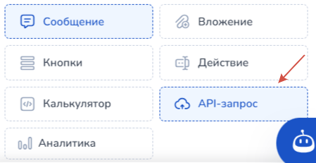<figcaption>
Рис. 9
</figcaption></figure>

<mark style="color:red;">**!**</mark> URL-функции: [https://store.salebot.pro/function/findcell](https://store.salebot.pro/function/findcell)

<mark style="color:red;">**!**</mark> JSON-параметры запроса:&#x20;

**{"id": "ид таблицы", "find": "текст для поиска", "col": номер колонки, "return": номер колонки,"creds\_path": "путь к вашему файлу с данными для авторизации"}**

Параметры ответа:

* "status":"1" означает, что найдено значение, а "status":"0" - не найдено.&#x20;
* data - найденное значение;
* cell\_number - найденная ячейка.



Параметр return необходимо передать со значением 0.\
&#xNAN;**{"id": "ид таблицы", "find": "текст для поиска", "col": 2, "return": 0}**\
Ответ: {"status":"1","data":{"0":"\u0441\u043e\u043b\u043d\u0446\u0435","1":"\u0440\u0430\u0441\u0441\u0432\u0435\u0442","2":"\u043a\u0440\u044b\u0448\u0430","3":"","4":"\u043d\u0435\u0431\u043e"},"cell\_number":{"row":4,"col":1, "col\_letter":"A"\}}\
Разбор ответа:&#x20;

data -> Ответ;&#x20;

data|0 -> Ячейка1;&#x20;

data|1 -> Ячейка2;&#x20;

data|2 -> Ячейка3;&#x20;

data|3 -> Ячейка4;&#x20;

cell\_number|row -> Строка;&#x20;

cell\_number|col -> Столбец




Какие функции еще доступны для таблиц читайте в статье "[Google-таблицы](/broken/pages/-M0rcpU5V2iF_guWKYJs)".


### Блок с уведомлением

Для уведомления пользователя, который направил соответствующую ссылку рефералу, о том, что клиент успешно прошел по этой ссылке, мы создадим специальный блок.

Для уведомления о создании нового реферала воспользуйтесь параметрами запроса (тип POST-json):&#x20;

<figure>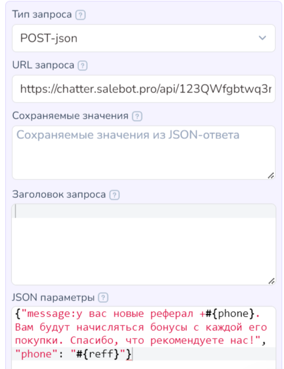<figcaption></figcaption></figure>

Запросы выполняются методом **POST** на URL: h**ttps://chatter.salebot.pro/api/{api\_key}/{action}**&#x20;

Где: **api\_key** - ключ доступа к API, который получается в настройках проекта (см. рис. 11).

<figure>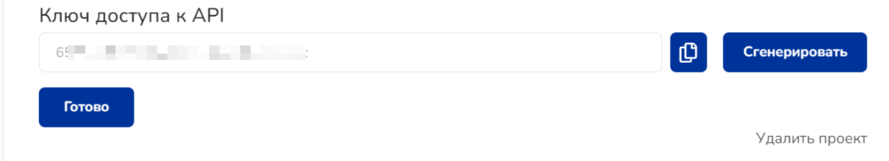<figcaption>
Рис. 11.
</figcaption></figure>

При этом получить ключ доступа можно с использованием переменной #{api\_key}. В ней хранится актуальный сгенерированный ключ доступа. Не забудьте перед использованием сгенерировать токен.

<mark style="color:red;">**!**</mark>**&#x20;URL запроса:** [**https://chatter.salebot.pro/api/#{api\_key}/whatsapp\_message**](https://chatter.salebot.pro/api/#{api_key}/whatsapp_message)

<figure>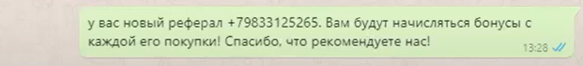<figcaption>
Рис. 12. Уведомление в Whatsapp
</figcaption></figure>


Подробнее о функциях API-запросов написано [здесь. ](/broken/pages/-M1G3NUmZ7-JAvRmEkDx)


### Внесение приглашенного и пригласившего пользователей в базу&#x20;

Для этого воспользуемся построчной записью в определенные столбцы. Осуществляется с помощью функции **mapping.**&#x20;


В таблице должна быть заполнена шапка (хотя бы одна ячейка в первой строке)


<mark style="color:red;">**!**</mark>**&#x20;URL функции:** [https://store.salebot.pro/function/gsheets](https://store.salebot.pro/function/gsheets)

<mark style="color:red;">**!**</mark>**&#x20;JSON-Параметры запроса:**&#x20;

{"id": "ид таблицы", "mapping":{"a":"#{переменная}", "b": "#{еще}", "d":"просто текст"\}}

Если вы хотите записывать строки не на первом листе, то надо добавить в запрос параметр list\_name:

{"id": "ид таблицы", "mapping":{"a":"просто текст", "b": "#{переменная}"}, "list\_name": "Название листа"}

Параметры:

id - идентификатор таблицы[\*](referalnaya-programma.md#gde-vzyat-identifikator-id-tablicy)\
a, b, c, d - это как раз имена столбцов\
list\_name - название вашего листа (например, "Лист2")

> Пример ответа:  **{"number\_row":8}**

Если проблем при выполнении запроса не возникло, то в ответ приходит номер строки, который можно сохранить и использовать для дальнейшей работы.

### Просмотр списка рефералов

Добавим в бота дополнительную команду, позволяющую смотреть список своих рефералов.

Для нахождения всех заданных значений в колонке используйте функцию findcell с параметром 'find\_all', при этом она найдет все значения параметра 'find\_all' в колонке 'col' и выведет строкой список уникальных значений из колонки 'return'.

<mark style="color:red;">**!**</mark>**&#x20;URL функции:**  [https://store.salebot.pro/function/findcell](https://store.salebot.pro/function/findcell)

<mark style="color:red;">**!**</mark>**&#x20;JSON-Параметры запроса:**&#x20;

{"id": "id таблицы", "find\_all": "что ищем", "list\_name": "название листа", "col": "номер колонки в которой ищем", "return": "номер колонки из которой возвращаем" , "find": "!"}

<figure>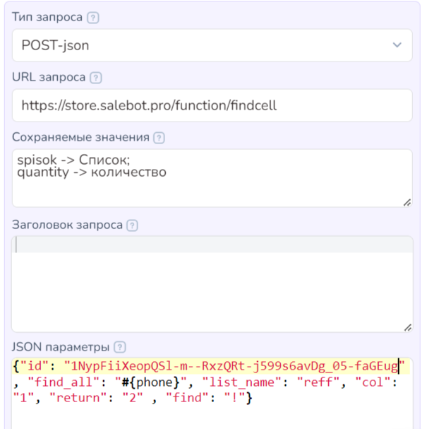<figcaption></figcaption></figure>

В сохраняемых значениях указываем:

spisok -> Список;&#x20;

quantity -> количество

Для пользователя выводим: "От тебя пришло #{Список}, твои рефералы #{Количество}"

В остальных мессенджерах сделать такую реферальную систему еще проще, так как данные о пригласившем пользователе передаются скрытым параметром при переходе, и новому пользователю не нужно отправлять текст в виде “меня пригласил такой-то номер”.
