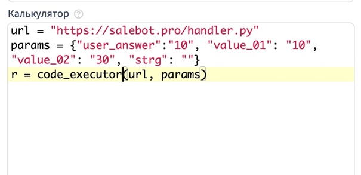

# Программирование на Python

## **Как выполнить исходный код на языке Python в конструкторе Salebot.pro**

Для исполнения исходного кода (файл с расширением .py) используется функция&#x20;

**code\_executor(URL, params)**, где

**URL -** ссылка на файл исходного кода (например, "[https://salebot.pro/handler.py](https://salebot.pro/handler.py)")

**params -** те параметры , которые нужны для вашего кода (они придут в виде строки JSON)

Возвращаемое значение - то, что вы вернете в функции.

Пример:

<figure><figcaption></figcaption></figure>


Если вам необходимо написать API-запросы от российского IP, рекомендуем использовать прокси Salebot.

Пример:

requests.get('https://google.com', proxies={'https': 'http://51.250.88.121:24532'}).text



139.59.148.123 - - executor кода для Python


### **Требования к исходному коду:**

Должна присутствовать функция с именем handle(data), принимающая один параметр, в котором будет хеш параметров, которые вы передали в настройках блока. Функция должна возвращать значение, которое после исполнения будет возращено боту. Для того, чтобы его разобрать на переменные конструктора, нужно возвращать JSON.

Пример кода вы можете увидеть по ссылке:  https://salebot.pro/handler.py


Максимальное время выполнения скрипта - 15 секунд.&#x20;


Вы можете использовать стандартные библиотеки, а также перечисленные ниже:

requests\
logger\
gspread\
oauth2client\
numpy\
pyzbar\
fuzzywuzzy\
python-Levenshtein\
re\
urllib\
time\
telethon\
json\
hmac\
hashlib\
beautifulsoup4\
pandas\
base64\
xmltodict\
mysql-connector-python\
zeep\
google-api-python-client
