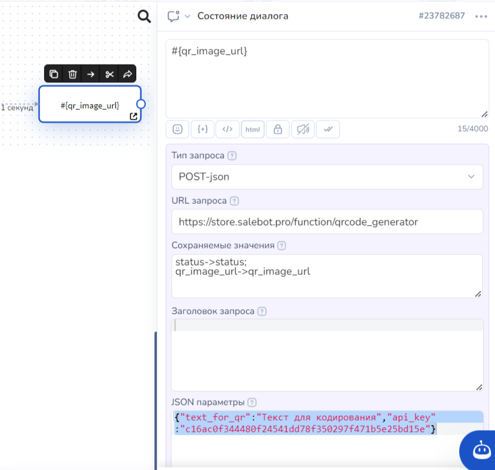
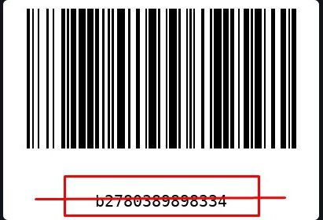
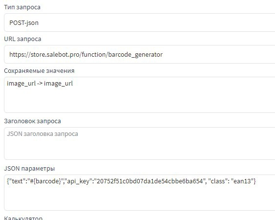
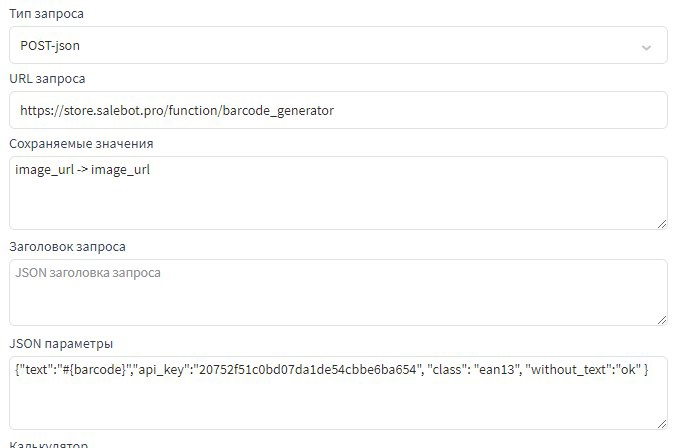
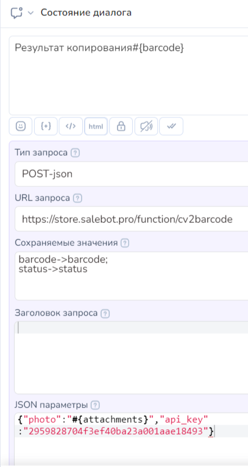
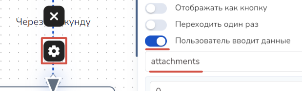

# QR-код и штрихкод

## Генерация QR-кода

Для генерации QR-кода необходимо воспользоваться функцией с адресом [https://store.salebot.pro/function/qrcode\_generator](https://store.salebot.pro/function/qrcode_generator)

**Параметры:**&#x20;

**text\_for\_qr** - текст который нужно закодировать.&#x20;

**api\_key** - ключ API из настроек проекта

.png>)


Замените #{api\_key} на токен из настроек проекта.


Пример:&#x20;

В поле "URL запроса" пишем [https://store.salebot.pro/function/qrcode\_generator](https://store.salebot.pro/function/qrcode_generator)

В поле JSON параметры пишем:

_{"text\_for\_qr":"Текст для кодирования","api\_key":"c16ac0f344480f24541dd78f350297f471b5e25bd15e"}_

В поле "Сохраняемые значения" пишем те переменные, которые хотим сохранить (нужный нам URL будет в _qr\_image\_url_):

_status->status;_&#x20;

_qr\_image\_url->qr\_image\_url_

<figure><figcaption></figcaption></figure>

Ответ: функция возвращает json с параметрами _status_ и _qr\_image\_url_

.png>)

.png>)

## Генерация штрихкода

Чтобы сгенерировать штрихкод, необходимо воспользоваться функцией с адресом\
[https://store.salebot.pro/function/barcode\_generator](https://store.salebot.pro/function/barcode_generator)

**Параметры:** \
&#xNAN;_**text**_ - текст который нужно закодировать. \
\
&#xNAN;_**api\_key**_ - ключ апи из настроек проекта.

.png>)

_**class**_ - класс кода, который необходимо сгенерировать. По умолчанию ea13. Может принимать значения _'code39', 'code128', 'ean', 'ean13', 'ean8', 'gs1', 'gtin', 'isbn', 'isbn10', 'isbn13', 'issn', 'jan', 'pzn', 'upc', 'upca'_

_**without\_text**_ - необязательный параметр, если его передать с любым значением, на картинке штрихкод будет отображаться без текста или как на картинке ниже


Замените #{api\_key} на токен из настроек проекта.


&#x20;Пример: _{"text":"#{barcode}","api\_key":"#{api\_key}", "class": "ean13"}_

Ответ: функция возвращает json с параметрами _status_ и _image\_url_ в случае успеха и _error\_message_ в случае неудачи.

В примере в переменной barcode лежит текст для кодирования и переменная image\_url сразу отправляется в сообщении как картинка.

## Распознавание на фотографии

Вы можете использовать ее для создания бота, который сканирует коды товаров. Полезной особенностью является то, что она также может сканировать QR-коды.

#### Функция для распознавания штрихкода на фотографии.

Адрес функции: [https://store.salebot.pro/function/cv2barcode](https://vk.com/away.php?to=https%3A%2F%2Fstore.salebot.pro%2Ffunction%2Fcv2barcode\&cc_key=)

Для сканирования фото вам необходимо отправить из блока следующие параметры:

{"photo":"ссылка на штрихкод/qr код или переменная со ссылкой","api\_key":"апи ключ из настроек проекта"}

Например, для отправки на сканирование фото, отправленного боту, нужно отправить следующие параметры:

<figure><figcaption></figcaption></figure>

В стрелке -> в поле "Пользователь вводит данные" укажите название переменной attachments.

<figure><figcaption></figcaption></figure>

`Пример кода:`

`{"photo":"#{attachments}","api_key":"eec62fb64bc0107a930ad3c60773b743b0bffa758981"}`

Где **photo** это ссылка на фотографию штрихкода, в нашем случае это переменная содержащая ссылку на фото отправленное боту.&#x20;

Следующий параметр **api\_key** это ключ, который можно сгенерировать в настройках вашего проекта.

Функция работает следующим образом. Клиент отправляет боту фото штрихкода, функция пробует его распознать и в случае успеха присылает штрихкод в виде числа и статус операции равен ok:&#x20;

barcode -> "4500000000567"\
status -> "ok"

Статус сканирования бывает следующим:

1. ok - штрихкод распознан
2. barcode not recognized - штрихкод не распознан
3. Error image reading - ошибка чтения файла
4. Error subscription - для вашей подписки не доступен данный функционал 

Переменную status можно поставить в виде условия на стрелку и отправлять пользователя в соответствующий блок.

Например, если на стрелке условие перехода переменная “status” и значение “barcode not recognized”, тогда выводим сообщение “Код не распознан, повторите попытку” и отправляем на повторный запрос фото.
