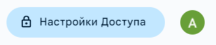
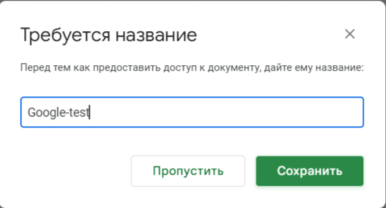
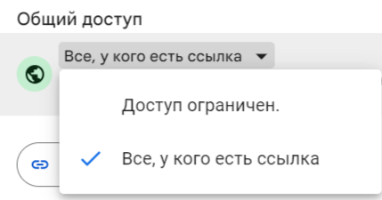
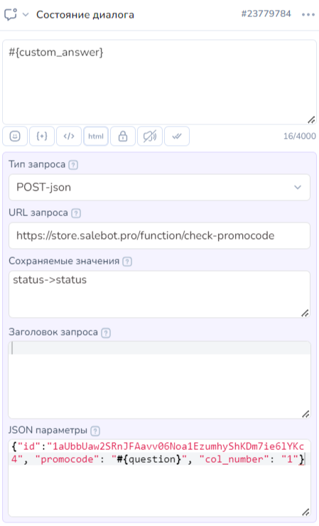
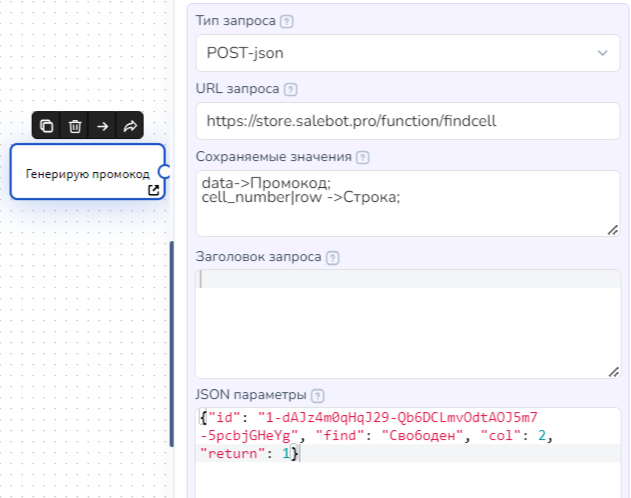
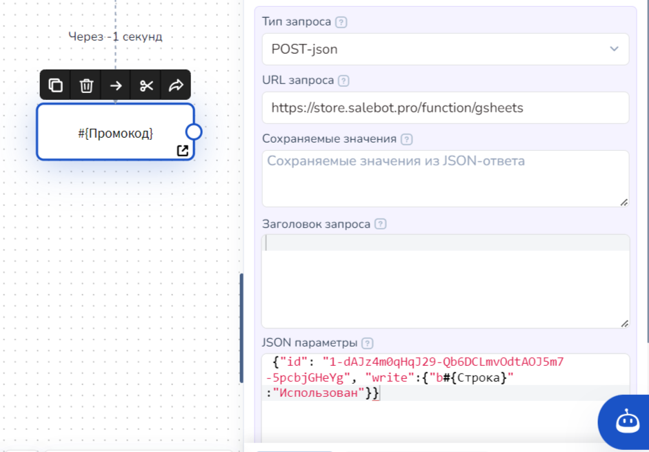
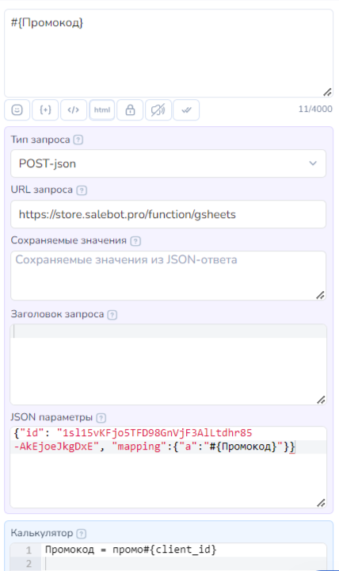

# Работа с промокодами

Выдать клиенту промокод на покупку можно двумя способами:

1. Подготовить список промокодов в Google-таблице, научить Salebot находить свободный промокод, выдавать его клиенту и отмечать его как выданный в гугл-таблице;
2. Научить Salebot генерировать его по некоему правилу с выдачей клиенту и внесением в Google-таблицу.

Проверить валидность промокодов можно при использовании Google-таблицы и API-запросы к ней.

Обо всем этом читайте ниже.

## Как проверить промокод из Google-таблицы

Если у вас стоит задача ограничить доступ к боту или специальным предложениям, вы можете воспользоваться функцией проверки промокодов.&#x20;

Подготовьте Google-таблицу, где в одном столбце будет список ваших промокодов. Настройки доступа в этой таблице выставьте «Редактировать могут все, у кого есть ссылка».&#x20;

<figure><figcaption></figcaption></figure>

<figure><figcaption></figcaption></figure> <figure><figcaption></figcaption></figure>


Как работать с Google-таблицами в платформе Salebot читайте в разделе[ Google](/broken/pages/AJyv5ldV9fJS174YJDVA) в статье [Google-таблицы](/broken/pages/-M0rcpU5V2iF_guWKYJs).&#x20;


Функция работает следующим образом. Клиент вводит в бота свой промокод, функция проверяет есть ли этот промокод в таблице в колонке, которую вы указали. Если промокод найден, то в соседнюю ячейку добавляется надпись "Промокод использован" при этом функция возвращает следующий ответ:

`{“status”: ‘’0’’}`

Адрес функции: [https://store.salebot.pro/function/check-promocode](https://store.salebot.pro/function/check-promocode)

Для проверки промокода вам необходимо отправить из блока следующие параметры

`{"id":"1aUbbUaw2SRnJFAavv06Noa1EzumhyShKDm7ie6lYKc4", "promocode": "#{question}", "col_number": "1"}`

Где id - это id вашей Google-таблицы, где хранятся промокоды. Вы можете получить его из ссылки на вашу Google-таблицу.&#x20;


Напоминаем, что сама таблица должна быть доступна **на редактирование** для всех, у кого есть ссылка.&#x20;


Если промокоды находятся **на отдельном листе**, то вы можете использовать параметр list\_name, в который необходимо передать название листа, например: `{"id":"1aUbbUaw2SRnJFAavv06Noa1EzumhyShKDm7ie6lYKc4", "promocode": "#{question}", "col_number": "1", "list_name": "Название листа"}`

[https://docs.google.com/spreadsheets/d/1aUbbUaw2SRnJFAavv06Noa1EzumhyShKDm7ie6lYKc4/edit#gid=0](https://docs.google.com/spreadsheets/d/1aUbbUaw2SRnJFAavv06Noa1EzumhyShKDm7ie6lYKc4/edit#gid=0)&#x20;

Следующий параметр - это промокод, который вводит посетитель.

col\_number - это номер колонки в таблице в которой хранятся промокоды.

`{“status”: ‘’1’’}`, после этого повторно ввести промокод нельзя.

Если функция не находит промокод в таблице или он уже использован, то она возвращает ответ

`{“status”: ‘’0’’}`

Как это использовать и куда вводить, показано на рисунке ниже:

<figure><figcaption></figcaption></figure>

\#{custom\_answer} - ответ с сервера, указанного в поле 'URL запроса"

Используйте эту переменную в поле ответ, чтобы посмотреть, что в нем содержится. Если вы все сделали правильно, то можете сохранить status->status, и в стрелках, в поле "Переменная для сравнения" выставить значения "status == 0" (и дать ответ пользователю, что код уже использован) или "status" == 1 (пользователь проходит дальше). Пример показан на рисунке ниже:

.png>)

### Как выдать промокод из Google-таблицы

Подготовьте таблицу как на рисунке ниже. В первом столбце - промокоды, а во втором - пометка «Свободен». Настройки доступа в этой таблице также выставьте «Редактировать могут все, у кого есть ссылка».&#x20;

.png>)

Вы получите ссылку вида: \
https://docs.google.com/spreadsheets/d/**1-dAJz4m0qHqJ29-Qb6DCLmvOdtAOJ5m7-5pcbjGHeYg**/edit?usp=sharing

Выделенный жирным фрагмент – это id вашей таблицы. Он нам понадобиться дальше.

В Salebot создайте блок в настройках которого укажите следующие параметры:

Тип запроса. **POST-json**\
URL запроса. [**https://store.salebot.pro/function/findcell**](https://store.salebot.pro/function/findcell)\
Сохраняемые данные из JSON-ответа:\
**data->Промокод;**\
**cell\_number|row ->Строка;**\
JSON POST-параметров:\
&#xNAN;**{"id": "1-dAJz4m0qHqJ29-Qb6DCLmvOdtAOJ5m7-5pcbjGHeYg", "find": "Свободен", "col": 2, "return": 1}**

Где вместо **1-dAJz4m0qHqJ29-Qb6DCLmvOdtAOJ5m7-5pcbjGHeYg** вставите id, полученный выше из адреса вашей таблицы.

<figure><figcaption></figcaption></figure>

Из этого блока создайте переход в следующий блок. В настройках Соединения (стрелки) установите -1 в поле "Задержка перед ответом", чтобы переход осуществлялся как можно быстрее.

В новом блоке выставьте настройки, описанные ниже.

Чтобы показать пользователю его промокод вставьте **#{Промокод}**.\
Тип запроса. **POST-json**\
URL запроса. [https://store.salebot.pro/function/gsheets](https://store.salebot.pro/function/gsheets)\
JSON POST-параметров. **{"id": "1-dAJz4m0qHqJ29-Qb6DCLmvOdtAOJ5m7-5pcbjGHeYg", "write":{"b#{Строка}":"Использован"\}}**

Где вместо **1-dAJz4m0qHqJ29-Qb6DCLmvOdtAOJ5m7-5pcbjGHeYg** вставите id, полученный выше из адреса вашей таблицы.

<figure><figcaption></figcaption></figure>

## Как сгенерировать промокод средствами Salebot

Если промокод может создаваться по определенному правилу, то можно генерировать его прямо в Salebot и записывать в Google-таблицу для дальнейшей проверки использования.

Для этого нам понадобятся переменные.\
Например, чтобы сгенерировать уникальный промокод, мы можем использовать переменную **#{client\_id}**. Это уникальная в Salebot переменная, обозначающая номер вашего клиента в системе.

В поле блока Расширенные настройки – Калькулятор при переходе запишите:\
**Промокод = промо#{client\_id}**\
В поле Ответ в этом блоке запишите **#{Промокод}**.\
В моем случае вы получите промокод вида промо**1330882**.

Если вы хотите добавить промокоду больше случайности, то можете добавить вызов функции random()\
**Промокод = 'promo' + '#{client\_id}' + random(0,10)**\
В данном примере в конец добавляется одна случайная цифра

Теперь запишем его в Гугл таблицу промокодов:

Для начала создадим пустую таблицу. Настройки доступа в этой таблице выставьте «Редактировать могут все, у кого есть ссылка». В ячейку A1 напишем слово Промокод&#x20;


_Если первая ячейка будет пустой, то функция не сработает, поэтому заполняем обязательно_


Вы получите ссылку вида: https://docs.google.com/spreadsheets/d/**1sl15vKFjo5TFD98GnVjF3AlLtdhr85-AkEjoeJkgDxE**/edit?usp=sharing

Выделенный фрагмент – это id вашей таблицы. Он нам понадобится дальше.

Теперь вернемся в Salebot. Продолжим редактировать наш блок с промокодом.\
Тип запроса. **POST-json**\
URL запроса. [https://store.salebot.pro/function/gsheets](https://store.salebot.pro/function/gsheets)\
JSON POST-параметров. **{"id": "1sl15vKFjo5TFD98GnVjF3AlLtdhr85-AkEjoeJkgDxE", "mapping":{"a":"#{Промокод}"\}}**\
Где вместо **1sl15vKFjo5TFD98GnVjF3AlLtdhr85-AkEjoeJkgDxE** вставите id, полученный выше из адреса вашей таблицы.

&#x20;У вас должно получиться так же, как на рисунке ниже:

<figure><figcaption></figcaption></figure>
