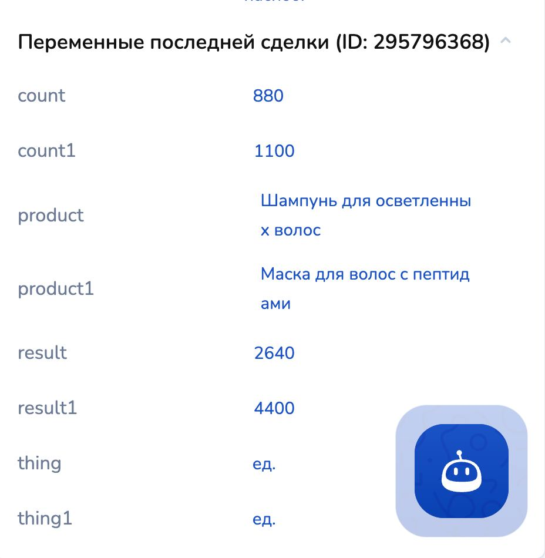

# AI-ассистент с google-таблицами

С помощью функции, разработанной командой Salebot, чат-бот ИИ прекрасно понимает введенные в таблицу значения, а затем записывает их в системную переменную в настройках проекта.&#x20;

Например, это может понадобится для AI-ассистента, который будет консультировать ваших клиентов по имеющемуся ассортименту товаров в вашем интернет-магазине, а также для рекламы умным ботом ваших возможностей.&#x20;

Как именно использовать чтение google-таблицы ботом - решать только Вам, а мы в свою очередь покажем, как оформить таблицу и настроить бота на работу с ней.

## Подготовка google-таблицы

### Создание и заполнение

Откройте редактор таблицы:&#x20;

<figure><figcaption></figcaption></figure>

Вам необходимо заполнить строки с обозначениями категорий столбцов:

<figure><figcaption></figcaption></figure>

Поскольку ИИ может считывать данные, с помощью функции он запишет значения из таблицы в переменную в настройках проекта, поэтому советуем добавлять лаконичные и понятные наименования категорий столбцов для вашего удобства и понимания поведения бота.&#x20;

Далее укажите в столбцах необходимые наименования:

<figure><figcaption></figcaption></figure>

Разберемся с категорией столбца "Единица измерения":

<figure><figcaption></figcaption></figure>

В единицу измерения можно вложить:&#x20;

1. Количественный показатель в виде штук/единиц (одна единица товара, две единицы товара, одна штука и т.д.):

<figure><figcaption></figcaption></figure>

2. Единицы измерения величин: литры, килограммы, граммы, метры:

<figure><figcaption></figcaption></figure>


Бот прекрасно поймет, что вы имели ввиду и будет пользоваться значениями, вложенными в слоты.&#x20;


Последним шагом в заполнении google-таблицы будет цена за единицу измерения:

<figure><figcaption></figcaption></figure>

На данном этапе google-таблица заполнена.&#x20;

### Настройки доступа

Для того чтобы бот с ИИ смог взять значения из таблицы, необходимо открыть настройки доступа:

<figure><figcaption></figcaption></figure>

Нажмите на настройки, после чего откроется следующее окно:

<figure><figcaption></figcaption></figure>

Здесь необходимо изменить настройку вместо "Доступ ограничен" на "Все, у кого есть ссылка":

<figure><figcaption></figcaption></figure>

### ID таблицы

Чтобы работать с функцией get\_info\_from\_table(!sheet\_id, number\_sheet, sheet\_json\_keys), нам понадобится ID таблицы, так как обязательным параметром функция принимает sheet\_id.&#x20;

Чтобы получить ID, достаточно кликнуть по адресной строке:

<figure><figcaption></figcaption></figure>

Вам откроется строка с адресом страницы:

<figure><figcaption></figcaption></figure>

Из которой нам понадобится набор символов и букв, как раз и являющийся ID таблицы:

<figure><figcaption></figcaption></figure>

На этом работа c таблицей и ее настройка завершена.&#x20;

## Работа в конструкторе воронок

### Использование функции get\_info\_from\_table()

Для того чтобы использовать функцию get\_info\_from\_table(), понадобится один блок в конструкторе воронок.&#x20;

Перейдите в соответствующую вкладку в Salebot и создайте блока с условием (стартовое условие или не состояние с условием):

<figure><figcaption></figcaption></figure>

Пропишем в сообщении вместо #{none} уведомление для тестового режима после запуска данного блока и вложенную переменную через конструкцию #{}:

<figure><figcaption></figcaption></figure>


Обращаем внимание!&#x20;

Переменная, вложенная в сообщении, необходима для проверки чтения ботом функции.&#x20;

При запуске блока в режиме тестирования бот покажет значения, которые будут вложены в переменную.



Обращаем внимание!

После настроек вызова блока в режиме тестирования и сохранения переменной в настройках проекта, не удаляйте данный блок.&#x20;

Он может понадобится: например, если вы добавили еще какие-либо значения в таблицу, просто запустите блок в тестовом режиме. Тогда данные в переменной проекта обновятся.



Название переменной может быть любое, удобное вам.


Далее нам понадобится функция get\_info\_from\_table(sheet\_id, number\_sheet, sheet\_json\_keys) - функция предназначена для чтения данных из таблицы.

<table><thead><tr><th width="248">параметры</th><th>описание </th></tr></thead><tbody><tr><td><mark style="color:red;"><strong>!</strong></mark> sheet_id</td><td>id google-таблицы</td></tr><tr><td>number_sheet</td><td>Номер листа в таблице; по умолчанию = 1</td></tr><tr><td>sheet_json_keys </td><td>Необязательный параметр, ключ доступа к данным таблицы</td></tr></tbody></table>

Откройте калькулятор и пропишите ID таблицы, вложив ее в переменную (например, sheet):

<figure><figcaption></figcaption></figure>

Далее назначьте переменную, указанную в сообщении блока, и присвойте ей значение в виде функции get\_info\_from\_table() с обязательным параметром sheet\_id (вместо которого вставьте переменную sheet, где лежит ID таблицы):

<figure><figcaption></figcaption></figure>

<mark style="color:red;">**Важно!**</mark> Перед переменной product\_pay\_info в калькуляторе пропишите project - это необходимо для того, чтобы ПЕРЕМЕННАЯ и ЗНАЧЕНИЯ из таблицы были внесены в настройки проекта (закешировались):

<figure><figcaption></figcaption></figure>

Теперь пропишите любое слово/цифры в условие блока:&#x20;

<figure><figcaption></figcaption></figure>

### Блок для передачи данных

Далее создайте второй блок Состояние:

<figure><figcaption></figcaption></figure>

Данный блок Состояние понадобится для передачи переменных в карточку клиента.&#x20;

Можно также в данном блоке передать завершающее сообщение от бота, например, "Спасибо за заказ! Передаю данные менеджеру по связи!":

<figure><figcaption></figcaption></figure>

Далее скопируйте ID блока - он понадобится для настройки AI-ассистента в команде "start\_block\_from\_ai 31241050", где вместо ID из примера вам необходимо вставить ID своего блока.

### Чтение таблицы

Теперь перейдите в тестирование бота и запустите блок с условием:

<figure><figcaption></figcaption></figure>

Таким образом, блок отработался верно: вы видите значения, которые лежат в переменной в настройках проекта.&#x20;

В этом можно убедиться, перейдя в соответствующий раздел:

<figure><figcaption></figcaption></figure>

Во вкладке "Переменные" в настройках проекта вы увидите свою переменную с вложенными в нее значениями из таблицы. Таким образом, теперь внутри вашего проекта существует переменная с товарами, стоимостью и всем тем, что вы указали в таблице.

## Работа в AI-ассистенте

Переходим в раздел "AI-ассистент" и приступаем к настройке искусственного интеллекта.&#x20;

Роль ассистента: продажник

<figure><figcaption></figcaption></figure>

Также установим опции "Кнопки" и "Пошаговый ввод данных":

<figure><figcaption></figcaption></figure>

Кнопки нам понадобятся для визуально оформленных ответов бота, а также удобства клиента (тогда вашему пользователю не нужно вводить вручную слова в диалоге); пошаговый ввод данных - для опроса ботом по поводу формируемого заказа.

### Настройки AI-ассистента

В настройках бота прописываем следующие данные:&#x20;

1. Должность и инструкции для бота.

Пример:

<_Ты продавец магазина "Все мелочи._ \
_Твоя задача спросить у клиента, какой товар он хочет выбрать, сколько единиц товара, а далее высчитать итоговую стоимость  товара, равную единице товара, умноженное на стоимость._

_После того, как ты опросил клиента по поводу его покупки, продублируй ему заказ и спроси "Верно ли составлен заказ?"_>.&#x20;

**Обращаем внимание** на строку "Высчитать итоговую стоимость товара, равную единице товара, умноженную на стоимость" - данная строка выведет итоговый результат стоимости всех выбранных категорий клиентом:

Пример:

&#x20;Клиент выбрал три кг одного товара. Бот, в свою очередь, рассчитывает итоговую стоимость:

<figure><figcaption></figcaption></figure>

2. Команда для вызова блока и передачи переменных в систему прописывается следующим образом:

<Если клиент написал "Заказ составлен верно" или "Верно", то напиши "start\_block\_from\_ai N">, где вместо N прописывается ID блока с завершающим сообщением: блок Состояние передает данные в карточку клиента:

<figure><figcaption></figcaption></figure>

Команды в настройках AI-ассистента выглядят следующим образом:

<figure><figcaption></figcaption></figure>

### Знания бота

В поле "Знания бота" передайте переменную, которую ранее закешировали блоком Первостепенной проверки условия:

<figure><figcaption></figcaption></figure>

Знания бота:&#x20;

<figure><figcaption></figcaption></figure>

Так бот будет брать информацию из переменной, лежащей в настройках проекта, и консультировать ваших клиентов по поводу имеющегося ассортимента.&#x20;

### Формат данных

В формате передаваемых данных вы прописываете собственно сами собираемые данные (например, товар), далее прописывается фразу с "ключом" и присваиваете значение ключу:

<figure><figcaption></figcaption></figure>

#### Объяснение

Строка 1: "Формат передаваемых данных: товар с ключом product, единица измерения с ключом thing, цена с ключом count, общая стоимость всех выбранных товаров с ключом result" - дает боту понять, какие данные и с каким значением необходимо передать в систему.&#x20;

Данные переменные будут отображаться в карточке клиента:

<figure><figcaption></figcaption></figure>

2. Если вам необходимо, чтобы каждый выбранный клиентом товар отображался отдельно, добавьте второй строкой:

"Если клиент выбрал несколько товаров, то запиши первый товар с ключом product1, второй товар с ключом product2, третий товар с ключом product3 и так далее".

На этом настройка AI-ассистента завершена.&#x20;

Остальные параметры можно выставить по-своему усмотрению:

<figure><figcaption></figcaption></figure>

## Тестирование бота

Добавьте через конструктор условий работу бота в тестовом окне:

Шаг 1. Кликните по конструктору условий

<figure><figcaption></figcaption></figure>

Шаг 2. Выберите вкладку с тестовым окном и кликните "Добавить":

<figure><figcaption></figcaption></figure>

Теперь в условии для запуска вы видите следующее значение:

<figure><figcaption></figcaption></figure>


Так бот будет запускаться только в тестовом окне и нигде больше.

После отладки работы бота, уберите данное условие.&#x20;


Теперь протестируем бота:

1. Зададим контрольный вопрос боту об ассортименте товаров:

<figure><figcaption></figcaption></figure>

Бот показал ассортимент товаров, которые были введены в google-таблице, захватывая значения из переменной, содержащейся в настройках проекта.

2. Далее выберем товар и поговорим с умным ботом:

<figure><figcaption></figcaption></figure> <figure><figcaption></figcaption></figure>

3. Выберем другой товар:

<figure><figcaption></figcaption></figure>

Бот также отображает корректно, показывая клиенту уже категории товаров для последующего выбора.&#x20;

4. Клиент выбрал несколько товаров и выбрал их количество:

<figure><figcaption></figcaption></figure> <figure><figcaption></figcaption></figure>

Бот высчитал стоимость выбранных единиц товара и рассчитал итоговую стоимость.&#x20;

5. Отправляем данные в систему:

<figure><figcaption></figcaption></figure>

Итог: после того, как бот продублирован заказ и клиент ответил, что заказ составлен верно, чат-бот, опираясь на настройки, вызвал блок "Состояние диалога":

<figure><figcaption></figcaption></figure>

После чего данные, сформированные ботом в диалоге с клиентом, направились в карточку клиента:

<figure><figcaption></figcaption></figure>

Бот отработал все корректно.


Таким образом вы можете создать интернет-магазин любого вида, использовать любые необходимые значения внутри таблицы.&#x20;

Основное ограничение - только Ваша фантазия!


## Видеогид


