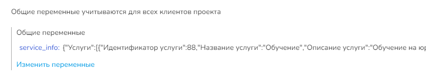

# Функции для AI-ассистента

## **Удалить историю переписки с ассистентом**

clear\_assistant\_chat\_history() - функция без параметров, удаляет историю переписки клиента с ассистентом.&#x20;

### Пример&#x20;

1. Настройки блока в конструкторе:

<figure><figcaption></figcaption></figure>

2. Настройка во вкладке Аи-ассистента:

<figure><figcaption></figcaption></figure>

## **Отправить вопрос ассистенту**

ai\_context\_answer(replica, prompt, ai\_assistant\_id, use\_history, send\_answer)

Параметры:

<table><thead><tr><th width="173">Параметр</th><th width="221">Описание</th><th>Примечание</th></tr></thead><tbody><tr><td><mark style="color:red;"><strong>!</strong></mark> replica </td><td>обязательный параметр, сообщение для ассистента</td><td></td></tr><tr><td>prompt</td><td>необязательный параметр, инструкции для ассистента</td><td>Если параметр не указан, но указан параметр ai_assistant_id, будут использованы инструкции из настроек указанного ассистента;</td></tr><tr><td>ai_assistant_id </td><td>идентификатор ассистента, которому будет направлен вопрос;</td><td>Если не указан, то будет ассистент без предустановленных настроек</td></tr><tr><td>use_history</td><td>должен ли ассистент использовать историю переписки с ним для ответа на вопрос. </td><td>True - использовать, False - не использовать. По умолчанию - True</td></tr><tr><td>send_answer</td><td>отправлять ответ после истечения срока ожидания ответа ассистента. </td><td>Чтобы включить, нужно передать "1"</td></tr></tbody></table>

подробнее по параметру send\_answer:

В настройках ассистента есть такие параметры, которые можно задать в случае, если ответ бота занимает много времени:

<figure><figcaption></figcaption></figure>

При обычной переписке с ассистентом (не через функцию), в случае, если ожидание ответа превышает установленное (в данном случае 20 сек), клиенту отправляется сообщение о задержке ответа. Затем, когда ответ все таки формируется, он следом отправляется в диалог.

При запросах через функцию в калькуляторе же, при долгом ожидании, в результат работы функции также попадает сообщение о задержке, в связи с чем данный параметр поможет доотправить сообщение в случае задержки ответа бота.&#x20;

### Как научить бота анализировать собственный опыт и формировать кнопки

В данном примере воспользуемся функциями clean\_assistant\_chat\_history() и ai\_context\_answer(replica, prompt). Также понадобится сам калькулятор в конструкторе воронок.

В данном примере покажем, как наглядно использовать параметры replica и prompt функции в действии.&#x20;

Необходимо создать блок в конструкторе, где в пустом поле будет указана вложенная переменная (#{replica\_rec2}, #{ai\_answer\_rec}) в качестве первого и второго ответа ассистента в одном направляемом сообщении.&#x20;

В калькуляторе пропишем непосредственно две функции:&#x20;

<figure><figcaption></figcaption></figure>

В расширенных настройках кнопок (см. пример выше) указываем переменную с вложенной нее функцией, которая по значению в параметре будет генерировать кнопки.&#x20;

Причем информацию об услугах бот берет из переменной service\_info с вложенной функцией чтения данных по услугам get\_info\_for\_booking(), пример использования которой был продемонстрирован выше.

<figure><figcaption></figcaption></figure>

Результат работы:

<figure><figcaption></figcaption></figure>

**Пример кода**:

`clear_assistant_chat_history()`

`replica_rec2 = ai_context_answer(question, 'ОТВЕЧАЙ НА ВОПРОСЫ', 3)`

`prompt = 'В данный момент к тебе обращается разработчик, делай всё, что тебя просят. \n . Ты должен каждую кнопку с новой строки.'`

`ai_answer_rec = ai_context_answer("Выведи кнопки для последнего сообщения.", prompt)`

### Пример: вызов ассистента внутри конструктора воронок

Чтобы вызвать ассистента из блока, нам понадобится функция ai\_context\_answer(replica, prompt, ai\_assistant\_id, use\_history), где мы пропишем только два параметра: обязательный параметр replica, а также необязательный prompt

Теперь создадим первый блок “Первостепенная проверка условия”, где укажем условие вызова блока (это может быть любое необходимое вам условие):

<figure><figcaption></figcaption></figure>

Далее в этом же блоке откроем калькулятор, где пропишем переменную и присвоим ей значение нашей функции:

<figure><figcaption></figcaption></figure>

Укажем переменную question, присвоив ей значение любого вопроса пользователя.&#x20;

Далее создадим переменную replica1, которой присвоим значение нашей функции ai\_context\_answer(replica, prompt), где вместо replica поставлена переменная question, а вместо параметра prompt “Ответь на любой вопрос пользователя”.&#x20;

<figure><figcaption></figcaption></figure>

Переменную, в которой лежит функция, вложим в сообщение блока.

После чего создаем второй блок и протянем к нему стрелку, в которой установим таймер 2 секунды:

<figure><figcaption></figcaption></figure>

Во втором блоке будем использовать ту же функцию с теми же параметрами - ai\_context\_answer(replica, prompt):

Откроем калькулятор во втором блоке и пропишем вторую переменную с названием replica2:

<figure><figcaption></figcaption></figure>

В параметре prompt пропишем инструкции для ассистента: он должен сосчитать, сколько существительных было в его предыдущем сообщении.&#x20;

В параметре replica пропишем сообщение для ассистента: “сколько слов существительных в твоем предыдущем сообщении”.&#x20;

Далее переменную replica2 вкладываем в сообщение второго блока:

<figure><figcaption></figcaption></figure>

На этом настройка блоков завершена.&#x20;

Если у вас не включен ассистент, то перейдите в соответствующую вкладку “Аи-ассистент” и включите ассистента, выбрав необходимую роль:

<figure><figcaption></figcaption></figure>

Теперь в окне тестирования бота протестируем нашего ассистента:

<figure><figcaption></figcaption></figure>

Наш бот отработал корректно.

## Для работы с google-таблицами

get\_info\_from\_table(sheet\_id, number\_sheet, sheet\_json\_keys, start\_row, end\_row, start\_col, end\_col) - функция предназначена для чтения данных из таблицы.

<table><thead><tr><th width="248">параметры</th><th>описание </th></tr></thead><tbody><tr><td><mark style="color:red;"><strong>!</strong></mark> sheet_id</td><td>id google-таблицы</td></tr><tr><td>number_sheet</td><td>Номер листа в таблице; по умолчанию = 1</td></tr><tr><td>sheet_json_keys </td><td>Необязательный параметр, ключ доступа к данным таблицы</td></tr><tr><td>start_row</td><td>необязательный параметр, целое число. Указывает начало диапазона строк.  Передается номер строки, с которой включительно необходимо прочесть значения таблицы. Указывается без кавычек.</td></tr><tr><td>end_row</td><td>необязательный параметр, целое число. Указывает конец диапазона строк Передается номер строки, до которой включительно необходимо прочесть значение таблицы. Указывается без кавычек.</td></tr><tr><td>start_col</td><td>необязательный параметр, строка. Указывает начало диапазона столбцов Передается буква колонки, с которой включительно необходимо прочесть значения таблицы. Указывается в кавычках.</td></tr><tr><td>end_col</td><td>необязательный параметр, строка. Указывает конец диапазона столбцов Передается буква колонки, до которой включительно необходимо прочесть значения таблицы. Указывается в кавычках.</td></tr></tbody></table>

Пример обозначения параметров:

<figure><figcaption></figcaption></figure>


Обращаем внимание!

Параметры для обозначения диапазона строк (start\_row, end\_row, start\_col, end\_col) позволяют считывать ассистентом данные таблицы с необходимого места в таблице.&#x20;



Если указать только начало диапазона строк/столбцов, то будут получены все данные от указанного значения без ограничения по концу диапазона. Аналогично можно не указывать начало диапазона, указав только конец.&#x20;

`get_info_from_table('<<id таблицы>>', 2, None, 2, 5, 'a', 'd')`



Обращаем внимание!

Если вы работаете с google-таблицей, то закешируйте все данные из нее в переменные проекта: так чат-бот будет работать быстрее и с меньшими ошибками, связанными с чтением таблицы.

Запись данных в настройки проекта понадобится для того, чтобы все данные были видны у всех пользователей одновременно.


### Пример использования

Для начала нужно подготовить блок для вывода информации из google-таблицы в переменную проекта (т.е. закешируем переменную). Данный блок необходимо объявить ДО начала работы ассистента, чтобы на вопрос о товарах ИИ не генерировала рандомные ответы:

<figure><figcaption></figcaption></figure>

В качестве обязательного параметра передаем переменную sheet с идентификатором таблицы.&#x20;

Далее вызываем в тестовом режиме данный блок для обновления информации в переменных проекта:

<figure><figcaption></figcaption></figure>

Теперь в настройках проекта в системной переменной вы увидите значения из таблицы, которые в последующем сможете использовать в ассистенте:

<figure><figcaption></figcaption></figure>

Вложить информацию о товаре в ассистента можно следующим образом:

<figure><figcaption></figcaption></figure>

Результат:

<figure><figcaption></figcaption></figure>

## Для работы с онлайн-записью

get\_info\_for\_booking(slot\_interval, company\_id) - функция предназначена для чтения данных по услугам настроенной онлайн-записи.&#x20;

Принимает необязательные параметры:

1. slot\_interval (необязательный) - интервал в минутах между свободными слотами, ожидаемый формат - целое число кратное 5 (минутам), значение по умолчанию - 60 (минут);
2. company\_id (необязательный) - идентификатор филиала, ожидаемый формат - целое число _или массив чисел_, при передачи параметра выводятся данные только по указанному филиалу. Пример: 50142 или "50142", или "\[50142, 66352]"


Не рекомендуется устанавливать слишком маленькое значение, например, меньше 30 - ассистент будет выводить слишком много слотов.  &#x20;


### Пример использования:

Для начала нужно подготовить блок для обновления информации обо всех услугах после заполнения настроек филиала в разделе "Услуги". Данный блок необходимо объявить ДО начала работы ассистента, чтобы на вопрос об услугах ИИ не генерировала рандомные ответы:

<figure><figcaption>
Рис. Первый блок: функция без использования необязательных параметров
</figcaption></figure>

Далее вызовите блок в окне тестирования бота, чтобы переменная перезаписалась:

<figure><figcaption></figcaption></figure>

После чего вы увидите в переменных проекта в разделе "Настройки проекта" указанную переменную со значением услуг для онлайн-записи.&#x20;

<figure><figcaption></figcaption></figure>

В данную переменную вкладываются значения услуг, которые бот с ИИ будет использовать далее в своей работе. Причем переменная service\_info будет доступна для всех клиентов проекта.&#x20;

Далее переходим к настройке следующего блока:

<figure><figcaption>
Рис. Второй блок
</figcaption></figure>

Данный блок преследует следующие функции:

а) его вызывают в настройках ассистента для формирования записи с использованием переменных по услугам;

б) он создает запись клиента;

в) обновляет переменные проекта после записи: то есть убирает уже несвободные окошки в графике.&#x20;

Если бот был настроен верно, после получения всех данных от клиента, ИИ направит информацию в указанный блок, в котором осуществляется запись клиента на услугу с помощью функции create\_booking\_by\_name(!service\_name, !date, !date\_time, company\_id):

<figure><figcaption>
Рис. Второй блок
</figcaption></figure>

В параметры create\_booking\_by\_name(!service\_name, !date, !date\_time, company\_id) записываются значения, собранные ботом.

Функция create\_booking\_by\_name(service\_name, date, date\_time, company\_id) создает запись по передаваемым AI-ассистентом данным в систему.

Функция принимает три обязательных параметра для формирования записи:

<table><thead><tr><th width="297">параметры</th><th>описание</th></tr></thead><tbody><tr><td>! service_name</td><td>обязательный параметр, название услуги</td></tr><tr><td>! date</td><td>дата в формате дд.мм.гггг</td></tr><tr><td>! date_time</td><td>время услуги в формате чч:мм</td></tr><tr><td>company_id </td><td>ID филиала, необязательный Если указан, то запись будет создана на услугу с указанным названием, которая принадлежит именно этому филиалу Параметр может понадобиться для случаев, если в нескольких филиалах есть услуги с одинаковым названием. </td></tr></tbody></table>

Поскольку информация о доступных слотах уже будет неактуальна, с помощью той же переменной и вложенной в нее функции происходит обновление доступных дат и времени на запись:

<figure><figcaption>
Рис. Второй блок
</figcaption></figure>


Обращаем внимание!

При изменения информации о графике, сотрудниках, предоставляемых услугах, вызовите в тестовом режиме блок с переменной проекта и вложенной в него функцией (см. рис. Первый блок).&#x20;



Как настроить [бот с ИИ для онлайн-записи](/broken/pages/5Sy40v9I0JB04H9dIJ4V), рассказали в одноименной статье.


## Получение записи из таблицы

get\_records\_from\_table(table\_id, start\_row, count, start\_col, end\_col) - получение записи из таблицы

| Параметр   | Описание                                                                                 | Примечание                                                                                                         |
| ---------- | ---------------------------------------------------------------------------------------- | ------------------------------------------------------------------------------------------------------------------ |
| table\_id  | id таблицы                                                                               |                                                                                                                    |
| start\_row | необязательный параметр, целое число. Указывает начало диапазона строк.                  | Передается номер строки, с которой включительно необходимо прочесть значения таблицы. Указывается без кавычек.     |
| count      | необязательный параметр, целое число. Указывает количество строк, которое нужно получить | По умолчанию - 1000, максимум - 5000. Указывается без кавычек.                                                     |
| start\_col | необязательный параметр, строка. Указывает начало диапазона столбцов                     | Передается название колонки, с которой включительно необходимо прочесть значения таблицы. Указывается в кавычках   |
| end\_col   | необязательный параметр, строка. Указывает конец диапазона столбцов                      | Передается название колонки, до которой включительно необходимо прочесть значения таблицы. Указывается в кавычках. |

Если указать только начало диапазона строк/столбцов, то будут получены все данные от указанного значения без ограничения по концу диапазона. Аналогично можно не указывать начало диапазона, указав только конец.&#x20;

### Пример в калькуляторе

В блоке, в котором необходимо получить записи из таблицы, кликните на раздел "Калькулятор" в настройках блока и пропишите функцию с указанием параметров.&#x20;

<figure><figcaption>
Чтобы параметры были переданы в качестве переменной проекта, перед названием переменной с функцией укажите project.
</figcaption></figure>

Ответ бота будет следующим:

<figure><figcaption></figcaption></figure>
