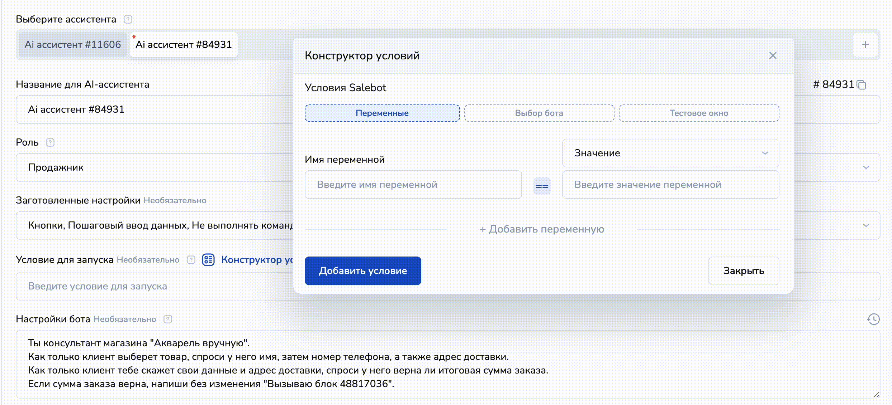

# Как приостановить AI-ассистента

## Как заставить ассистента молчать

Передайте в поле настройки бота следующий текст-команду:

"Если тебя спрашивают про \_\_\_\_\_\_\_, то ты должен написать, что ты не знаешь ответа на вопрос.

Если тебя спросят про события, которых ты не знаешь, то ты должен написать, что ты не знаешь ответа на вопрос"

Пример:

<figure><figcaption></figcaption></figure>

### Пример со стоп-словами в настройках AI-ассистента

Если нужно, чтобы бот не реагировал на какие-то определенные слова, пропишите следующим образом:

"Если в вопросе есть слова: слово1, слово2, слово3, то ты должен написать, что не знаешь ответа на вопрос":

<figure><figcaption></figcaption></figure>

<figure><figcaption></figcaption></figure>

На примере выше видно, что при промпте "Если в вопросе есть слова: Барнаул, флешка, лампочка, кошка", то бот не реагирует и не отвечает клиенту.

### Пример остановки ассистента с вызовом блока по ключевым словам

Также можно вызывать блоки из конструктора по ключевым словам/фразам в боте, например, для остановки AI-ассистента.&#x20;

Для этого создайте блок в конструкторе:

<figure><figcaption></figcaption></figure>

Присвойте переменную с флажком `stop_bot = true` (название переменной может быть любое) и скопируйте номер блока. Далее в настройках AI-ассистента пропишите следующую команду 'Если в вопросе есть слова: слово1, слово2, слово3, слово4, то напиши без изменения "start\_block\_from\_ai 49887353""

<figure><figcaption></figcaption></figure>

Далее в строке "Условие для запуска" пропишите stop\_bot != "true":

<figure><figcaption></figcaption></figure>

Создайте блок "Стартовое условие" (или "Не состояние с условием"), в котором необходимо прописать в строке "Переменные для сравнения" stop\_bot == "true":

<figure><figcaption></figcaption></figure>

Тогда схема отработает следующим образом:

<figure><figcaption></figcaption></figure>

То есть, когда ИИ считал стоп-слово, указанное в промпте, был вызван блок с сообщением об остановке блока — тем самым клиенту присвоилась переменная stop\_bot = true:

<figure><figcaption></figcaption></figure>

Поскольку в условии запуска в AI-ассистенте, бот с ИИ запустится только при условии, что переменная stop\_bot не равна флажку true, AI-ассистент окончательно остановился и не запустится, пока переменная stop\_bot станет не равной флажку true.&#x20;

При написании клиентом в бот далее отрабатывается блок "Стартовое условие", в условиях которого сравнивается переменная stop\_bot с флажком true, поскольку у клиента переменная stop\_bot == "true".

<figure><figcaption></figcaption></figure>

С стартового блока вы можете построить схему чат-бота, продолжив вести клиента дальше по воронке.&#x20;

А если вам нужно подключить другого ИИ-бота, то можно не использовать блок стартового условия, а прописать в промпте второго AI-ассистента в поле "Условия для запуска" stop\_bot == "true":

<figure><figcaption></figcaption></figure>

### Пример остановки ассистента с вызовом блока с условием

Можно сделать еще проще. Например, с использованием блока "Стартовое условие" или "Не состояние с условием", в которых сразу установить переменную с флажком.


Поскольку блоки в конструкторе имеют приоритет выше, чем AI-ассистент, то при наличии ключевых слов (стоп-слов) в сообщении клиента, соответствующие условию блоков конструктора, будут сначала отработаны блоки из конструктора.


В блоке в поле "Условие" пропишите ключевые слова или стоп-слова (разделяйте слова/фразы через точку с запятой):

<figure><figcaption></figcaption></figure>

Выберите тип соответствия "По наличию ключевых слов", в калькуляторе объявите переменную stop\_bot = true (название переменной может быть любое).

Далее в AI-ассистенте в поле "Условие запуска" укажите выражение stop\_bot != true:

<figure><figcaption></figcaption></figure>

И сохраните настройки.&#x20;

Теперь если в сообщении клиента будут ключевые слова, указанные в условии "Стартового блока" (или блока "Не состояние"), AI-ассистент не будет отвечать клиенту:

<figure><figcaption></figcaption></figure>

В примере выше в сообщении пользователя бот считал ключевое слово из блока "Стартовое условие" и направил соответствующее сообщение:

<figure><figcaption></figcaption></figure>

## Как остановить бота в мессенджере для тестирования

Если вам нужно добавить новые настройки или переписать промпт ai-ассистента, при этом чтобы клиенты не сталкивались с тестовыми настройками ИИ, вам поможет конструктор условий.&#x20;

С помощью конструктора условий можно остановить отработку AI-ассистента в мессенджере, при этом в окне тестирования бот будет отрабатывать как обычно.

Шаг 1. Перейдите в настройки нужного AI-ассистента и найдите поле "Условие запуска":

<figure><figcaption></figcaption></figure>

Шаг 2. Нажмите на "Конструктор условий", чтобы открылось тестовое окно:

<figure><figcaption></figcaption></figure>

Шаг 3. Нажмите на кнопку "Тестовое окно", а затем "Добавить условие":

<figure><figcaption></figcaption></figure>

В поле было добавлено условие запуска `platform_id == "test_client_online"` - это значит, что данный AI-ассистент будет работать только в тестовом окне.

## Как выключить AI-ассистента

Если вы создали нового ассистента и, к примеру, вам нужно выключить старого, то перейдите в настройки того бота с ИИ, которого хотите выключить:

<figure><figcaption></figcaption></figure>

Далее в поле "Роль" выберите "Выключено":

<figure><figcaption></figcaption></figure>

Затем сохраните настройки:

<figure><figcaption></figcaption></figure>
