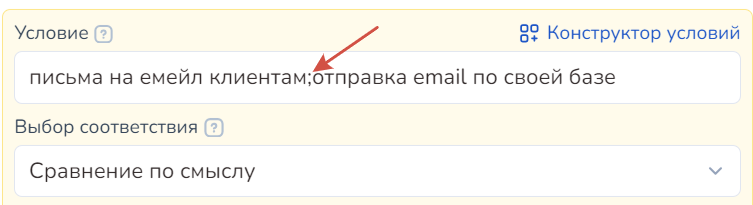

# Сравнение по смыслу

Сравнение по смыслу в условиях блоков ("Стартовое условие" и "Не состояние с условием") — это искусственный интеллект, который обучен искать в сообщении клиента по словам/фразам, указанным в поле "Условие".&#x20;

Блоки имеют приоритет над AI-ассистентом, поэтому можно использовать блок с условием и выбором соответствия "сравнение по смыслу" в случае, если вы хотите направить клиенту четко выверенный и прописанный вами ответ и вести по воронке в боте из "Конструктора".&#x20;

## Принцип работы

В основе работы сравнения по смыслу лежит поиск контекста в сообщении по ключевым фразам, прописанных в поле "Условие".

Принцип работы "Сравнение по смыслу" следующий:

1. В условии прописываются фразы, являющиеся СМЫСЛОМ, который выявляется ИИ из сообщения клиента;
2. Обработка системой (чат-ботом) сообщения клиента — то есть поиск вложенного в условие смысла для ИИ в реплике клиентов;
3. Отработка ботом события в блоке.&#x20;

То есть, прописывая в условии определенные значения, например, какие-либо фразы, искусственный интеллект проверит каждое условие на соответствие реплике, отправленной клиентом, и начнет отработку соответствующего события в блоке (например, отправку сообщения и пр.)

Пример:

В условии прописана определенная фраза, которую должен обработать и найти в сообщении клиента, если ИИ нашел контекст из поля "Условие" в сообщении клиента, то отработается действие из данного блока (например, отправится сообщение).

В нашем случае, в условии лежат фраза "закрывающие счета и акты":

<figure><figcaption></figcaption></figure>

Наш блок выглядит следующим образом:

<figure><figcaption></figcaption></figure>

При выборе соответствия "сравнение по смыслу" бот должен найти в сообщении клиента похожие/схожие по смыслу слова/фразы, лежащие в условии:

<figure><figcaption></figcaption></figure>

<figure><figcaption></figcaption></figure>

Каждый раз бот после обработки сообщения клиента, верно отрабатывает необходимое событие, лежащее в блоке.

## Как писать условие

Условие в соответствующем поле прописывается аналогично иным условиям при любом выборе соответствия — каждую отдельную фразу необходимо отделять от другой с помощью точки с запятой:

<figure><figcaption></figcaption></figure>

Точное и лаконичное условие — фраза — для блока поможет чат-боту верно отрабатывать событие, вложенное в блок. \
Чем больше сложных слов, размытых по смыслу, и растянутых на несколько предложений фраз, тем дольше осуществляется обработка ИИ сообщений клиентов, что может привести к некорректной работе вашей схемы.

Также условие для соответствия "Сравнение по смыслу" не может состоять из одного слова.

Пример <mark style="color:green;">**правильного**</mark> условия:

<figure><figcaption></figcaption></figure>

Пример <mark style="color:red;">**НЕправильного**</mark> условия:

<figure><figcaption></figcaption></figure>


<mark style="color:red;">**Обращаем внимание!**</mark>&#x20;

1. Условие НЕ должно состоять из одного слова: несмотря на то, что необходимо составлять лаконичные условия, они должны отражать искомый ботом смысл.
2. Если модель будет сравнивать два разных слова условия, то они не будут равны. Например: вместо слова «счет», выставьте условие «оплата по счету за месяц» - такое условие будет соответствовать искомым требованиям, а также укажет модели ИИ необходимые критерии для сравнения по смыслу


### Пример отработки условий ботом

Для начала наглядно продемонстрируем, как будет вести себя бот при написании условия всего с одним словом:

Например, вам необходимо, чтобы блок отрабатывался, когда клиенту нужно выставить счет по оплате за интернет:

<figure><figcaption></figcaption></figure>

В условии было прописано всего одно слово - "счет".&#x20;

Далее протестируем бота, задав ему вопрос по поводу счета (любого другого):

<figure><figcaption></figcaption></figure>

Итак мы видим, что хотя ИИ и видит слово "счет"/"счета" в контексте сообщения пользователя и принимает его значение для старта блока, бот срабатывает на любое сообщение со словом "Счет".

Чтобы избежать подобного, необходимо конкретизировать условия в выборе соответствия:

<figure><figcaption></figcaption></figure>

Пример отработки условий ботом:

<figure><figcaption></figcaption></figure>

Как видно из примера, бот не ответил на сообщения по поводу банковских счетов и счетов-фактуры.&#x20;

Однако из последнего сообщения он выявил контекст, который был прописан в его условии, и отработал все корректно.&#x20;

Таким образом, с помощью выбора соответствия "сравнение по смыслу" при отработке ИИ переберет необходимые варианты для понимания смысла реплики клиента, и по соответствию чат-бот отработает необходимое событие.&#x20;

## Видео-инструкция



## Пример бота с ИИ "Умная станция"


В данном примере наглядно продемонстрируем приоритет блоков над AI-ассистентов и поиск по контексту в сообщении клиента с выбором соответствия "Сравнение по смыслу".&#x20;


В конструкторе воронок создаем два блока "Первостепенная проверка условия", в каждом из которых устанавливаем выбор соответствия "Сравнение по смыслу" и сообщение "Включаю/выключаю свет":

<figure><figcaption>
Блок 1 "Включаю свет"
</figcaption></figure> <figure><figcaption>
Блок 2 "Выключаю свет"
</figcaption></figure>

Для понимания того, что отработался именно блок, а не АИ-ассистент, добавим дополнительную строку в сообщении каждого блока:

<figure><figcaption>
Блок 1 "Включаю свет"
</figcaption></figure> <figure><figcaption>
Блок 2 "Выключаю свет"
</figcaption></figure>

Далее переходим в АИ-ассистента.&#x20;

Создаем бота с ролью "Универсальный ассистент":

<figure><figcaption></figcaption></figure>

Далее прописываем его настройки:

<figure><figcaption></figcaption></figure>

Для наглядности отработки блоков, мы не будем ограничивать ассистента в его поведении.&#x20;

На данном этапе все настройки завершены. Перейдем к тестированию.

1. Начнем разговор с нашей умной станцией:

<figure><figcaption></figcaption></figure>

Поскольку мы никак не ограничивали станцию, то она может разговаривать на совершенно отвлеченные темы.

2. Теперь в контексте нашего сообщения пропишем ключевой смысл - включить или выключить свет:

<figure><figcaption></figcaption></figure>

Бот отработал корректно.&#x20;

Таким образом, в моменты, когда условия из блока не отрабатываются, работает ассистент.&#x20;

Но если в контексте бот найдет контекст, установленный в условии блока, отработается именно блок.&#x20;

## Видеогид


