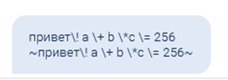

# Форматирование текста сообщений

## Как форматировать текст в месседжерах

### Как форматировать в Telegram

Для разметки текста в нужном блоке под полем для ввода текста сообщения включите "Markdown в Telegram":

<figure><figcaption></figcaption></figure>


Если в этом блоке встречаются символы из перечисленных: '\_', '\*', '\[', ']', '(', ')', '\~', '\`', '>', '#', '+', '-', '=', '|', '{', '}', '.', '!'  — их нужно экранировать, добавлять перед ними обратный слэш \\&#x20;

Иначе сообщение не отправится вообще. При этом не имеет значения, какой участок текста вы размечаете.

&#x20;Пример: привет\\. Рады \*тебя\* видеть\\!


Экранирование текста возможно как вручную, так и в калькуляторе при помощи функции

**txt = tg\_escape(s)**

На вход подается **s** - строка с исходным текстом.&#x20;


Чтобы в переменную записать текст с переносами строк, укажите значение следующим образом:

`ваша_переменная = "Текст первой строки" + "\n" + "Текст второй строки" + "\n" +"Третья строка"`


На выходе в **txt** приходит строка уже с вставленными слешами в нужных местах.&#x20;

Пример:

<figure><figcaption>
Пример экранирования
</figcaption></figure>

<figure><figcaption>
Как выглядит текст в Telegram
</figcaption></figure>

Далее размечаете нужный текст:

Чтобы сделать текст **жирным**, с обеих сторон ставите звездочки: \*тут текст\*

**Для курсива** — нижнее подчёркивание: \_текст\_

**Подчеркнутый текст** — два нижних подчеркивания с обеих сторон: \_\_текст\_\_

**Зачеркнутый текст** — тильда с обеих сторон текста: \~текст\~

**Ссылка в тексте**: \[текст в квадратных скобках]\(ссылка в круглых скобках) \
\[inline URL]\(http://example.com/)

**Упоминание пользователя ТГ**: \[текст в квадратных скобках]\(ссылка на пользователя в круглых скобках). В ссылке после знака равно можно использовать #{platform\_id} \
\[inline mention of a user]\(tg://user?id=123456789)

**Текст в виде кода** — с обеих сторон текста поставить обратный апостроф: \`inline fixed-width code\`

**Скрытый текст или spoiler** - с обеих сторон от текста используйте ||&#x20;

Пример:

<figure><figcaption>
Пример экранирования
</figcaption></figure>

Результат:

<figure><figcaption>
Как выглядит текст в Telegram
</figcaption></figure>


Экранировать переменные в тексте НЕ надо.


<figure><figcaption>
Пример ошибки: экранированы символы переменной и разметки текста. 
</figcaption></figure>

<figure><figcaption>
Пример сообщения с ошибкой экранирования
</figcaption></figure>

Правильный вариант:

<figure><figcaption></figcaption></figure>

Сообщение в Телеграм:

<figure><figcaption></figcaption></figure>

В случае, если вы не экранируете спец. символы при использовании разметки, то сообщения из бота не будут направляться.&#x20;

Например:

<figure><figcaption>
Не экранирован восклицательный знак, в то время как точка экранирована
</figcaption></figure>

<figure><figcaption>
Ошибка отправки сообщения
</figcaption></figure>

### Видеоинструкция "Как форматировать текст в Telegram"



### Как форматировать ВКонтакте&#x20;

Какие теги доступны для форматирования текста Вконтакте:

HTML:\
\<b>жирный\</b>\
\<strong>жирный\</strong>\
\<em>курсив\</em>\
\<i>курсив\</i>\
\<u>подчеркнутый\</u>\
\<a href="url">текст ссылки\</a>

<figure><figcaption></figcaption></figure> <figure><figcaption></figcaption></figure>

Markdown:\
\_\_подчеркнутый\_\_\
\_курсив\_\
\*жирный\*\
\[текст ссылки]\(url)

<figure><figcaption></figcaption></figure> <figure><figcaption></figcaption></figure>

### Как форматировать в Viber &#x20;


В мессенджере Viber разметка текста не работает.


### Как форматировать в Whatsapp и Facebook<mark style="color:red;">\*</mark>&#x20;


<mark style="color:red;">**\***</mark>**На территории Российской Федерации&#x20;**<mark style="color:red;">**запрещена деятельность**</mark>**&#x20;социальных сетей&#x20;**<mark style="color:red;">**Facebook**</mark>**&#x20;и&#x20;**<mark style="color:red;">**Instagram**</mark>**, принадлежащих компании Meta Platforms Inc**., признанная экстремистской!


Whatsapp и Messenger Facebook<mark style="color:red;">\*</mark> поддерживают выделение текста при помощи символов:

<figure><figcaption>
Форматирование текста в блоке
</figcaption></figure>

<figure><figcaption>
Как выглядит текст в Whatsapp
</figcaption></figure>


В Messenger Facebook<mark style="color:red;">\*</mark> форматирование работает только в веб-версии.

Неподдерживаемые теги в ФБ и whatsapp:


