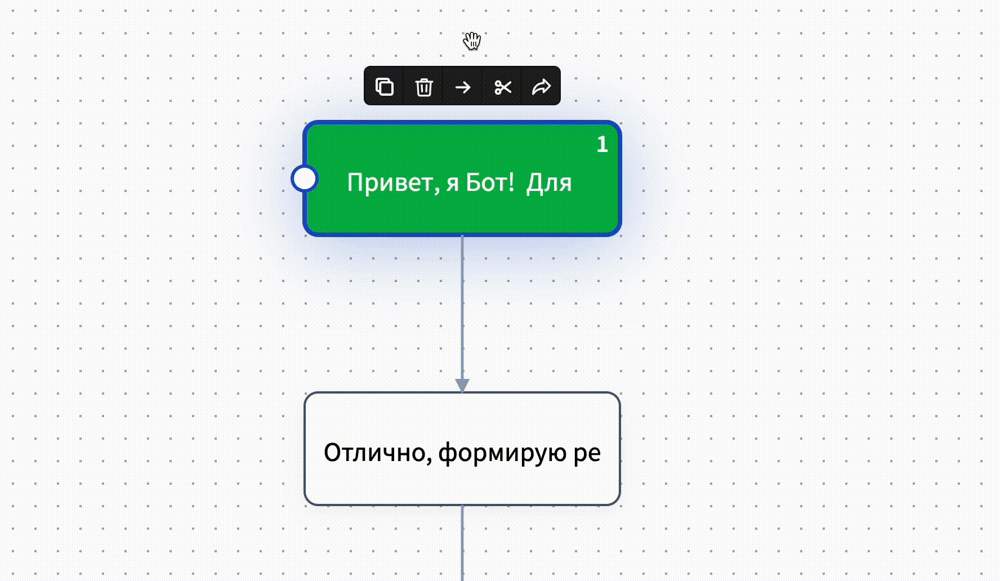
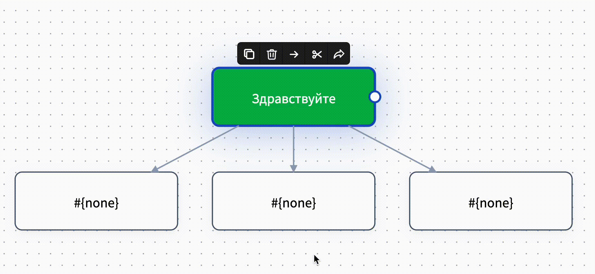

# Быстрые действия

При наведении на блок сверху появляется 5 значков: копировать, удалить, создать стрелку, удалить все стрелки этого блока, связать с другим листом.&#x20;

<figure><figcaption></figcaption></figure>

## Как создать стрелку

Для соединения блоков нам понадобится значок - стрелка.

<figure><figcaption></figcaption></figure>

С помощью этой функции вы сможете создать новый блок (копию исходного), соединенный с предыдущим стрелкой.

<figure><figcaption></figcaption></figure>

Чтобы соединить два существующих блока, нужно кликнуть по блоку, далее зажать небольшую круглую кнопку и повести стрелку к следующему блоку:

<figure><figcaption>
Стрелку от блока можно вести в любую сторону
</figcaption></figure>


Если вы протянете стрелку из блока в пустоту, то будет создан новый блок, соединенный с предыдущим, поскольку стрелка не может существовать отдельно от блоков и не может соединять какой-либо блок с пустотой.


## Как удалить блок

Для удаления блоков нам понадобится значок - корзина. Удалить блок можно также клавишей Delete на клавиатуре.

<figure><figcaption></figcaption></figure>

## Как создать пустой блок&#x20;

Для создания пустого блока необходимо нажать дважды левой кнопкой мыши на пустом поле.

<figure><figcaption></figcaption></figure>

## Как удалить стрелку

Для удаления стрелок нам понадобится значок - ножницы.

<figure><figcaption></figcaption></figure>

Нажав на эту кнопку, вы удалите все стрелки присоединены к данному блоку.

<figure><figcaption></figcaption></figure>

## Работа с блоками на разных листах схемы

В конструкторе воронок можно создавать разные листы воронки, например, для логического разделения схемы по секторам для удобства:

<figure><figcaption></figcaption></figure>


Важно знать!&#x20;

Создание схемы на разных листах в конструкторе не равно созданию разных чат-ботов!&#x20;

Схема на всех листах воронки будет работать как один чат-бот.&#x20;


При построении схемы чат-бота можно перенести не только всю воронку на последующий лист, а также начать строить схему бота на новом листе, перенеся последний блок схемы бота без отрыва от основной цепочки.&#x20;

Сделать это можно с помощью кнопки быстрого действия:

<figure><figcaption></figcaption></figure>

Например, ваша основная схема построена на записи ваших клиентов на услуги, а вам понадобилось ввести предпраздничные бонусы с помощью блоков, которые впоследствии все равно вам нужно будет удалить.&#x20;

<figure><figcaption>
Главная схема чат-бота на основном листе
</figcaption></figure>

Чтобы не перегружать основную схему и знать, какие блоки бота относятся к предпраздничным бонусам, можно создать второй лист с доп. блоками, соединив основную схему с дополнительной.&#x20;


Помните! Все блоки отрабатываются как одна схема. Функция для создания листов необходимо для вашего удобства.&#x20;

Подробнее о листах воронки рассказали в статье "[Основы работы с редактором](/broken/pages/-M1L-cdQCvYql7-bRR5L#kak-dobavit-listy-voronki)"&#x20;


### Видео-обзор для быстрых действий в блоке



## Как копировать нужный блок

Для копирования блока нам понадобится значок - копирование:

<figure><figcaption></figcaption></figure>

## Как отменять действия

Кнопка отмены последнего действия:

<figure><figcaption></figcaption></figure>

Нажав на эту кнопку, можно отменить последние действия. Отменить действие также можно нажав Ctrl+Z

С помощью этой кнопки вы можете вернуть отмененное действие. Вернуть действие также можно нажав Ctrl+Y

<figure><figcaption></figcaption></figure>
