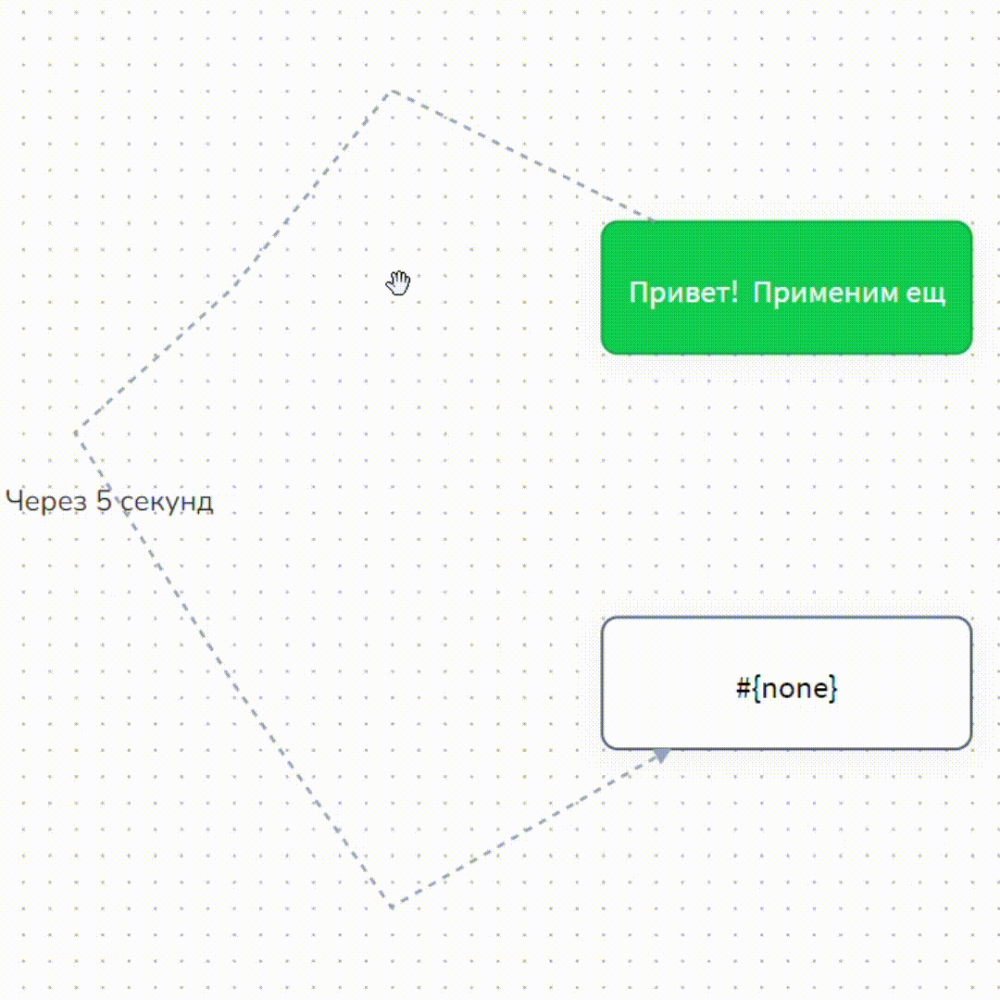

# Как создать чат-бота

Каждый чат-бот, собранный на Сейлбот, так или иначе состоит из блоков:

<figure><figcaption></figcaption></figure>

Блок - это своеобразный набор команд для чат-бота, настройки которого установлены вами либо разработчиками чат-ботов для вашего проекта.&#x20;

Из каждого блока чат-бот берет инструкцию, каким образом ему нужно отработать или на что отреагировать, а затем куда дальше по воронке пойдет клиент.&#x20;

<figure><figcaption>
Красным цветом выделена рабочая область, где создается схема чат-бота
</figcaption></figure>

## Как создать блок

Научиться создавать блоки в конструкторе чат-бота очень просто: достаточно два раза кликнуть по рабочей области левой кнопкой мыши два раза и Ваш блок будет создан.

<figure><figcaption></figcaption></figure>

Блок (блоки) можно перемещать в любую область поля конструктора, тем самым оптимизировать схему, а также придать ей более аккуратный вид.

Для наглядности приведем случайную схему и поговорим о редакторе, ссылаясь на нее.

<figure><figcaption></figcaption></figure>

Перед вами схема чат-бота. Схема состоит из блоков и стрелок, которые соединяют блоки между собой.

**Диалог в воронке всегда начинается с зелёных блоков — Стартовое условие.** Написав сообщение или нажав на кнопку, пользователь может перейти из одного блока в другой при соблюдении условия такого перехода. Условия бывают у блоков и стрелок.&#x20;

<figure><figcaption></figcaption></figure>

Чтобы бот запускался по клику на кнопку "Начать" в Телеграме (или любом другом мессенджере), необходимо прописать триггерное слово в блоке с условием.

<figure><figcaption>
Кнопка "Начать" - это сочетание "/start" для ТГ
</figcaption></figure>

Блоки с условиями бывают зеленого и серого цвета:

<figure><figcaption></figcaption></figure>

Всего существует два блока с условием:

1. Стартовое условие;
2. Не состояние с условием.

Блок первостепенной проверки условия имеет наивысший приоритет среди всех блоков - это значит, что он отработается самым первым, если его условие будет удовлетворять каким-либо действиям клиента.

<figure><figcaption></figcaption></figure>


Подробнее о том, как правильно работать с условиями, рассказали в статье "[Условие и выбор соответствия](/broken/pages/-M5QU0ZLA1A6QhyOaMzP)".&#x20;


Блок "Не состояние с условием" являются блоком типа "Не состояние": в такие блоки нельзя перейти, поэтому их можно использовать для направления сообщений с промо-акциями, для напоминания о каком-либо событии, чтобы не выбивать клиента из основной воронки:

<figure><figcaption></figcaption></figure>


Подробнее о работе с блоками "Не состояние" рассказали в статье в [одноименной статье](/broken/pages/-M1G0tS64N7tDTadS8Ao).&#x20;


Также существуют другие виды блоков, но основой всех схем чат-бота является блок "Состояние":

<figure><figcaption></figcaption></figure>

В блоке "Состояние" нет условий и в него нельзя перейти, если к нему не проведена стрелка (соединение) от предыдущих блоков.&#x20;

Для построения простейшей схемы чат-бота нам понадобится блок "Начало диалога" для входа в воронку.&#x20;

Шаг 1. Создаем блок "Начало диалога".&#x20;

Для этого кликаем по пустому листу в конструкторе воронок:

<figure><figcaption></figcaption></figure>


Полезно знать!&#x20;

Что такое конструкция #{none}?

Конструкция #{none}, указанная по умолчанию в поле ответа, является конструкцией для заполнения поля сообщения (условий и тп). Это значит, что, например, что блок с условием #{none} отработается при направлении клиентом любого сообщения, а если оставить конструкцию в поле сообщения, то можно переместить клиентов в необходимый блок воронки.&#x20;


Чтобы сделать блок. который не отправляет сообщение, укажите в поле ответа _#{none} (устанавливается по умолчанию)_

Далее кликните на блок и выберите его тип - "Стартовое условие":

<figure><figcaption></figcaption></figure>

После того как вы выбрали тип блока "Стартовое условие", откроется плашка с настройкой условия. Поскольку это наша первая схема и тестировать мы будем ее в режиме тестирования внутри Сейлбота, то пропишем простое условие "Привет":

<figure><figcaption></figcaption></figure>

Теперь пропишем сообщение, которое будет отправлять бот, как только получит в чате свое триггерное условие: например, это будет сообщение "Привет, я бот":

<figure><figcaption></figcaption></figure>

Затем обязательно нажмите "Сохранить", чтобы все настройки были применены к блоку:

<figure><figcaption></figcaption></figure>

Шаг 2. Создаем следующий блок.&#x20;

Чтобы создать блок с привязкой (стрелкой), найдем меню дополнительных настроек блока:

<figure><figcaption></figcaption></figure>

В меню дополнительных настроек увидем кнопку "Создать блок ниже", которая поможет создать новый блок "Состояние" с привязкой к блоку "Стартовое условие":

<figure><figcaption></figcaption></figure>

Теперь в воронке уже два блока, соединенных между собой стрелками.


Важно знать!

В процессе прохождения по схеме пользователь может находиться только в одном из блоков.&#x20;

Что это значит? Если у вас в боте две разных цепочки сообщений, то пользователь не может проходить две параллельно. Либо проходит по одной, либо по другой.

Если вам нужно прислать отдельное сообщение и не выбить человека из цепочки, используете серые блоки - "Не состояние" и "Не состояние с условием".&#x20;


Стрелки - это соединения между блоками, которые направляют клиента далее по схеме воронки. В стрелках в том числе можно прописывать условия, чтобы, например, клиент мог пойти дальше по воронке, осуществив целевые действия: кликнул по кнопке, осуществил оплату и др.&#x20;

Давайте создадим кнопку в блоке "Стартовое условие" (зеленый блок), чтобы клиент перешел в следующий блок.&#x20;

Шаг 3. Создаем кнопку.

Нажмите на зеленый блок "Стартовое условие". В настройках блока вы увидите вкладку "Кнопки":

<figure><figcaption></figcaption></figure>

Нажмите на вкладку, тогда раскроется меню с настройкой кнопки:

<figure><figcaption></figcaption></figure>

Нажмите "+Добавить кнопку", тогда откроется меню с настройками кнопки:

<figure><figcaption></figcaption></figure>

В тексте кнопке пропишите любое название, например, "Нажми меня":

<figure><figcaption></figcaption></figure>

Кликните "Добавить", тогда в настройках блока появится кнопка:

<figure><figcaption></figcaption></figure>

Кнопка может быть клавиатурной или в тексте. В зависимости от мессенджера, какой-либо вид кнопок не будет работать (например, для whatsapp), поэтому можно поставить "Автоматически" - тогда кнопка будет либо в клавиатуре, либо в тексте, в зависимости от поддержки кнопок в мессенджере:

<figure><figcaption></figcaption></figure>

И обязательно сохраните настройки блока:

<figure><figcaption></figcaption></figure>

Готово! Вы создали свой первый блок с условием и кнопкой!&#x20;

Шаг 4. Настройка стрелки

Теперь перейдем к настройке стрелки, чтобы при клике на кнопку ваш клиент переходил в следующий блок воронки. Для этого наведите на стрелку и найдите кнопку шестеренки:

<figure><figcaption></figcaption></figure>

Тогда откроются настройки стрелки, где мы укажем название кнопки:

<figure><figcaption>
В условии стрелки пропишите название кнопки
</figcaption></figure>

И кликните на "Сохранить":

<figure><figcaption></figcaption></figure>

После сохранения настроек стрелки, вы наглядно увидите, что прописано в условии стрелки: это поможет вам в дальнейшем наглядно видеть, на какой триггер настроен переход из одного блока в другой:

<figure><figcaption></figcaption></figure>

Стрелки можно изгибать.

<figure><figcaption></figcaption></figure>

Это позволяет увидеть соединения, которые перекрывают друг друга. Для этого ухватите мышкой стрелку в том месте, в котором хотите согнуть стрелку и переместите в нужное место. Количество изгибов не ограничено.

Чтобы удалить лишние изгибы стрелки, дважды кликните левой кнопкой мыши по нужному узлу.

Шаг 5. Блок "Состояние".&#x20;

По умолчанию при клике по полю вы видели, что создавался белый блок "Состояние" - это самый распространенный блок для работы со схемой чат-бота. В нем можно осуществить любые настройки (кроме условий). Именно из блоков "Состояние" будет в большинстве своем состоять Ваша схема чат-бота.&#x20;

<figure><figcaption></figcaption></figure>

В блок "Состояние", в отличие от блоков с условием, можно попасть только в случае, если в него проведена стрелка от предыдущего блока, либо если Вы направили рассылку клиентам.

Чтобы клиент попадал в блок "Состояние" по какому-либо условию, настройка условия осуществляется в стрелке, как в шаге 4, либо по таймеру.

В текстовом поле блока "Состояние" пропишем сообщение, которое будет отправлять бот клиенту, если клиент нажмет кнопку "Нажми меня":

<figure><figcaption></figcaption></figure>

Обязательно нажмите на "Сохранить" в настройках блока "Состояние".&#x20;


Теперь вы создали свою первую воронку чат-бота.&#x20;


## Как подключить мессенджеры

После тестирования можно подключить схему к мессенджерам. Для этого в главном меню необходимо перейти в пункт Каналы.

<figure><figcaption>
Виды поддерживаемых мессенджеров
</figcaption></figure>

Дальше необходимо нажать на кнопку с требуемым мессенджером. О том, как подключить ботов в разных мессенджерах, написано в разделе "[Мессенджеры](/broken/pages/-M6-dPO2gBhwzPgf2pVT)"

### Видео-обзор


