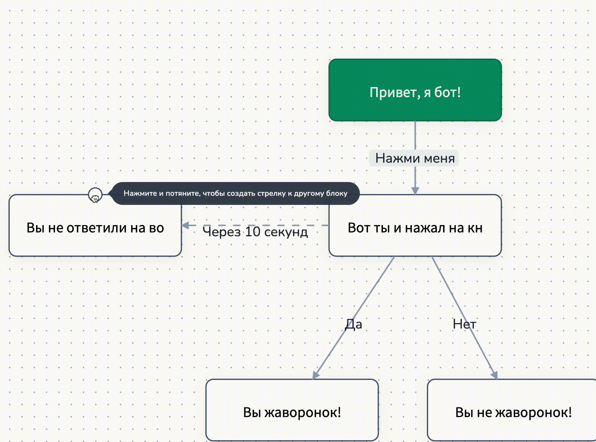

# Как создать сообщение с таймером

Создадим новый блок, к которому ведет стрелка из блока с вопросом "Вы жаворонок?", а также удалим петлю (для этого наведите на петлю и нажмите крестик).&#x20;

<figure><figcaption></figcaption></figure>

Перейдем в настройки стрелки, которая ведет к новому блоку из блока с вопросом":

<figure><figcaption></figcaption></figure>

В настройках стрелки существует плашка "Задержка перед ответом" - это таймер, в котором устанавливается время, по истечению которого будет автоматический переход в следующий блок:

<figure><figcaption></figcaption></figure>

Также необходимо активировать чекбокс "Отменить, если покинул блок", чтобы сообщение не отправилось, если Ваш клиент все-таки даст ответ на поставленный вопрос.&#x20;

Теперь пропишем сообщение в новом блоке:

<figure><figcaption></figcaption></figure>

И из нового блока протянем стрелку к блоку с вопросом:

<figure><figcaption></figcaption></figure>

Для этого наведите на блок: вы увидите точку для создания стрелки:

<figure><figcaption></figcaption></figure>

Кликните по кнопке и проведите стрелку к блоку с вопросом:

<figure><figcaption></figcaption></figure>

Две стрелки совпадут, поэтому нужно будет одну из них вытянуть повыше. Для этого наведите мышью на стрелки и найдите продолговатую кнопку, чтобы вытянуть стрелку:

<figure><figcaption></figcaption></figure>

И, зажав кнопку, потяните стрелку вверх:

<figure><figcaption></figcaption></figure>

Теперь перейдите в настройки только созданной стрелки и установите таймер 1 секунду, чтобы клиент вновь перешел в блок с вопросом:

<figure><figcaption></figcaption></figure>

Итоговая схема выглядит следующим образом:

<figure><figcaption></figcaption></figure>

Как работает тестовая схема:&#x20;

<figure><figcaption>
p.s. для теста мы поменяли таймер с 10 минут до 10 сек.
</figcaption></figure>


Вы сумели создать своего первого чат-бота с кнопками, со стрелками и вариантами ответа, а также с петлями и зацикленными стрелками!

