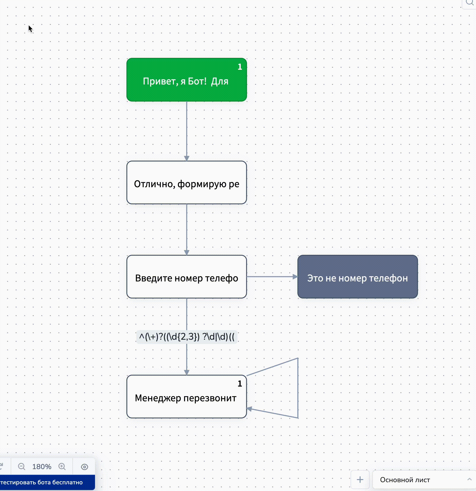
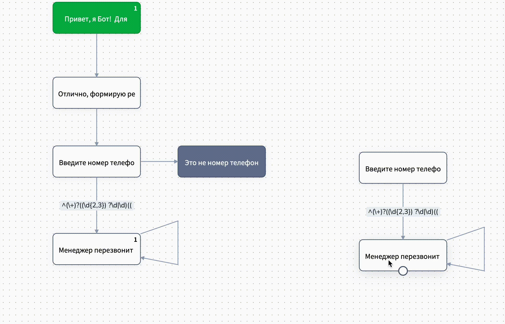

# Массовые действия с блоками

## Как выделить нужную область

#### **1 способ**

Чтобы выбрать множество блоков, зажмите Ctrl и выделите нужную область левой кнопкой мыши.

<figure><figcaption>
Зажимаем Ctrl и выделяем нужные блоки
</figcaption></figure> <figure><figcaption>
Отпускаем ctrl и кнопку мыши: блоки выделены
</figcaption></figure>

**2 способ**

Чтобы выделить конкретные блоки, нужно зажать Ctrl и левой кнопкой мыши выбирать их по одному.

<figure><figcaption></figcaption></figure>

## Как копировать выделенные блоки

Чтобы скопировать выделенные блоки, нажмите на выделенную иконку или же зажмите Ctrl+C.&#x20;

<figure><figcaption></figcaption></figure>

Тогда вы увидите уведомление (небольшую инструкцию), где указано, что скопированные блоки можно вставить:

1. На том же листе;
2. На другом листе в одном проекте;
3. В конструкторе воронок другого проекта.&#x20;

<figure><figcaption></figcaption></figure>

Далее кликните в пустую область, куда хотите скопировать выделенные элементы:

<figure><figcaption></figcaption></figure>

## Как удалить множество блоков

Чтобы удалить несколько блоков сразу, зажмите клавишу ctrl и выделите блоки, которые необходимо удалить:

<figure><figcaption></figcaption></figure>

Затем нажмите на корзину или на клавишу Delete.

## Как переместить выделенные блоки

Вы можете свободно перетаскивать выделенные блоки, зажав левую кнопку мыши.

<figure><figcaption></figcaption></figure>
