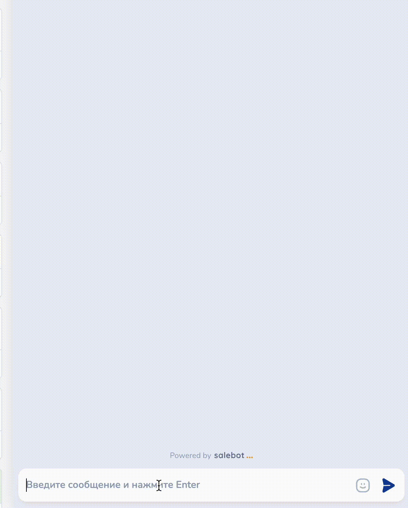

# Тестирование чат-бота

После создания  или в процессе создания любой схемы, чат-бота нужно тестировать для отработки необходимых сценариев и правильности настройки.&#x20;

Можно подключить бота к проекту и тестировать в нем, но если создается бот в Whatsapp, то написать самому себе нельзя. Для этого есть другой способ: можно открыть онлайн-чат с ботом и работать с ним. Для этого нажмите на кнопку в левом нижнем углу конструктора:

<figure><figcaption></figcaption></figure>

При нажатии на кнопку "Протестировать бота" откроется тестовое окно:

<figure><figcaption></figcaption></figure>

Левая область экрана в тестировочном окне отображает созданные блоки для чат-бота:

<figure><figcaption></figcaption></figure>

В правой части вы увидите тестовые данные клиента (то есть себя):

<figure><figcaption></figcaption></figure>

Посередине экрана вы увидите онлайн-чат, в котором можно протестировать бота. Для этого пропишите условие из блока "Начало диалога":

<figure><figcaption></figcaption></figure>

Как работает бот, собранный нами по пяти шагам:

<figure><figcaption></figcaption></figure>

### О вкладке "Тестирование"

После создания схемы чат-бота в режиме тестирования слева вы увидите все плашки с информацией о блоках:

<figure><figcaption></figcaption></figure>

Каждая плашка на экране слева отображает номер блока, его тип, а также содержание:

<figure><figcaption></figcaption></figure>

Блоки можно отобразить по типу, отфильтровав их с помощью соответствующей кнопки "Фильтр":

<figure><figcaption></figcaption></figure>

Чтобы проверить отработку только одного блока из схемы, можно выбрать соответствующий блок, кликнув по нему, и нажать на "Отправить блок":

<figure><figcaption></figcaption></figure>

Выбранный блок отправится от имени чат-бота в средней части экрана - окне тестировки:

<figure><figcaption></figcaption></figure>

В этой же части экрана вы сможете отработать всю схему блока, начиная с самого первого в схеме.&#x20;


Тестировать схему чат-бота можно не только с самого начала: например, если вы добавили к своей схеме новые блоки, то воспользуйтесь функцией "Отправить блок" и начните тестировать схему именно с выбранного блока.&#x20;


В правой части экрана расположено отображение тестового клиента:

<figure><figcaption></figcaption></figure>

В этом же окне клиента существуют следующие возможности:

1. Присвоить или добавить метки/списки клиенту;&#x20;
2. Добавить переменные;
3. Просмотреть переменные, присвоенные клиенту с помощью отработки схемы чат-бота:

<figure><figcaption></figcaption></figure>

Таким образом вы можете полностью отработать схему чат-бота (а также любую его часть), сразу просмотреть карточку клиента и его данные.&#x20;

### Видеоверсия


