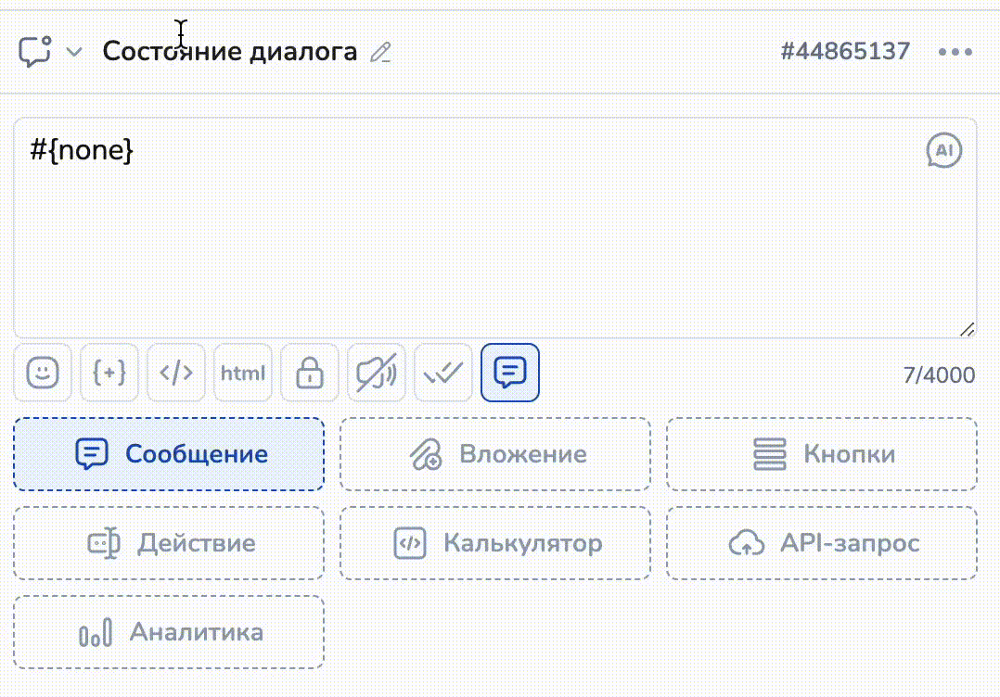

# Верхняя строка редактора блока

В верхней строке редактора блока расположено несколько полей:

1. Тип блока

<figure><figcaption></figcaption></figure>

2. Название блока (Описание)

<figure><figcaption></figcaption></figure>

3. Уникальный номер блока

<figure><figcaption></figcaption></figure>

Чтобы скопировать номер блока (ID блока) достаточно кликнуть по номеру блока.&#x20;

4. Меню дополнительных команд

<figure><figcaption></figcaption></figure>

5. Генерация текста искусственным интеллектом

<figure><figcaption></figcaption></figure>

### **Поле: Тип блока**


По умолчанию выбрано "Состояние диалога"


Поле, которое отвечает за выбор типа блока. Подробнее о типах блоков читайте в данной [**статье**](https://docs.salebot.pro/rabota-s-redaktorom.-chast-2.-tipy-blokov.)

Чтобы сменить тип блока кликните по значку типа блока, откроется выпадающее меню.&#x20;

<figure><figcaption></figcaption></figure>

### **Поле: Название блока (Описание)**

**Описание:** в это поле можно задать краткое описание назначения блока. Полезно для структурирования логики бота, поможет не запутаться, если работаете над сложным проектом с большим количеством блоков. По умолчанию текст берется из поля "Текст сообщения". На работу бота данное поле не влияет.

По умолчанию в названии блока лежит наименование его типа:

<figure><figcaption></figcaption></figure>

Задать собственное название блока можно, кликнув по строке:

<figure><figcaption></figcaption></figure>

### Поле: Меню дополнительных команд (три точки)

<figure><figcaption></figcaption></figure>

В данном разделе находятся дополнительные команды:&#x20;

* _**Создать петлю**_

Петля -  стрелка, которая возвращает пользователя в тот же блок.

_Пример использования петли при получении номера телефона пользователя._\
&#x20;\
От блока "Введи номер телефона идут две стрелки: [стрелка со сбором данных](/broken/pages/-LxaQRtvQIhwYmZyL5eu#strelka-so-sborom-dannykh) к блоку "Твой номер... "  и стрелка [с пустым условием](/broken/pages/-LxaQRtvQIhwYmZyL5eu#strelka-bez-usloviya) к блоку "Попробуй еще раз".\
\
В стрелке со сбором данных в поле Условие указываем [регулярное выражение](https://docs.salebot.pro/peremennye-1/spisok-poleznykh-regulyarnykh-vyrazhenii) - условие, с помощью которого бот может проверять формат введенных данных: пользователь ввел именно номер телефона или что-то иное. \
\
Если пользователь ввел НЕ номер телефона, то ему придёт сообщение из блока "Попробуй ещё раз".  У данного блока создана [петля](https://docs.salebot.pro/osnovnye-ponyatiya.-kak-sozdavat-botov-na-salebot.pro/osnovy-raboty-s-redaktorom-sozdanie-odnogo-bota-odnovremenno-pod-vse-messendzhery.#kak-sozdat-petlyu). \
Каждый раз, когда пользователь вводит НЕ номер телефона, он будет возвращаться в блок " Попробуй еще раз". До тех пор пока не введет номер телефона и не перейдет в блок по стрелке со сбором данных с регулярным выражением в блок "Твой номер..."&#x20;

<figure><figcaption></figcaption></figure>

* _**Создать блок ниже**_

Команда для быстрого создания нового блока (по умолчанию,  тип Состояние диалога), соединенного с текущим стрелкой. Можно создать любое количество блоков.&#x20;

<figure><figcaption></figcaption></figure>

* _**Пересчитать статистику**_

Команда Пересчитать статистику помогает увидеть количество пользователей в блоках( состоянии) в момент нажатия данной кнопки.&#x20;


Для обновления данной статистики  повторно нажимаем команду Пересчитать статистику в любом блоке конструктора воронок.


<figure><figcaption>
Количество пользователей, находящихся в данном состоянии воронки после пересчета статистики
</figcaption></figure>

* _**Создать рассылку**_

Команду Создать рассылку можно использовать [для создания рассылок из блока](https://docs.salebot.pro/rassylki-1/rassylki) и для перемещения клиентов из одного состояния(блока воронки) в другое.&#x20;

<figure><figcaption></figcaption></figure>

После выбора типа рассылки ( в мессенджеры или E-mail) откроется форма рассылки. При таком способе создания рассылки текст сообщения, вложения и другие настройки берутся из блока, в котором вызвали команду Создать рассылку:

1\) Переход в настройки рассылки при клике на кнопку "Рассылка в мессенджеры"&#x20;

<figure><figcaption></figcaption></figure>

2\) Вкладка "Сообщение" в настройках рассылки

<figure><figcaption></figcaption></figure>

### Пример: Отправить пользователей в другой блок

Пошаговая инструкция как массово переместить клиентов (пользователей) в другой блок воронки на примере пользователей в мессенджерах.

**Шаг 1.  Копируем ID блока, ИЗ которого нужно "забрать" клиентов.** \
Открываем редактор блока - верхняя строка - кликнуть по номеру блока.&#x20;

<figure><figcaption></figcaption></figure>

**Шаг 2.  Запустить создание рассылки в блоке, В КОТОРЫЙ необходимо переместить клиентов.**\
Открываем редактор блока КУДА надо переместить клиентов. \
Верхняя строка редактора -Три точки (Меню дополнительных команд)(1) - Создать рассылку (2)- Рассылка в мессенджеры (3)

<figure><figcaption></figcaption></figure>

**Шаг 3. Создание рассылки, заполнение раздела Получатели в форме рассылки.**\
В форме создания рассылки в разделе Получатели отфильтровать по номеру блока ОТКУДА "забираем клиента (получили в шаге 1).

<figure><figcaption></figcaption></figure>

Выберите блок. Перед отправкой пересчитайте количество получателей рассылки. \
\
Всё содержание рассылки будет автоматически добавлено из блока, в который пользователи будет переведены данной рассылкой.\
\
**Шаг 4. Отправить рассылку.** \
После успешной отправки рассылки можно нажать Пересчитать статистику в блоке.

### Видео-обзор "Меню блока"


