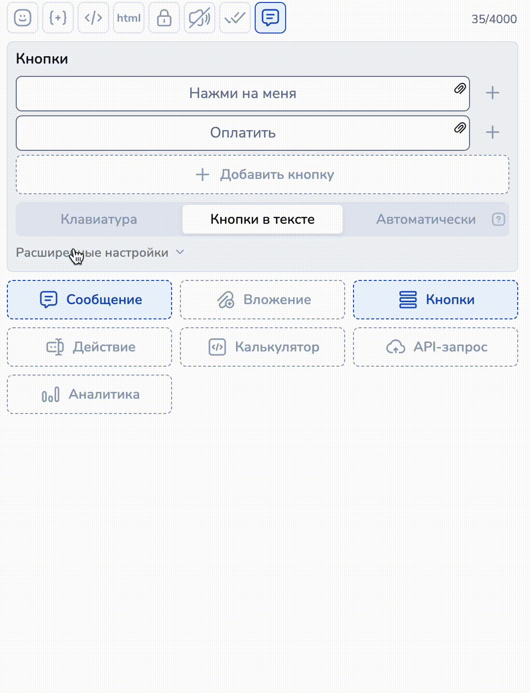

# Вкладка: Кнопки

<figure><figcaption></figcaption></figure>

Кнопки можно создавать [двумя способами](https://docs.salebot.pro/osnovnye-ponyatiya.-kak-sozdavat-botov-na-salebot.pro/knopki#kak-sozdavat-knopki): \
\- стрелками с условием (включить настройку Отображать как кнопку)

<figure><figcaption></figcaption></figure>

\- в редакторе блока Вкладка Кнопки

### Поле: Кнопки

Быстрый способ создать кнопки: достаточно кликнуть "Добавить кнопку", заполнить необходимые поля и сохранить.&#x20;

<figure><figcaption></figcaption></figure>

Также в этом поле легко менять кнопки местами, зажав левую кнопку мыши и перетянув кнопку в новое положение.&#x20;

<figure><figcaption></figcaption></figure>

Под визуальным отображением кнопок есть переключатель типа созданных кнопок : Клавиатура (reply кнопки) и Кнопки в тексте (inline кнопки), а также автоматический режим:

<figure><figcaption></figcaption></figure>

### Поле: Расширенные настройки кнопок

<figure><figcaption></figcaption></figure>

### **Чекбокс Показать кнопки**

**Показать кнопки:** по умолчанию данный ползунок включен и клиенту показываются кнопки.

<figure><figcaption></figcaption></figure>

### Чекбокс Показать стрелки как кнопки

Показать стрелки как кнопки: по умолчанию данный ползунок включен и условия стрелок (соединений) из данного блока отображаются как кнопки

<figure><figcaption></figcaption></figure>

### **Поле: Подсказка в мессенджерах без кнопок**

Поле "**Подсказка в мессенджерах без кнопок**" необходимо, когда ваш бот должен работать одновременно в мессенджерах с кнопками и без (например, Telegram и обычный Whatsapp). Так как Whatsapp не поддерживает кнопки, то в этом поле вы можете предложить пользователям текст с цифровым меню. Он будет отображаться только в Whatsapp. Применяется для навигации внутри бота.

<figure><figcaption></figcaption></figure>

### **Поле: Расширенные настройки кнопок - код кнопок**

Поле "**Расширенные настройки кнопок (код кнопок)"** можно использовать для создания уникальных кнопок с помощью кода.

<figure><figcaption></figcaption></figure>

Все возможные настройки кнопок можно прочитать [в этой статье](https://docs.salebot.pro/osnovnye-ponyatiya.-kak-sozdavat-botov-na-salebot.pro/knopki#vse-vozmozhnye-nastroiki-knopok-v-etom-pole).
