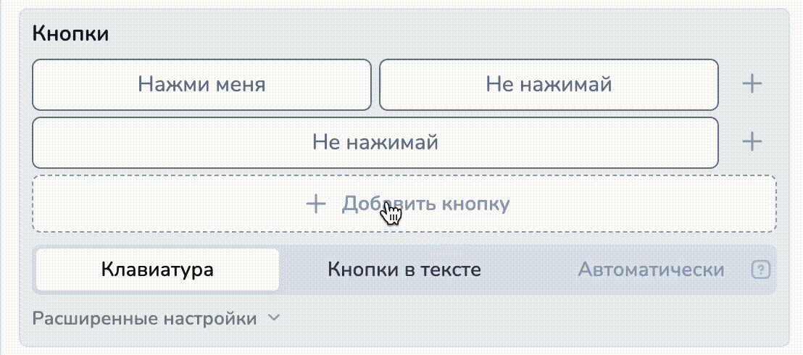
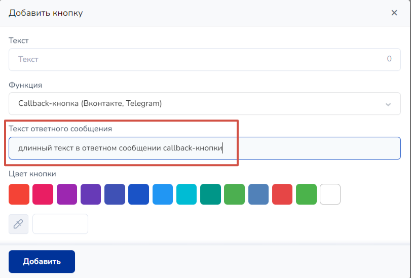

# Типы кнопок

Кнопки — это один из самых интуитивно понятных для пользователей элемент чат-ботов.

Добавляя кнопки к сообщению, мы упрощаем пользователю задачу: он нажимает на кнопку и переходит в нужный блок в зависимости от его ответа. Если человек не нажмет на кнопку, а напишет то же самое текстом, он также перейдет в соответствующий блок.

Сначала давайте рассмотрим мессенджеры, которые поддерживают кнопки (Телеграм, Viber, Facebook\* messenger, Вконтакте, Instagram\*).&#x20;


Принадлежит компании Meta, деятельность которой признана в России экстремистской и запрещена.


Они поддерживают два типа кнопок: те, что появляются ниже поля ввода сообщения (клавиатурные или reply) и кнопки в тексте (инлайн, inline), т.е внутри сообщения.

* [Как создавать кнопки](tipy-knopok.md#kak-sozdavat-knopki.)
* [Как можно сделать кнопку без протягивания стрелок](tipy-knopok.md#esli-nuzhno-sdelat-knopku-bez-protyagivaniya-strelok)
* [Как сделать кнопки в тексте](tipy-knopok.md#knopki-v-tekste)
* [Как сделать кнопки со ссылкой](tipy-knopok.md#knopki-so-ssylkoi)
* [Как задать цвет кнопки](tipy-knopok.md#cvet-knopki)
* [Как сделать кнопку - Запросить телефон (Telegram и Viber)](tipy-knopok.md#kak-sdelat-knopku-zaprosit-telefon)
* [Как сделать кнопку - Оплата](tipy-knopok.md#kak-sdelat-knopku-oplata)
* [Как сделать кнопку - Запрос геолокации (Вконтакте, Телеграм и Viber)](tipy-knopok.md#kak-sdelat-knopku-zapros-geolokacii)
* [Как создать кнопку – Звонок](tipy-knopok.md#kak-sozdat-knopku-zvonok)
* [Как создать кнопку - Поделиться (Telegram)](tipy-knopok.md#kak-sozdat-knopku-podelitsya-telegram)
* [Как добавить Callback кнопку (Вконтакте, Telegram)](tipy-knopok.md#kak-dobavit-callback-knopku-vkontakte-telegram)
* [Как установить боту кнопку для входа в Ваше веб-приложение (Web App)](tipy-knopok.md#kak-ustanovit-botu-knopku-dlya-vkhoda-v-vashe-veb-prilozhenie-web-app)
* [Как заменить кнопки в WhatsApp](tipy-knopok.md#knopki-v-whatsapp)
* [Как настроить кнопки вручную](tipy-knopok.md#nastroiki-knopok-vruchnuyu)
* [Какие есть ограничения](tipy-knopok.md#ogranicheniya)

## Как создать кнопку

Кнопки можно создавать двумя способами: используя настройки кнопок в нужном блоке и используя стрелки между блоками. Первый вариант более функционален и удобен в работе.

Чтобы сделать кнопки из блока, открываете нужный блок, там выбираете раздел Кнопки:

<figure><figcaption></figcaption></figure>

<figure><figcaption>
раздел Кнопки: добавить кнопку и расширенные настройки кнопок 
</figcaption></figure>

В раскрытом меню расширенных настроек кнопок увидите два переключателя - Показать кнопки и Показать стрелки как кнопки. Отключаем Показать стрелки как кнопки и нажимаем "+ Добавить кнопку":

<figure><figcaption>
раздел Кнопки: добавить кнопку и расширенные настройки кнопок 
</figcaption></figure>


Полезно знать!&#x20;

Чтобы не создавать кнопку в блоке, активируйте чекбокс "Показать стрелки как кнопки", далее в стрелке, ведущей от одного блока к другому, пропишите условие.&#x20;

Тогда стрелка будет отображаться как клавиатурная кнопка.

Шаг 1. Активируем чекбокс "Показать стрелки как кнопки"

Шаг 2. В настройках стрелки пропишем условие, которое будет отображаться как кнопка и активируем чекбокс "Отображать как кнопку"

Шаг 3. Тестируем бота

Готово! Теперь вы знаете еще больше полезных умений по работе с кнопками.&#x20;


После клика на "+ Добавить кнопку":

<figure><figcaption>
Настройки новой кнопки по умолчанию
</figcaption></figure>

В поле "Текст" пропишите текст, который будет в кнопке.

<figure><figcaption></figcaption></figure>

Далее выберите функцию кнопки:

<figure><figcaption></figcaption></figure>

Если вы хотите использовать кнопку как переход к тому или иному состоянию воронки без каких-либо оплат, запросов номера и пр., то оставьте функция "по умолчанию".


Подробнее о функциях кнопок рассказали в разделе "[Функции кнопок](tipy-knopok.md#funkcii-knopok)" ниже


После чего кликните "Добавить" и тогда кнопка будет добавлен в настройках блока:

<figure><figcaption></figcaption></figure>

Кнопки могут быть клавиатурные (они исчезают после нажатия или ввода текста с клавиатуры) и кнопки в тексте (они не пропадают после нажатия), либо в автоматическом режиме (клавиатурные или в тексте в зависимости от мессенджера):

<figure><figcaption></figcaption></figure>

Бот реагирует на нажатие этих кнопок одинаково.&#x20;

Можно создать еще кнопки двумя способами:

1\) кликните на "+" справа от ранее созданной кнопки:

<figure><figcaption></figcaption></figure>

Тогда кнопка добавится на одной линии с первой кнопкой:

<figure><figcaption></figcaption></figure>

2\) Если кликнуть снизу на "+ Добавить кнопку":

<figure><figcaption></figcaption></figure>

То новая кнопка будет добавлена под ранее созданной:

<figure><figcaption></figcaption></figure>

Кнопки можно менять местами, ставить в один ряд: для этого просто перетащите кнопку на нужное место.

<figure><figcaption></figcaption></figure>

### Как правильно прописать название кнопки

При создании кнопки вы всегда выбираете наиболее интересные и привлекательные названия для привлечения клиентов. Однако необходимо соблюдать следующее правило: в названии кнопки <mark style="color:red;">**не должно быть кавычек.**</mark>

<mark style="color:red;">**Неправильный вариант:**</mark>

<figure><figcaption></figcaption></figure>

Если вам необходимо как-либо выделить слова, вы можете использовать одинарные кавычки.

<mark style="color:green;">**Правильный вариант:**</mark>

<figure><figcaption></figcaption></figure>

Также вы можете сделать кнопки ярче и красочнее, воспользовавшись эмодзи:

<figure><figcaption></figcaption></figure>

Как выглядит кнопка с эмодзи в Телеграм:

<figure><figcaption></figcaption></figure>

### Кнопки со ссылкой

Чтобы бот выдавал клиентам кнопки с ссылкой, необходимо при создании (редактировании) кнопки:

1. Установить тип кнопки "По умолчанию":

<figure><figcaption></figcaption></figure>

2. В поле URL указать:

а) прямую ссылку:

<figure><figcaption></figcaption></figure>

б) Переменную, в которой лежит какая-либо ссылка:

<figure><figcaption></figcaption></figure>

&#x20;Тогда при нажатии на эту кнопку будет открываться ссылка, указанная в настройках кнопки.


Важно!&#x20;

У каждого мессенджера свои особенности. Например, в Telegram и Instagram\* ссылку можно поставить только в "Кнопку в тексте". &#x20;

_\*принадлежит Meta, деятельность которой признана экстремитсткой и запрещена на территории РФ._


### Уведомление о клике

Чтобы отслеживать, перешел ли клиент по ссылке, кликнул по кнопке в боте, а также настраивать реакцию на такие события, можно использовать чекбокс в настройках кнопки "С уведомлением о клике":

<figure><figcaption></figcaption></figure>

Кликните по чекбоксу, чтобы приходили колбеки (уведомления о событиях), если клиент кликнет по кнопке:

<figure><figcaption></figcaption></figure>

Далее нажмите "Изменить" или "Добавить" (в зависимости от того, редактируете ли вы кнопку или создаете новую).&#x20;

Теперь давайте протестируем:

Мы нажали на кнопку, нам предлагают перейти по ссылке:

<figure><figcaption></figcaption></figure>


Пока клиент не кликнет на "Перейти", колбек не придет


Если клиент перешел по ссылке, то в разделе "Клиенты" в диалоге с клиентом придет колбек следующего вида: "<mark style="color:yellow;">**link\_was\_pressed**</mark> <mark style="color:orange;">**#{URL}**</mark>", где <mark style="color:yellow;">**link\_was\_pressed - тело колбека (событие в проекте),**</mark>**&#x20;**<mark style="color:orange;">**#{URL} - ваша ссылка"**</mark>

<figure><figcaption></figcaption></figure>

Чтобы настроить реакцию на колбек, создайте блок с условием, где нужно прописать в поле условия колбек, либо пропишите колбек в условиях стрелки:

Вариант 1. Создаем блок с условием, который будет отрабатываться только если придет колбек:

<figure><figcaption></figcaption></figure>


В данном примере использовали блок "Не состояние с условием" - он также отработается только, если придет колбек, прописанный в условии, но не выбьет клиента из основной воронки.

Можно использовать другой условный блок.&#x20;



Важно знать!

В конструкторе существует ограничение в размере 500 шт. для условных блоков в одном проекте.&#x20;


Вариант 2. Прописываем колбек в условии стрелки:

<figure><figcaption></figcaption></figure>

В обоих вариантах блок отработается только при условии того, что придет колбек в диалоге с клиентом. Основное различие, что во втором варианте клиент будет дальше двигаться по воронке, а в первом (из-за использования блока "Не состояние") останется в том же состоянии воронки, то есть в зеленом блоке.&#x20;

### Как задать цвет кнопки

При необходимости вы можете указать цвет кнопки — это работает в ВК и Viber.&#x20;

В ВК вам доступны 4 цвета кнопок (синий, красный, зеленый, белый). Если кнопка со ссылкой, то выбор цвета недоступен. Для выбора цвета нажмите на соответствующий квадрат в настройках.

<figure><figcaption></figcaption></figure>

В Вайбере можете выбрать любой цвет кнопки — нажмите на черный квадрат и откроется палитра:

<figure><figcaption></figcaption></figure>

## Функции кнопок

### Как сделать кнопку - Запросить телефон (Telegram и Viber)


Работает в Телеграм и Viber


При создании кнопки нужно выбрать "Запросить телефон"

<figure><figcaption></figcaption></figure>

При нажатии на кнопку откроется окно, требующее подтвердить передачу номера:

<figure><figcaption></figcaption></figure>

<figure><figcaption></figcaption></figure>

Когда клиент разрешит передачу номера телефона, телефон будет передан в бота в качестве реплики клиента.&#x20;


Номер телефона автоматически запишется в переменную **phone**


### Как сделать кнопку - Оплата

Кнопка с функцией Оплата упрощает работу с подключенными платежными системами для выдачи ссылки на оплату.

<figure><figcaption></figcaption></figure>


Обратите внимание, что во многих мессенджерах ссылки можно ставить только в кнопки в тексте (inline). Не забудьте после создания кнопки выбрать подходящий тип кнопки в настройках блока.


Кнопка с функцией Оплата доступна для платежных систем:&#x20;

**Prodamus** \
**Robokassa** \
**Tinkoff** \
**Юkassa** \
**Cloudpayments**


Внутри одного блока можно создавать кнопки "Оплата" для разных платежных систем с разными суммами к оплате



Если к проекту не подключены платежные системы, данный тип кнопок будет не доступен


<figure><figcaption></figcaption></figure>

#### Основные поля кнопки Оплата

**поле Текст.** Данный текст будет указан на кнопке с ссылкой на оплату в сообщении\
Функция. Выбираем тип кнопки Оплата

**поле Функция.** Для создания кнопки для выдачи ссылки в кнопке на оплату выбираем функцию Оплата

**поле Платежная система.** В списке отображаются подключенные к проекту платежные системы


В зависимости от выбранной платежной системы обязательные поля для формирования ссылки и для создания чека будут  отличаться.&#x20;


Посмотреть настройки кнопки с функцией Оплата для разных платежных систем можно здесь:

* для [Prodamus здесь](https://docs.salebot.pro/integracii/platezhnye-sistemy/platezhnaya-sistema-prodamus-prodamus#knopka-s-funkciei-oplata)
* для[ Robokassa здесь](https://docs.salebot.pro/integracii/platezhnye-sistemy/priem-platezhei-cherez-robokassu#knopka-s-funkciei-oplata)
* для [Тинькофф здесь](https://docs.salebot.pro/integracii/platezhnye-sistemy/tinkoff#knopka-s-funkciei-oplata)
* для [ЮKassa здесь](https://docs.salebot.pro/integracii/platezhnye-sistemy/priem-platezhei-v-bote-cherez-yandeks.kassu#knopka-s-funkciei-oplata)
* для [Cloudpayments здесь](https://docs.salebot.pro/integracii/platezhnye-sistemy/cloudpayments#knopka-s-funkciei-oplata)

<mark style="color:green;">**Обязательными полями для формирования ссылки**</mark> будут Сумма и Наименование товара/Описание товара. \
**поле Сумма.** В данном поле нужно указать сумму к оплате.

**поле Наименование товара.** В данном поле нужно указать название товара, которое будет указано на странице оплаты.&#x20;


В наименовании товара НЕЛЬЗЯ использовать двойные кавычки. \
\
Можете заменить их на апострофы или одинарные кавычки.


В зависимости от выбранной платежной системы в настройках кнопки появятся выпадающие меню "Данные для формирования чека" и/или "Дополнительная информация". При клике по ним откроются дополнительные поля:

<figure><figcaption></figcaption></figure>


Рекомендуем заполнять все обязательные поля формы создания кнопки Оплата, чтобы исключить ошибки формирования ссылки на оплату.


### Переменные при использовании кнопки с функцией Оплата

Как только пользователь получит блок с кнопкой "Оплата" автоматически будут созданы переменные клиента:

Служебная переменная клиента **`__payments`** , которая хранит сумму, идентификатор созданной ссылки, нужна для идентификации хука от платежной системы.


Служебную переменную клиента \_\_payments НЕЛЬЗЯ удалять или изменять!


Переменная клиента **`error_payment_button`** создается, если при формировании кнопки возникла ошибка.

В значение переменной error\_payment\_button запишется либо текст ошибки, либо ответ платежной системы с ошибкой.


Значение переменных становятся актуальными при переходе в следующий блок&#x20;


### Как обработать результат

**Успешный платеж.**

После успешной оплаты в бота придет КОЛЛБЭК, который состоит из 10 символов секретного ключа платежной системы, слова \_success и через пробел сумма платежа

Например: `ovg58keefc_success 44`, где:&#x20;

ovg58keefc : 10 символов секретного ключа платежной системы

\_success : результат обработки запроса (успешный платеж)

44 : сумма платежа


Колбеки (уведомления) от платежной системы пользователь НЕ ВИДИТ. Они отображаются только во вкладке Клиенты и видны оператору.


Пример использования:\
Шаг 1. В блоке "с кнопкой Оплата" добавляем кнопки с функцией Оплата.&#x20;

Шаг 2. В поле Условие соединения от этого блока к блоку "Успешная оплата" указываем колбэк. Аналогично работает, если указать колбэк об успешной оплате в поле Условие блока Первостепенной проверки условия.


Важно: выбор соответствия Полное совпадение  или По наличию ключевых слов


<figure><figcaption>
Колбэк об успешной оплате в поле Условие блока.
</figcaption></figure>


Полезно знать

Чтобы уведомление об успешном платеже клиенту, приходило клиенту, но не выбивало клиента из общей воронки, создавайте блоки "Не состояние с условием".&#x20;


<figure><figcaption>
Колбэк об успешной оплате в поле Условие соединения(стрелки)
</figcaption></figure>

**Платеж с ошибкой**

<mark style="color:blue;">**При ошибке проведения оплаты**</mark> в бота придет КОЛБЭК, который состоит из 10 символов секретного ключа платежной системы, слова \_fail и через пробел сумма платежа

Например, `ovg58keefc_fail 44` , где

`ovg58keefc` : 10 символов секретного ключа платежной системы

`_fail` : результат обработки запроса -  платеж не выполнен или с ошибкой.&#x20;

`44` : сумма платежа


Зависит от платежной системы. **Не все платежные системы присылают колбэк об ошибке платежа.**


Если сумма, указанная в настройках кнопки, <mark style="color:blue;">**отличается от суммы, которую клиент оплатил**</mark>, то придет КОЛЛБЭК, который состоит из 10 символов секретного ключа платежной системы, слова \_different\_amounts и через пробел уникальный ID платежа

Например: `ovg58keefc_different_amounts 123456` , где:&#x20;

`ovg58keefc` : 10 символов секретного ключа платежной системы

\_different\_amounts : результат обработки запроса (сумма оплаты отличается от суммы в ссылке)

123456 : уникальный ID платежа

### Как сделать кнопку "Запрос геолокации" (Вконтакте, Телеграм и Viber)


Работает в Вконтакте, Телеграм и Viber


При создании кнопки нужно выбрать функцию "Запросить геолокацию"

<figure><figcaption></figcaption></figure> <figure><figcaption></figcaption></figure>

После того, как клиент разрешит передачу местоположения, в бота перейдет сообщение с долготой и широтой.

 (1) (1) (1).png>)


Долгота и широта автоматически запишутся в переменные **latitude** и **longitude.**


### Как создать кнопку "Звонок" (Facebook<mark style="color:red;">\*</mark>)


<mark style="color:red;">**\***</mark>**принадлежит** **Meta Platforms Inc**., деятельность которой признана экстремистской и запрещена!



На данный момент работает только в Фейсбуке<mark style="color:red;">\*</mark>.


При создании кнопки выбираете "Звонок" и заполняете все поля:

<figure><figcaption></figcaption></figure> <figure><figcaption></figcaption></figure>

### Как создать кнопку "Поделиться (Telegram)"


**Кнопка только для Telegram.**


При создании кнопки выбираете "Поделиться (только Telegram)" и заполняете все поля:

При нажатии на получившуюся кнопку будет предложено выбрать, кому из списка контактов переслать информацию. После выбора получателя будет вставлен текст из строки “передаваемая информация”. Таким образом можно передавать любые данные и ссылки (в том числе на сообщения из каналов в телеграмм).

Видео обзор по созданию кнопки "Поделиться". 



### Как **добавить Callback-кнопку (Вконтакте, Telegram)**


**Кнопка только для Вконтакте и Телеграм.**


При создании кнопки выбираете "Callback-кнопка (только Вконтакте, Telegram)" и заполняете все поля:

<figure><figcaption></figcaption></figure>


При нажатии на кнопку этого типа ВКонтакте можно увидеть загрузку, как на картинке ниже.\
В Telegram в редких случаев на кнопке на очень короткий промежуток времени появится иконка часов.


После нажатия в разделе клиенты от клиента придет соответствующий кнопке callback:

<figure><figcaption></figcaption></figure>


Важно!

Тип кнопки с функцией Callback  в Telegram должен быть Кнопка в тексте (inline).


<figure><figcaption></figcaption></figure>

Далее слова из поля "Текст ответного сообщения" можно указать в условии стрелки или блока:

<figure><figcaption></figcaption></figure>

Далее протестируем нашего бота:

<figure><figcaption>
отработка бота в ТГ
</figcaption></figure>

Диалог с клиентом в разделе "Клиенты":

<figure><figcaption></figcaption></figure>

### Видеоурок: Callback-кнопки&#x20;

{% embed url="https://www.youtube.com/watch?ab_channel=Salebot-%D0%9A%D0%BE%D0%BD%D1%81%D1%82%D1%80%D1%83%D0%BA%D1%82%D0%BE%D1%80%D1%87%D0%B0%D1%82%D0%B1%D0%BE%D1%82%D0%BE%D0%B2&v=-L6pIBW1zgM" %}

### **Как установить боту кнопку для входа в Ваше веб-приложение (Telegram Web App)**

Для входа в приложение существует 3 разновидности кнопок:

1. кнопка в тексте;
2. кнопка в клавиатуре;
3. кнопка меню бота.

Для первых двух вариантов создаем кнопку и выбираем Telegram Web Application. В поле "текст" вводим тот текст, который будет на кнопке, далее выберите функцию "Telegram Web App":

<figure><figcaption></figcaption></figure>

Если у вас создан сайт на платформе Сейлбот, то достаточно будет выбрать сайт из списка:

<figure><figcaption></figcaption></figure>

Если вам нужно указать сайт, созданный не в Сейлбот, то нажмите на кнопку "Указать внешнюю ссылку" и в поле URL вставьте нужную вам ссылку:

<figure><figcaption></figcaption></figure>

Далее нажмите "Добавить".

После создания кнопки выберите, какая именно кнопка нужна.

<figure><figcaption></figcaption></figure>

Если не укажете явно, то будет создана кнопка в клавиатуре. Отличие кнопки только в ее типе, но сама работа кнопки будет одинаковой в любом из трех вариантов.&#x20;

> Также вот примеры, создающие кнопки через расширенные настройки кнопок. \
> Кнопка в тексте:
>
> \[{"line":0,"index\_in\_line":0,"text":"Web App","type":"inline","web\_app":"здесь будет ссылка на ваше приложение"}]
>
> Кнопка в клавиатуре: \[{"line":0,"index\_in\_line":0,"text":"Web-App","type":"web\_app","web\_app":"здесь будет ссылка на ваше приложение"}]

Третий вид кнопок создается через калькулятор:&#x20;

<figure><figcaption></figcaption></figure>

**tg\_set\_chat\_menu\_button(type, text, web\_app\_url, platform\_id)**, где&#x20;

**type** — необязательный параметр, в котором указываем один из 3 типов кнопки (“default”, “commands”, “web\_app”),&#x20;

**text** — необязательный параметр, если не был выбран type, в нем указывается текст на кнопке,&#x20;

**web\_app\_url** - необязательный параметр, ссылка на ваше веб-приложение (указывается только при выборе type “web\_app”),&#x20;

**platform\_id** - необязательный параметр, указывает на конкретный диалог с пользователем, если по каким-то причинам Вы хотите отображать кнопку только кому-то конкретному.&#x20;

Вот пример создания кнопки, для входа в веб-приложение: tg\_set\_chat\_menu\_button('web\_app', 'Web app', 'здесь будет ссылка на ваше приложение') \
В результате получите кнопку возле поля ввода сообщения, которая будет на виду постоянно:

<figure><figcaption></figcaption></figure> <figure><figcaption></figcaption></figure>

Результатом нажатия на любую из 3 кнопок будет открытие веб-приложения через бота в отдельном окне.


**Не забывайте что Ваше веб-приложение нужно определенным образом настроить. Рекомендации от разработчиков платформы Telegram доступны по ссылке:** [**Web Apps for Bots**](https://core.telegram.org/bots/webapps#initializing-web-apps)**.**


**Видео обзор работы с WebApp кнопками**  



## Как заменить кнопки в WhatsApp

В WhatsApp не поддерживаются кнопки. Для этого можно воспользоваться подсказками для кнопок.&#x20;

В настройках блока во вкладке Кнопки нажмите "Расширенные настройки", появится поле "**Подсказка в мессенджерах без кнопок**".:

<figure><figcaption></figcaption></figure> <figure><figcaption></figcaption></figure>


Текст, добавленный в поле "**Подсказка в мессенджерах без кнопок**" будет отображаться только в мессенджерах, не поддерживающих кнопки (в частности WhatsApp).


Как воспользоваться полем для мессенджера без кнопок: впишите в это поле текст, который будет четко давать понять клиенту, что ему необходимо отправить, чтобы перейти в нужный раздел и посмотрим, как это будет выглядеть в WhatsApp.

.jpg>)

Чтобы сработало условие при отправке цифр и не поменялись названия кнопок в остальных мессенджерах, добавим через точку с запятой в условия перехода цифры, соответствующие нашей подсказке.

Пример на рисунке ниже означает, что переходы из блока теперь будут срабатывать и на фразу от клиента и на цифру.

## Как можно сделать кнопку без протягивания стрелок

Например, у вас в боте есть меню, и вам нужно в разных блоках сделать кнопку "назад в меню". Чтобы не протягивать стрелку к блоку "меню" по всей воронке, сделайте следующее:

— открываете настройки блока "меню" и ставите тип блока "Стартовое условие"

— в поле "Условие" в этом блоке вписываете текст кнопки, которая будет вести на этот блок

<figure><figcaption></figcaption></figure>

Как вы видите, в поле Условие добавлено несколько условий — блок будет срабатывать по любому из них. Вы можете добавить несколько условий для перехода в этот блок, условия разделяются между собой с помощью знака ; (точка с запятой), например, меню;назад в меню;вернуться к меню

Далее чтобы отрабатывалось условие, создайте кнопку с одним из условий, которое было прописано в блоке:

<figure><figcaption></figcaption></figure>

## Создать кнопки стрелками

Клавиатурные кнопки можно создавать с помощью стрелок. Для этого протяните соединение (стрелку) и откройте редактор соединения(стрелки):

<figure><figcaption></figcaption></figure>

Чтобы создать кнопки с помощью стрелок, включите этот ползунок, а в поле "Условие стрелки" напишите текст, который будет на кнопке.\
Работает только в мессенджерах, где поддерживаются кнопки.&#x20;


С помощью стрелок можно создать ТОЛЬКО клавиатурные кнопки


<figure><figcaption></figcaption></figure>

<figure><figcaption>
Отображение кнопок в ТГ
</figcaption></figure>

**Номер в линии и номер линии:** Кнопки, созданные с помощью стрелок, по умолчанию отображаются вертикально друг под другом. С помощью этого поля можно изменить номер линии для отображения кнопки, созданной стрелкой.&#x20;


НУМЕРАЦИЯ линий и позиции в линии  НАЧИНАЕТСЯ С 0.&#x20;

Первая кнопка в верхней линии будет иметь настройки 0 и 0


**Цвет кнопки:** При необходимости вы можно указать цвет кнопки — это работает в ВК и Viber.&#x20;

<figure><figcaption></figcaption></figure>

## Как настроить кнопки вручную

Теперь давайте рассмотрим более сложный способ создания кнопок: создание кнопок в поле "Расширенные настройки кнопок" в разделе "Кнопки" редакторе блока.

Простой вариант создания кнопок: создание кнопок протягиванием стрелок с условием:

<figure><figcaption></figcaption></figure>

Кнопки будут отображены следующим образом:

<figure><figcaption></figcaption></figure>

Можно вместо блоков "Состояние", соединенных стрелками, сделать блоки Первостепенной проверкой условия. В Условие этих блоков записывается текст (например, который был написан в условии стрелок).

<figure><figcaption></figcaption></figure>

В редакторе блока с приветственным текстом в расширенных настройках раздела Кнопки записывается код кнопок:

`[{"type": "reply", "text": "Расскажи об услугах", "line": 0, "index_in_line": 0}, {"type": "reply", "text": "Стоимость услуг", "line": 0, "index_in_line": 1}, {"type": "reply", "text": "Контакты", "line": 1, "index_in_line": 0}, {"type": "reply", "text": "Оставить заявку", "line": 1, "index_in_line": 1}]`&#x20;

Вы получили такое же меню, но без стрелок соединения. Если все сделано верно, то нажав на кнопку такого меню вам придет сообщение из нужного блока-ответа.

<figure><figcaption></figcaption></figure>

<figure><figcaption></figcaption></figure>

### **Видеоурок работы с кодом кнопок.** 



### **Все возможные настройки кнопок в этом поле**

_text_ - Текст кнопки(единственный обязательный параметр);\
&#xNAN;_&#x75;rl_ - ссылка, по которой будет переход при нажатии на кнопку(телеграмме работает только для кнопок в тексте);\
&#xNAN;_&#x63;olor_ - цвет кнопки;\
&#xNAN;_&#x6C;ine_ - номер линии(если значение не указано, кнопки будут друг под другом);\
&#xNAN;_&#x69;ndex\_in\_line_ - позиция кнопки в линии;\
&#xNAN;_&#x74;ype_ - принимает значения reply(кнопка в клавиатуре), inline(кнопка в тексте), location(запрос местоположения), phone(запрос номера телефона).\
&#xNAN;_&#x6F;ne\_time_ -  заполните это свойство значением 1, и клавиатура не удалится после отправки сообщения (это свойство относится только к кнопкам reply и работает только ВКонтакте).

Для создания кнопки с ссылкой необходимо указать параметр URL, остальные настройки идентичны  с обычными кнопками.

`[{"type": "inline", "text":"ссылка в гугл", "url":"https://google.com"}]`

## Какие есть ограничения

### Facebook<mark style="color:red;">**\***</mark> и Instagram<mark style="color:red;">**\***</mark>


<mark style="color:red;">**\***</mark>**На территории Российской Федерации&#x20;**<mark style="color:red;">**запрещена деятельность**</mark>**&#x20;социальных сетей&#x20;**<mark style="color:red;">**Facebook**</mark>**&#x20;и&#x20;**<mark style="color:red;">**Instagram**</mark>**, принадлежащих компании Meta Platforms Inc**., признанная экстремистской!



В Facebook и Instagram существует ограничение на количество кнопок. 12 reply(обычных клавиатурных) и 3 inline (в тексте)


В Инстаграм<mark style="color:red;">**\***</mark> ссылки можно размещать только в инлайн-кнопках.

 (1) (1) (1).png>)

Максимальное количество символов в наименовании кнопки - 23 символа. Если их больше, то Facebook<mark style="color:red;">**\***</mark> обрезает текст после 23 символа и вставляет троеточие.

### Viber


В Viber существует ограничение на количество кнопок. 24 reply(обычных клавиатурных) и 7 inline (в тексте)


Viber позволяет добавить много знаков в наименование кнопки. Но не нужно забывать, что длинный текст переносится на новую строку и часть текста может быть не видна, а часть передвинуться на соседнюю кнопку.

### ВКонтакте

#### reply

Клавиатура показывается под полем ввода в диалоге с пользователем. Максимальный размер стандартной клавиатуры — 5 × 10. Максимальное количество клавиш: 40.

 (1) (1) (1).png>)

#### inline

Клавиатура может отображаться внутри сообщения — это inline-отображение. Чтобы включить его, передайте параметр inline в объект клавиатуры. Её максимальный размер составит 5 × 6. Максимальное количество клавиш: 10.

 (1) (1) (1).png>)

ВКонтакте допускается до 40 символов в наименовании кнопки. Если символов больше, то кнопки не отправляются.

### Одноклассники

&#x20;В Одноклассниках может быть 42 знака в наименовании кнопки, остальные платформа обрежет и вставит троеточие.

### Telegram

Максимальное количество символов в наименовании кнопок допускается 32 знака. Если их больше, то Telegram посреди текста вырезает кусок текста и вставляет троеточие.&#x20;

### Одновременно inline и reply

В одном сообщении отправить оба вида кнопок не получится. О том, как соединить два вида кнопок в боте Telegram можно прочитать здесь:


Как совместить два вида кнопок в боте Telegram


Итак, сегодня мы рассмотрели как легко и просто на конструкторе Salebot, можно создавать кнопки в различных мессенджерах, что, на данном этапе, позволяет вам создавать  функциональных ботов.

## Возможные ошибки создания кнопок

### Bad Request: BUTTON\_DATA\_INVALID

Данная ошибка может возникнуть, если нарушены ограничения мессенджера для кнопок. Например, для Telegram ограничение на длину текста в названии кнопки до 32 символов.

Решение: сократить длину названия в настройках кнопки или использовать кнопки с функцией Callback

<figure><figcaption></figcaption></figure>

Также данная ошибка может всплывать в случае, если текст слишком длинный (для Телеграм ограничение 1-64 байта):

<figure><figcaption></figcaption></figure>

## Видеоурок



