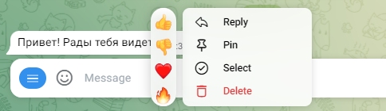

# Вкладка: Сообщение

### **Поле: Текст сообщения (Ответ)**

**Ответ** - это поле, где вы указываете текст, который придет пользователю в личных сообщениях.  Поле можно оставить пустым ( по умолчанию установлено #{none} - проигнорировать сообщение): например, вам нужно прислать просто картинку без сопроводительного текста. \
Также помимо текста можно указывать переменные в виде #{переменная} — так будет выводиться их значение. Допускается вместо переменной записывать математические действия, например, #{2 + 2} выведет значение 4.&#x20;

### Генерация текста сообщения ИИ

В поле можно генерировать сообщения с помощью искусственного интеллекта:

<figure><figcaption></figcaption></figure>

Кликнув по кнопке, откроется окно модальной формы для генерации текста сообщения:

<figure><figcaption></figcaption></figure>

В пустом поле пропишите, какой именно текст вам нужен, а затем кликните на кнопку "Сгенерировать":

<figure><figcaption></figcaption></figure>

После чего вы увидите текст для своего сообщения:

<figure><figcaption></figcaption></figure>

Чтобы текст появился в окне сообщения, кликните по кнопке "Вставить текст":

<figure><figcaption></figcaption></figure>

Далее вы увидите текст в поле для сообщения:

<figure><figcaption></figcaption></figure>

### Дополнительные кнопки

Под полем Текст сообщения есть **дополнительные кнопки**:&#x20;

1. **Добавить эмодзи**: встроенные эмодзи конструктора

<figure><figcaption></figcaption></figure>

2. **Вставить переменную**: шаблоны встроенных переменных. При клике по кнопке откроется окно с описанием встроенных переменных. Чтобы добавить переменную, кликните по ней.

<figure><figcaption></figcaption></figure>

<figure><figcaption></figcaption></figure>

4. **Markdown в Telegram**: форматирование (разметка  текста) текста, настройка работает только в Telegram.&#x20;

<figure><figcaption></figcaption></figure>


Если в этом блоке встречаются символы из перечисленных: '\_', '\*', '\[', ']', '(', ')', '\~', '\`', '>', '#', '+', '-', '=', '|', '{', '}', '.', '!'  — их нужно экранировать: добавлять перед ними обратный слэш \ \
\
Иначе сообщение не отправится вообще. При этом не имеет значения, какой участок текста вы размечаете.

&#x20;Пример: привет\\. Рады \*тебя\* видеть\\!



Подробнее про работу с [Markdown читайте в этой статье.](/broken/pages/KEcqTxiLh1QVQqHdo0eU)


4. **Защитить контент**: защита контента от копирования, работает только в Telegram. Защищенные сообщения нельзя переслать, а на телефоне нельзя переслать и сделать скриншот.

<figure><figcaption></figcaption></figure>

Пример сообщения с включенной защитой контента.

<figure><figcaption>
Приложение Telegram для ПК: кнопки Переслать нет
</figcaption></figure> <figure><figcaption>
Веб-версия Telegram: кнопки Переслать нет
</figcaption></figure>

5. HTML-разметка Telegram: поможет стилизовать текст в сообщениях в мессенджере

<figure><figcaption></figcaption></figure>


Подробнее о разметке в Telegram рассказали в статье "[Markdown и HTML-разметка в Телеграм](/broken/pages/KEcqTxiLh1QVQqHdo0eU)"


6. **Отправка без звука**

<figure><figcaption></figcaption></figure>

В некоторых мессенджерах существует возможность отправки сообщений без звука (например, в Телеграм):

<figure><figcaption></figcaption></figure>

В чат-боте существует та же функция: бот может отправлять сообщения без звука.&#x20;

7. Callback о просмотре для Вконтакте и email:

<figure><figcaption></figcaption></figure>

Коллбек - это уведомление в боте о каком-нибудь совершенном действии клиентом или событии в проекте, которое отображается в диалоге с клиентом:

<figure><figcaption></figcaption></figure>

Данное уведомление клиент не видит, но на колбек можно настроить реакцию.

8. **Сохранение переписки в истории переписки с клиентом**:

<figure><figcaption></figcaption></figure>

Данная кнопка активна по умолчанию, но, например, если вы не хотите сохранять какие-либо сообщение в истории с клиентом (определенные сообщения в воронке), то кнопку можно деактивировать.&#x20;
