# Условие и соответствие

## Какие существуют типы сравнения условия

Условие - это то, что является причиной запуска бота, перехода между состояниями (по стрелкам от блока к блоку) или другого действия. Слова и фразы в поле "Условие" являются триггером для схемы в конструкторе к отработке события или действия, содержащегося в блоке.&#x20;

В блоках с условием и в стрелках можно задать символы, а также числа, выражения, слова, которые послужат причиной перехода клиента в определенное состояние воронки или запуска бота. Поле "Условие" находится в редакторе условного блока или соединения.

<figure><figcaption></figcaption></figure>

<figure><figcaption>
Условие в настройках соединения (стрелки)
</figcaption></figure>

Например, если вам надо создать блок на все возможные стартовые слова мессенджеров, вы можете указать следующее условие: _`старт;start;get started;начать`_&#x20;


Во всех типах сравнения символ **`точка с запятой ;`** разделяет условия — это значит, что если вам необходимо прописать несколько условий, то их необходимо разделить запятой.


<figure><figcaption></figcaption></figure>

Чат-бот отреагирует на условие отработкой заданного действия или события: например, отправит приветственное сообщение клиенту:

<figure><figcaption>
Отработка чат-ботом события - направление сообщения
</figcaption></figure>

Для распознания условия необходимо определить тип сравнения (поле "Выбор соответствия"). Выбор соответствия помогает сравнить чат-боту условие с сообщением клиента или иным действием (например, с нажатием кнопки) и понять, какое событие необходимо далее отработать.&#x20;

В Salebot существует 4 типа выбора соответствия условию:&#x20;

1. Игнорируя ошибки и неточности;
2. Ключевые слова;
3. Полное совпадение;
4. Регулярное выражение;
5. Сравнение по смыслу (искусственный интеллект).

<figure><figcaption></figcaption></figure>

Далее разберем подробно.&#x20;

## Игнорируя ошибки и неточности

Данный тип сравнения является основным и позволяет работать с описками, опечатками, неточностями, пропусками букв, а также их перестановками. Условие срабатывает, если строки похожи более чем на 70%.&#x20;

Пример:\
Для условия "_привет"_ сработают следующие слова: _привед, првед, превет и пр._&#x20;

<figure><figcaption></figcaption></figure>

<figure>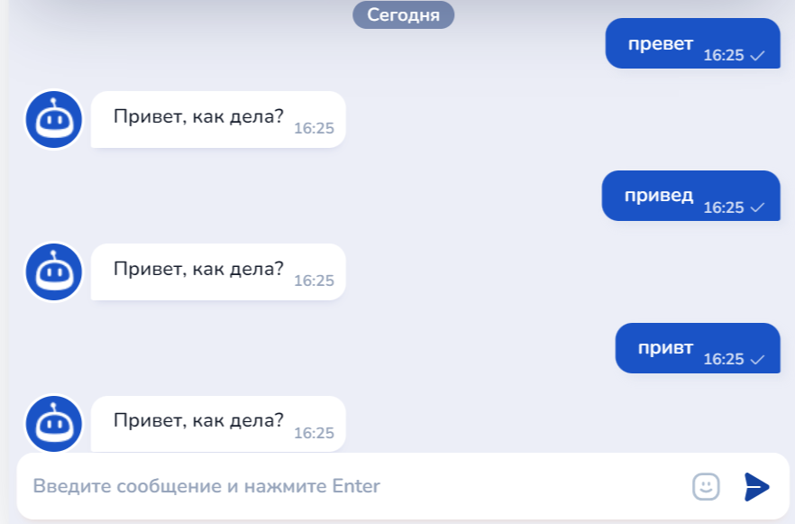<figcaption>
Отработка ботом условия при наличии ошибок в сообщении
</figcaption></figure>

Такой тип сравнения для условия более ориентирован на клиентов и включает в генерацию отработки условия человеческий фактор, поскольку опечатки встречаются довольно-таки часто.&#x20;

Выбор соответствия "Игнорируя ошибки и неточности" будет отличным сравнением для условия приветственного (первого) блока в схеме чат-бота, в котором клиент первым инициирует диалог. &#x20;

## По наличию ключевых слов

По наличию ключевых слов - очень мощный тип сравнения, который позволит сделать человекоподобного консультанта. При данном типе сравнения бот будет реагировать на любое сообщение пользователя, в котором содержится одно из ключевых слов условия.&#x20;

То есть, если клиент напишет чат-боту сообщение, в котором содержится одно или несколько ключевых слов из условия, то схема отработается в соответствии с ее настройками.&#x20;

Пример:\
Для условия "_привет;человек"_ сработают следующее условие: _я хочу поприветствовать этого замечательного человека_

<figure><figcaption></figcaption></figure>

<figure>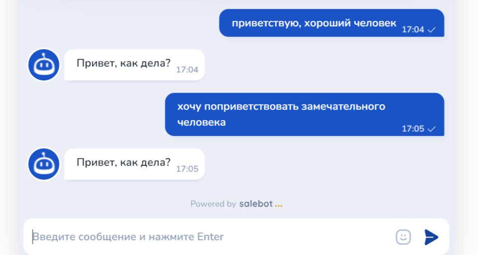<figcaption>
Отработка события внутри блока
</figcaption></figure>

В условие можно включить большое количество ключевых слов: с их помощью чат-бот сможет распознать, что клиенту требуется в данный момент, и отработать в соответствии с содержанием событие внутри настройки блока.

<figure><figcaption></figcaption></figure>

<figure>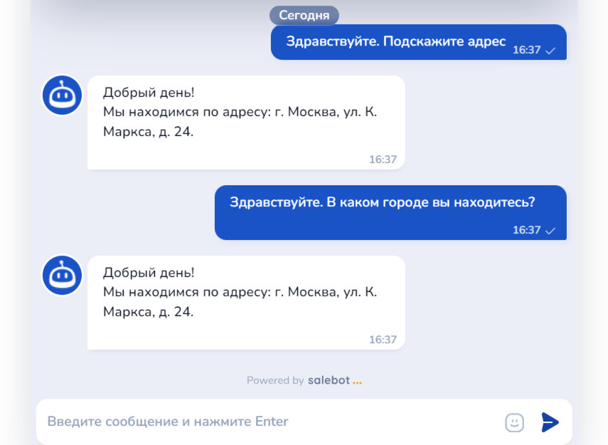<figcaption>
Отработка ботом события внутри блока
</figcaption></figure>

Как видно из примера выше, бот отработает любое сообщение, в котором содержится одно из ключевых слов в условии.&#x20;

При данном типе сравнения также используется поле "**Строки, на которые не надо отвечать**".&#x20;

<figure><figcaption></figcaption></figure>

Данное поле работает аналогично полю условие в противоположном значении: то есть, если сообщение пользователя будет содержать слова из поля "Строки, на которые не надо отвечать", то условие отработано не будет.

Соответственно, если условие поля "Строки, на которые не надо отвечать" срабатывает, то общее условие не работает.

### Вариативность

Дополнительное условие можно добавить также через точку с запятой, но что делать, если нужно одно из нескольких вариантов слов?&#x20;

Например, обработать одним условием фразы "_У меня не работает интернет", "У меня не работает компьютер", "у меня сломался компьютер"._&#x20;

Очевидно, перебор всех вариантов ключевиков путь в никуда. Для этого придуман синтаксис ИЛИ. Чтобы указать один из нескольких равнозначных ключевиков, надо их все поместить в круглые скобки и разделить символом вертикальной черты.&#x20;

Например: условие _(тар план |тариф) (перейт|подключ|менит|помен)_ сработает на вопросы: _Здравствуйте, как подключить новый тариф. Как сменить тарифный план._

<figure><figcaption></figcaption></figure>

<figure>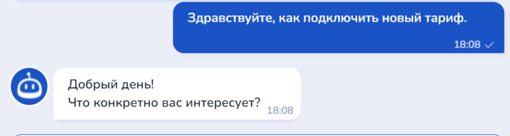<figcaption>
Отработка ботом условия
</figcaption></figure>

Разберем условие:

_(тар план |тариф)_ говорит, что в строке должно быть _тар_ **И** _план_ **ИЛИ** _тариф_ **И ОДНОВРЕМЕННО** _перейт_ **ИЛИ** _подключ_ **ИЛИ** _менит_ **ИЛИ** _помен_

Несколько других примеров, они интуитивно понятные.\
&#xNAN;_&#x43C;ен пароль (каб|лк)_\
_(забыл|сброс|восста|вспомнить|принимает|подходит|не верный|не тот|не помн) парол_\
_(не могу| не удается) (восстановить|изменить) пароль_\
_логин в договоре;(потер|утеря|где лежит|не знаю|где| не найти|нет) догов_\
_(приостанов|заблок|блок|откл) (услуг|интер|инет|списан); (спасан|спаст) ден; постав на паузу;уезжа_\
_автоплат; оплат;заплатить;реккурентн плат;подключ плат_

## Полное совпадение

При данном типе сравнения бот отработает событие только в том случае, если сообщение, направляемое клиентом совпадет с условием.


Сравнение происходит без учета регистра, то есть если условие _привет_, а пользователь введет _ПРИВЕТ_, то условие сработает. Это необходимо учитывать.


Такой тип сравнение справделиво будет указать в настройках, например, стрелки при нажатии клиентом кнопки или после перехода с минилендинга в чат-бот с указанием тега сайта.&#x20;

1. Для нажатия кнопки

Например, в условиях мы пропишем названия кнопок, по клике клиентом на которую он должен перейти в соответствующий блок.&#x20;

<figure><figcaption></figcaption></figure>

Далее мы создадим блоки, в которые должен перейти клиент после нажатия на кнопку, после первого блока (в примере будет 5 блоков, содержание которых соответствует тексту кнопок):

<figure><figcaption></figcaption></figure>

После чего в настройках в поле "Условие" выбираем соответствующую кнопку:

<figure><figcaption></figcaption></figure>

И ставим выбор соответствия "Полное совпадение":

<figure><figcaption></figcaption></figure>

Далее, при необходимости возврата клиента к выбору кнопок, сделаем еще одну кнопку "Назад" в каждом блоке, к которому ведет определенное соединение (стрелка) с условием:

<figure><figcaption></figcaption></figure>

Теперь создадим блок "Стартовое условие", где в условии пропишем слово "Назад" и выберем выбор соответствия полное совпадение:

<figure><figcaption></figcaption></figure>

И протянем стрелку с задержкой 0 секунд в блок с кнопками:

<figure><figcaption></figcaption></figure>

Итоговая схема работает следующим образом:

1. Клиент пишет боту и попадает в приветственный блок;
2. Далее с задержкой в 0 секунд клиенту отправляется блок "Состояние", в котором созданы кнопки;
3. В зависимости от клика на кнопку, клиент переходит в следующий блок, рассказывающий об определенном виде техники;
4. Если клиент нажмет "Назад", то попадет в зеленый блок, а затем снова в блок с кнопками:

<figure><figcaption></figcaption></figure>

Теперь может протестировать бота:

<figure><figcaption></figcaption></figure>

Как видно, бот отлично отрабатывает условие и выбор соответствия полное совпадение при использовании кнопок.&#x20;

2. Использование тега сайта в воронке.&#x20;

В данном случае принцип схож с использованием кнопок, однако в этом случае условие и выбор соответствия прописывается непосредственно в самом блоке с условием.&#x20;

В этом случае, тег берется во вкладке сайты, где вы установили тег для страницы сайта:

<figure><figcaption></figcaption></figure>

Тег в условии блока указывается в УСЛОВИИ блока БЕЗ слов ТЕГ и иных надписей:

<figure><figcaption></figcaption></figure>


Подробнее о том, как настроить запуск бота по тегу, который установлен на сайте, рассказали в статье "[Создание сайта и основные настройки"](/broken/pages/SVmo5FWy8HXy0n1EdOSO#teg) в разделе "Тег".&#x20;


Чат-бот также отреагирует и отработает установленное событие внутри настройки блока.

## Регулярное выражение

Регулярные выражения - это условие, с помощью которого бот может проверять формат введенных данных (например, что человек ввел именно номер телефона, а не что-то иное).

При сборе данных пользователь часто вводит не то, что его просят ввести. Приведем типовую схему проверки корректности ввода номера телефона. В случае, если пользователь ввел не номер телефона, бот попросит его повторить ввод.

<figure><figcaption></figcaption></figure>

Из блока, спрашивающего номер телефона, идет 2 соединения. Одно без условия, а второе с условием регулярного выражения российского номера телефона:&#x20;

`^((+7|7|8)+([0-9]){10})$`

Соединение с условием как раз добавляет его в заявку и сработает только тогда, когда встретится корректный номер телефона. Второе соединение сработает во всех других случаях, так как у него ниже приоритет.&#x20;


Полный список полезных регулярных выражений можно увидеть в [одноименной статье](/broken/pages/-M0wjAtzg71YW7LB-2D8).


## Сравнение по смыслу

В основе выбора соответствия "сравнение по смыслу" лежит принцип работы искусственного интеллекта - это настоящий прорыв в работе Вашего чат-бота.&#x20;

Принцип работы:

1. В условии прописываются слова/фразы, являющиеся СМЫСЛОМ, который выявляется ИИ из сообщения клиента;
2. Обработка системой (чат-ботом) сообщения клиента - то есть поиск вложенного в условие смысла для ИИ в реплике клиентов;
3. Отработка ботом события в блоке.&#x20;

То есть, прописывая в условии определенные значения, например, какие-либо фразы, искусственный интеллект проверит каждое условие на соответствие реплике, отправленной клиентом, и начнет отработку соответствующего события в блоке (например, отправку сообщения и пр.)

Пример:

В условии нами были прописаны определенные фразы и слова, которые должен обработать и найти в реплике клиента (сообщении) ИИ, а затем отработать необходимое событие, лежащее в блоке.

В нашем случае, в условии лежат фразы "закрывающие счета или акты":

<figure><figcaption></figcaption></figure>

При выборе соответствия "сравнение по смыслу" бот должен найти в сообщении клиента похожие/схожие по смыслу слова/фразы, лежащие в условии:

<figure><figcaption></figcaption></figure>

<figure><figcaption></figcaption></figure>

Каждый раз бот после обработки сообщения клиента, верно отрабатывает необходимое событие, лежащее в блоке.&#x20;

#### Как писать условие

Условие в соответствующем поле прописывается аналогично иным условиям при любом выборе соответствия: через точку с запятой (;):

<figure><figcaption></figcaption></figure>

Приоритетнее указывать в поле условия фразы/слова наиболее точно и лаконично:

<figure>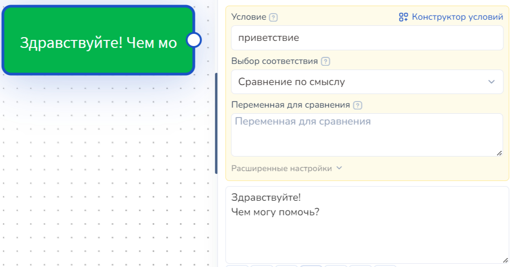<figcaption>
Настройки блока
</figcaption></figure> <figure>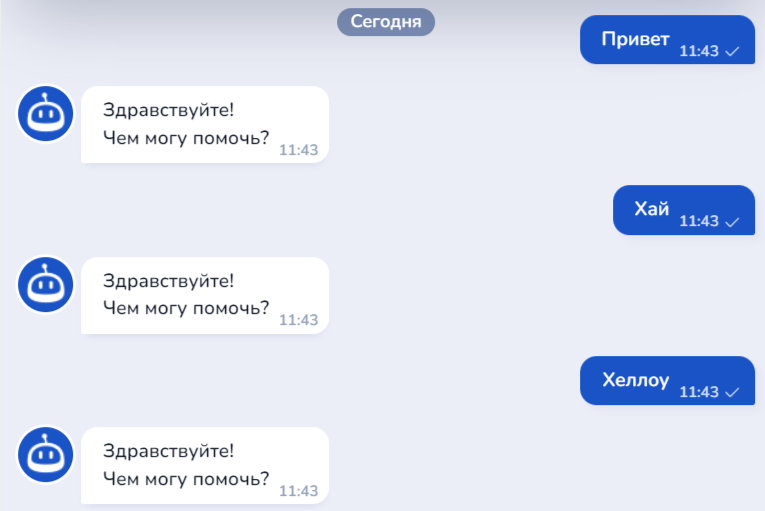<figcaption>
Отработка ботом
</figcaption></figure>


Емкое, точное и лаконичное условие для блока поможет чат-боту верно отрабатывать событие, вложенное в блок. \
Чем больше сложных слов, размытых по смыслу, и растянутых на несколько предложений фраз, тем дольше осуществляется обработка ИИ сообщений клиентов, что может привести к некорректной работе вашей схемы.&#x20;



<mark style="color:red;">**Обращаем внимание!**</mark>&#x20;

Условие НЕ должно состоять из одного слова: несмотря на то, что необходимо составлять лаконичные условия, они должны отражать искомый ботом смысл..&#x20;

Если модель будет сравнивать два разных слова условия, то они не будут равны. Например: вместо слова «счет», выставьте условие «оплата по счету за месяц» - такое условие будет соответствовать искомым требованиям, а также укажет модели ИИ необходимые критерии для сравнения по смыслу


Пример: это  <mark style="color:green;">**ВЕРНОЕ**</mark>  написание условия выбор соответствия "сравнение по смыслу":

<figure><figcaption>
Верное условие!
</figcaption></figure>

При верно прописанном условии чат-бот также сработает корректно, а ответ не заставит себя ждать:

<figure>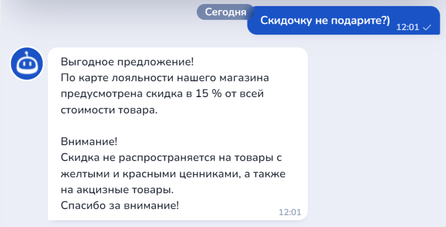<figcaption></figcaption></figure> <figure>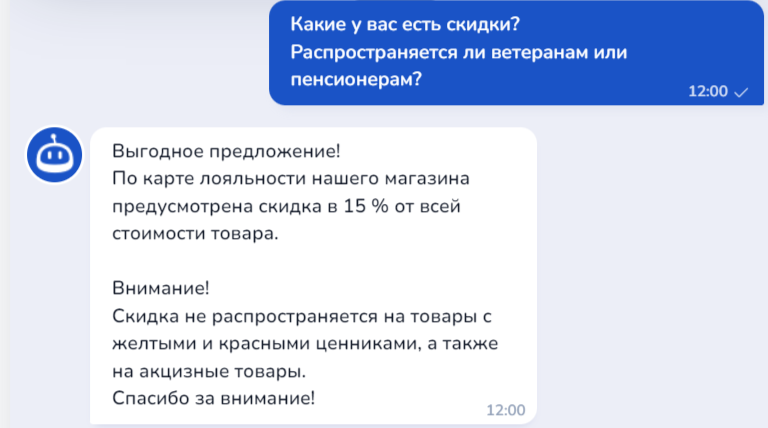<figcaption></figcaption></figure>

Таким образом, с помощью выбора соответствия "сравнение по смыслу" при отработке ИИ переберет необходимые варианты для понимания смысла реплики клиента, и по соответствию чат-бот отработает необходимое событие.&#x20;

### Видео-инструкция



## Конструктор условий

Конструктор условий - это уникальный специализированный функционал для оперативного сбора условий в соответствующих блоках для реакции на приходящие коллбеки от различных каналов, платежных систем и других интеграций.

Конструктор условий соответственно доступен только для [блоков с условиями](/broken/pages/VktePfPMzzJlbjBSqE93): Стартовое условие и Не состояние с условием

<figure><figcaption></figcaption></figure>

Чтобы воспользоваться конструктором, откройте настройки блока, где вы увидите соответствующую кнопку, расположенную чуть выше поля условия:

<figure><figcaption></figcaption></figure>

После клика на соответствующую кнопку вам откроется окошко для работы с условиями:

<figure><figcaption></figcaption></figure>

Далее нажмите на "Добавить условие".&#x20;

### Условия Salebot

<figure><figcaption></figcaption></figure>

Вкладка конструктора "Условия Salebot" включают в себя все системные условия, хранящиеся и доступные для работы с различными разделами в Сейлботе.&#x20;

#### Обычные условия.

Данный функционал аналогичен по работе вложенному условию в блоке: здесь в условии вы прописываете то, что НЕ является заранее вложенным в систему.

<figure><figcaption></figcaption></figure>

Это может быть тег воронки; сайта и иное другое условие, которое существует только в вашем проекте.&#x20;

#### Переменные

<figure><figcaption></figcaption></figure>

Условия с переменными достаточно легки в настройке.

Шаг 1. В соответствующем поле введите Имя переменной.

Шаг 2. Выберите параметр сравнения.

<figure>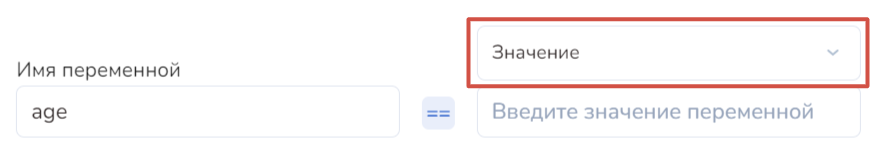<figcaption></figcaption></figure>

То есть, что вы хотите сравнивать со своей переменной: определенное значение либо другую переменную.

<figure>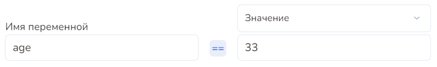<figcaption>
Сравниваем переменную со значением
</figcaption></figure>

<figure>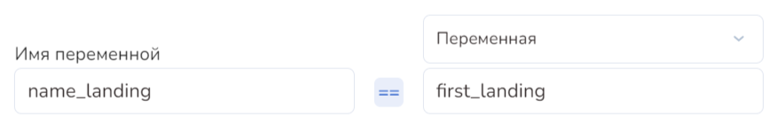<figcaption>
Сравниваем переменную с переменной
</figcaption></figure>

Шаг 3. Выберите тип сравнения.

<figure>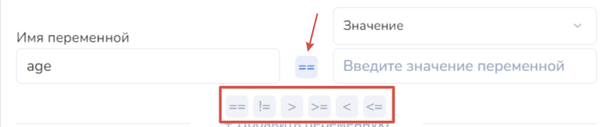<figcaption></figcaption></figure>

Каждое сравнение имеет свое значение: равно (==); не равно (!=); строго больше (>); больше или равно (>=); строго меньше (<); меньше или равно (<=).

Пример:

<figure>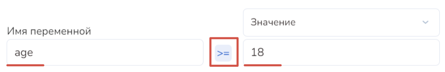<figcaption></figcaption></figure>

В примере вкладывается значение переменной больше или равно 18. Что это значит? \
Это значит, что событие, вложенное в блок, сработает только у тех клиентов, которые подходят по возрастной группе "совершеннолетние". То есть им или 18, или больше.&#x20;

Эквивалентным выражением "age >= 18" является "age > 17". &#x20;

Условие "age > 17" также сработает только для тех лиц, кто строго старше 17. То есть, начиная от 18 и далее.

#### Разделы Salebot

<figure><figcaption></figcaption></figure>

В условиях по разделам Salebot содержатся типичные коллбеки - системные уведомления - о тех или иных событиях в проекте.&#x20;

Для отработки вложенного события в блок по уведомлению (колбеку), выберите нужное событие, на которое должен реагировать бот, в поле условия, затем укажите выбор соответствия и нажмите кнопку "Добавить условие":

<figure><figcaption></figcaption></figure>

После чего условие появится в соответствующих полях в блоке.&#x20;


Если в блоке уже вложено какое-либо условие, то при нажатии на кнопку "Добавить условие" новое условие добавится строго после существующего.\
Если вам необходимо добавить новое условие в блок взамен старому, нажмите на "Заменить условие".&#x20;


### Мессенджеры

<figure><figcaption></figcaption></figure>

С помощью вкладки "Мессенджеры" в конструкторе условий вы сможете настроить реакции на события в мессенджерах, подключенные к Сейлботу.&#x20;


Событие — это какое-либо действие ваших подписчиков или клиентов в мессенджерах (каналах, группах, директе и т.д.), например, клиент отписался от бота, подписчик ответил на сторис и т.д.


#### Instagram\*


\*Принадлежит экстремистской компании Meta, деятельность которой  запрещена на территории Российской Федерации.&#x20;


Для данного канала существуют свои коллбеки (уведомления о событиях) и отдельные методы для отработки реакций.

Для начала вам необходимо выбрать соответствующий коллбек:

<figure><figcaption></figcaption></figure>

Значение каждого коллбека вы можете увидеть непосредственно перед самим системным уведомлением.


Для некоторых коллбеков существует свой собственный метод для бота.&#x20;

Например: mention\_in\_media - коллбек упоминания в посте. \
Собственный метод для данного коллбека - reply\_to\_mention - ответный комментарий к посту.


<figure><figcaption></figcaption></figure>

Для некоторых колбеков можно ввести ID поста — например, если вам нужно, чтобы бот отреагировал только на комментарии под определенным постом:

<figure><figcaption></figcaption></figure>

После настройки необходимой реакции на коллбек кликните на "Добавить условие"/"Заменить условие". На этом настройка закончена.&#x20;


Каналы "Telegram" и "Вконтакте" настраиваются аналогично.


### Сервисы для приема платежей

<figure><figcaption></figcaption></figure>

Для настройки условий для платежных систем, убедитесь, что вы подключили соответствующую интеграцию, в противном случае вы не сможете воспользоваться конструктором с необходимой системой:

<figure><figcaption></figcaption></figure>

Далее выберите необходимый сервис для приема платежей, нажав на кнопку с названием нужного сервиса и выберите соответствующий коллбек в списке:

<figure><figcaption></figcaption></figure>

Если вам нужно настроить реакцию только на определенную сумму, то пропишите сумму в поле "Сумма платежа", если нужно, чтобы бот реагировал на любую оплату, поле "Сумма платежа" можно пропустить.

Выбор соответствия "Полное совпадение" или "По наличию ключевых слов":

<figure><figcaption></figcaption></figure>

Далее нажмите "Добавить условие":

<figure><figcaption></figcaption></figure>


Иные вкладки конструктора условий настраиваются аналогично.\
Желаем успехов!

