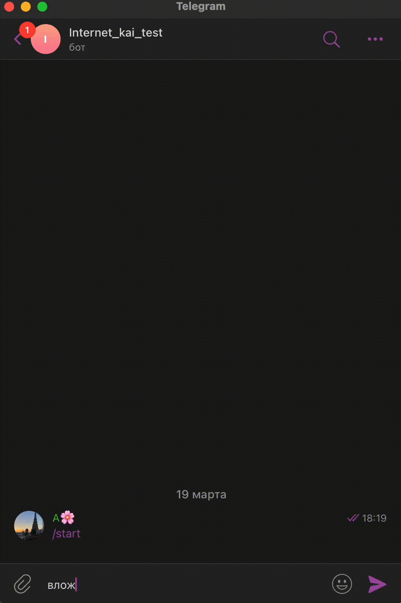
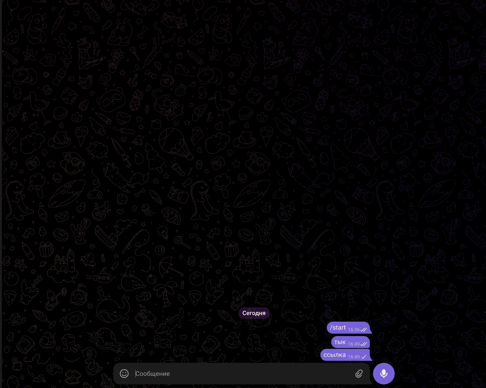

# Вкладка: Вложения

В блок можно добавить один из типов вложений: ссылка, видео, картинка, файл, аудио. &#x20;


Подробнее про работу с вложениями, их различие и как правильно использовать рассказано [в этой статье. ](https://docs.salebot.pro/osnovnye-ponyatiya.-kak-sozdavat-botov-na-salebot.pro/otpravka-vlozhenii-audio-video)


<figure><figcaption></figcaption></figure>

Существует несколько типов вложений, которые можно отправлять в боте:

1. Ссылка;
2. Видео;
3. Изображение;
4. Файл;
5. Аудио.&#x20;


В одном блоке НЕЛЬЗЯ соединять разные типы вложений!\
\
Загруженное в конструктор вложение должно быть не больше 20 MB

Допустима отправка до 10 вложений <mark style="color:red;">**одного типа**</mark> в одном блоке


## Как отправить вложения

Чтобы отправить вложение, создаем пустой блок и открываем редактор блоков (правое меню).


Обращаем внимание!&#x20;

1. Загруженное вложение должно быть не больше 20 Mb. Допустима отправка до 10 вложений <mark style="color:red;">**одного типа**</mark> в одном блоке;
2. <mark style="color:red;">**Не рекомендуется отправлять блок с несколькими вложениями в рассылке**</mark>, чтобы не упереться в лимит API  разных мессенджеров;
3. <mark style="color:red;">**НЕЛЬЗЯ**</mark> присваивать <mark style="color:red;">**одно и то же имя**</mark> разным вложениям **в рамках одного проекта**! Если вы загрузите другое вложение с тем же именем, которое присвоено уже существующему вложению в проекте, отправится то, которое вы загрузили в систему раньше. Для правильной работы блоков присваивайте вложениям различные названия во избежание ошибок!&#x20;



**Обращаем внимание!**

**Особенности в  Telegram:**&#x20;

* <mark style="color:red;">**кнопки НЕ придут**</mark> при отправке более одного вложения в блоке.

_<mark style="color:blue;">Исключение:</mark>_ Если в блоке текст > 1024 символов, то такая отправка будет разделена на 2 сообщения, и кнопки придут вместе с текстом, а вложения отдельным сообщением.

* Разметка текста <mark style="color:red;">**markdown и html не работает**</mark> при отправке более одного вложения в блоке.


Все настройки вложений находятся в настройках блока, которые открываются при клике на кнопку  "Вложения":

<figure><figcaption></figcaption></figure>

&#x20;Давайте подробнее рассмотрим появившиеся **кнопки с типами вложений:**

<figure><figcaption></figcaption></figure>

### Ссылка

Первый кнопка - **ссылка:**&#x20;

<figure><figcaption></figcaption></figure>

При клике на кнопку появляются поля для указания URL вложения либо загрузки вложения, где вы можете добавить ссылку (URL вложения) для перехода клиентом или соответственно загрузить тот файл, который хотите передать (он будет показан в отдельной ссылке).


Прикрепленный файл будет отправлен ссылкой с сервера salebot.pro.



Загруженный файл имеет приоритет перед ссылкой на файл. Если вы укажите ссылку и одновременно прикрепите файл, то будет отправлен файл.


Под полем для URL есть три чекбокса:

<figure><figcaption></figcaption></figure>

1. **С уведомлением о клике** - значит, что когда пользователь перейдет по ссылке, бот вернет ответ в виде: link\_was\_pressed и ссылки через пробел.&#x20;

<figure><figcaption></figcaption></figure>

Для чего это нужно?&#x20;

С помощью этого события можно разделять пользователей на тех, кто перешел по ссылке и тех, кто не перешел. Если активировать чекбокс, то в диалоге с клиентом будет приходить колбек следующего вида: "<mark style="color:yellow;">**link\_was\_pressed**</mark> <mark style="color:purple;">**https://salebot.pro**</mark>", где <mark style="color:yellow;">**link\_was\_pressed - неизменяемая часть колбека,**</mark>**&#x20;**<mark style="color:purple;">**https://salebot.pro - URL, который был указан Вами в блоке.**</mark>&#x20;

<figure><figcaption></figcaption></figure>

<figure><figcaption></figcaption></figure>

Например, можно "догревать", отправляя клиентам напоминания.


Как настроить реакцию бота на колбек перехода по ссылке, читайте ниже в разделе "[Отслеживание клика по ссылке](vkladka-vlozheniya.md#otslezhivanie-klika-po-ssylke)"


По умолчанию ссылка с уведомлением о клике имеет вид "https://sblnk.ru/{proxy\_id}".\
Вы можете задать свой домен для формирования ссылок с уведомлением.&#x20;

Для этого перейдите в настройки проекта:

<figure><figcaption></figcaption></figure>

Кликните по кнопке "Установить собственный домен..." и в модальном окне укажите домен:

<figure><figcaption></figcaption></figure>


Подробнее о создании и настройке собственного домена рассказали [здесь.](/broken/pages/SVmo5FWy8HXy0n1EdOSO#domen)&#x20;


Тогда ссылка с уведомлением о клике примет вид: "https://{ваш домен}/{proxy\_id}/s":

<figure><figcaption></figcaption></figure>

.png>)

2. Чекбокс "**Показывать превью ссылок"**

<figure><figcaption></figcaption></figure>

Значит, что в месседжерах помимо самой ссылки будет видно, что за файл вы отправляете.&#x20;

3. Чекбокс "**Изображение ниже текста**"&#x20;

<figure><figcaption></figcaption></figure>

### **Видео-вложение**

Кнопка **Видео-вложение:**

<figure><figcaption></figcaption></figure>

Выбирайте при отправке видео. В Whatsapp видео отображается только ссылкой. Если вам нужно и в других мессенджерах, чтобы видео с Ютуба приходило просто ссылкой, то можно ссылку прогнать через любой сократитель ссылок или отправить как вложение с уведомлением о клике.&#x20;


Во Вконтакте видео загружается только с Вконтакте или с Ютуба. Если Вам необходимо прикрепить ссылку на видео с других платформ, воспользуйтесь прикреплением через ссылку.&#x20;



Важно! \
У Telegram есть особенность: если размер видео слишком маленький (примерно до 2 мб), то видео-вложение отправляется в формате .gif.


Прикреплять видео лучше ссылкой, если размер видео большой, из файлового хранилища. **Прямо в блок загружаются видеофайлы объемом не более 20 МБ.**


Обращаем внимание!&#x20;

Видео прикрепляется в формате MP4


<figure><figcaption></figcaption></figure>

### Картинка

Кнопка **"Изображение" -** выбирайте при отправке необходимых изображений в боте.&#x20;

<figure><figcaption></figcaption></figure>

Как и любое другое вложение, изображение можно загрузить прямо с компьютера или указать его URL.&#x20;

### Файл

Значок - **файл** - используйте при отправке документов и любых других файлов.

<figure><figcaption></figcaption></figure>

### **Аудио**

Значок - **Аудио -** используйте, если тип отправляемого файла имеет аудио формат.

<figure><figcaption></figcaption></figure>


Аудиофайл должен иметь формат .ogg и быть менее 1Мб

Для Instagram формат файла .m4a


### Отправка множественных файлов

Для отправки нескольких видеовложений/файлов/картинок/аудио в разделе "Вложения" редактора блока укажите нужный тип вложений и выполните загрузку необходимых файлом по одному:

<figure><figcaption></figcaption></figure>


<mark style="color:red;">**Не забывайте про ограничения при отправке нескольких файлов!**</mark>

* Добавить можно одновременно до 10 файлов одного типа
* Каждый файл не должен превышать размер 20Мб
* При отправке нескольких вложений в Телеграм важно учесть:\
  \- При отправке более одного файла не работает разметка текста markdown, html\
  \- При множественной отправке файлов нельзя отправить кнопки&#x20;


**В Телеграм:**&#x20;

* <mark style="color:red;">**кнопки НЕ придут**</mark> при отправке более одного вложения в блоке.

_<mark style="color:blue;">Исключение:</mark>_ Если в блоке текст > 1024 символов, такая отправка будет разделена на 2 сообщения и кнопки придут вместе с текстом, а вложения отдельным сообщением.

* Разметка текста <mark style="color:red;">**markdown и html не работает**</mark> при отправке более одного вложения в блоке

## **Пример отправки вложений**

Перейдем к примерам.&#x20;

Добавим в бота автоматическую отправку каждые 2 секунды. В  каждом блоке добавим разные типы вложений и посмотрим, как это выглядит в мессенджере Телеграм.

<figure><figcaption></figcaption></figure>

В каждом из блоков в схеме, представленной на примере выше, загружены разные типы вложений: файл, ссылка, видео, изображение и аудио. Интервал отправки - 2 секунды.&#x20;

<figure><figcaption></figcaption></figure>

### Отслеживание клика по ссылке

Создадим блок, в который вложим ссылку:

<figure><figcaption></figcaption></figure>

Далее создадим из блока первостепенной проверки условия создадим еще два блока: в одном напишем "Перешел по ссылке" во втором "НЕ перешел по ссылке":

<figure><figcaption></figcaption></figure>

Переходим в настройки стрелки, ведущей от блока первостепенной проверки к блоку "Перешел по ссылке":

<figure><figcaption></figcaption></figure>

В поле Условие в настройках стрелки нужно указать коллбек "link\_was\_pressed #{ВАША ССЫЛКА}":

<figure><figcaption></figcaption></figure>

Чтобы скопировать колбек, отправьте блок с ссылкой и перейдите по ссылке в чате с ботом. Тогда колбек придет в диалоге с клиентом:

<figure><figcaption></figcaption></figure>

Либо пропишите вручную в формате "<mark style="color:orange;">**link\_was\_pressed**</mark>**&#x20;**<mark style="color:purple;">**пробел**</mark> <mark style="color:red;">**ссылка"**</mark>.

В настройках второй стрелки:

1. Ставим задержку отправки блока: это даст время клиенту перейти по ссылке;
2. Активируем чекбокс "Не отправлять, если покинул блок": это нужно для того, если клиент нажмет на ссылку и перейдет в блок "Перешел по ссылке", второй блок "Не перешел по ссылке" спустя установленное в стрелке время НЕ отработал.&#x20;

<figure><figcaption></figcaption></figure>

<figure><figcaption></figcaption></figure>

Тестируем бота:

<figure><figcaption></figcaption></figure>

Теперь вы умеете отправлять различные типы файлов/вложений, а также отслеживать переходы по ссылкам с помощью чат-бота. Использовать данный функционал можно как в повседневных целях (рассылки, отправка чек листов и т.д.), так и в более сложных воронках с дальнейшем "подогревом" клиентов в зависимости от их действий в боте.&#x20;

### Как разместить ссылку со слежением в кнопку

Ссылка с уведомлением о клике выглядит специфично, поэтому есть смысл размещать эти ссылки в кнопках. Для этого вам нужно создать переменную со ссылкой со слежением и разместить ее в кнопке.

Для создания ссылки со слежением необходимо вызвать функцию **proxy('ВАША ССЫЛКА')** в калькуляторе.

Для этого пропишите переменную, например, link, значение которой равно функции с вашей ссылкой:

<figure><figcaption></figcaption></figure>

Теперь переменную, в которой записана ссылка с уведомлением о клике, можно разместить в тексте или поставить в кнопку.

**ПРИМЕР:&#x20;**_**ссылка с уведомление о клике в тексте сообщения:**_

<figure><figcaption></figcaption></figure>

Обратите внимание, переменная передана через конструкцию #{ВАША ССЫЛКА} - это обязательно. &#x20;

**ПРИМЕР:&#x20;**_**ссылка с уведомление о клике добавлена в настройки кнопки**_:

1. Создайте кнопку&#x20;

<figure><figcaption></figcaption></figure>

2. В поле URL укажите вашу переменную через конструкцию #{ВАША ССЫЛКА}, функция кнопки "По умолчанию":

<figure><figcaption></figcaption></figure>


Полезные статьи:

1. Функции для создания ссылок с уведомлением о клике и сроком действия можно прочитать в статье "[Для работы с ссылками](/broken/pages/EDc43pOhHpH3zXtkpiAl)"
2. Подобнее о том, как разместить ссылку в кнопке, вы можете прочитать в статье "[Кнопки](/broken/pages/xeepnRj969zW3xRimkdg)"


### Видеоинструкция



## Получение изображений и файлов от пользователя

В разделе расскажем, как определить, что пользователь отправил файл, получить на него ссылку и как правильно работать с ней.

Чтобы определить, что пользователь отправил какое-либо вложение (изображение, файл, видео и пр.), необходимо в условии указать **attachment\_message:**

<figure><figcaption>
Настройки стрелки для получения файлов от клиента
</figcaption></figure>

После того, как отправлен файл, появляются две переменные:\
\#{**attachments**} - url вложений к сообщению пользователя в формате JSON массива\
\#{**attachment\_url**} - в этой переменной содержится обычная url ссылка на вложение, например, для последующего использования в боте.&#x20;

Чтобы понять, чем отличаются **attachments** и **attachment\_url** друг от друга, выведите их на экран:

<figure><figcaption></figcaption></figure>

Если в вашем проекте используется несколько вложений от пользователя, то удобно присваивать для url каждого из них собственную переменную. Для этого в редакторе блока в поле Калькулятор объявите переменную, в которую сохраните полученный url вложения.

`Ваша_переменная = #{attachment_url}`, как на Рисунке 3.

<figure><figcaption>
Присвоить переменной url_image1  значение <code>attachment_url</code>
</figcaption></figure>


Видео-урок "Получение файлов от пользователя"

