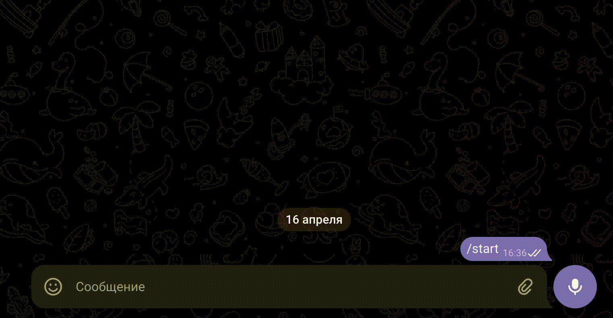

# Случайные ответы в боте

Если у вас стоит задача отправлять клиентам различные случайные ответы, то воспользуйтесь представленным ниже описанием. Есть возможность отправлять как фразы целиком, так и отдельные слова, цифры и вложения.

В случае, когда необходимо отправить фразу, варианты ответа необходимо записать в формате <mark style="color:red;">**{**</mark>**текст1**<mark style="color:red;">**|**</mark>**текст2**<mark style="color:red;">**|**</mark>**текст3**<mark style="color:red;">**}**</mark>, например:&#x20;

<figure><figcaption></figcaption></figure>

Как работает бот:

<figure><figcaption></figcaption></figure>

### **Отправка случайного вложения:**

Для случайного вывода ссылки список URL необходимо записать в формате \
**<ссылка1>**<mark style="color:red;">**<$>**</mark>**<ссылка2>**<mark style="color:red;">**<$>**</mark>**<ссылка3>**, например:&#x20;

<figure><figcaption>
Между ссылками установлены символы <mark style="color:red;"><strong>&#x3C;$></strong></mark>
</figcaption></figure>

Отработка бота:

<figure><figcaption></figcaption></figure>

### **Отправка случайного числа:**

1. Необходимо вызвать функцию random, указать нижнюю и верхнюю границы для создания случайного числа. Функцию присвоить переменной.
2. Вывести значение в сообщение бота, поместив имя переменной в #{}, например:&#x20;

<figure><figcaption></figcaption></figure>

Отработка бота:

<figure><figcaption></figcaption></figure>

### **Отправка случайного словосочетания:**

Есть гипотеза, что при рассылках в Whatsapp вероятность блокировки ниже, если не рассылать одинаковое сообщение, а немного его модифицировать.&#x20;

Случайная часть предложения выделяется фигурными скобками, а варианты вертикальной чертой, например:&#x20;

<mark style="color:red;">**{**</mark>**Привет**<mark style="color:red;">**|**</mark>**Здравствуйте**<mark style="color:red;">**|**</mark>**Добрый день**<mark style="color:red;">**}**</mark>. Я хочу {пригласить на|предложить|продать} свой мега тренинг.

<figure><figcaption></figcaption></figure>

Ответы бота:

<figure><figcaption></figcaption></figure>

### Отправка случайного ответа:

Рассмотрим на примере как отправить **в Instagram\*** комментарий клиенту, выбранный случайным образом.

За выбор случайной строки отвечает метод **select\_random('str1|str2')**

где  **str1 и str2** - переменные, в значении которых записаны варианты ответа.

За отправку ответа на комментарий под постом, который прокомментировал клиент - **insta\_create**_**\_**_**comment("str")**

где  **str** - переменная, в значении которой записан результат полученный методом **select\_random.**


Вместо **insta\_create**_**\_**_**comment()** можно использовать любой другой метод отправки сообщений.


<figure><figcaption></figcaption></figure>


\*Принадлежит Meta, деятельность которой признана экстремистской и запрещена на территории РФ.&#x20;

