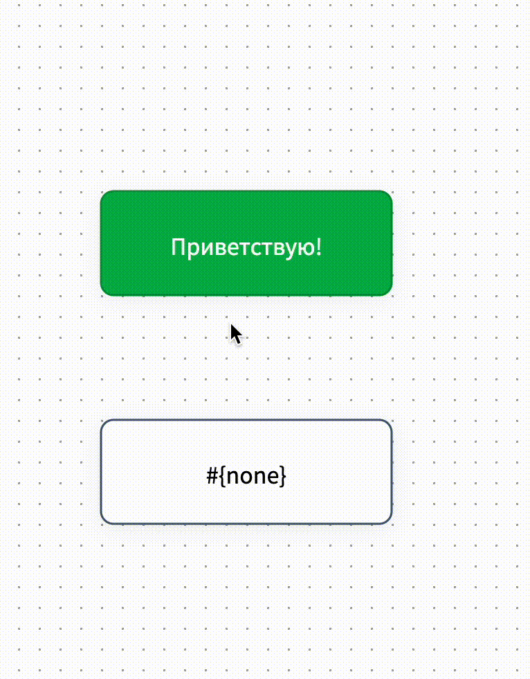

# Стрелки (соединения)

**Стрелки** - это условия перехода. По сути, стрелка выполняет роль распределителя: если клиент выбрал "Ответ 1", он переместится в блок №1, если выбрал "Ответ 2", то переместится в блок №2 и т.д.&#x20;

<figure><figcaption></figcaption></figure>

Чтобы **соединить два блока стрелкой**, наведите указатель мыши на блок. Появится белый круг внизу блока - узелок связи. Кликните по нему левой кнопки мыши и, удерживая кнопку, тяните к следующему блоку. Отпустите кнопку - стрелка создана:

<figure><figcaption></figcaption></figure>

Наведите мышь на стрелку и увидите меню действий для стрелки:

<figure><figcaption></figcaption></figure>

При клике на шестеренку откроется форма настроек стрелки:

<figure><figcaption></figcaption></figure>

Как видите, структура формы настроек стрелки содержит разделы настройки таймера перехода, условного перехода и основные настройки для стрелок со сбором данных.


Важно знать!&#x20;

Стрелки не могут существовать сами по себе, они являются элементом соединения двух блоков.




Чтобы перейти в форму настройки стрелки (соединения), наведите на стрелку: появится шестеренка, на которую нужно кликнуть:

<figure><figcaption></figcaption></figure>

Тогда форма настройки откроется справа на экране.

### Описание

<figure><figcaption></figcaption></figure>

В это поле можно задать краткое описание назначения стрелки. Полезно для структурирования логики бота: поможет не запутаться, если работаете над сложным проектом с большим количеством блоков. По умолчанию описание указано "Соединение". Чтобы изменить его, кликните по описанию и введите своё.  На работу бота данное поле не влияет.
