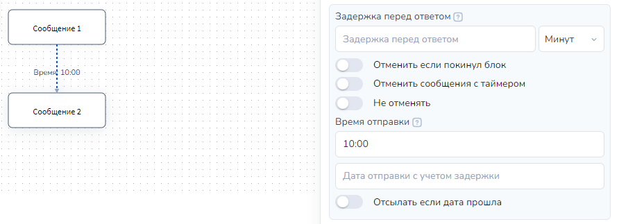

# Настройки времени и даты в стрелке

## **Задержка перед ответом**

<figure><figcaption></figcaption></figure>

Переход в следующий блок произойдет через промежуток времени, указанный в поле "Задержка перед ответом".  Время может измеряться в секундах, минутах, часах, днях и месяцах. Данный функционал применяется для отправки автоматических сообщений, которые не требуют ответа пользователя. \
Оставьте поле "Задержка перед ответом" пустым, если переход должен быть в ответ на действие или сообщение от пользователя.

Проверить, что сообщение запланировано можно в разделе Клиенты. Для этого откройте диалог с клиентом, вкладка О клиенте - Запланированные сообщения.

Запланированное сообщение можно найти в переменных клиента:

<figure><figcaption></figcaption></figure>

При клике на "Сообщение запланировано", откроется окошко с информацией о сообщении:

<figure><figcaption>
Диалог с клиентом: проверяем запланированные сообщения
</figcaption></figure>

## **Отменить, если покинул блок (переключатель)**

Включите данный ползунок, если вам необходимо прервать цепочку автоматических сообщений, если пользователь выполнил какое-либо действие и перешел в другой блок.

<figure><figcaption></figcaption></figure>


Обратите внимание, чтобы сработала данная настройка Позиция в воронке у клиента должна измениться. Он должен перейти в другой блок состояния


**Пример:**\
\
Клиент получает Сообщение 1 с кнопкой. Если он нажал кнопку, то получит Сообщение 2. Его позиция в воронке изменится, и сообщение, запланированное с таймером 10 минут, отменится. \
Если за 10 минут клиент не нажал кнопку, ему придет новое сообщение  с кнопкой "Ты еще не нажал кнопку".&#x20;

<figure><figcaption>
Вариант 1
</figcaption></figure>

<figure><figcaption>
Вариант 2
</figcaption></figure>

_<mark style="color:red;">**Рассмотрим вариант с ошибкой**</mark>_\
\
При переходе в блок Сообщение 1 у пользователя планируется стрелка с таймером 10 мин и включенной настройкой "Отменить если покинул блок". А также есть стрелка с условием  "Нажал кнопку"  с таймером 5 минут.\
\
В этой ситуации при клике по кнопке Сообщение 2 будет запланировано и отправится через 5 минут после клика по кнопке. Клиент НЕ меняет свою позицию в воронке пока не получит Сообщение 2 (не перейдет в блок Сообщение 2). \
\
Если позиция в воронке не сменилась, значит через 10 секунд ему придет сообщение "Ты еще не нажал кнопку". И следом по таймеру придет текст из блока "Сообщение 2"

<figure><figcaption>
Ошибка: при текущих настройках клиент через 3 минуты получит сообщение - напоминание даже если нажал кнопку
</figcaption></figure>

_<mark style="color:red;">**Второй вариант с ошибкой**</mark>_\
\
Клиент также получит сообщение из блока "Ты еще не нажал кнопку", даже если клиент успеет нажать кнопку. Причина: блоки "Не состояния" НЕ МЕНЯЮТ позицию в воронке у клиента.

<figure><figcaption>
Ошибка: блок Не состояние НЕ МЕНЯЕТ Позицию в воронке у клиента
</figcaption></figure>

## Отменить сообщения с таймером **(переключатель)**

Если ползунок включен, то при переходе по стрелке отменятся все запланированные сообщения с таймерами, кроме тех, где включено "Не отменять":

<figure><figcaption></figcaption></figure>

## Не отменять **(переключатель)**

Сообщения, запланированные с помощью стрелки, в которой включен ползунок "Не отменять", останутся запланированными, даже если клиент перейдет по стрелкам \
с включенным ползунком "Отменить сообщения с таймером".

<figure><figcaption></figcaption></figure>

## **Поле: Дата и время отправки**

Для планирования сообщения на конкретное время укажите время отправки в формате чч:мм или выберите, используя ползунки.&#x20;

<figure><figcaption>
Настройка времени отправки
</figcaption></figure>

Для планирования сообщения в конкретную дату укажите её в формате дд.мм.гггг или выберите в календаре.

<figure><figcaption>
Настройка даты отправки
</figcaption></figure>


Лучше всего одновременно с этим полем указывать и время отправки сообщения в поле "Время отправки"


\
**Если не указать время отправки,** сообщение будет отправлено за 1 минуту до начала указанной даты (в 23:59). Если указана задержку в поле "Задержка перед ответом", то она прибавится к назначенному времени.&#x20;

<figure><figcaption></figcaption></figure>

Сообщение будет отправлено в указанное время и дату, если в поле "Задержка перед ответом" будет указано числовое значение, то это прибавит задержку из поля:

<figure><figcaption>
Настройки стрелки: время отправки + задержка перед ответом  сообщение будет отправлено через 30 минут после времени 08:28, в 08:58 17 июня
</figcaption></figure>

<figure><figcaption>
В карточке клиента можно просмотреть дату и время отправки запланированного сообщения с учетом задержки
</figcaption></figure>

Для указания времени можно использовать переменные. Переменная с временем может быть задана в константах проекта или объявлена в Калькуляторе блока.

<figure><figcaption>
В Калькуляторе объявим переменную
</figcaption></figure>

По аналогии можно использовать дату отправления, указав ее в формате дд.мм.гггг

<figure><figcaption>
В стрелке в поле "Время отправки" укажем переменную
</figcaption></figure>

## Отсылать если дата прошла **(переключатель)**

Если в день отправки сообщения время прошло, и вы установили ползунок "Отсылать если дата прошла", оно будет запланировано на завтра.&#x20;

<figure><figcaption></figcaption></figure>


Ползунок "Отсылать если дата" прошла работает ТОЛЬКО вместе с датой отправки сообщения.


**Ситуация 1.** В стрелке указано время отправки 10:00  и ВЫКЛЮЧЕН ползунок "Отсылать, если дата прошла". Клиент попадает в воронку и получает блок "Сообщение 1" в 16:34, то следующее сообщение ЗАПЛАНИРУЕТСЯ на следующий день. \
\
В запланированных сообщениях у него будет отправка текста из блока "Сообщение 2"  на следующий день в 10:00.

<figure><figcaption>
Сообщение 2 НЕ придет при таких настройках,  если клиент попал в блок Сообщение 1 позже 10:00
</figcaption></figure>

**Ситуация 2**.  В стрелке указано время отправки 10:00  и Включен ползунок "Отсылать если дата прошла". Клиент попадает в воронку и получает блок "Сообщение 1" в 16:34 23 февраля.

Сообщение ЗАПЛАНИРУЕТСЯ на следующий день.\
В запланированных сообщениях у него будет отправка текста из блока "Сообщение 2"  на следующий день в 10:00.

<figure><figcaption>
Настройки стрелки: время + Отсылать если дата прошла
</figcaption></figure>

<figure><figcaption>
Ситуация 2: клиент попал в блок "Сообщение 1"  23 февраля  позже 10:00, в стрелке ВКЛ Отсылать если дата прошла
</figcaption></figure>

**Ситуация 3.** В стрелке указана ДАТА ОТПРАВКИ и время отправки 10:00.  Ползунок "Отсылать если дата прошла" ВЫКЛЮЧЕН. Клиент попадает в воронку и получает блок "Сообщение 1" в 16:34, то **следующее сообщение НЕ запланируется** на следующий день.

Клиент останется в блоке "Сообщение 1", в диалоге запланированных сообщений не будет.

<figure><figcaption>
В поле Дата отправки указана встроенная переменная current_date  =  текущий день. 
</figcaption></figure>
