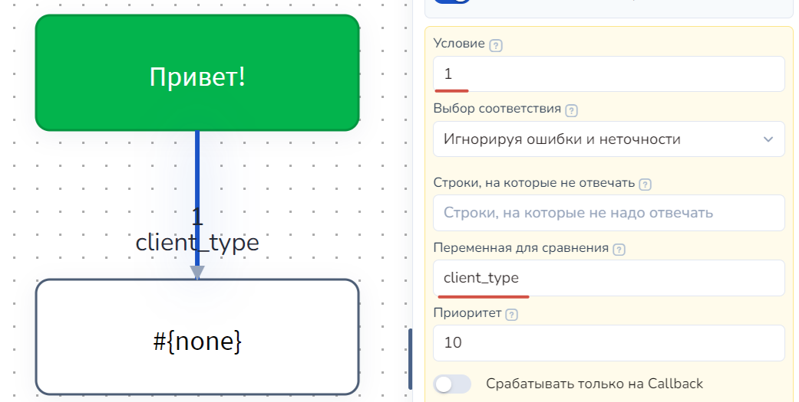
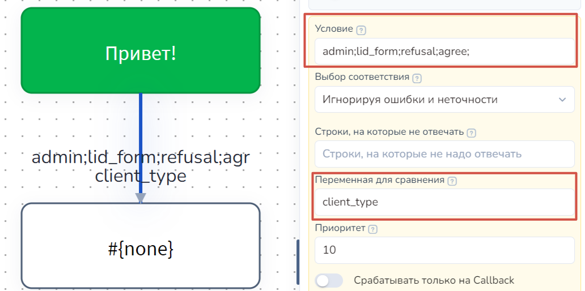
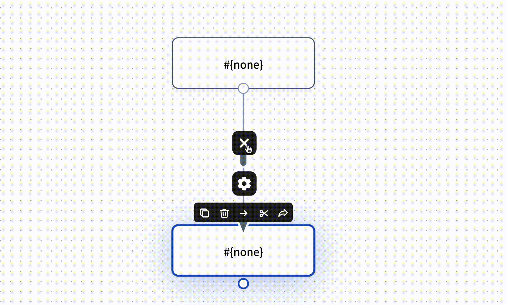

# Типы соединений (стрелок)

Перейдем к изучению основных типов стрелок, для этого рассмотрим пример на представленной ниже схеме. Здесь используются все виды стрелок:&#x20;

<figure><figcaption></figcaption></figure>

Давайте подробнее остановимся на основных видах стрелок.

### **Стрелка: с условием**

**Стрелка с условием -** это стрелки, переход по которым осуществляется, если выполнилось некое условие.&#x20;

<figure><figcaption></figcaption></figure>

Условие перехода может быть задано: \
\- по некоему слову (коллбэку) - задается **в поле Условие**, в нашем случае по нажатию кнопки НЕТ бот выдает сообщение "Удачного Вам дня!". Подробнее читать[ тут](/broken/pages/-M5QU0ZLA1A6QhyOaMzP)\
При этом могут быть заданы слова (коллбэки), на которые стрелка не должна реагировать (в основном используется, когда Условие пустое)\
\- по анализу на значение переменных - задается **в поле Переменная для сравнения**. Подробнее читайте[ тут](/broken/pages/-Lxp39EYXA5Zcp0bP4H_#peremennaya-dlya-sravneniya)

При этом есть возможность создания клавиатурных (reply) кнопок. Для этого достаточно указать в поле Условие текст для кнопки и включить ползунок **Отображать как кнопку**.

Также в условии стрелки можно прописать проверку для вводимого пользователем значения с помощью регулярного выражения:

<figure><figcaption></figcaption></figure>

А также использовать переменную для сравнения:

<figure><figcaption></figcaption></figure>

Однако в условии, в соответствии с лексическими правилами, вы не можете прописать несколько условий для сравнения по одной переменной:

<figure><figcaption>
Неверный ввод условия
</figcaption></figure>

Если вам необходимо проверять сразу несколько значений в условии, то воспользуйтесь операторами and (&&), or (||) и др.&#x20;


Подробнее о [сравнении переменных ](/broken/pages/-M6eUY-GrEk0DNnDsTl1)читайте в одноименной статье.




### Стрелка: без условия

**Стрелка без условия** - это такой тип стрелок, которые срабатывают на любой ответ клиента, что-то вроде альтернативного пути. \
Так, например, в нашей схеме такая стрелка выходит из блока с вопросом "Желаете оформить заказ?". Если клиент ответит что-то помимо "Да" или "Нет", сработает как раз стрелка без условия, и бот ответит: "Я не понял ваш ответ", а далее вновь спросит "Желаете оформить заказ?".


Стрелка без условия имеет приоритет выше, чем блок "Начало диалога". \
Если в вашей схеме, вам необходимо, чтобы блок отрабатывался первее, чем переход по стрелке, используйте блок "Первостепенная проверка условия".


### **Стрелка: с таймером**

**Стрелка с таймером** - это стрелки, переход по которым будет осуществлен через заданный промежуток времени. Отображаются они пунктирными линиями и отображается время заданной задержки. \
На нашей схеме несколько таких стрелок. Первая выходит из ярко-зеленого блока "Добрый день". На этой стрелке стоит задержка в 0 секунд. \
Принцип работы: после того как бот ответит клиенту "Добрый день", тут же вдогонку летит следующий вопрос "Желаете оформить заказ?".&#x20;

<figure><figcaption></figcaption></figure>

Итак, для того чтобы задать **задержку перед ответом**, заполните соответствующее поле в форме настроек. Таким же образом могут быть указаны конкретные дата и время отправки сообщения. Для этого следует заполнить **поля "Время отправки"**


Справа от поля "Задержка перед ответом" можно выбрать меру измерения "Секунды, минуты, часы, дни".



Если используете задержки и при этом условия на сравнение переменных, отключив "Отменить сообщения с таймером", то прописывайте в "Строки, на которые не отвечать" #{question}


<figure><figcaption></figcaption></figure>



### **Стрелка: со сбором данных**

**Стрелки со сбором данных с пользователей** - это стрелки без условия, но они "запоминают" ответы клиентов в указанную в настройках переменную. На конце этих стрелок ромб. \
**Принцип работы**: бот спрашивает клиента "Укажите свой номер телефона", клиент вводит номер, происходит переход по стрелке в следующий блок, при этом бот записывает в переменную ответ клиента. Данный тип стрелок можно использовать для сбора любых данных с клиентов (имя, город, район, метро и т.д.).

<figure><figcaption></figcaption></figure>

За необходимость сбора данных отвечает ползунок "**Пользователь вводит данные**" и в поле "Вводимые данные" вписываем название переменной, в которую бот запишет введенные клиентом данные. В нашем случае это "name":

<figure><figcaption></figcaption></figure>

Жмем готово. Стрелка создана.




ВАЖНО!&#x20;

Стрелка со сбором данных  работает БЕЗ ЗАДЕРЖКИ в настройках данной стрелки. Это значит, что бот будет ждать, пока пользователь ответит на этот вопрос.

Чтобы пользователи не останавливались надолго в блоке перед ответом на вопрос, продумайте логику воронки и[ добавьте догоняющее сообщение](https://docs.salebot.pro/kak-sdelat/faq#kak-otpravit-dogonyayushee-soobshenie), если нужно напомнить о себе. &#x20;


<figure><figcaption></figcaption></figure>

<figure><figcaption></figcaption></figure>

В завершении хотим упомянуть о том, что стрелки могут принимать любую форму ломанной линии. Для этого наведите мышь на стрелку, зажмите и потяните в сторону. Таким образом вы можете задать приятное и простое визуальное оформление своему проекту и никогда не запутаетесь в цепочке:

<figure><figcaption></figcaption></figure>

Чтобы удалить ненужный узел в стрелке, дважды кликните на этот узел левой кнопкой мыши либо на крестик, который появляется при наведении на стрелку:

<figure><figcaption></figcaption></figure>
