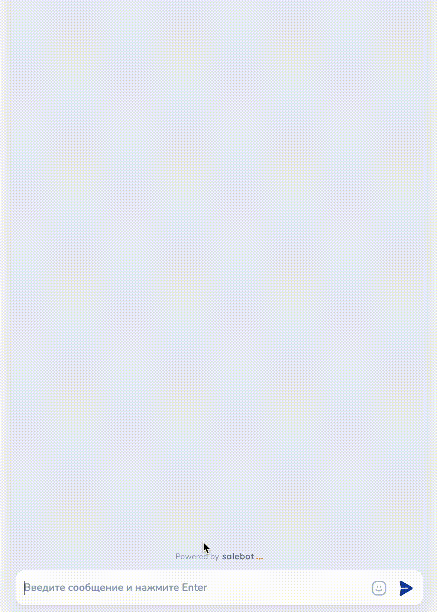

# Блоки не состояние


Ограничения по блокам:

1. Суммарный лимит в схеме не более 500 шт. для блоков с условием: Блок "Стартовое условие" + Блок "Не состояние" не должны в совокупности превышать 500 шт. в одном проекте.


Есть два типа блоков, в которые нельзя перейти:&#x20;

1. "Не состояние";
2. "Не состояние с условием".

Кстати, быстрый ответ - это "Не состояние с условием".&#x20;

"**Нельзя перейти**" - т.е. пользователь получит сообщение из этого блока, но при этом не выбьется из основной цепочки воронки.&#x20;

<figure><figcaption></figcaption></figure>

С помощью блоков "Не состояние" можно делать различного рода воронки с интересными предложениями, например, направлять эксклюзивные акции; при проверке валидности номера телефона или email клиента, выводить сообщение об ошибке и много чего другого.&#x20;


Подробнее об отправке эксклюзивных предложений с помощью рассылок или проверке валидности номера телефона [рассказали ниже. ](bloki-ne-sostoyanie.md#primer-proverki-dannykh)


## **Блок:** Не состояние с условием

Не состояние с условием - это темно-серый блок.

По своим функциям данный вид блока аналогичен блоку [Первостепенная проверка условия](/broken/pages/-LxaF6DgPjVFl2Gjvs6m#blok-pervostepennaya-proverka-usloviya) с той лишь разницей, что клиент в этот блок не попадает.

<figure><figcaption></figcaption></figure>


Приоритет этого блока, по сравнению с иными блоками с условием, минимальный - это значит он сработает в самую последнюю очередь.&#x20;


## **Блок:** Не состояние

Не состояние — это серый блок. У него нет условия как в блоке [Состояние диалога](/broken/pages/-LxaF6DgPjVFl2Gjvs6m#blok-sostoyanie-dialoga), но в него нельзя перейти.&#x20;

<figure><figcaption></figcaption></figure>


Из блоков без состояния можно делать стрелки с таймером или, например, для проверки валидности вводимых клиентов данных! Так как в блок нельзя перейти, а следовательно нельзя выйти.

С помощью блоков "Не состояние" можно запускать цепочки рассылок.


При запуске сообщения по таймеру отменяются другие сообщения с таймером. Для того чтобы они не отменялись, перейдите в настройки стрелки и снимите на стрелке переключатель  "Отменить сообщения с таймером"&#x20;

<figure><figcaption>
Переставить чекбокс "Отменить сообщения с таймером" в неактивное положение
</figcaption></figure>

<figure><figcaption></figcaption></figure>

### Пример работы с таймером

Схема чат-бота, которая наглядно продемонстрирует работу блока "Не состояние" в воронке:

<figure><figcaption></figcaption></figure>

Человек пишет "привет" и навсегда помещается в блок "Состояние", так как петля не дает ему выйти. Параллельно идет рассылка, которая не выбивает его из этого блока. И даже если клиент пишет какое-либо сообщение, всегда отправляется сообщение с зацикленной стрелкой, при этом клиент не переходит в блок "Не состояние":

<figure><figcaption></figcaption></figure>

### Пример проверки данных

С помощью блока "Не состояние" можно создавать валидацию (проверку) данных, которые отправляет клиент боту в сообщениях.

Сделать такую проверку можно с помощью регулярных выражений, а чтобы не делать зацикленные петли и не выбивать клиента при вводе невалидных данных, можно воспользоваться блоком "Не состояние".&#x20;


С помощью регулярных выражений можно проверить номера телефонов, электронную почту, дату и многое другое.&#x20;

Полный список регулярных выражений можно найти в статье "[Список полезных регулярных выражений](/broken/pages/-M0wjAtzg71YW7LB-2D8#spisok-poleznykh-regulyarnykh-vyrazhenii)".


В блоке, из которого ведут две стрелки, запрашивается номер телефона клиента (это может быть как номер телефона, так ФИО, email и пр.):

<figure><figcaption></figcaption></figure>

Из блока протянуты две стрелки: к блоку "Не состояние" и к блоку "Состояние":

<figure><figcaption></figcaption></figure>

Чтобы клиент дальше двигался по воронке при вводе валидного номера телефона, в стрелке, ведущей к блоку "Состояние", прописываем в условии регулярное выражение вида <mark style="color:yellow;">**^(+)?((\d{2,3}) ?\d|\d)((\[ -]?\d)|( ?(\d{2,3}) ?)){5,12}\d$**</mark>, а в выборе соответствия указывается "Регулярное выражение":&#x20;

<figure><figcaption></figcaption></figure>

Готово! Схема будет отрабатывать следующим образом: при переходе в блок с сообщением "Введите номер телефона", если клиент напишет что-то иное, он не сможет двигаться по воронке дальше из-за проверки на соответствие регулярному выражению, при этом каждый раз при вводе не номера телефона, будет приходить сообщение "Это не номер телефона":

<figure><figcaption></figcaption></figure>
