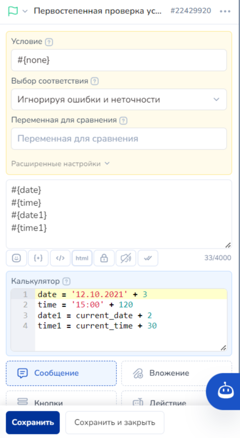
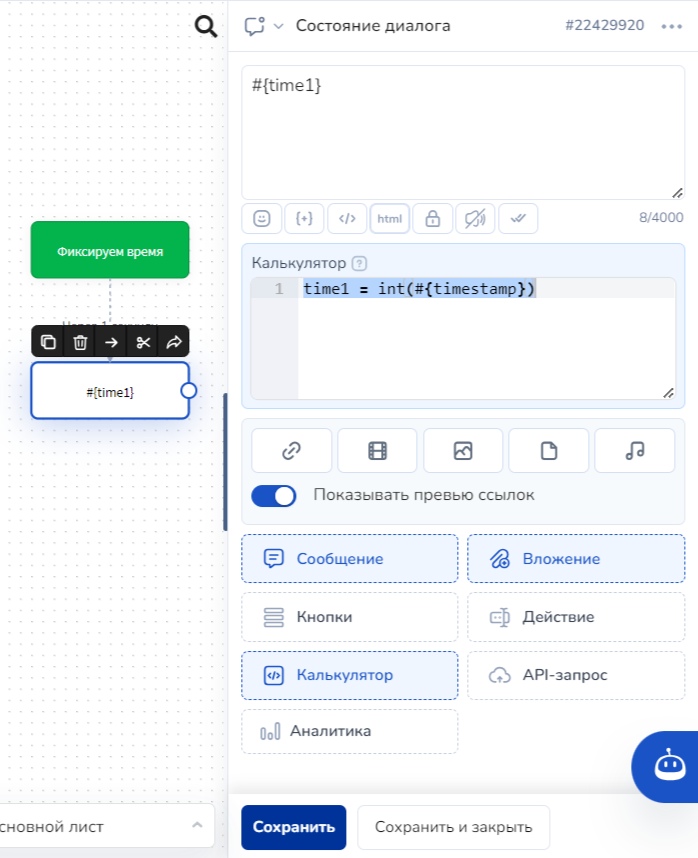
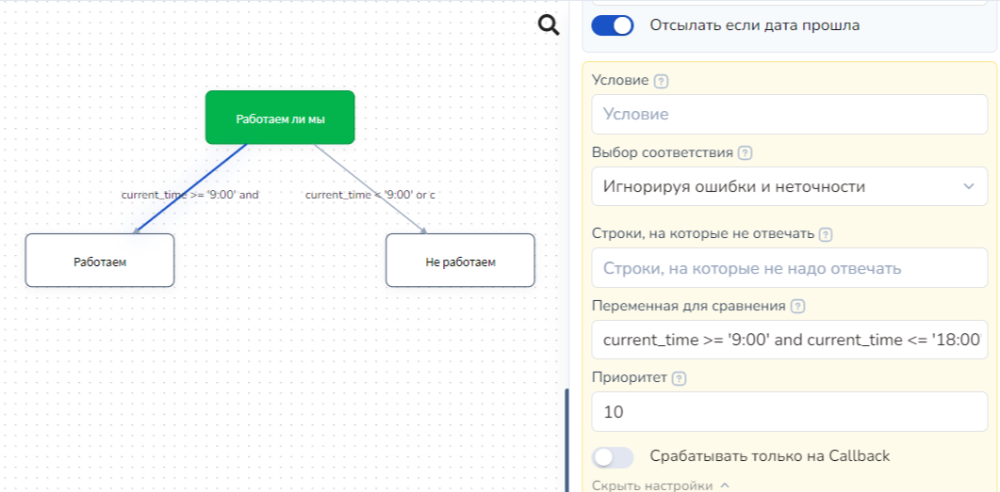

# Для работы с датами и временем


Salebot работает со следующими форматами ДАТЫ и ВРЕМЕНИ:

для дат -**"dd.mm.yyyy"**

для времени - **"HH:MM"**&#x20;


### Переменные

Для работы с датами и временем вы можете использовать следующие переменные:

**current\_date** - текущая дата в формате dd.mm.yyyy по часовому поясу проекта\
**next\_day** - завтрашняя дата в формате dd.mm.yyyy. Удобно для отправки сообщения завтра.\
**current\_time** - время в формате hh:mm по часовому поясу проекта\
**weekday** - день недели в виде числа, понедельник - 1, вторник -2

**Быстрый доступ к описаниям функций:**

* [прибавить ко времени время](dlya-raboty-s-datami-i-vremenem.md#kak-pribavit-ko-vremeni-vremya)
* [сравнить время](dlya-raboty-s-datami-i-vremenem.md#kak-sravnit-vremya)
* [задать временные интервалы](dlya-raboty-s-datami-i-vremenem.md#kak-zadat-vremennye-intervaly)
* [узнать сколько времени до дня D](dlya-raboty-s-datami-i-vremenem.md#kak-uznat-skolko-vremeni-ostalos-do-dnya-d)
* [узнать ближайший день рождения](dlya-raboty-s-datami-i-vremenem.md#kak-uznat-blizhaishii-den-rozhdeniya)
* [получить дату дня недели](dlya-raboty-s-datami-i-vremenem.md#kak-poluchit-datu-dnya-nedeli)
* [получить дату дня месяца](dlya-raboty-s-datami-i-vremenem.md#kak-poluchit-datu-dnya-mesyaca)
* [проверить попадание в рабочее время](dlya-raboty-s-datami-i-vremenem.md#kak-proverit-popadaniya-v-rabochee-vremya-ili-v-nerabochee)
* [конвертировать дату и время](dlya-raboty-s-datami-i-vremenem.md#kak-konvertirovat-datu-i-vremya)
* [видеоурок](dlya-raboty-s-datami-i-vremenem.md#videourok)

### Как прибавить ко времени время&#x20;


Сравнивать даты и время можно логическими операторами так же, как и числа.


**addYear() | addMonth() | addDays() | addMinutes()**



**addYear(дата,лет\_прибавить)** - для вычисления даты через сложение с учетом високосного года заданной даты и количества лет. Для вычитания используйте отрицательное число. &#x20;

**addMonth(дата, месяцев\_прибавить)** - для вычисления даты через сложение с учетом високосного года заданной даты и количества месяцев. Для вычитания используйте отрицательное число.&#x20;

**addDays(дата, дней\_прибавить) -** для прибавления к дате указанного количества дней. Для вычитания передайте отрицательное число. Пример: _addDays(current\_date, 20)_ или _addDays('20.08.2019', -99)_&#x20;

**addMinutes(время, минут\_прибавить)** прибавляет к указанному времени количество минут. Для вычитания передайте отрицательное число. Пример: _addMinutes(current\_time, 20)_ или _addMinutes('20:08', -30)_

**'дата' + дни** прибавляет к дате указанное количество дней

**'время' + минуты** прибавляет к дате указанное количество минут



Пример - прибавим к дате некое количество лет:

<figure><figcaption></figcaption></figure>

<figure><figcaption></figcaption></figure>

Пример - прибавим к дате некое количество месяцев:

<figure><figcaption></figcaption></figure>

<figure><figcaption></figcaption></figure>

Пример использования простого математического действия - сложения даты и дней, времени и минут:

<figure><figcaption></figcaption></figure>

.png>)



```
kol = 2 
data = '29.02.2020' 
x = addYear(data, kol) 
y = addYear('31.12.2021', -1*kol)


kol = 10 
data = '30.04.2019' 
x = addMonth(data, kol) 
y = addMonth('31.12.2020', -1*kol)

kol = 10 
data = '30.04.2019' 
x = addMonth(data, kol) 
y = addMonth('31.12.2020', -1*kol)
```



### Как сравнить время&#x20;



Сравнивать даты и время можно логическими операторами так же, как и числа:\
&#x20;больше >,    меньше < \
равно ==,     не равно != \
больше или равно >=, меньше или равно <=&#x20;

При этом условия сравнения можно связывать между собой логическими операциями и AND, или OR


**Условие сравнения должно быть логически верным**, т.е. нельзя строить условия по типу a == 1 and a != 1, так как число не может быть одновременно равно и не равно 1.


Записываются условия сравнения в поле Переменная для сравнения

<figure><figcaption><p>подраздел Условия в блоках с условиями и стрелках</p></figcaption></figure>

При указании условий сравнения в стрелке обязательно используйте задержки

<figure><figcaption></figcaption></figure>



`'01.09.2020'`` `_`< '11.10.2020'`_&#x20;

_`'11.10.2020' >=`_` ``current_date`

`current_date == date`

`current_time >= '18:00'`&#x20;

`current_time <= '21:00'`



### &#x20; Как задать временные интервалы



Очень удобная функция, позволяющая работать с временными интервалами, это:

**time\_interval('Время\_начало','Время\_конец')**

Результат выполнения функции логическое True или False&#x20;

Используйте функцию в блоках как условие в Переменной для сравнения или в Калькуляторе в IF()


Функция позволяет проверить вхождение **текущего времени** в заданный интервал




`time_interval('10:00','19:00') - проверка временного интервала с 10 утра до 7 вечера`

`time_interval('19:00','07:00') - проверка временного интервала с 7 вечера до 7 утра`

`time_interval('18.10.2021 10:00','25.10.2021 23:59:59') - проверка временного интервала между разными датами`  &#x20;

`time_interval('#{current_date} 10:00','#{date} 19:00') - проверка временного интервала, заданного с помощью переменных`


Разберем подробнее первый пример, дословно функция читается:

Если пользователь напишет слово "время" в период с 10 утра до 7 вечера, то условие истинно, иначе ложь.&#x20;

Таким образом,  можно реализовать разные ответы в зависимости от времени обращения клиента. Например, при попадании во временной интервал с 10 утра до 7 вечера клиент получит ответ "Вам скоро ответит менеджер", в другое время он получит в ответ "Сейчас менеджер не на месте, вам ответят в рабочее время с 10:00"

Запишем в поле "Калькулятор":

ответ = if(time\_interval('10:00','19:00'), "Вам скоро ответит менеджер", "Сейчас менеджер не на месте, вам ответят в рабочее время с 10:00")

а в поле Сообщение -  #{ответ}

<figure><figcaption><p>Настройка блока на типовой автоответчик</p></figcaption></figure>

<figure><figcaption><p>Тестируем функцию timeinterval()</p></figcaption></figure>



ответ = if(time\_interval('10:00','19:00'), "Вам скоро ответит менеджер", "Сейчас менеджер не на месте, вам ответят в рабочее время с 10:00")



### Как узнать сколько времени осталось до дня D

<figure><figcaption></figcaption></figure>

Для решения задачи сколько времени осталось до дня D:

Задаём дату и время момента, до которого считаем время:&#x20;

`date_D = 10.10.2021 time_D = 12:00`

Конвертируем в формат timestamp:&#x20;

`timestampD = convert_datetime("#{date_D} #{time_D}", "%d.%m.%Y %H:%M", "%s")`

Фиксируем текущее время в формате timestamp:&#x20;

`timestamp0 = #{timestamp}`

Округляем полученные значения до целого:&#x20;

`timeD = int(#{timestampD}) time0 = int(#{timestamp0})`

Вычисляем разницу в секундах:&#x20;

`time = timeD - time0`

Делим на количество секунд в сутках, и округляем полученное значение:&#x20;

`суток = time/86400`&#x20;

`дней = int(#{суток})`

Выясняем сколько секунд осталось от неполных суток:&#x20;

`c = дней*86400`&#x20;

`d = time - c`

Считаем сколько это в часах и округляем:

`e = d/3600 часов = int(e)`

Выясняем сколько секунд осталось от неполных часов:&#x20;

`g = часов*3600`&#x20;

`h = d - g`

Переводим это в минуты и округляем:&#x20;

`i = h/60`&#x20;

`минут = int(i)`

Выясняем сколько секунд осталось:&#x20;

`k = минут*60`&#x20;

`секунд = h - k`

И выводим время в поле Текст сообщения:

До старта осталось #{дней} дней #{часов} часов #{минут} минут и #{секунд} секунд

Код для вставки в калькулятор:

```
timestampD = convert_datetime("#{date_D} #{time_D}", "%d.%m.%Y %H:%M", "%s")
timestamp0 = #{timestamp}
timeD = int(#{timestampD})
time0 = int(#{timestamp0})
time = timeD - time0
суток = time/86400
дней = int(#{суток})
c = дней*86400
d = time - c
e = d/3600
часов = int(e)
g = часов*3600 
h = d - g
i = h/60 
минут = int(i)
k = минут*60 
секунд = h - k
```

Так же калькулятор поддерживает вычитание даты и времени без приведения типов. Например:

`'11.12.2021' - '8.12.2021'  вернет 3 (дня)`

`'11:12' - '3:45'  вернет 447 (минут)`

### Как узнать ближайший День рождения &#x20;

Для того, чтобы бот мог поздравить человека, можно использовать функцию:

**birthdate(дата)** - функция возвращает ближайший день рождения. На вход принимает дату рождения человека. Например: `напоминание = birthdate('28.04.1994')`&#x20;

### Как получить дату дня недели &#x20;

Если у вас периодичные рассылки по дням недели, вы можете получать дату дня недели, чтобы запланировать рассылку.

**weekday\_date(weekday, b)** - возвращает дату ближайшего дня недели.&#x20;

Принимает **два параметра**.\
<mark style="color:$success;">**weekday — день недели**</mark>, дату которого необходимо определить (от 1 до 7).\
<mark style="color:$success;">**b — параметр,**</mark> который показывает, **возвращать ли сегодняшнюю дату, если нужный день сегодня**. Второй параметр можно не указывать, по умолчанию False. Его значение давайте рассмотрим на примере:&#x20;

Допустим, вы настраиваете отправку сообщения в рассылке так, чтобы оно приходило именно в четверг. Но как же быть, если клиент только зарегистрировался в четверг? \
Отправлять ему сообщение в этот четверг или в следующий? \
Второй параметр False означает, что сообщение будет отправлено только в следующий четверг. \
Второй параметр True означает, что оно будет отправлено и в тот четверг, когда пользователь только зарегистрировался.

В нашем примере пользователь регистрируется в четверг 13.02.2020. И сообщение мы ему хотим отправить в следующий четверг. Значит, возвращаемое значение: "20.02.2020".

Например, `weekday_date(4)` вернет '20.02.2020'.

Если текущий день вам подходит только до определенного времени, то можно использовать такую конструкцию:\
`weekday_date(4, current_time < '13:00')`, где условие можно заменить на нужное вам.

<mark style="color:green;">**Вариант использования функции:**</mark>

<figure><figcaption><p>Пример использования функции в поле Дата отправки в стрелке(соединение блоков)</p></figcaption></figure>

### Как получить дату дня месяца &#x20;

Если у вас периодичные действия в определенный день месяца, вы можете получать дату для ближайшего дня месяца, чтобы запланировать рассылку.

**month\_date(date, b)** - возвращает ближайшую дату месяца на указанное в параметре число дня. Принимает **два параметра**. **Первый параметр date - число дня**, для которого необходимо определить ближайшую дату (от 1 до 31). **Второй параметр b** показывает, **возвращать ли сегодняшнюю дату, если нужный день сегодня**. Второй параметр можно не указывать, по умолчанию False.&#x20;

Если передать число 31, а в текущем месяце 30 дней, то функция вернет дату на 30 число.

Например, если сегодня 5.04.2022, а мы вызываем функцию t=month\_date(1), то в результате получим дату 01.05.2022.

### Как проверить попадание в рабочее или нерабочее время &#x20;

Допустим, компания работает с утра 9 до 6 вечера за исключением субботы и воскресенья.

Все рекомендуется делать по шагам.&#x20;

Сначала поставим проверку попадания в рабочее время:\
current\_time >= '9:00' **AND** current\_time <= '18:00' \
По аналогии НЕ рабочее время:\
current\_time < '9:00' **OR** current\_time > '18:00'

Дальше добавим проверку не написали ли нам в выходные, для этого нам понадобится weekday:\
weekday != 6 AND weekday != 7

Соединим вместе. Условие, что написали в рабочее время:\
current\_time >= '9:00' **AND** current\_time <= '18:00' **AND** weekday != 6 **AND** weekday != 7\
Противоположное условие, что написали НЕ в рабочее время:\
current\_time < '9:00' **OR** current\_time > '18:00' **OR** weekday == 6 **OR** weekday == 7

#### Пример

<figure><figcaption></figcaption></figure>

### Как конвертировать дату и время

Формат даты времени везде используется разный и, возможно, один из интегрированных ресурсов вернет время не в том формате, который понимает salebot. Вам нужно будет его конвертировать.&#x20;

**convert\_datetime(date, fin, f\_out) -** для конвертации даты и времени

3 параметра: строка даты, строка формата входной строки, строка формата результата. Пример: \
`convert_datetime("2011-11-03", "%Y-%m-%d", "%Y/%m/%d") на выходе будет 2011/11/03`

Данная функция конвертирует поступившую дату в timestamp.&#x20;

\#{current\_date} #{current\_time} - преобразовывается в "06.01.2025 11:45" - поскольку здесь нет информации о секундах и микросекундах, в результате после точки одни нули.

Пример: 1736144700.000000

Если вписать после точки милисекунды:

convert\_datetime("06.01.2025 19:26:35.123456", "%d.%m.%Y %H:%M:%S.%f", "%s.%f"), то и результат будет таким: 1736166395.123456

**get\_datetime(format)** - функция получения текущего времени в определенном формате. Функция принимает 1 параметр, а именно указание в каком формате вернуть время. \
\
<mark style="color:orange;">**Важно:**</mark> Ответ от функции придет на русском языке, если проект создан на salebot.pro, если же вы работаете в проекте на salebot.ai, то ответ придет на английском языке (Monday, Tuesday...)\
\
Пример:

`get_datetime("%A") на выходе будет Среда`

Описание параметров строки формата, параметры указываются в функции в кавычках:

<table data-header-hidden><thead><tr><th width="177.33333333333331">Директива</th><th>Значение</th><th>Пример</th></tr></thead><tbody><tr><td>Директива</td><td>Значение</td><td>Пример</td></tr><tr><td><code>%a</code></td><td>Сокращенное значение дня недели</td><td>Вс, Пн.. </td></tr><tr><td><code>%A</code></td><td>Полное название дня недели</td><td>Понедельник, Вторник, …, Воскресенье</td></tr><tr><td><code>%w</code></td><td>День недели как десятичное число, где 0 воскресенье и 6 суббота</td><td>0, 1, …, 6</td></tr><tr><td><code>%d</code></td><td>День месяца в виде десятичного числа с нулями</td><td>01, 02, …, 31</td></tr><tr><td><code>%b</code></td><td>Месяц как аббревиатура</td><td>янв, фев, …, дек</td></tr><tr><td><code>%B</code></td><td>Полное название месяца</td><td>января, февраля, марта и пр...</td></tr><tr><td><code>%m</code></td><td>Месяц в виде десятичного числа с нулями</td><td>01, 02, …, 12</td></tr><tr><td><code>%y</code></td><td>Год в виде двузначного числа</td><td>00, 01, …, 99</td></tr><tr><td><code>%Y</code></td><td>Четырехзначное значение года</td><td>0001, 0002, …, 2013, 2014, …, 9998, 9999</td></tr><tr><td><code>%H</code></td><td>Час (24-часовой формат) двузначное значение</td><td>00, 01, …, 23</td></tr><tr><td><code>%I</code></td><td>Час (12-часовой формат) двузначное значение</td><td>01, 02, …, 12</td></tr><tr><td><code>%p</code></td><td>Эквивалент AM или PM.</td><td>AM, PM (en_US);am, pm (de_DE)</td></tr><tr><td><code>%M</code></td><td>Минуты в двузначном формате</td><td>00, 01, …, 59</td></tr><tr><td><code>%S</code></td><td>Секунды в двузначном формате</td><td>00, 01, …, 59</td></tr><tr><td><code>%f</code></td><td>Микросекунды в шестизна</td><td>000000, 000001, …, 999999</td></tr><tr><td><code>%z</code></td><td>UTC offset in the form <code>±HHMM[SS[.ffffff]]</code> (empty string if the object is naive).</td><td>(empty), +0000, -0400, +1030, +063415, -030712.345216</td></tr><tr><td><code>%Z</code></td><td>Time zone name (empty string if the object is naive).</td><td>(empty), UTC, GMT</td></tr><tr><td><code>%j</code></td><td>Трезначное значение дня года</td><td>001, 002, …, 366</td></tr><tr><td><code>%U</code></td><td>Номер недели в году (воскресенье как первый день недели) в виде десятичного числа, дополненного нулями. Все дни нового года, предшествующие первому воскресенью, считаются нулевой неделей.</td><td>00, 01, …, 53</td></tr><tr><td><code>%W</code></td><td>Номер недели в году (понедельник как первый день недели) в виде десятичного числа. Все дни нового года, предшествующие первому понедельнику, считаются нулевой неделей.</td><td>00, 01, …, 53</td></tr><tr><td><code>%%</code></td><td>Символ <code>'%'</code></td><td>%</td></tr><tr><td><code>%s</code></td><td>timestamp</td><td>1607926200</td></tr></tbody></table>

Все остальные символы означают сами себя.


Получить текущий timestamp можно: **convert\_datetime("#{current\_date} #{current\_time}", "%d.%m.%Y %H:%M", "%s")**


### Вывод текущей даты в виде «dd название месяца» &#x20;

Чтобы вывести дату в виде "dd название месяца", воспользуйтесь функцией current\__date\_rus(). Она выведет сегодняшнюю дату в виде числа и названия месяца в родительном падеже, например, 3 апреля._

_Если Вам потребуется прибавить определенное количество дней к данной дате, следует вписать нужное количество дней в параметры функции._

_Например, если сегодняшняя дата - 3 апреля, тогда функция вернет:_\
_current\_date\_rus() - 3 апреля_\
_current\_date\_rus(2) - 5 апреля_\
_current\_date\_rus(-2) - 1 апреля_

### Вывод _заданной_ даты в виде «dd название месяца» &#x20;

Для вывода заданной даты в виде «dd название месяца» используйте функцию \
**date\_rus(date, num)**, где \
**date** - это дата в формате dd.mm.yyyy,которую необходимо перевести в вид  26 октября, например, 26.10.2022;\
**num** - количество дней, которые нужно отнять/прибавить.

Например, для даты 19.07.2022 функция вернет: \
date\_rus(‘19.07.2022’) - 19 июля \
date\_rus(‘19.07.2022’,2) - 21 июля \
date\_rus(‘19.07.2022’,-2) - 17 июля

## Видеогид


