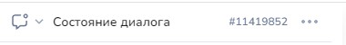
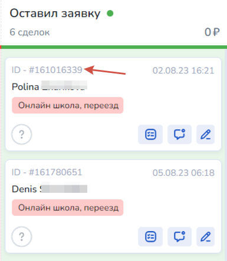
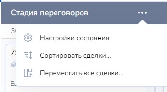

# Для работы с клиентами и CRM

## Для работы с клиентами

**was\_in\_state() | days\_from\_last\_message()** | **free**_**\_**_**client() | assign\_to**_**\_**_**user() | distribute\_client()| get\_operator**() | **get\_operator\_name**() | **delete\_pended\_messages() | set\_note() | add\_unread() | clear\_unread() |** unsubscribe()|block\_client() | unblock\_client() | set\_client\_name() | get\_bind\_clients() | get\_current\_pipline\_id()

<mark style="color:red;">**ОБОЗНАЧЕНИЯ:**</mark>



* &#x20;**was\_in\_state(message\_id)** – для проверки был ли клиент в выбранном состоянии(блоке). Номер блока можно взять из редактора:&#x20;




* **days\_from\_last\_message()** -  для определения количества дней с момента последней реплики клиента. Создана для проверки попадания в 24часовое окно.&#x20;

Пример: \
`d = days_from_last_message()`


Если с последнего сообщения клиента прошло более 30 дней, функция вернет число 9999


* **free**_**\_**_**client()** -  для снятия ответственного оператора Пример: `free_client()`
* **assign\_to\_user(email, only\_active)** -  для назначения диалога оператору, где:
* email - строка, необязательный параметр. Если указать только email, назначит диалог на указанного оператора независимо от статуса&#x20;
* only\_active - True или False, необязательный параметр. Если указано True, назначает диалог указанному оператору, только если он на смене

Примеры:

`assign_to_user()` - назначает диалог случайному оператору, который в данный момент находится на смене&#x20;

`assign_to_user('email оператора')` - назначает диалог оператору независимо от статуса

`assign_to_user('email оператора', True)` - назначает диалог указанному оператору, только если он на смене


* **distribute\_client() -** для назначения диалога оператору согласно настроек автораспределения. Пример:  `distribute_client()`


* **get\_operator**() -  для получения email ответственного оператора.&#x20;

Пример: `get_operator()`&#x20;

Можно использовать для постановки задачи ответственному и т.д. или проверки есть ли ответственный оператор. Если ответственного нет, то вернется None.


* **get\_operator\_name**() -  для получения имени ответственного оператора.&#x20;

Пример:  `get_operator_name()`&#x20;

Можно использовать для вывода информации клиенту. Если ответственного нет, то вернется None. Если у оператора не назначено имя, то вернется email.


* **delete\_pended\_messages()** -  для удаления всех запланированных сообщений для текущего клиента. По умолчанию удаляет и сообщения, созданные стрелками "Не отменять". Чтобы не отменять сообщения со стрелок "Не отменять" необходимо передать параметр False: `delete_pended_messages(False)`


* **set\_note(comment)** -  для добавления комментария к диалогу.&#x20;

Пример: **`set_note`**`('Переделать')`

* **add\_unread(count)** — для пометки непрочитанным диалога с клиентом

Параметр **count** можно не передавать или передать значение 1, тогда в диалоге с клиентом будет отметка +1 непрочитанное сообщение.

.png>).png>)

Если передать любое другое число оно отобразиться в разделе Клиенты как количество непрочитанных сообщений от клиента:

.png>)&#x20;

<figure><figcaption></figcaption></figure>

* **clear\_unread()** — для пометки диалога прочитанным
* **unsubscribe()** - функция для отмены подписки от сообщений бота.  [Пример рассмотрен в этой статье](https://docs.salebot.pro/rassylki-1/otpiska-klienta-ot-bota#kak-polnostyu-otpisat-ot-soobshenii) . У отписавшегося клиента появится символ -  красное сообщение с крестиком.

<figure><figcaption></figcaption></figure>

* **block\_client()** - заблокировать клиенту возможность писать в бота. Также будут отменены ранее запланированные сообщения от бота. Остается возможность писать клиенту из диалога в разделе Клиенты.

У заблокированного клиента появится отметка - красный замочек.

<figure><figcaption></figcaption></figure>

* **unblock\_client()** - разблокировать клиента. Клиент снова сможет контактировать с ботом, двигаться по цепочкам сообщений.&#x20;
* **set\_client\_name(name)** - изменить имя клиента. Передайте вместо name имя клиента, указав его в двойных кавычках. Можно использовать переменную, в которой записано имя клиента, следующим образом: \
  \- set\_client\_name("Виктор Викторович")
* **get\_bind\_clients()** - функция  без параметров, возвращает массив из id клиентов, привязанных к текущему клиенту.&#x20;
* **get\_current\_pipline\_id()** - функция без параметров, возвращает id воронки, в которой находится клиент. \
  Если сделка клиента в неразобранном - возвращает None&#x20;



## Для работы с задачами&#x20;


Функции работы с задачами возвращают статус выполнения операции **True или идентификатор задачи в случае успеха**. **В случае неудачи возвращается False или None.**



Salebot работает с датами в формате **"dd.mm.yyyy"**, а с временем в формате **"HH:MM"**&#x20;


**create\_task() | update\_task() | done\_task() | delete\_task()**



**create\_task(email, name, date\_srok, description, time\_srok)** – для создания задачи

Параметры:

<mark style="color:red;">**!**</mark>**&#x20;email** - еmail ответственного

<mark style="color:red;">**!**</mark>**&#x20;name** - название задачи

<mark style="color:red;">**!**</mark>**&#x20;date\_srok** - срок выполнения, дата

<mark style="color:red;">**!**</mark>**&#x20;description** - описание

**time\_srok** - срок выполнения, время


**update\_task(task\_id,email, name, date\_srok, description, time\_srok)** - для обновления задачи

Параметры:

<mark style="color:red;">**!**</mark>**&#x20;task\_id**- id задачи

<mark style="color:red;">**!**</mark>**&#x20;email** - еmail ответственного

<mark style="color:red;">**!**</mark>**&#x20;name** - название задачи

<mark style="color:red;">**!**</mark>**&#x20;date\_srok** - срок выполнения, дата

<mark style="color:red;">**!**</mark>**&#x20;description** - описание

**time\_srok** - срок выполнения, время


**done\_task(task\_id)**- для отметки задачи - выполнено

Параметры:

<mark style="color:red;">**!**</mark>**&#x20;task\_id**- id задачи


**delete\_task(task\_id)** – для удаления задачи

Параметры:

<mark style="color:red;">**!**</mark>**&#x20;task\_id**- id задачи





Создадим задачу оператору:

<figure><figcaption></figcaption></figure>

<figure><figcaption><p>Пункт меню Задачи</p></figcaption></figure>

Обновим срок исполнения и описание

<figure><figcaption><p>Обновление задачи</p></figcaption></figure>

<figure><figcaption><p>Задача после обновления</p></figcaption></figure>

Отметим как выполненную задачу

<figure><figcaption><p>Отмечаем задачу выполненной</p></figcaption></figure>

<figure><figcaption><p>Задача выполнена</p></figcaption></figure>

Удаление задачи

<figure><figcaption></figcaption></figure>



```
task_id=create_task('admin@salebot.pro', 'Test', '22.01.2023', 'тестовая задача', '08:00')
status=delete_task(task_id)
```



## Для работы со сделками&#x20;

**get\_order\_id() | create\_order()** **|** **set\_order\_name() |** **set\_order\_budget() | get\_active\_orders\_ids()  | get\_success\_orders\_ids() | get\_fail\_orders\_ids() | get\_order\_var()** | **get\_order\_vars() | set\_order\_var() | set\_order\_vars() | move\_order\_to\_next\_state()** | **set\_order\_status\_success()** | **set\_order\_status\_fail(order\_id)| get\_state\_id()** | **change\_state() |** get\_order\_id\_by\_var\_value() | latest\_order\_datetime() |  count\_client\_orders(), get\_count\_orders() | delete\_order(order\_id)



<mark style="background-color:blue;">**Получение идентификатора текущей сделки**</mark>

**get\_order\_id()** - вернет состояние сделки

<mark style="background-color:blue;">**Создание новой сделки**</mark>

**create\_order(name, budget, description, client\_name, phone, email, state\_id)**\
Текущая активная сделка в воронке вместе с переменными станет доступна только в функциях для работы со сделками и в CRM. \
\
**Параметры функции:** \
<mark style="color:red;">**!**</mark>**&#x20;name** - название сделки.  Необязательный параметр, если не передан, то применит к текущей активной сделке клиента

<mark style="color:red;">**!**</mark>**&#x20; budget** - стоимость сделки (число).  Необязательный параметр, если не передан, то применит к текущей активной сделке клиента\
Если передать в параметре **budget** не число, функция вернет ответ: **'budget must be a number'**

**description** - Описание сделки. Необязательный параметр;

Дополнительные параметры для создания клиента:

**client\_name** - (необязательный параметр) строка, имя для нового клиента

**phone** - (необязательный параметр)  строка, телефон для нового клиента

**email** - (необязательный параметр)  строка, емейл для нового клиента

Для создания клиента должна быть указана переменная phone или email. Если указана phone, и клиента с таким телефоном в проекте нет, то будет создан новый.

Если указана переменная email без переменной phone, и клиента в проекте с таким адресом нет, будет создан новый.

Дополнительный параметр:

**state\_id** - число, позволяет указать состояние, в котором будет сделка после создания, необязательный параметр

<mark style="background-color:blue;">**Добавить или изменить название сделки**</mark>

**set\_order\_name(name, order\_id)**

**name** - ❗обязательный параметр,строковое значение. Название сделки

**order\_id** - не обязательный, если не передан, то применит к текущей активной сделке клиента


<mark style="background-color:blue;">**Добавить или изменить бюджет сделки**</mark>

**set\_order\_budget(budget, order\_id)**

**budget** -❗обязательный параметр, число. Стоимость сделки

**order\_id** - не обязательный, если не передан, то применит к текущей активной сделке клиента

Для корректной работы order\_id:

1. Либо вписывать вручную: брать id из сделки и писать как параметр функции, если нужна конкретная сделка

<figure><figcaption></figcaption></figure>

2. Либо получать через функцию get\_order\_id(), потому что встроенная переменная order\_id возвращает ответ в виде {client\_id}-{order\_id}, что приводит к некорректной работе.

<mark style="background-color:blue;">**Получение списка активных сделок**</mark> \
(исключая архивные\*, успешные или проваленные сделки)

**get\_active\_orders\_ids()**&#x20;


<mark style="background-color:blue;">**Получение списка идентификаторов успешных сделок**</mark>

**get\_success\_orders\_ids()**&#x20;


<mark style="background-color:blue;">**Получение списка идентификаторов проваленных сделок**</mark>

**get\_fail\_orders\_ids()**


<mark style="background-color:blue;">**Получение значения переменной сделки**</mark>

**get\_order\_var(order\_id, variable)**&#x20;

Параметры:

<mark style="color:red;">**!**</mark>**&#x20;order\_id** - идентификатор сделки&#x20;

<mark style="color:red;">**!**</mark>**&#x20;variable** - имя переменной, значение которой необходимо получить


<mark style="background-color:blue;">**Получение данных сделки**</mark>

**get\_order\_vars(order\_id, names)**&#x20;

Параметры:

<mark style="color:red;">**!**</mark>**&#x20;order\_id** - идентификатор сделки

**names** - массив переменных, данные которых необходимо получить. Если не указан, то функция вернет все данные указанной сделки

Функция возвращает словарь с переменными, перечисленными в массиве **names**,  для сделки **order\_id.** Если names не указано, то функция вернет словарь всех переменных указанной сделки


<mark style="background-color:blue;">**Добавление переменной сделки**</mark>

**set\_order\_var(order\_id, variable, value)**

Параметры:

<mark style="color:red;">**!**</mark>**&#x20;order\_id** - идентификатор сделки&#x20;

<mark style="color:red;">**!**</mark>**&#x20;variable** - имя переменной, которую будем добавлять в сделку&#x20;


Если вы хотите изменить параметры "название" или "описание" сделки, используйте значения "Название" или "Описание"


<mark style="color:red;">**!**</mark>**&#x20;value** - значение переменной


<mark style="background-color:blue;">**Добавление нескольких переменных сделки**</mark>

**set\_order\_vars(order\_id, variables\_dict)**&#x20;

Параметры:

<mark style="color:red;">**!**</mark>**&#x20;order\_id** - идентификатор сделки.&#x20;

<mark style="color:red;">**!**</mark>**&#x20;variables\_dict** - словарь переменных


<mark style="background-color:blue;">**Перенос на следующий этап воронки**</mark>

**move\_order\_to\_next\_state(order\_id)**&#x20;

Параметры:

**order\_id** - идентификатор сделки. Если параметр не указан, то будет перемещена текущая активная сделка

Порядок состояний сделки устанавливается в соответствии с заданным порядком в SalebotCRM

<figure><figcaption><p>Порядок состояний сделки в SalebotCRM</p></figcaption></figure>


<mark style="background-color:blue;">**Получение id состояния воронки в SalebotСRM**</mark>

**get\_state\_id(client\_id, order\_id)** \
Также id состояния воронки можно скопировать в Настройках состояния

<figure><figcaption><p>Настройки состояния</p></figcaption></figure>

Параметры:

**order\_id -** id сделки клиента

Можно с параметром **order\_id** или без него если нет **order\_id** , то вернет **id** состояния в воронке по текущей сделке.

Также для корректной работы order\_id:

1. Либо вписывать вручную: брать id из сделки и писать как параметр функции, если нужна конкретная сделка

<figure><figcaption></figcaption></figure>

2. Либо получать через функцию get\_order\_id(), потому что встроенная переменная order\_id возвращает ответ в виде {client\_id}-{order\_id}, что приводит к некорректной работе.

<mark style="background-color:blue;">**Перемещение лида по воронке SalebotCRM по id состояния**</mark>

**change\_state(state\_id, order\_id)**&#x20;

Параметры:

<mark style="color:red;">**!**</mark> **state\_id -** id состояния воронки

**order\_id (** не обязателен) -  id сделки, которую перемещаем по воронке

Если не передать, то переместит текущую активную сделку.


<mark style="background-color:blue;">**Получение id сделки по названию и значению параметра**</mark>

get\_order\_id\_by\_var\_value(var\_name, var\_value, client\_id)

Параметры:

<mark style="color:red;">!</mark> var\_name - название переменной;

<mark style="color:red;">!</mark> var\_value - значение переменной;

client\_id - идентификатор клиента сделки, необязательный, по умолчанию - id клиента в боте;


<mark style="background-color:blue;">**Получение времени последней сделки**</mark>

latest\_order\_datetime(client\_id, dt\_fmt)

Параметры:

client\_id - идентификатор клиента сделки, необязательный,  по умолчанию - id клиента в боте;

df\_fmt - формат возвращаемых даты и времени, необязательный, по умолчанию -  "%d.%m.%y %H:%M"

<mark style="background-color:blue;">**Получение числа сделок клиента**</mark>

count\_client\_orders(client\_id, state\_id, get\_all, active)

Параметры:\
client\_id -  идентификатор клиента сделки, необязательный, по умолчанию - id клиента в боте;

state\_id - id состояния сделок в воронке, необязательный;

get\_all - индикатор фильтрации по параметру active, необязательный, по умолчанию - 1 (единица), то есть фильтрация по active отключена;

active - параметр для фильтрации активных сделок, используется только когда get\_all равно 0 (ноль), по дефолту 1 (единица), т.е. возвращает только активные сделки;

<mark style="background-color:blue;">**Получение количества заявок в определенном состоянии сделки**</mark>

get\_count\_orders(id) - функция, которая позволяет выгрузить количество заявок, находящихся в определенном состоянии воронки по id сделки.&#x20;

Функция принимает один параметр:

<mark style="color:red;">**!**</mark> id - идентификатор (айди) состояния сделки.&#x20;

Пример использования функции:

<figure><figcaption></figcaption></figure>

Идентификатор состояния можно найти в настройках.

Далее необходимо прописать функцию в калькуляторе следующим образом:

<figure><figcaption></figcaption></figure>

При тестировании бота ответ бота будет состоять из количества сделок, находящихся в передаваемом значении в функции:


<figure><figcaption></figcaption></figure>

<mark style="background-color:blue;">**Удаление сделки**</mark>

delete\_order(order\_id) — удаление сделки в SalebotCRM.&#x20;

order\_id - необязательный параметр. Нужно указать, если необходимо удалить конкретную сделку по id. Если не указывать, удалит последнюю сделку.&#x20;



Все функции просты в своем применении.\
Например, создадим новую сделку, отправим ее номер клиенту:<br>

<figure><figcaption><p>Создание новой сделки</p></figcaption></figure>

<figure><figcaption><p>Регистрация обращения клиента</p></figcaption></figure>

Вы можете получить идентификатор текущей активной сделки клиента, используя функцию get\_order\_id(), или весь перечень сделок клиента, используя get\_active\_orders\_ids()

<figure><figcaption><p>Получение идентификатора текущей активной сделки</p></figcaption></figure>

<figure><figcaption><p>Получение списка активных сделок</p></figcaption></figure>

Зная идентификатор сделки, мы можем назначать, получать переменные:

<figure><figcaption><p>Назначение и получение переменных</p></figcaption></figure>



```
/* Создание сделки */
oid = create_order()

/*Получение ид сделки клиента*/
oid = get_order_id()

/*Получение списка активных сделок*/
res = get_active_orders_ids()

/*Добавление/получение переменных сделки*/
res = set_order_var('40630', 'обновлено', '#{current_date}')

vars = {"VAR1": "V111", "VAR2": "V222"}
res2 = set_order_vars('40630', vars)

ovar = get_order_vars('40630')
```



### <mark style="background-color:blue;">**Установка метки успешной сделки**</mark>&#x20;

**set\_order\_status\_success()**



**set\_order\_status\_success(order\_id)**&#x20;

Параметры:

**order\_id** - идентификатор сделки. Если параметр не указан, то метка будет установленная для текущей активной сделки



### <mark style="background-color:blue;">**Установка метки проваленной сделки**</mark>&#x20;

**set\_order\_status\_fail()**



**set\_order\_status\_fail(order\_id)**&#x20;

Параметры:

**order\_id** - идентификатор сделки. Если параметр не указан, то метка будет установленая для текущей активной сделки



### <mark style="background-color:blue;">**Установка метки архивной сделки**</mark> &#x20;

**set\_order\_status\_archive()**&#x20;



**set\_order\_status\_archive(order\_id)**&#x20;

Параметры:

**order\_id** - идентификатор сделки. Если параметр не указан, то метка будет установлена для текущей активной сделки



/\*Отправить текущую активную сделку в архив\*/

`res_arh = set_order_status_archive()`


