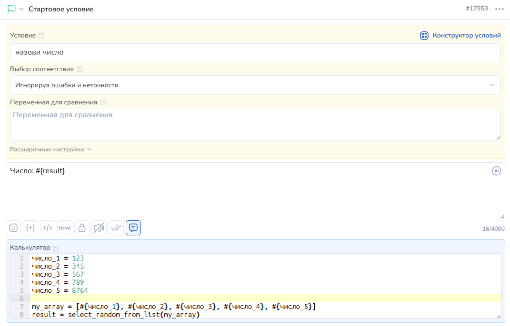
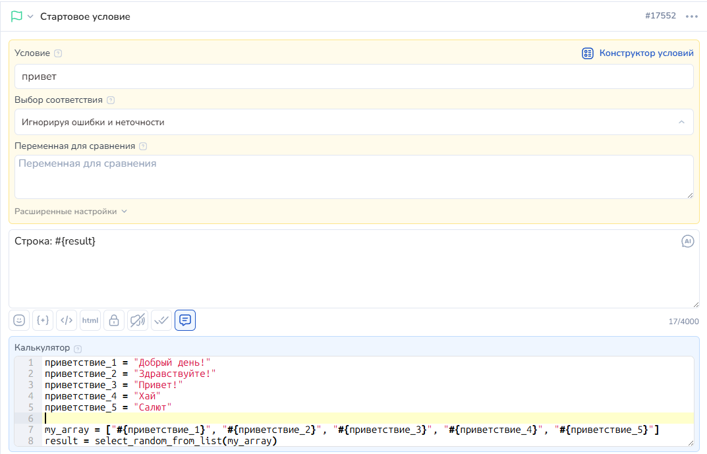

# Для работы со строками

**substring() | endswith() | startswith() | contains() | len() | concat() | splitter() | lower() | upper() | strip() | capitalize() | title() | normalizePhone() | replace() | base64() | base64decode() |  urlencode() | urldecode() | hmac\_hexdigest() | tg\_escape() | select\_random\_from\_list()**

<mark style="color:red;">**ОБОЗНАЧЕНИЯ:**</mark>

<mark style="color:red;">**!**</mark> - Обязательные параметры



**substring(str, n1, n2)** -  для обрезки строки.&#x20;

Параметры:\
<mark style="color:red;">**!**</mark> **str** - исходная строка\
<mark style="color:red;">**!**</mark> **n1** - количество символов для обрезки слева (> 0)\
**n2** - количество символов для обрезки справа (< 0)

**endswith(str, substr)** - для проверки, заканчивается строка заданной подстрокой или нет.&#x20;

Параметры:\
<mark style="color:red;">**!**</mark> **str** - исходная строка ("где ищем")\
<mark style="color:red;">**!**</mark> **substr** - строка поиска ("что ищем")

**startswith(str, substr)** - для проверки, начинается строка заданной подстрокой или нет. Параметры:\
<mark style="color:red;">**!**</mark> **str** - исходная строка ("где ищем")\
<mark style="color:red;">**!**</mark> **substr** - строка поиска ("что ищем")

**contains(str, substr,registr)** – для проверки, входит ли вторая строка в первую.&#x20;

Параметры:\
<mark style="color:red;">**!**</mark> **str** - исходная строка ("где ищем")\
<mark style="color:red;">**!**</mark> s**ubstr** - строка поиска ("что ищем")\
**registr** - признак, нужно ли учитывать регистр (False - учитывать регистр не надо)

**len(str)** – для подсчета количества символов в строке.&#x20;

Параметры:\
<mark style="color:red;">**!**</mark> **str** - исходная строка

**concat(str1, str2)** – для конкатенации (сложения) строк, переданных в параметрах.\
Параметры:\
<mark style="color:red;">**!**</mark> **str1** - строка 1\
<mark style="color:red;">**!**</mark> **str2** - строка 2

**splitter(str, s, n)** -  для разделения строки на части. Функция возвращает массив элементов.\
Параметры:\
<mark style="color:red;">**!**</mark> **str** - исходная строка\
<mark style="color:red;">**!**</mark> **s** - разделитель строки\
**n** - максимальное количество элементов

**lower(str)** – для приведения строки к нижнему регистру.\
Параметры:\
<mark style="color:red;">**!**</mark> **str** - исходная строка

**upper(str)** -  для приведения строки в верхний регистр.\
Параметры:\
<mark style="color:red;">**!**</mark> **str** - исходная строка

**strip(str)** -  для обрезки пробелов по краям строки.\
Параметры:\
<mark style="color:red;">**!**</mark> **str** - исходная строка

**capitalize(str)** -  для замены первого символа строки на тот же символ верхнего регистра (пишет слова с большой буквы).\
Параметры:\
<mark style="color:red;">**!**</mark> **str** - исходная строка

**title(str)** - приведение каждого слова в строке str к виду: первая буква заглавная, остальные - строчные.\
Параметры:\
<mark style="color:red;">**!**</mark>**&#x20;str - исходная строка.**

**normalizePhone(str)** -  для приведения номера телефона к стандартному виду. Убирает все кроме цифр и, если телефон начинается с 8, меняет ее на 7. \
Параметры:\
<mark style="color:red;">**!**</mark> **str** - исходная строка с номером телефона

**replace(str, s1, s2, n)** -  для замены подстроки в строке на другую подстроку. \
Параметры:\
<mark style="color:red;">**!**</mark> **str** - исходная строка\
<mark style="color:red;">**!**</mark> **s1** - подстрока, которую будем менять\
<mark style="color:red;">**!**</mark> **s2** - подстрока, на которую будем менять\
**n** - количество замен

**base64(str)** – для кодировки строки в формате base64\
Параметры:\
<mark style="color:red;">**!**</mark> **str** - исходная строка

**base64decode(str)** -  для декодировки base64 в строку\
Параметры:\
<mark style="color:red;">**!**</mark>**&#x20;str** - исходная строка

**urlencode(str) -**  для кодировки строки, чтобы ее можно было передавать по http.\
Параметры:\
<mark style="color:red;">**!**</mark>**&#x20;str** - исходная строка

Например: _Ivan Ivanovich_ станет _Ivan%20Ivanovich_, а _Anna\&Maria_ станет _Anna%26Maria_

**urldecode(str)** - для декодировки строки url. \
Параметры:\
<mark style="color:red;">**!**</mark>**&#x20;str** - исходная строка

Например: Ivan%20Ivanovich будете переведено в Ivan Ivanovich

**hmac\_hexdigest(secret\_key, msg, hash\_type)** - для шифрования строки 'sha256', 'md5', 'sha512' или 'sha1'\
Параметры:\
<mark style="color:red;">**!**</mark> secret\_key - ключ\
<mark style="color:red;">**!**</mark>  msg - строка для шифрования\
<mark style="color:red;">**!**</mark>  hash\_type - тип шифрования ( 'sha256', 'md5', 'sha512' или 'sha1')

**select\_random\_from\_list(array) - возвращает случайный элемент из списка.**

<mark style="color:red;">**!**</mark> array - список элементов. Обязательный параметр.

**tg\_escape(str)** - для экранирования переменной и вывода ее в сообщении Telegram с включенной разметкой. Функция ставит слеш перед перечисленными символами: '\_', '\*', '\[', ']', '(', ')', '\~', '\`', '>', '#', '+', '-', '=', '|', '{', '}', '.', '!'\
Параметры:\
<mark style="color:red;">**!**</mark> **str** - исходная строка



Разберем функцию обрезки строки:

<figure><figcaption></figcaption></figure>

<figure><figcaption></figcaption></figure>

Определяем длину строки:

<figure><figcaption></figcaption></figure>

<figure><figcaption></figcaption></figure>

Очень часто при работе с таблицами нужна функция деления строки на части:

<figure><figcaption></figcaption></figure>

Обработка номера телефона:

<figure><figcaption></figcaption></figure>

Замена подстроки в строке

<figure><figcaption></figcaption></figure>

**Использование**

**select\_random\_from\_list(array) - возвращает случайный элемент из списка.**

<mark style="color:red;">**!**</mark> array - список элементов. Обязательный параметр.

Примеры использования:

Пример1. Выбор случайного числа из списка чисел.

число\_1 = 123\
число\_2 = 345\
число\_3 = 567\
число\_4 = 789\
число\_5 = 8764

my\_array = \[#{число\_1}, #{число\_2}, #{число\_3}, #{число\_4}, #{число\_5}]

result = select\_random\_from\_list(my\_array)

<figure><figcaption></figcaption></figure>

<figure><figcaption></figcaption></figure>

Пример 2: Выбор случайной строки из списка.\
приветствие\_1 = "Добрый день!"\
приветствие\_2 = "Здравствуйте!"\
приветствие\_3 = "Привет!"\
приветствие\_4 = "Хай"\
приветствие\_5 = "Салют"

my\_array = \["#{приветствие\_1}", "#{приветствие\_2}", "#{приветствие\_3}", "#{приветствие\_4}", "#{приветствие\_5}"]

result = select\_random\_from\_list(my\_array)

Если работаем со строками - важно, чтобы передаваемые в список переменные были дополнительно обернуты в кавычки.

<figure><figcaption></figcaption></figure>

<figure><figcaption></figcaption></figure>



```
/*Разбираем substring()*/
text = 'тескт для обрезки'
a=substring(text, 4)
a1=substring(text, -4)
b=substring(text, 4, 6)
b1=substring(text, 0, 6)
c=substring(text, 0, -4)
d=substring(text, 4, -4)

/*работаем с len()*/
text = 'тескт для обрезки'
a=len(text)
b=len("как прекрасен этот мир!")

/*делим строку на части*/
elements = splitter('s, W, q', ',')
text='text1:text2:text3:text4:text5'
texts = splitter(text, ':',2)

/*title()*/
фио = петров аНАтолий ИваноВич
фио = title("#{фио}")

/*обработка номера телефона*/
phone=normalizePhone("+7978-999-99-99")

/*замена подстроки в строке*/
a=replace("wwww2222ww", "w", "e", 1)
```



