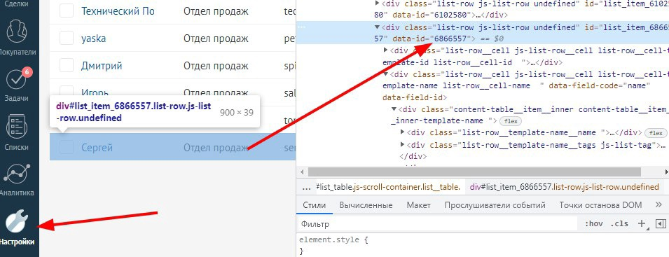

# Функции (API) в калькуляторе


<mark style="color:red;">\*</mark>На территории Российской Федерации <mark style="color:red;">запрещена деятельность</mark> социальных сетей <mark style="color:red;">Facebook</mark> и <mark style="color:red;">Instagram</mark>, принадлежащих компании Meta Platforms Inc., признанная экстремистской!



Функции API работают только на тарифах "Бизнес" и "Инфобиз".


## API Salebot

<mark style="color:red;">**ОБОЗНАЧЕНИЯ:**</mark>\ <mark style="color:red;">**!**</mark> - Обязательные параметры

### Как отправить Callback


Callback можно отправить только ДРУГОМУ клиенту.&#x20;

СЕБЕ отправить callback НЕЛЬЗЯ!&#x20;




**callback(client\_id, callback\_message)**

Параметры:

<mark style="color:red;">**!**</mark>**&#x20;client\_id** - идентификатор клиента

<mark style="color:red;">**!**</mark>**&#x20;callback\_message** - текст сообщение в колбеке



Колбек - в программировании это функция, предназначенная для отложенного выполнения.  То есть это отправка сообщения, которое бот распознает как команду для исполнения. Клиент при этом не видит данное сообщение, оно видно только в карточке клиента.

Отправим колбек клиенту с client\_id=73704021

<figure><figcaption><p>Блок с условием - отправка колбека клиенту</p></figcaption></figure>

Скрин карточки клиента:

<figure><figcaption><p>Полученный клиентом колбек</p></figcaption></figure>

Далее просто настраиваем реакцию на данный колбек в блоке с условием.



```
callback('73704021', 'callback TEST123')
```



### Как отправить Callback в Telegram



**tg\_callback(platform\_id , callback\_message,group\_id, business\_connection\_id)**

Параметры:

<mark style="color:red;">**!**</mark>**&#x20;platform\_id** - идентификатор клиент Telegram

<mark style="color:red;">**!**</mark>**&#x20;callback\_message** - текст сообщение в колбеке

&#x20;**group\_id** - идентификатор бота Telegram

**tg\_business -** для работы с бизнес-клиентами, передается значение "1".








```
tg_callback('73704021', 'callback TEST123')
```




Разбор функции callback()




### **Как в реакции на callback-кнопку добавить переход в бота с тэгом**

**tg\_callback\_url\_open(callback\_query\_id, url)**

Параметры: \
<mark style="color:red;">**!**</mark>**&#x20;callback\_query\_id** - данный id позволяет идентифицировать нажавшего кнопку и продемонстрировать ему Alert-уведомление,\
<mark style="color:red;">**!**</mark>**&#x20;url** - URL-адрес, указывающий бота и параметр (выглядит так: t.me/your\_bot?start=XXXX, вместо your\_bot - имя бота)

### **Как отправить клиенту сообщение**

**message() | platform\_message() | whatsapp\_message()**


Чтобы в переменную записать текст с переносами строк, укажите значение следующим образом:

`text = "Текст первой строки" + "\n" + "Текст второй строки" + "\n" +"Третья строка"`




**message(client\_id, text, message\_id, timeout)**

Параметры:\
<mark style="color:red;">**!**</mark>**&#x20;client\_id** - идентификатор клиента\
<mark style="color:red;">**!**</mark>**&#x20;text** - текст сообщения\
**message\_id** - идентификатор блока. Если оставить поле text пустым (''), а этот параметр заполнить, то клиенту будет отправлен текст из указанного блока.&#x20;

_Обратите внимание, если в функции message передать параметр message\_id , блок все равно отработается полностью, а клиент, которого вы указали в client\_id, будет перемещен в блок, который вы передали в параметре message\_id_&#x20;

\
**timeout** - время отправки или задержки.  Если нужно отправить сообщение с задержкой, можно указать время: \
а) задержка в секундах до 3600 секунд. Если указано большее количество секунд, то сообщение отправится через час, если указано отрицательное число, сообщение отправится мгновенно. Например, timeout = 50. \
б) дату отправки в виде дд.мм.гггг чч:мм, например: timeout = ‘03.04.2022 15:00’. Если указать уже прошедшее время, то сообщение отправится мгновенно.

**platform\_message(platform\_id, text, client\_type,  message\_id, timeout,group\_id)**

Параметры:\
<mark style="color:red;">**!**</mark>**&#x20;platform\_id** - идентификатор клиента в мессенджере\
<mark style="color:red;">**!**</mark>**&#x20;text** - текст сообщения\
**client\_type -** тип мессенджера, необязательный параметр. Если не указан, то клиента будут искать в том же мессенджере, из которого бот отправляет сообщение. Если указан, то клиент будет найден среди базы данных указанного мессенджера. Используемые типы мессенджеров можно найти [тут](https://docs.salebot.pro/peremennye-1/peremennye#znacheniya-client_type). \
**message\_id** - идентификатор блока. Если указан, то клиент получит сообщение из указанного блока, а не значение из text.  \
**timeout** - время отправки или задержка. Аналогичен одноименному параметру функции message()\
**group\_id** - идентификатор бота

**whatsapp\_message(phone, text, message\_id)**

Параметры:\
<mark style="color:red;">**!**</mark>**&#x20;phone**- номер телефона клиента, на котором зарегистрирован Whatsapp\
<mark style="color:red;">**!**</mark>**&#x20;text** - текст сообщения\
**message\_id** - идентификатор блока. Если оставить поле text пустым (''), а этот параметр заполнить, то клиенту будет отправлен текст из указанного блока.&#x20;


К проекту должен быть подключен Whatsapp-бот




Простой пример отправки сообщения по client\_id:

<figure><figcaption><p>Отправка сообщения по client_id</p></figcaption></figure>

Разные варианты отправки сообщения по client\_id:

<figure><figcaption><p>Разные варианты отправки сообщения</p></figcaption></figure>

Пример отправки сообщения через platform\_message():

<figure><figcaption></figcaption></figure>



```
/*Отправка сообщения по client_id*/
message(73704021, 'Текст сообщения для клиента')
/*Отправка сообщения по client_id с задержкой в 30 секунд*/
message(73704021, 'Привет! Спасибо, что написал.','',30)
/*Отправка сообщения из блока 3190 по client_id 03.04.2022 в 15:00*/
message(73704021, '',3190, '03.04.2022 15:00')

/*Отправка сообщения в Whatsapp*/
whatsapp_message('79999999999', 'Текст сообщения для клиента')
```




Разбор функции message()



Разбор функций platform\_message() и whatsapp\_message()




### Получение client\_id по значению platform\_id

get\_client\_id\_by\_platform\_i&#x64;**()**



**get\_client\_id\_by\_platform\_id(client\_type, platform\_id , group)**&#x20;

При выполнении функция вернет client\_id, если найдет клиента по заданным условиям, иначе вернет None.

<mark style="color:red;">**!**</mark> **client\_type** - мессенджер. Значение client\_type [посмотрите в этой статье. ](https://docs.salebot.pro/peremennye-1/peremennye#znacheniya-client_type)

<mark style="color:red;">**!**</mark> **platform\_id** - ID клиента в указанном мессенджере.

**group** - обязательный, если подключено более одного бота для мессенджера.


Если в проекте подключено несколько мессенджеров одного типа, то искать будет по всем подключенным данного типа.

Рекомендуем в этом случае передавать параметр group




### Функции для get-запросов

requests\_get(url, answer\_type, headers, params, auth, proxy)&#x20;



<mark style="color:red;">**!**</mark>**&#x20;url** - ссылка, по которой делается запрос,&#x20;

**answer\_type** - необязательный параметр, указание, что из ответа сервера нужно вернуть ('status' - вернет код статуса ответа; 'json' - вернет json из ответа; 'text' - вернет текст ответа сервера, любой иной вариант включая вариант по умолчанию вернет ответ вида '{"status": status\_code, "data": data}')

**headers** - необязательный параметр, в нем передаете заголовки запроса,&#x20;

params - параметры get запроса (могут быть указаны в url),&#x20;

**auth** - необязательный параметр, будет полезен при необходимости авторизации в апи. если необязательный параметр не хотите использовать, но нужен идущий за ним, то передайте в этом параметре 0

proxy -  необязательный параметр, принимает одно значение "de", где запрос будет передан с европейского ip



### Функции для пост запросов

requests\_post(url, answer\_type, headers, data, json\_data, auth, proxy)



<mark style="color:red;">**!**</mark>**&#x20;url** - ссылка, по которой делается запрос,&#x20;

**answer\_type** - необязательный параметр, указание, что из ответа сервера нужно вернуть ('status' - вернет код статуса ответа; 'json' - вернет json из ответа; 'text' - вернет текст ответа сервера, любой иной вариант включая вариант по умолчанию вернет ответ вида '{"status": status\_code, "data": data}')

**headers** - необязательный параметр, в нем передаете заголовки запроса

**data** - необязательный параметр, вариант тела запроса, если на стороне апи не работают с json&#x20;

&#x20;**json\_data** - необязательный параметр, также является вариантом тела запроса, использовать нужно какой-то один&#x20;


Будьте внимательны, некоторые варианты заголовков могут заблокировать отправку запроса с телом определенного вида


**auth** - необязательный параметр, будет полезен при необходимости авторизации в апи. если необязательный параметр не хотите использовать, но нужен идущий за ним, то передайте в этом параметре 0

proxy - необязательный параметр, принимает одно значение "de", где запрос будет передан с европейского ip



### Функции для put-запросов

requests\_put(url, answer\_type, headers, data, auth, proxy)



<mark style="color:red;">**!**</mark>**&#x20;url** - ссылка, по которой делается запрос

**answer\_type** - необязательный параметр, указание, что из ответа сервера нужно вернуть ('status' - вернет код статуса ответа; 'json' - вернет json из ответа; 'text' - вернет текст ответа сервера, любой иной вариант включая вариант по умолчанию вернет ответ вида '{"status": status\_code, "data": data}')

**headers** - необязательный параметр, в нем передаете заголовки запроса

**data** - необязательный параметр, для этого типа запроса важно знать требуемый апи формат данных

**auth** - необязательный параметр, будет полезен при необходимости авторизации в апи. если необязательный параметр не хотите использовать, но нужен идущий за ним, то передайте в этом параметре 0

proxy - необязательный параметр, принимает одно значение "de", где запрос будет передан с европейского ip



### Функции для patch-запросов

requests\_patch(url, answer\_type, headers, data, auth, proxy)



<mark style="color:red;">**!**</mark>**&#x20;url** - ссылка, по которой делается запрос

**answer\_type** - необязательный параметр, указание, что из ответа сервера нужно вернуть ('status' - вернет код статуса ответа; 'json' - вернет json из ответа; 'text' - вернет текст ответа сервера, любой иной вариант включая вариант по умолчанию вернет ответ вида '{"status": status\_code, "data": data}')

**headers** - необязательный параметр, в нем передаете заголовки запроса

**data** - необязательный параметр, для этого типа запроса важно знать требуемый апи формат данных

**auth** - необязательный параметр, будет полезен при необходимости авторизации в апи. если необязательный параметр не хотите использовать, но нужен идущий за ним, то передайте в этом параметре 0

proxy -  необязательный параметр, принимает одно значение "de", где запрос будет передан с европейского ip



### Функция для Delete запросов

requests\_delete(url, answer\_type, headers, data, json\_data, auth, proxy)



<mark style="color:red;">**!**</mark>**&#x20;url** - ссылка, по которой делается запрос

**answer\_type** - необязательный параметр, указание, что из ответа сервера нужно вернуть ('status' - вернет код статуса ответа; 'json' - вернет json из ответа; 'text' - вернет текст ответа сервера, любой иной вариант включая вариант по умолчанию вернет ответ вида '{"status": status\_code, "data": data}')

**headers** - необязательный параметр, в нем передаете заголовки запроса

proxy -  необязательный параметр, принимает одно значение "de", где запрос будет передан с европейского ip

data - необязательный параметр, для этого типа запроса важно знать требуемый апи формат данных

json\_data - необязательный параметр, также является вариантом тела запроса, использовать нужно какой-то один&#x20;

auth - необязательный параметр, будет полезен при необходимости авторизации в апи. если необязательный параметр не хотите использовать, но нужен идущий за ним, то передайте в этом параметре 0

proxy - необязательный параметр, принимает одно значение "de", где запрос будет передан с европейского ip



### Функция для получения названия блока по его id

get\_block\_name\_by\_id(block\_id)



<mark style="color:red;">**!**</mark>**&#x20;block\_id** — идентификатора (id) блока



### Функции (API) для интеграции

<details>

<summary>AMOCRM</summary>


Внимание!&#x20;

Устаревшие функции.



Подключение интеграции больше не доступно в связи с тем, что AMO был удален виджет Salebot.&#x20;

Рекомендуем использовать SalebotCRM для интеграции с сайтами и чат-ботами.


Как получить токен

Для получения токена используется мето&#x434;**:**

**amo\_token = amo\_get\_token()**

Как добавить новую сделку

Для добавления новой сделки можно воспользоваться методом **amo\_add\_lead(lead\_data, идентификатор контакта)** идентификатор контакта - необязательный параметр, автоматически берется из переменной amo\_client\_id.

&#x20;lead\_data - словарь с набором данных для нового лида. Параметр lead\_data имеет вид словаря в одинарных кавычках, ключи и значения в двойных. Максимальный набор параметров:

`amo_add_lead('{"name": "Новый ЛИД", "budget": бюджет, "responsible_id": идентификатор ответственного}')`

Идентификатор ответственного - по умолчанию берется первый созданный сотрудник

Минимальный набор параметров: `amo_add_lead('{"name": "Новый ЛИД"}')`


Как переименовать сделку

Чтоб переименовать сделку клиента, достаточно вызвать функцию **amo\_set\_lead\_name(Новое название, идентификатор сделки)** идентификатор сделки - необязательный параметр, ав&#x442;_&#x43E;_&#x43C;атически берется из переменной amo\_lead\_id

Пример: `amo_set_lead_name("Новое название")`

### Как переместить сделку по воронке

**amo\_change\_state(status\_id, lead\_id, pipeline\_id)**

`Параметры:`

**status\_id** — id этапа воронки, на который надо перенести бота,&#x20;

**lead\_id** — id сделки, которую необходимо передвинуть(необязательный параметр, по умолчанию берется из переменной amo\_lead\_id). Можно пропустить параметр, заменив на None или на двойные кавычки **"".**&#x20;

Пример как пропустить параметр: `amo_change_state(status_id, "", pipeline_id)`

**pipeline\_id** — ID воронки, если сделка находится в другой воронке амо (необязательный параметр).  Можно пропустить параметр, заменив на **None.**

\
Пример как пропустить два необязательных параметра: `amo_change_state(status_id)`


Если номер сделки подтягивается из стандартной переменной amo\_lead\_id, тогда его можно не передавать: amo\_change\_state(status\_id, "", pipeline\_id)


Ид состояния необходимо взять из исходников страницы AmoCRM:

 (1).png>)

### Как получить информацию по сделке

**amo\_get\_lead\_info(lead\_id)**

где **lead\_id** — id сделки (необязательный параметр, по умолчанию берется из переменной amo\_lead\_id). Можно пропустить параметр, заменив на **None** или не передавать.

\
**Пример** получения информации о текущей сделки: `amo_get_lead_info()`

### Получить значение кастомного поля сделки

**amo\_get\_lead\_custom\_field(var\_id, lead\_id)**

где **lead\_id** — id сделки (необязательный параметр, по умолчанию берется из переменной amo\_lea&#x64;_\__&#x69;d). \
va&#x72;_\__&#x69;d  — номер кастомного поля или его название, из которого нужно получить значение

Пример:\
`var_id = 682233`

`amo_get_lead_custom_field(var_id, None)`


Узнать номер кастомного поля можно, открыв ссылку в браузере:\
&#xNAN;_**вашдомен**.amocrm.ru/api/v4/leads/custom\_fields_\
\
_Как получить номер кастомного поля можно также посмотреть в этой статье:_ [_https://docs.salebot.pro/crm/integraciya-s-amocrm#kak-otpravit-kastomnye-polya-amocrm_](https://docs.salebot.pro/crm/integraciya-s-amocrm#kak-otpravit-kastomnye-polya-amocrm)<br>


### Как отправить кастомные поля сделке

**Передача одного значения в кастомное поле:**

**amo\_add\_lead\_custom\_fields**("идентификатор поля", "Значение")&#x20;

Также третьим параметром можно передать вручную идентификатор сделки, в ином случае он автоматически подтягивается из переменной: **amo\_lead\_id**&#x20;

**amo\_add\_lead\_custom\_fields**("идентификатор поля", "Значение", "идентификатор сделки")

**Передача нескольких значений одновременно:**

**amo\_add\_lead\_custom\_fields**('{"идентификатор поля": "Значение", "идентификатор поля2": "Значение2", "идентификатор поля3": "Значение3"}')

Пример: **amo\_add\_lead\_custom\_fields**('{"582601": "222333333", "588091": "red"}')&#x20;

Также третьим параметром можно передать вручную идентификатор сделки, в ином случае он автоматически подтягивается из переменной: amo\_lead\_id. При этом вторым нужно передать две одинарные кавычки!

**amo\_add\_lead\_custom\_fields**('{"идентификатор поля": "Значение", "идентификатор поля2": "Значение2", "идентификатор поля3": "Значение3"}', '', "идентификатор сделки")

### Как получить информацию о клиенте

**amo\_get\_contact\_info(contact\_id)**

где **amo\_contact\_id** — id сделки, информацию о которой необходимо получить(необязательный параметр, по умолчанию берется из переменной amo\_contact\_id). Можно пропустить необязательный параметр, заменив его на **None.**

### Как получить значение кастомного поля клиента

**amo\_get\_contact\_custom\_field(var\_id, contact\_id)**

где \
**amo\_contact\_id** — id контакта, информацию о котором необходимо получить(необязательный параметр, по умолчанию берется из переменной amo\_contact\_id). Можно пропустить необязательный параметр, заменив его на **None.**\
**var**_**\_**_**id** — номер кастомного поля или его название, из которого нужно получить значение


Узнать номер кастомного поля можно, открыв ссылку в браузере:\
&#xNAN;_**вашдомен**.amocrm.ru/api/v4/contacts/custom\_fields_


### Как отправить кастомное поле контакту

#### Передача одного значения в кастомное поле:

**amo\_add\_contact\_custom\_fields**("идентификатор поля", "Значение")&#x20;

Также третьим параметром можно передать вручную идентификатор сделки, в ином случае он автоматически подтягивается из переменной клиента: **amo\_client\_id**&#x20;

**amo\_add\_contact\_custom\_fields**("идентификатор поля", "Значение", "идентификатор сделки")

#### Передача нескольких значений одновременно:

\
**amo\_add\_contact\_custom\_fields**('{"идентификатор поля": "Значение", "идентификатор поля2": "Значение2", "идентификатор поля3": "Значение3"}')

Пример: **amo\_add\_contact\_custom\_fields**('{"582601": "222333333", "588091": "red"}')&#x20;

Также третьим параметром можно передать вручную идентификатор контакта, в ином случае он автоматически подтягивается из переменной клиента: amo\_client\_id. При этом вторым нужно передать две одинарные кавычки!&#x20;

**amo\_add\_contact\_custom\_fields**('{"идентификатор поля": "Значение", "идентификатор поля2": "Значение2", "идентификатор поля3": "Значение3"}', '', "идентификатор сделки")

### Как создать задачу

**amo\_create\_task(title, assigned\_id, minutes\_deadline, task\_type\_id, lead\_id)**

где **lead\_id** — id сделки, для которой необходимо поставить задачу(необязательный параметр, по умолчанию берется из переменной amo\_lea&#x64;_\__&#x69;d). Можно пропустить необязательный параметр, заменив его на **None.**\
**deadline** — время в минутах до завершения задачи,\
**assigned\_user\_id** — id ответственного,\
**task\_type\_id** — id типа задачи,\
**title** — текст задач


Чтобы получить id типа задачи необходимо в браузере открыть ссылку:\
&#xNAN;_&#x432;ашдомен.amocrm.ru/api/v4/tasks_


### **Как у**становить теги

**amo\_set\_tags(tags, lead\_id)**

где **lead\_id** — id сделки, для которой устанавливаются теги(необязательный параметр, по умолчанию берется из переменной amo\_lea&#x64;_\__&#x69;d). Можно пропустить необязательный параметр, заменив его на **None.**\
**tags** — список тегов, перечисленных через запятую.

### Как установить бюджет

**amo\_set\_budget(budget, lead\_id)**

где **lead\_id** — id сделки, для которой устанавливается бюджет(необязательный параметр, по умолчанию берется из переменной amo\_lea&#x64;_\__&#x69;d). Можно пропустить необязательный параметр, заменив его на **None.**\
**budget** — сумма сделки

### Как вставить примечания

**amo\_add\_notes(text, lead\_id)**

где: \
**lead\_id** — id сделки, для которой устанавливается бюджет(необязательный параметр, по умолчанию берется из переменной amo\_lea&#x64;_\__&#x69;d). Можно пропустить необязательный параметр, заменив его на **None.**\
**text** — текст примечания

 (1).png>)

### Как вставить примечание к контакту

**amo\_add\_contact\_notes(text, contact\_id)** \
где: \
**contact\_id**— id контакта, для которой устанавливается бюджет(необязательный параметр, по умолчанию берется из переменной amo\_client\_id).  Можно пропустить необязательный параметр, заменив его на **None.**\
**text** — текст примечания.

### Как изменить имя, фамилию контакта

**amo\_set\_contact\_name**('Имя', 'Фамилия')


Обязателен первый параметр!


Пример: **amo\_set\_contact\_name**('Жульен', 'Агутин')

Также третьим параметром можно передать вручную идентификатор контакта, в ином случае он автоматически подтягивается из переменной клиента: amo\_client\_id. При этом, если не передан второй параметр (фамилия), то вместо него нужно передать две одинарные кавычки!&#x20;

Пример: **amo\_set\_contact\_name**('Жульен', '', '1234567')

### Как задать контакту номер телефона и e-mail

Чтобы задать клиенту в AmoCRM номер телефона и е-мейл необходимо в поле «Калькулятор» задать переменные:

**client.phone = Телефон**

**client.email = Емейл**

Данные из этих переменных передадутся в желтых и красных блоках в CRM

### Как задать ответственного сотрудника для сделки

**amo\_set\_lead\_responsible\_user( responsible\_user\_id, lead\_id)**

где **responsible\_user\_id** – идентификатор назначенного пользователя

Пример: `amo_set_lead_responsible_user(5912572)`



### Как найти идентификатор поля

Идентификатор поля можно найти в коде страницы, нажав правой кнопкой мыши на названии нужного поля:


</details>

<details>

<summary>Битрикс24</summary>


Внимание!&#x20;

Устаревшие функции.

Подключение Битрикс24 больше недоступно.


### **Как добавить комментарий**

#### Сделка&#x20;

**bitrix\_add\_deal\_comment(text, bitrix\_deal\_id)**,где \
text - текст комментария \
bitrix\_deal\_id - необязательный параметр, идентификатор сделки, если не передан автоматически будет взят из переменной bitrix\_deal\_id

#### Контакт&#x20;

**bitrix\_add\_contact\_comment(text, bitrix\_contact\_id), где**\
text - текст комментария \
bitrix\_contact\_id - необязательный параметр, идентификатор контакта, если не передан автоматически будет взят из переменной bitrix\_contact\_id

#### Лид&#x20;

**bitrix\_add\_lead\_comment(text, bitrix\_lead\_id)**, где\
text - текст комментария\
bitrix\_lead\_id - необязательный параметр, идентификатор лида, если не передан автоматически будет взят из переменной bitrix\_lead\_id


### Как изменить ответственного

#### &#x20;Сделка

&#x20;**bitrix\_deal\_responsible(assigned\_by\_id, bitrix\_deal\_id )**, где \
assigned\_by\_id - идентификатор пользователя в битрикс \
bitrix\_deal\_id - необязательный параметр, идентификатор сделки, если не передан автоматически будет взят из переменной bitrix\_deal\_id

#### Контакт

**bitrix\_contact\_responsible(assigned\_by\_id, bitrix\_contact\_id),** где\
assigned\_by\_id - идентификатор пользователя в битрикс \
bitrix\_contact\_id - необязательный параметр, идентификатор контакта, если не передан автоматически будет взят из переменной bitrix\_contact\_id

#### Лид&#x20;

**bitrix\_lead\_responsible(assigned\_by\_id, bitrix\_lead\_id)** \
assigned\_by\_id - идентификатор пользователя в битрикс \
bitrix\_lead\_id - необязательный параметр, идентификатор лида, если не передан автоматически будет взят из переменной bitrix\_lead\_id

### Как изменить поля&#x20;

#### Сделка&#x20;

**bitrix\_deal\_fields(fields, bitrix\_deal\_id)**, где \
fields - словарь с именами полей и значениями, описание ниже (ссылка на имена полей ниже) \
bitrix\_deal\_id - необязательный параметр, идентификатор сделки, если не передан автоматически будет взят из переменной bitrix\_deal\_id

#### Контакт&#x20;

**bitrix\_contact\_fields(fields, bitrix\_contact\_id)**, где \
fields - словарь с именами полей и значениями, описание ниже (ссылка на имена полей ниже) \
bitrix\_contact\_id - необязательный параметр, идентификатор контакта, если не передан автоматически будет взят из переменной bitrix\_contact\_id

#### Лид&#x20;

**bitrix\_lead\_fields(fields, bitrix\_lead\_id)**, где \
fields - словарь с именами полей и значениями, описание ниже (ссылка на имена полей ниже) \
bitrix\_lead\_id - необязательный параметр, идентификатор лида, если не передан автоматически будет взят из переменной bitrix\_lead\_id

Параметр fields имеет вид словаря в одинарных кавычках, ключи и значения в двойных: `'{"Название поля": "значение", "Название поля2": "значение2"}'`

Для примера изменим поля в сделке:&#x20;

`bitrix_lead_fields('{"ADDITIONAL_INFO": "Дополнительная информация", "UTM_CONTENT": "Содержание кампании"}')`

### Как **осуществить п**оиск

#### Сделка&#x20;

**bitrix\_deal\_search(search\_filter, select\_fields, order)**

#### Контакт

&#x20;**bitrix\_contact\_search(search\_filter, select\_fields, order)**

#### Лид&#x20;

**bitrix\_lead\_search(search\_filter, select\_fields, order)**

#### Товар&#x20;

**bitrix\_product\_search(search\_filter, select\_fields, order)**

Во всех этих функциях:

`search_filter` - словарь с именами полей и значениями для фильтрации (ссылки на имена полей ниже)

Пример:  `'{">OPPORTUNITY": 0, "STAGE_ID": "NEW"}'` - OPPORTUNITY больше 0 и STAGE\_ID равен NEW  Если нужно отрицание, то добавить вначале поля восклицательный знак. Пример: "!STAGE\_ID": "NEW" - НЕ равен NEW

`select_fields` - массив имен полей, которые необходимо получить в результате (необязательный параметр) Пример: `'["ID", "TITLE"]'`&#x20;

`order` - (необязательный параметр) параметры сортировки.

В результате работы функция возвращает словарь с двумя параметрами: `{'result': [], 'total': 0}` result - массив найденных значений total - сколько найдено всего

Пример: `result = bitrix_deal_search('{"STAGE_ID": "NEW"}', '["ID", "TITLE", "UF_CRM_1637142365873"]')` условие для фильтра это сделки на стадии NEW и вернуть для найденых сделок идентификатор, заголовок и пользовательское поле (как узнать идентификатор пользовательского поля читайте [https://docs.salebot.pro/integracii/crm/integraciya-s-bitriks-24#kak-uznat-id-polzovatelskogo-polya](https://docs.salebot.pro/integracii/crm/integraciya-s-bitriks-24#kak-uznat-id-polzovatelskogo-polya\)) )

В результате, если такие сделки найдены придет следующий ответ: `{'result': [{'ID': '5', 'UF_CRM_1637142365873': 'значение поля'}, {'ID': '7', 'UF_CRM_1637142365873': None}], 'total': 2}`

### Как найти имена полей для сущностей

Ссылки на доступные стандартные поля можно найти по ссылке: [https://docs.salebot.pro/integracii/crm/integraciya-s-bitriks-24#zapolnenie-polei-sdelok-i-lidov](https://docs.salebot.pro/integracii/crm/integraciya-s-bitriks-24#zapolnenie-polei-sdelok-i-lidov)

### **Для закрытия чата оператором в Bitrix**

Для закрытия чата оператором в bitrix используется функция **bitrix\_dialog\_finish(chat\_id)**, где\
&#x20;chat\_id — идентификатор чата в системе Битрикс.

</details>
