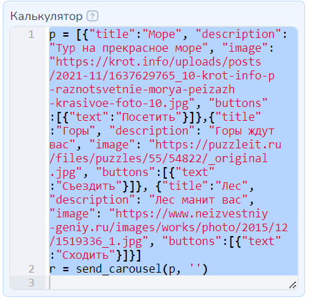
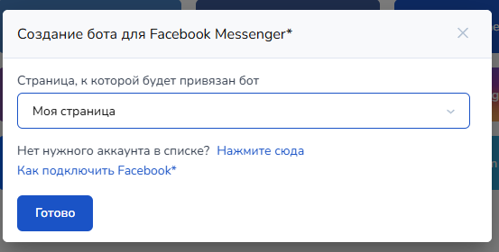

# \*\*cebook Messenger\*


<mark style="color:red;">\*</mark>На территории Российской Федерации <mark style="color:red;">запрещена деятельность</mark> социальных сетей <mark style="color:red;">Facebook</mark> и <mark style="color:red;">Instagram</mark>, принадлежащих компании Meta Platforms Inc., признанная экстремистской!



Мы не призываем Пользователей к использованию ресурса.

Помните!

1. Действия, связанные с приобретением товаров или услуг у запрещенной организации могут быть расценены как финансирование экстремистской деятельности, согласно ст. 282.3 УК РФ.
2. Также с 1 сентября 2025 запрещено распространять рекламу на информационных ресурсах тех организаций, деятельность которых запрещена в РФ (согласно ч. 3 ст. 12 ФЗ от 25 июля 2002 № 114-ФЗ).


* [Как подключить страницу Facebook](./#kak-podklyuchit-stranicu)<mark style="color:red;">\*</mark>
* [Как делать рассылки](./#kak-delat-rassylki-v-facebook)
* [Как работать с Пиксель](./#kak-rabotat-s-piksel-fb)

## Как подключить страницу

Если у вас уже есть бизнес страница в Facebook<mark style="color:red;">\*</mark>, вы можете подключить к ней бота.


**ВАЖНО!** Создавать нужно именно **страницу**, а не группу. Чат-боты в Facebook<mark style="color:red;">\*</mark> привязываются только к страницам.



Подключить бота может только администратор или владелец страницы!


Для подключения Facebook<mark style="color:red;">\*</mark>к Salebot перейдите в раздел "Каналы" и выберите Facebook<mark style="color:red;">\*</mark>

<figure><figcaption></figcaption></figure>

<figure><figcaption></figcaption></figure>

В появившемся окне пройдите авторизацию для доступа к аккаунту. После авторизации, у вас появится список созданных вами бизнес страниц для подключения. Выберите нужную вам.


Вам могут предложить подключить сразу Бизнес аккаунты Instagram<mark style="color:red;">\*</mark>, но это по желанию


<figure><figcaption></figcaption></figure>

Далее необходимо выбрать страницу, к которой необходимо подключить бота.

<figure><figcaption></figcaption></figure>

Далее выберите разрешения для бота. Обязательно проверьте, чтобы все бегунки были включены.

<figure><figcaption></figcaption></figure>

Если все прошло успешно, то вы увидите следующее окно

<figure><figcaption></figcaption></figure>

В раздел "Каналы", у вас появится возможность выбрать страницу для привязки бота.

<figure><figcaption></figcaption></figure>

После нажатия кнопки "Готово", вы должны увидеть успешно подключенный Facebook<mark style="color:red;">\*</mark>

<figure><figcaption></figcaption></figure>


У страницы должны быть подключены сообщения.


После перехода в группу, у вас по умолчанию будет стартовая кнопка "Начать"

<figure><figcaption></figcaption></figure>

Не забудьте прописать это слово в условиях стартового блока.

Приветственное сообщение, которое увидит пользователь перед тем как нажать на кнопку "Начать", настраивается в настройках страницы Facebook<mark style="color:red;">\*</mark>

 (1).png>)

### **Что делать если в списке страниц нет необходимой**

Если в списке групп вы не видите нужную, то, скорее всего у конструктора нет прав на данную группу. Вам необходимо дать их.

**Для этого:**

Выйдите из системы, в правом верхнем углу

&#x20;                                                                    

Нажмите войти через Facebook<mark style="color:red;">\*</mark>&#x20;

<figure><figcaption></figcaption></figure>

Нажмите **Изменить настройки**

<figure><figcaption></figcaption></figure>

Выберите нужную страницу и проделайте все операции, описанные в начале статьи.

## Как делать рассылки в Facebook\*&#x20;

С 31.07.2019 Facebook<mark style="color:red;">\*</mark> ввел новые правила рассылки сообщений для чат-ботов и Facebook Messenger<mark style="color:red;">\*</mark>\
Для всех рассылок работает правило «24+1».&#x20;

Оно относится к любым сообщениям, которые вы отправляете: через чат-ботов, массовую рассылку или сообщения, отправленные вручную.&#x20;

Когда пользователь подписывается на чат-бота или обращается в чат страницы компании, с этого момента в течение 24 часов вы можете отправлять пользователю любые сообщения, в том числе рекламные.

1. Если пользователь не ответил в течение 24 часов, Facebook<mark style="color:red;">\*</mark> разрешает отправить ещё одно сообщение. К нему можно добавить кнопку и сделать крутой оффер, чтобы обратить внимание подписчика и заставить его ответить.
2. Если пользователь ответил в течение 24 часов, открывается новое 24-часовое окно. И так происходит всякий раз, если он отвечает на сообщение чат-бота.

Из данного правила есть исключения.\
Подробно: [https://developers.facebook.com/docs/messenger-platform/policy/policy-overview\
 ](https://developers.facebook.com/docs/messenger-platform/policy/policy-overview)Одно из них - Message Tags. Это разрешенный тип рассылки, который можно рассылать и спустя 24 часа после ответа.\
\
У него есть 16 типов. Мы решили использовать confirmed\_event\_update - “Напоминание о событиях”.\
Возможно в будущем мы организуем возможность выбирать какой тип сообщения вы отправляете.


**После 24 часов с момента последнего сообщения клиента** разрешена только отправка сообщений с уведомлением клиентов о мероприятии, на которое они зарегистрировались, напоминать им о встрече, подтверждать предстоящее бронирование, уведомлять об изменении расписания и т. д. **Запрещено после окна в 24 часа рассылать рекламный контент!** За нарушение этого правила facebook может заблокировать страницу.&#x20;


\
Плюс данного решения — рассылки не надо отправлять на модерацию. Открывается возможность обойти правило 24+1.

## Как работать с Пиксель Facebook<mark style="color:red;">\*</mark>


Для установки пикселя на наш минилендинг, вы должны к нему привязать свой домен.


Это связанно с тем, что Facebook<mark style="color:red;">\*</mark> требует использование собственных доменов.&#x20;

Подробно об установке Пиксель читать [ЗДЕСЬ](/broken/pages/-M1L_fPpT9ptt_t1BNvt#piksel-facebook).

## Как создать карусель

<figure><figcaption></figcaption></figure>


В карусели может быть от 2 до 10 карточек(слайдов).


Рассмотрим на примере карусели из 3 карточек. Для создания карточек вам нужно в поле "Калькулятор" написать следующее:

p = \[{"title":"ЗАГОЛОВОК", "description": "ОПИСАНИЕ КАРТОЧКИ 1", "image": "ССЫЛКА НА КАРТИНКУ 1", "buttons":\[{"text":"ТЕКСТ КНОПКИ 1"}]},{"title":"ЗАГОЛОВОК", "description": "ОПИСАНИЕ КАРТОЧКИ 2", "image": "ССЫЛКА НА КАРТИНКУ 2", "buttons":\[{"text":"ТЕКСТ КНОПКИ 2"}]}, {"title":"ЗАГОЛОВОК", "description": "ОПИСАНИЕ КАРТОЧКИ 3", "image": "ССЫЛКА НА КАРТИНКУ 3", "buttons":\[{"text":"ТЕКСТ КНОПКИ 3"}]}]                                               &#x20;

r = send\_carousel(p, '')

&#x20;                                        


Обратите внимание: выражение r = send\_carousel(p, '') - должно быть с новой строки в калькуляторе



<mark style="color:red;">**ОБРАТИТЕ ВНИМАНИЕ!**</mark>

При построении описания карточки карусели важно:

{"**title**":"ЗАГОЛОВОК", "**description**": "ОПИСАНИЕ КАРТОЧКИ 1", "**image**": "ССЫЛКА НА КАРТИНКУ 1", "buttons":\[{"text":"ТЕКСТ КНОПКИ 1"}]}\
**заполнить** параметр **title&#x20;**<mark style="color:red;">**и**</mark>**&#x20;description или image**


То есть сначала записываем массив с title, description, image, buttons в переменную p (вы можете назвать переменную иначе), а далее используем ее в методе send\_carousel(p, '')  &#x20;

Вы можете воспользоваться [табличкой ](https://docs.google.com/spreadsheets/d/1QcZbSZ-Hjntm3kIp7Fm0chwvrvrQENfa/edit#gid=552753053)и просто вставить нужные значения заголовков, ссылок и тд, а потом просто скопировать в ваш блок                                 &#x20;

В поле "Ответ" оставляет #{None}

&#x20;                                          


В кнопки карточек карусели вы можете вставлять ссылки, тогда при нажатии на кнопку пользователь перейдет по ссылке


Чтобы вставить ссылку в кнопку на карточке, запишите в массив:

p = \[{"title":"заголовок", "description": "ОПИСАНИЕ КАРТОЧКИ 1", "image": "ССЫЛКА НА КАРТИНКУ 1", "buttons":\[{"text":"ТЕКСТ КНОПКИ 1", "url":"ССЫЛКА ДЛЯ КНОПКИ" }]}]

&#x20;                                       (1).png>)

&#x20;                                     


В кнопки карточек карусели добавлен еще один необязательный параметр payload, который не будет отображаться клиенту, но позволит проанализировать сделанный клиентом выбор&#x20;


Поскольку часто требуется размещение карточек карусели с одинаковым текстом кнопки, то был добавлен еще один параметр **payload**, который не будет отображаться клиенту, но позволит проанализировать сделанный им выбор:

 (1).png>)             (1).png>)

Обратите внимание на правильность его применения:\
p = \[{"title":"заголовок", "description": "ОПИСАНИЕ КАРТОЧКИ 1", "image": "ССЫЛКА НА КАРТИНКУ 1", "buttons":\[{"text":"ТЕКСТ КНОПКИ 1"**,"payload":"1"**}]},{"title":"заголовок", "description": "ОПИСАНИЕ КАРТОЧКИ 2", "image": "ССЫЛКА НА КАРТИНКУ 2", "buttons":\[{"text":"ТЕКСТ КНОПКИ 1"**,"payload":"2"**}]}, {"title":"заголовок", "description": "ОПИСАНИЕ КАРТОЧКИ 3", "image": "ССЫЛКА НА КАРТИНКУ 3", "buttons":\[{"text":"ТЕКСТ КНОПКИ 1"}]}]&#x20;

Параметр **payload** - может быть опущен

## Работа с комментариями


Обращаем внимание!

Колбеки не будут приходить в проекте,  Фейсбук\*-бота был подключен до 20.10.2025.

Чтобы это исправить, нужно полностью переподключить интеграцию, и не просто удалить и добавить заново из списка, а с перезаходом в Фейсбук.&#x20;


Чтобы получить информацию для работы с комментариями, сначала удалите старое подключение.

Затем нажмите на иконку мессенджера:

<figure><figcaption></figcaption></figure>

И кликните по ссылке "Нажмите сюда":

<figure><figcaption></figcaption></figure>

Вас направит на страницу с входом в аккаунта, далее необходимо авторизоваться и уже на стороне Сейлбота выбрать нужную страницу для подключения бота.


Подробно, как с нуля подключить мессенджер, рассказали в разделе "[Как подключить страницу](./#kak-podklyuchit-stranicu)"


После подключения можно включить получение комментариев в разделе "Каналы"

<figure><figcaption></figcaption></figure>

При получении комментария под постом в информации о клиенте будут созданы следующие переменные:

* \*facebook\_media\_url - ссылка на пост, под которым оставлен комментарий
* \*facebook\_last\_comment\_id - id последнего оставленного комментария

Callback имеет вид:

_<mark style="color:$warning;">**\*fb\_client\_wall\_reply\_new\_comment \<link> \<id>: \<text>,**</mark>_

где link - ссылка на пост, если включена настройка "приписывать ссылку",  id — id поста, text — текст комментария

\`fb\_create\_comment(text, comment\_id)\` - Ответить на комментарий.

\`text\` - текст ответа, обязательный параметр

\`comment\_id\` - id комментария, необязательный параметр. Если comment\_id не передан, функция использует переменную клиента \`facebook\_last\_comment\_id\`

\`fb\_delete\_comment(comment\_id)\` – удалить комментарий.

\`comment\_id\` - id комментария, который нужно удалить. необязательный параметр. Если comment\_id не передан, функция использует переменную клиента \`facebook\_last\_comment\_id\`


Обращаем внимание!

Правила для работы с мессенджером идентичны: после получения комментария можно один раз написать в ЛС пользователю, который оставил комментарий под постом (правила окна 24-часа), и только если клиент ответит на сообщение, ему можно дальше писать сообщения.

