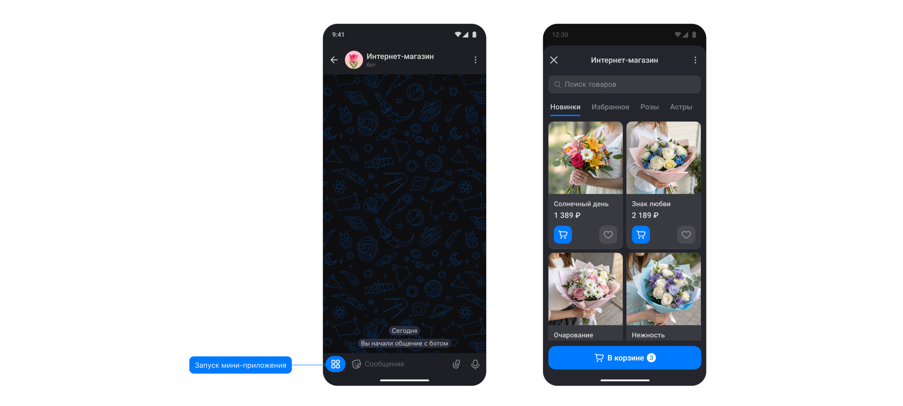

# Чат-бот MAX


Обращаем внимание!

В мессенджере запрещены рассылки и сообщения по таймеру. Ограничение «24-часового окна» для отправки сообщений не применяется. При этом соблюдение пункта 1.5 пользовательского соглашения MAX остаётся на вашей стороне.

[См. пункт 1.5 Правил MAX.](https://dev.max.ru/docs/legal/requirements)

Спасибо за понимание!



При настройке кнопок для чат-бота в одной строке может быть максимум 7 кнопок.


## Создание бота

Чат-боты умеют решать типовые задачи прямо в MAX. Создайте бота, который будет делать что-то за вас.

Даже без навыков программирования сделать своего бота в приложении просто — придумайте сценарий и следуйте пошаговой инструкции.&#x20;

## Как получить токен бота


Обращаем внимание!

**Создание чат-бота в MAX доступно для ю/л и ИП.**


**Шаг 1. Перейдите во вкладку Каналы в Salebot.**

Чтобы перейти на страницу регистрации в мессенджере, войдите в личный кабинет Сейлбот и выберите проект, в котором нужно подключить чат-бота MAX.

Затем в проекте перейдите во вкладку "Каналы" и нажмите на кнопку MAX:

<figure><figcaption></figcaption></figure>

При клике по кнопке подключения мессенджера откроется форма, где можно найти кнопку для регистрации в мессенджере для компаний (ю/л и ИП):

<figure><figcaption></figcaption></figure>

**Шаг 2. Создайте бота**


Если вы уже создали бота на платформе  и он прошёл проверку, перейдите к разделу "[Подключение мессенджера](chat-bot-max.md#podklyuchenie-messendzhera)" ниже.


<figure><figcaption></figcaption></figure>

Чтобы подключить инструменты коммуникации с клиентами в MAX, вам нужно:

1. Пройти регистрацию по номеру телефона на платформе MAX для партнеров;
2. Ввести данные своей организации, чтобы создать Личный Кабинет;
3. В ЛК пройти верификацию организации (через Госуслуги или Банки-провайдеры).

**Шаг 3. Скопируйте токен из настроек бота**

Для этого:

1. Перейдите на платформу и авторизуйтесь.
2. Если у вас несколько ботов, в левом верхнем углу выберите нужный.
3. В разделе Чат-бот и мини-приложение нажмите Настроить.

<figure><figcaption></figcaption></figure>

**Шаг 4. Скопируйте токен:**

<figure><figcaption></figcaption></figure>

Теперь можно подключать мессенджер к Сейлбот.

## Подключение мессенджера

После того как вы создали бота в мессенджере, необходимо перейти в раздел "Каналы" в Сейлбот:

<figure><figcaption></figcaption></figure>

В разделе каналы нажимаем на “MAX” для ввода токена, который вы скопировали ранее при создании бота:

<figure><figcaption></figcaption></figure>

Вставьте скопированный токен и нажмите на “Готово”:

<figure><figcaption></figcaption></figure>


Готово! Бот подключен


При запуске бота, в диалоге с клиентом появится сообщение /start&#x20;

<figure><figcaption></figcaption></figure>

<figure><figcaption></figcaption></figure>

## Как получить полный вебхук

Для получения полного вебхука от Max достаточно присвоить любое значение переменной  save\_webhook(переменная может быть как константой проекта, так и переменной сделки).

При этом ответ из мессенджера будет записываться в переменную tt\_request, которую вы найдете в карточке клиента среди переменных сделки

<figure><figcaption></figcaption></figure>

Max поддерживает кнопки callback, кнопки с ссылкой, запрос номера телефона, запрос геолокации

Если клиент нажмет на кнопку с запросом номера и даст разрешение, в чат поступит сообщение с его номером телефона и появится переменная phone

<figure><figcaption></figcaption></figure>

Если клиент поделится своей геолокацией, данные поступят в виде сообщения, и будут созданы переменные latitude и longitude

<figure><figcaption></figcaption></figure>

<figure><figcaption></figcaption></figure>

## Inline-клавиатура

Такая клавиатура может иметь до 210 кнопок, сгруппированных в 30 рядов — до 7 кнопок в каждом. Если ряды кнопок не помещаются в плейсхолдер клавиатуры, автоматически подключается скролл

<figure><figcaption>
Inline-клавиатура в чат-боте
</figcaption></figure>

Поддерживаемые типы кнопок

* callback — сервер MAX отправляет событие с типом message\_callback (через Webhook или Long polling)
* link — позволяет пользователю открыть ссылку в новой вкладке
* request\_contact — запрашивает у пользователя разрешение на доступ к контактам — нику или телефону
* request\_geo\_location — запрашивает у пользователя его местоположение

## Доступные коллбеки

bot\_added -  подключенный бот добавлен в групповой чат/канал

bot\_removed - подключенный бот удален из группового чата/канала

user\_added - в групповой чат добавлен новый участник/другой бот

user\_removed  - из группового чата удален участник/другой бот

При срабатывании коллбеков на добавление/удаление участников, создаются переменные клиента

chat\_member\_name - имя пользователя

chat\_member\_username - ник пользователя (если установлен)

chat\_member\_id - id пользователя

Чтобы писать сообщения от имени бота, а также видеть сообщения других участников в групповом чате/канале, бота нужно назначить администратором и дать соответствующие разрешения&#x20;

<figure><figcaption></figcaption></figure>

## Форматирование сообщений 

#### Markdown 

\*Курсив\* или \_курсив\_

\*\*Жирный\*\* или \_\_Жирный\_\_

\~\~Зачеркнутый\~\~

++Подчеркнутый++

\`Моноширинный\`

<figure><figcaption></figcaption></figure>

<figure><figcaption></figcaption></figure>

#### HTML 

\<i>курсив\</i> или \<em>курсив\</em>

\<b>жирный\</b> или \<strong>жирный\</strong>

\<del>зачёркнутый\</del> или \<s>зачёркнутый\</s>

\<ins>подчёркнутый\</ins> или \<u>подчёркнутый\</u>

\<pre>моноширинный\</pre> или \<code>моноширинный\</code>

ссылка \<a href="https://dev.max.ru">Docs\</a>

<figure><figcaption></figcaption></figure> <figure><figcaption></figcaption></figure>

## Кнопка MAX WebApp

В MAX теперь можно добавлять мини-приложения (WebApp) с ссылкой на ваш сайт или онлайн-магазин.

Ссылку возможно вставить только на бота, у которого настроено мини-приложение.&#x20;


Ссылка на сайт настраивается вручную в настройках бота.\
[Подробнее в официальной документации MAX.](https://dev.max.ru/docs/webapps/introduction)



Важно!

В настройке кнопки на стороне Salebot допустимо вставлять ссылку на другого бота с настроенным мини-приложением. Ссылку сразу на сайт вставить нельзя


### Настройки: как добавить приложение в MAX 

1. Откройте [платформу MAX для партнёров](https://business.max.ru/self), зайдите в профиль организации → перейдите в раздел **Чат-боты**
2. Если у вас несколько ботов, в панели управления ботом нажмите на имя текущего бота и выберите нужный из списка
3. Перейдите в раздел **Чат-бот и мини-приложение** → **Настроить**
4. Вставьте URL мини-приложения в поле для ссылки
5. Выберите вид кнопки открытия мини-приложения (**Открыть**, **Старт**, **Играть** или без названия) и нажмите **Сохранить**

**Требования к URL мини-приложения:**

* Длина: не более 1024 символов
* Протокол: только https://
* Допустимые символы: буквы (латиница), цифры, точка (.) и дефис (-)
* Пробелы не поддерживаются
* URL должен быть валидный

<figure><figcaption></figcaption></figure>

Как только вы подключите мини-приложение к платформе, в чате с его ботом появится заметная кнопка для быстрого запуска сервиса.

<figure><figcaption></figcaption></figure>

### Настройки кнопки с WebApp

Чтобы отправлять клиенту кнопку с WebApp в цепочке бота, в блоке создайте кнопку:

<figure><figcaption></figcaption></figure>

В настройках кнопки выберите функцию MAX Web Application и вставьте ссылку на вашего бота.
