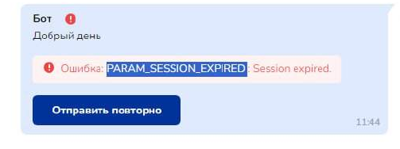

# Одноклассники

В отличие от других мессенджеров, **чат-бот в Одноклассниках запускается сразу после перехода по ссылке** на бота, за исключением администратора группы.

Рекомендуется использовать прокси-ссылку из раздела "Минилендиги", чтобы была возможность передавать UTM-метки и дополнительные параметры.

* [Как подключить Одноклассники](odnoklassniki.md#poluchenie-klyucha-dostupa)
* [Пример работы чат-бота в Одноклассниках](odnoklassniki.md#primer-raboty-chat-bota-v-odnoklassnikakh)
* [Рекомендации по размещению прокси-ссылки Salebot в таргете рекламных кабинетов Одноклассников и MyTarget](odnoklassniki.md#kak-ne-slit-reklamnyi-byudzhet)

## Как подключить Одноклассники 

Для работы с Bot API от имени группы необходимо получить специальный ключ доступа.‌

**Ключ доступа (или токен)** — это строка, включающая латинские буквы, цифры и специальные символы.‌

Администратор группы может получить ключ доступа (токен) в разделе Настройки группы на полной версии сайта.‌

Чтобы получить ключ, надо:‌

**1. Открыть раздел «Настройки»**&#x200C;

**2. Выбрать вкладку «Сообщения»**&#x200C;

**3. В строке «Сообщения отправлять могут» выберите «Гости и участники»**


Если пропустить этот шаг, то **чат-бот РАБОТАТЬ НЕ БУДЕТ.**


 (1) (1) (1).png>)

**4. В строчке «Работа с API» нажать на кнопку «Получить ключ доступа»**&#x200C;

 (1) (1) (1).png>)

**5. Подтвердить ваш выбор**‌

**6. Скопировать токен**‌

**7. Вставить в форму подключения Одноклассников в Salebot.pro**‌

### Ошибки

<figure><figcaption></figcaption></figure>

Данная ошибка говорит пользователю о том, что истек срок действия ключа и его необходимо обновить.


Токен живет 30 дней со дня последнего использования.&#x20;



Если вы уже получали ранее ключ доступа для группы, то при генерации нового ключа - старый станет недействительным.‌




## Пример работы чат-бота в Одноклассниках 

‌

Ниже представлены фотографии сообщений, файлов, изображений, кнопок, отправленных ботом.

В одноклассниках отсутствуют постоянные кнопки. Можно задать только оранжевый и серый цвета для кнопок.

## Как не слить рекламный бюджет

Рекомендации по размещению прокси-ссылки Salebot в таргете рекламных кабинетов Одноклассников и MyTarget.

### Проблема


Обнаружен баг одноклассников: при переходе **с мобильных устройств iOS** ссылка открывает диалог не в мобильном приложении Одноклассников, а выкидывает в браузер и предлагает ввести логин там.\
Соответственно — здесь конверсия будет стремиться к нулю.\
По словам технических специалистов Одноклассников, **исправить эту оплошность для айосов они не смогут**.


Если НИЧЕГО НЕ ДЕЛАТЬ с этим, то вы потеряете небольшой процент трафика с рекламы (корректно будет работать ссылка в декстопе, мобильной веб версии сайта и с приложений на Android) По официальным данным: Одноклассники на iOS используют не так много пользователей:

 (1) (1) (1).png>)

### Как это обойти?


Чтобы полноценно использовать Salebot в одноклассниках с любого устройства, **необходимо пропустить прокси-ссылку через сокращатель** [**OK.ME**](https://ok.me) и затем размещать в рекламе.


В таком случае, независимо от того, с какого именно устройства видит рекламу ваш потенциальный клиент — если он кликнет по ссылке в объявлении, то его перекинет в диалог и запустится бот.

### Инструкция

В разделе минилендинги найти прокси-ссылку Одноклассников.

Вставляем её в строку [на странице сокращателя OK.ME](https://ok.me) и дописываем необходимые параметры и метки. Нажимаем «Сократить ссылку».

Забираем готовую сокращенную ссылку для рекламы и размещаем в постах.

В итоге при клике по ссылке в рекламном посте у пользователя открывается диалог с вашей группой и запускается бот. А в карточке клиента в Salebot сохраняются все указанные метки.

### Какие особенности ботов в ОК (FAQ)

**Статистика кликов в кабинете и диалогов в боте не совпадает**\
Кликом в MyTarget считается клик по любому месту рекламного объявления (то есть не только по ссылке в посте, но и переход в группу/открытие полностью поста и тд). Поэтому не удивляйтесь, если в рекламном кабинете у вас может отображаться в разы больше кликов, чем запущенных диалогов в боте.

**Динамические параметры не поддерживаются**\
Об этой проблеме технические специалисты Одноклассников знают, обещают добавить в ближайшее время.
