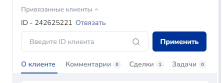
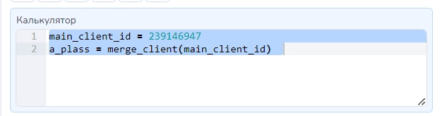
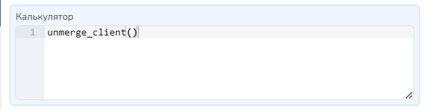
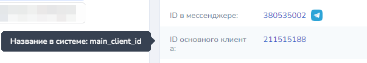

# Перевод клиента в другой мессенджер

## Объединение контактов


**Внимание!** Для создания ссылок для перехода из одного мессенджера в другой к проекту должен быть подключен бот в нужном мессенджере.


**get\_merge\_link(client\_type, tag, group)**&#x20;

Функция возвращает ссылку, которая, при переходе по ней, перенаправит пользователя в указанный бот

Параметры:

<table><thead><tr><th width="201"></th><th width="258"></th><th></th></tr></thead><tbody><tr><td><strong>client_type</strong></td><td> тип клиента число, обязательный параметр, указывает на какой мессенджер будет совершен переход </td><td>(доступны следующие значения 0: 'vkontakte', 1: 'telegram', 2: 'viber', 3: 'facebook', 6: 'whatsapp', 8: 'odnoklassniki', 10: 'instagram')</td></tr><tr><td><strong>tag</strong> </td><td>сообщение, которое придет в чат с клиентом после перехода (для ТГ) или запишется в переменную tag (для ВК) (так же как в минилендингах) - необязательный параметр</td><td></td></tr><tr><td><strong>group</strong> </td><td>идентификатор бота, можно посмотреть в списке подключенных ботов. Не обязательный параметр</td><td></td></tr></tbody></table>

\
&#xNAN;**`merge_client(main_client_id, client_id)`** - свяжет текущего клиента с клиентом с идентификатор которого указан в переменной main\_client\_id, если передан второй параметр, то свяжет клиента client\_id с main\_client\_id. 

<figure><figcaption>
Связанные клиенты отобразятся в карточке клиента. 
</figcaption></figure>

\
Параметры функции:&#x20;

<table><thead><tr><th width="300"></th><th></th></tr></thead><tbody><tr><td><strong>main_client_id</strong></td><td> идентификатор клиента, который будут основным в связке</td></tr><tr><td><strong>client_id</strong> </td><td>идентификатор клиента, которого нужно связать с клиентом указанным в первом параметре. Необязательный, если не передан, то будет связан текущий клиент</td></tr></tbody></table>

<figure><figcaption>
Свяжет текущего клиента с главным клиентом. 
</figcaption></figure>


**Обратите внимание,** если к проекту подключено более одного бота в одном мессенджере и не передан параметр group, то ссылка будет сформирована на первый найденный бот из подключенных.


Функция возвращает ссылку вида https://salebot.pro/mlink/000

**Пример** для формирования ссылки для перехода в телеграм \
link = get\_merge\_link('1') - ссылка на первого найденного в проекте бота телеграм, без тега \
link = get\_merge\_link('1', '', 'testovbot') - ссылка на конкретного бота без тега \
link = get\_merge\_link('1', 'сменил чат', 'testovbot') - ссылка на конкретного бота с тегом

### Важные примечания

*   **Для ссылок на инстаграм**<mark style="color:red;">**\***</mark>**!** \
    Если вы генерируете ссылку на инстаграм<mark style="color:red;">\*</mark>, тогда в переменные добавится переменная text\_to\_merge\_contact со значением вида **cli123** (уникальное для каждого объединения) После перехода в инстаграм\* нужно попросить пользователя отправить этот текст в директ. 

    <figure><figcaption></figcaption></figure>
* **Для ссылок на Whatsapp!** \
  После перехода по ссылке для объединения контактов, ведущей на whatsapp, в поле ввода пользователю автоматически подставится текст вида **cli123** (уникальное для каждого объединения). Пользователь должен его отправить в чат, иначе объединение не произойдет. Дополнительно, при генерации ссылки на whatsapp, добавится переменная text\_to\_merge\_contact с тем же значением. \
  Рекомендуется уведомить пользователя о необходимости после перехода отправить этот текст в чат.
* **Для ссылок на ВКонтакте!**\
  После перехода в диалог сообщества ВК по ссылке для объединения контактов необходимо, чтобы пользователь написал сообщение или нажал кнопку Начать. После этого у пользователям появится системная переменная tag (тег), если был параметр передан tag в функции **get\_merge\_link()**&#x20;
* **Для ссылок на Telegram!**\
  После перехода по ссылке в Telegram пользователь должен запустить бота кликом по кнопке Запустить(Начать/Старт в зависимости от устройства). В диалог с ботом придет значение параметра  tag, указанного в функции **get\_merge\_link()**&#x20;


\*Принадлежит компании Meta, признанной экстремисткой и запрещенной на территории России



Внимание! Переменная text\_to\_merge\_contact удаляется при новой генерации ссылки на объединение или перезаписывается, если генерация ссылки производится для инстаграм или whatsapp.


## Удаление связи между контактами клиента разных мессенджеров

**unmerge\_client(client\_id)** - отвяжет текущего клиента от привязанного.\
\
Если есть или если передан параметр в функции, то отвяжет клиента с идентификатором client\_id от того, к которому привязан client\_id - идентификатор клиента salebot.\
\
&#xNAN;_&#x424;ункция может работать, как без параметра так и с ним._ \
\
Если указать ее в калькуляторе так: **unmerge\_client()** - то удалена будет связь текущего клиента от того, к которому была ранее создана. В случае если параметр передан, то удалена будет связь с клиентом идентификатор которого передан в функцию. \
\
<mark style="color:green;">Рекомендуем использовать функции, если уверенны в ее необходимости и понимаете, как она работает.</mark>&#x20;

<figure><figcaption>
Удаление связи между клиентами.
</figcaption></figure>

## Колбеки после успешного объединения контактов

После успешного объединения контактов в карточке клиента вы увидите раздел Связанные диалоги:  

<figure><figcaption></figcaption></figure>

После успешного перехода в новый мессенджер клиенту в старый придет колбек switch\_to\_ с припиской&#x20;


**Колбэк switch\_to\_(мессенджер,в который перешел клиент) приходит в диалог с ботом, в котором была ВЫДАНА ссылка для перехода в новый мессенджер)**


Например: **switch\_to\_telegram**, если клиент перешел в телеграм

<figure><figcaption></figcaption></figure>

## Передать переменные клиента при переходе в другой мессенджер

При переходе в другой мессенджер может потребоваться передача переменных клиента, чтобы продолжить с ним диалог.

&#x20;Самый простой способ передать значение переменной  - прикрепить к ссылке параметры.


Важно! Если передать название переменной, которое уже есть в диалоге в другом мессенджере, то значение замениться на то, что указано в ссылке&#x20;


Придумайте название переменной, которая будет создана у клиента при переходе по ссылке.&#x20;

Для примера, если переводите в Telegram из Whatsapp можно назвать переменную id\_wa  и передать в ней client\_id из диалога с Whatsapp - ботом и передать номер телефона в переменной phone\_wa. Названия переменных могут быть ЛЮБЫЕ понятные вам.

Как передать параметр с ссылкой:

<figure><figcaption></figcaption></figure>

В диалоге Whatsapp ссылка выглядит следующим образом:

<figure><figcaption></figcaption></figure>

В диалог основного клиента (там, где выдана ссылка для перехода) при запуске бота в другом мессенджере придет колбэк, а в диалоге в новом мессенджере у клиента будут записаны переменные с теми значениями, что были указаны в ссылке:

<figure><figcaption></figcaption></figure>


Передать таким способом параметры можно только при первой связке двух контактов. Далее используйте переменную main\_client\_id  или [функцию для присвоения переменных](https://docs.salebot.pro/peremennye-1/peremennye#kak-prisvoit-peremennuyu-klienta).&#x20;


<figure><figcaption></figcaption></figure>
