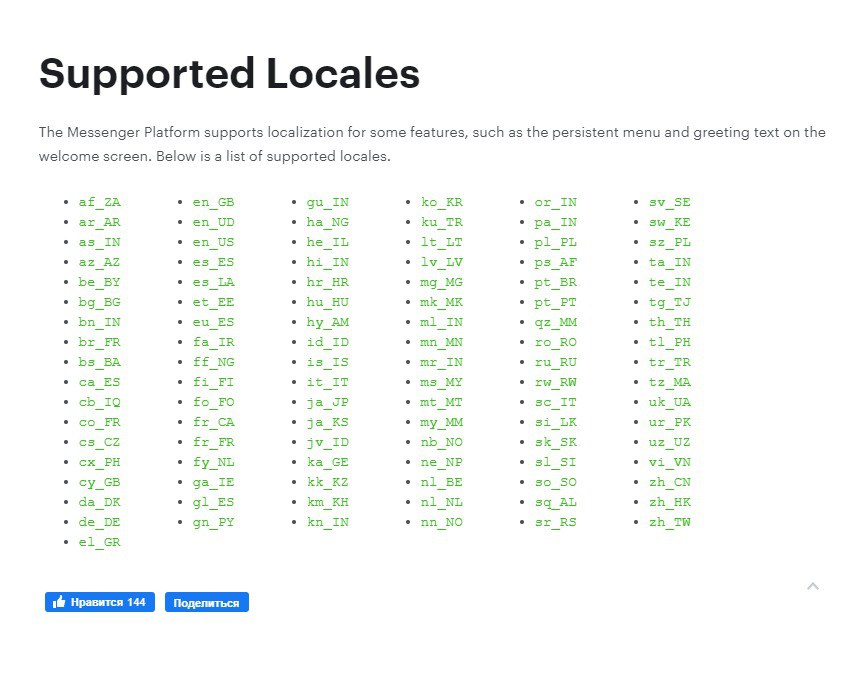

# API \*\*stagram


<mark style="color:red;">**\***</mark>**На территории Российской Федерации&#x20;**<mark style="color:red;">**запрещена деятельность**</mark>**&#x20;социальных сетей&#x20;**<mark style="color:red;">**Facebook**</mark>**&#x20;и&#x20;**<mark style="color:red;">**Instagram**</mark>**, принадлежащих компании Meta Platforms Inc**., признанная экстремистской!



Мы не призываем Пользователей к использованию ресурса.

Помните!

1. Действия, связанные с приобретением товаров или услуг у запрещенной организации могут быть расценены как финансирование экстремистской деятельности, согласно ст. 282.3 УК РФ.
2. Также с 1 сентября 2025 запрещено распространять рекламу на информационных ресурсах тех организаций, деятельность которых запрещена в РФ (согласно ч. 3 ст. 12 ФЗ от 25 июля 2002 № 114-ФЗ).


### Что такое постоянное меню

<figure><figcaption><p>Постоянное меню Instagram</p></figcaption></figure>

Постоянное меню позволяет создавать и отправлять меню основных функций вашего бизнеса, таких, как часы работы, расположение магазинов и продукты, которые всегда отображаются в разговоре человека с вашей компанией в Messenger.

#### Поддерживаемые кнопки:

Постоянное меню состоит из набора кнопок . В постоянном меню поддерживаются следующие типы кнопок:\
● кнопки-ссылки URL (web\_url)\
● колбек-кнопки (postback)

### Как добавить постоянное меню

**response = ig\_set\_persistent\_menu(login, buttons),** где:\
**login** - логин в инстаграме, можно посмотреть в меню Каналы в сейлбот,\
**buttons** - словарь с кнопками

**Пример оформления словаря с кнопками**:\
buttons = {"default": \[\["postback", "Button 1", "callback\_text 1"], \["postback", "Button 2", "callback\_text 2"], \["web\_url", "Site link", "https://salebot.ai/"]]}\
**default** - обязательный ключ, описывает массив кнопок, которые будут в меню по умолчанию, не зависимо от локализации пользователя.\
В качестве значения указывается массив с кнопками. Каждая кнопка описывается отдельным массивом:\
\["тип кнопки", "Отображаемый текст кнопки", "Текст, который придет в бот - callback"]

**Типы кнопок и их описание:**\
&#xNAN;_- колбек-кнопка:_\
\["postback", "Отображаемый текст кнопки", "Текст, который придет в бот"]\
&#xNAN;_- кнопка-ссылка URL:_\
\["web\_url", "Отображаемый текст ссылки", "Ссылка"]

### Как настроить меню с учетом локализации клиента

Настроить кнопки отдельно для разных регионов можно, используя для этого дополнительный ключ в словаре кнопок.

Например, добавим кнопки для русской локали:

buttons = {"default": \[\["postback", "Button 1", "callback\_text 1"], \["postback", "Button 2", "callback\_text 2"], \["web\_url", "Site link", "https://salebot.ai/"]], **"ru\_RU"**: \[\["postback", "Кнопа", "callback\_text 1"], \["postback", "Кнопа 2", "callback\_text 2"], \["web\_url", "Ссылка", "https://salebot.pro/"]]}

Обратите внимание, что в данном случае ключ - это локаль, для которой будут отображаться кнопки.&#x20;

**Список всех доступных локалей**:\
af\_ZA, ar\_AR, as\_IN, az\_AZ, be\_BY, bg\_BG, bn\_IN, br\_FR, bs\_BA, ca\_ES, cb\_IQ, co\_FR, cs\_CZ, cx\_PH, cy\_GB, da\_DK, de\_DE, el\_GR, en\_GB, en\_UD, en\_US, es\_ES, es\_LA, et\_EE, eu\_ES, fa\_IR, ff\_NG, fi\_FI, fo\_FO, fr\_CA, fr\_FR, fy\_NL, ga\_IE, gl\_ES, gn\_PY, gu\_IN, ha\_NG, he\_IL, hi\_IN, hr\_HR, hu\_HU, hy\_AM, id\_ID, is\_IS, it\_IT, ja\_JP, ja\_KS, jv\_ID, ka\_GE, kk\_KZ, km\_KH, kn\_IN, ko\_KR, ku\_TR, lt\_LT, lv\_LV, mg\_MG, mk\_MK, ml\_IN, mn\_MN, mr\_IN, ms\_MY, mt\_MT, my\_MM, nb\_NO, ne\_NP, nl\_BE, nl\_NL, nn\_NO, or\_IN, pa\_IN, pl\_PL, ps\_AF, pt\_BR, pt\_PT, qz\_MM, ro\_RO, ru\_RU, rw\_RW, sc\_IT, si\_LK, sk\_SK, sl\_SI, so\_SO, sq\_AL, sr\_RS, sv\_SE, sw\_KE, sz\_PL, ta\_IN, te\_IN, tg\_TJ, th\_TH, tl\_PH, tr\_TR, tz\_MA, uk\_UA, ur\_PK, uz\_UZ, vi\_VN, zh\_CN, zh\_HK, zh\_TW

<figure><figcaption><p>Перечень локалей, применяемых в Facebook</p></figcaption></figure>

**Пример запроса:**

```
buttons = {"default": [["postback", "Button 1", "callback_text 1"], ["postback", "Button 2", "callback_text 2"], ["web_url", "Site link", "https://salebot.ai/"]], "ru_RU": [["postback", "Кнопа", "callback_text 1"], ["postback", "Кнопа 2", "callback_text 2"], ["web_url", "Ссылка", "https://salebot.pro/"]]}
response = ig_set_persistent_menu('login', buttons)
```

В случае успешного исполнения функция возвращает:\
{"result":"success"}

Иначе - описание ошибки:\
'Error parse buttons data' - ошибка в словаре кнопок\
{"error":{"message":"(#100) param persistent\_menu\[0]\[call\_to\_actions] must be non-empty.","type":"OAuthException","code":100,"fbtrace\_id":"AJtVczu7TEJJxbMfnO"\}}

### Как удалить постоянное меню

**response = ig\_delete\_persistent\_menu('login')**, где login - имя аккаунта

<figure><figcaption><p>login</p></figcaption></figure>

В случае успешного исполнения функция возвращает:

{"result":"success"}

Иначе - описание ошибки:

'Bot not found'
