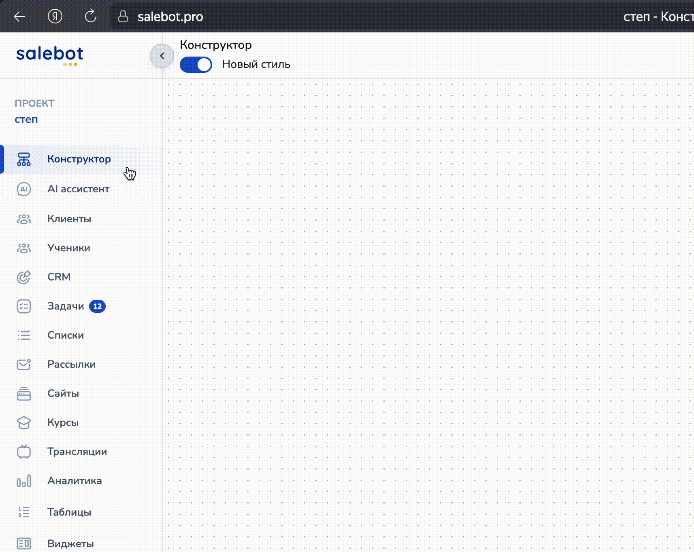
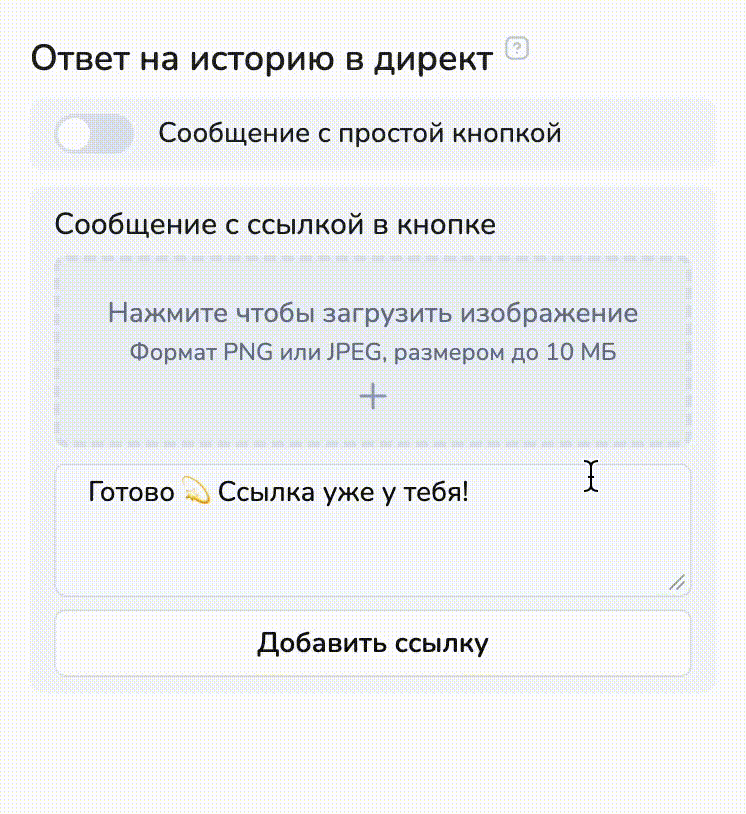

# Автоматизация \*\*stagram


\***Принадлежат компании Meta Platforms Inc**., деятельность которой признана **на территории Российской Федерации&#x20;**<mark style="color:red;">**экстремистской и**</mark> <mark style="color:red;">**запрещена!**</mark>&#x20;


Мы реализовали автоматизацию для Instagram\*, которая устраняет необходимость ручного построения реакций на действия пользователей под вашими постами или на истории.&#x20;

<figure><figcaption></figcaption></figure>

Теперь обработку событий — таких как комментарий, ответ в сторис — можно настроить с помощью удобного функционала без создания отдельных блоков с функциями или методами. Это сокращает количество логических цепочек и снижает вероятность ошибок при масштабировании.

Чтобы перейти к автоматизации мессенджера, следуйте инструкции:

Наведите на "Конструктор" в левом меню:

<figure><figcaption></figcaption></figure>

Откроется всплывающее меню, где нужно перейти в раздел Instagram\*.&#x20;

Если канал еще не подключен, то в разделе будет отображаться кнопка для подключения интеграции:

<figure><figcaption></figcaption></figure>

После подключения интеграции, перейдите в обратно в раздел и нажмите на кнопку "Добавить автоматизацию":

<figure><figcaption></figcaption></figure>

Во вкладке с созданием автоматизации можно настроить автоответы на комментарии под постами или на ответы на истории:

<figure><figcaption></figcaption></figure>

Можно выбрать, где настроить автоматизацию для соц. сети: для всех аккаунтов или только для определенного аккаунта:

<figure><figcaption></figcaption></figure>

Далее выберите тип автоответа:

1. Автоответ в директ (для автоматизации ответов, если клиент написал Вам в директ);
2. Автоответ на комментарии под постом (для автоматизации ответов в директ тем клиентам, которые написали комментарии под вашими постами);
3. Автоответ на сообщение на историю (для автоматизации ответов на сообщения клиентов, отправленные в истории):

<figure><figcaption></figcaption></figure>


Важно!

В одной автоматизации можно настроить только один тип реакции на действия ваших клиентов в аккаунте: либо ответ в директ, либо ответ на комментарии под постом, либо ответ на сообщении в истории.

После настройки одного из типа реакции, Вам достаточно нажать "Сохранить" и далее в разделе кликнуть на "Добавить автоматизацию", чтобы выбрать автоответы другого типа.


## Автоответ в директ

Если клиент написал Вам сообщение в директ, то вы можете настроить автоответ, отправив клиенту сообщение с кнопкой, ссылкой или изображением:

<figure><figcaption></figcaption></figure>

### Настройка реакции бота

Настройки реакции бота — это такие настройки, где вы устанавливаете триггер для запуска бота. Триггер может быть любым: например, любое слово, фраза:

<figure><figcaption></figcaption></figure>

Если выберите "Реагировать на слова" и в поле пропишите слова, то бот будет отправлять автоответ только на заданные слова, а остальные — игнорировать.


Важно!

Слова/фразы, на которые должен реагировать бот, должны прописываться через точку с запятой!



Если выберите настройку "Реагировать на всей слова/фразы", то автоответ будет приходить на любые сообщения, отправленные пользователями вам в директ:

<figure><figcaption></figcaption></figure>

### Добавить действие

Чтобы добавить клиента в список или просвоить ему метку (либо удалить из списка и метку), нажмите "+ добавить действие" в настройках реакции:

<figure><figcaption></figcaption></figure>

Далее выберите действие:

<figure><figcaption></figcaption></figure>

И выберите соответствующий список (метку):

<figure><figcaption></figcaption></figure>

В зависимости от действия (добавить / удалить), ваш клиент будет добавлен в список или удален из него (аналогично с метками), если напишет вам в директ.

### Настройка автоответа в директ

После того как вы настроили реакцию бота (прописали тригерные слова/фразы и т.д.), нужно настроить сообщение, которое будет отправляться клиенту в качестве автоматического ответа:

<figure><figcaption></figcaption></figure>

1. Сообщение с ссылкой в кнопке является обязательным:

<figure><figcaption></figcaption></figure>

Здесь можно добавить при необходимости изображение для отправки вашему клиенту, а также нужно прописать текст:

<figure><figcaption></figcaption></figure>

Чтобы добавить кнопку с ссылкой, нажмите на "Добавить ссылку":

<figure><figcaption></figcaption></figure>

Далее заполните текст в кнопке и укажите ссылку.&#x20;


Важно!

На данный момент функция удаления кнопки недоступна.


2. Также можно настроить сообщение с простой кнопкой. Для этого активируйте чекбокс:

<figure><figcaption></figcaption></figure>

Данное сообщение отправится раньше, чем сообщение с ссылкой в кнопке.

Пример реализации работы с ботом вы сможете увидеть на экране справа:

<figure><figcaption></figcaption></figure>

Далее нажмите "Сохранить", чтобы не потерять настройки:

<figure><figcaption></figcaption></figure>

## Автоответ на комментарии под постами

Чтобы настроить автоматические ответы на комментарии под постами, выберите в настройках автоматизации "Автоответ на комментарии под постом":

<figure><figcaption></figcaption></figure>

Далее выберите пост, на комментарии под которым вы хотите настроить автоматический ответ:

<figure><figcaption></figcaption></figure>

Или выберите отметьте галочкой "Автоответ на все посты", чтобы автоматический ответ в виде комментария прилетал под всеми постами.

### Настройка реакции бота

Настройки реакции бота — это такие настройки, где вы устанавливаете триггер для запуска бота. Триггер может быть любым: например, любое слово, фраза:

<figure><figcaption></figcaption></figure>

Если выберите "Реагировать на слова" и в поле пропишите слова, то бот будет отправлять автоответ только на заданные слова, а остальные — игнорировать.


Важно!

Слова/фразы, на которые должен реагировать бот, должны прописываться через точку с запятой!



Если выберите настройку "Реагировать на всей слова/фразы", то автоответ будет приходить на любые сообщения, отправленные пользователями вам в директ:

<figure><figcaption></figcaption></figure>

### Добавить действие

Чтобы добавить клиента в список или просвоить ему метку (либо удалить из списка и метку), нажмите "+ добавить действие" в настройках реакции:

<figure><figcaption></figcaption></figure>

Далее выберите действие:

<figure><figcaption></figcaption></figure>

И выберите соответствующий список (метку):

<figure><figcaption></figcaption></figure>

В зависимости от действия (добавить / удалить), ваш клиент будет добавлен в список или удален из него (аналогично с метками), если напишет комментарий под постом.

### Настройка автоответа

На комментарии под постами можно отвечать комментарием под постом и (или) сообщением в директ:

<figure><figcaption></figcaption></figure>


Подробно о том, как настроить ответ на комментарий в директ (ответ в виде сообщения в директ на комментарий) [мы рассказали в разделе выше.](avtomatizaciya-stagram.md#nastroika-avtootveta-v-direkt)


Чтобы настроить автоответ в виде комментария, активируйте переключатель "Ответ в виде комментария":

<figure><figcaption></figcaption></figure>

Вам откроются поля, чтобы написать текст автоответа под постами:

<figure><figcaption></figcaption></figure>


Можно добавить от одного до четырех комментариев, которые будут рандомно проставляться под комментариями ваших клиентов в аккаунте.


После настройки автооветов под постами, не забудьте нажать "Сохранить" в правом углу:

<figure><figcaption></figcaption></figure>

## Автоответ на сообщения в сторис

Чтобы настроить автоответы на сообщения в сторис, выберите "Автоответ на реакцию в истории":

<figure><figcaption></figcaption></figure>

Далее выберите одну из сторис или "все истории", на которые необходимо настроить автоответы:

<figure><figcaption></figcaption></figure>

### Настройка реакции бота

Настройки реакции бота — это такие настройки, где вы устанавливаете триггер для запуска бота. Триггер может быть любым: например, любое слово, фраза:

<figure><figcaption></figcaption></figure>

Если выберите "Реагировать на слова" и в поле пропишите слова, то бот будет отправлять автоответ только на заданные слова, а остальные — игнорировать.


Важно!

Слова/фразы, на которые должен реагировать бот, должны прописываться через точку с запятой!



Если выберите настройку "Реагировать на всей слова/фразы", то автоответ будет приходить на любые сообщения, отправленные пользователями вам в директ:

<figure><figcaption></figcaption></figure>

### Автоответ в директ


Подробнее о настройке [автоответов в директ рассказали выше.](avtomatizaciya-stagram.md#nastroika-avtootveta-v-direkt)


### Добавить действие


Как добавить действие в автоответ, [рассказали выше.](avtomatizaciya-stagram.md#dobavit-deistvie)


## Как проверять подписку

Чтобы проверить подписку клиента, который оставил вам комментарий под постом, написал в директ или отрегаировал на историю, достаточно нажать галочку в настройке автоответа:

<figure><figcaption></figcaption></figure>

Затем прописать нужное сообщение в тексте или оставить текст по умолчанию:

<figure><figcaption></figcaption></figure>

d
