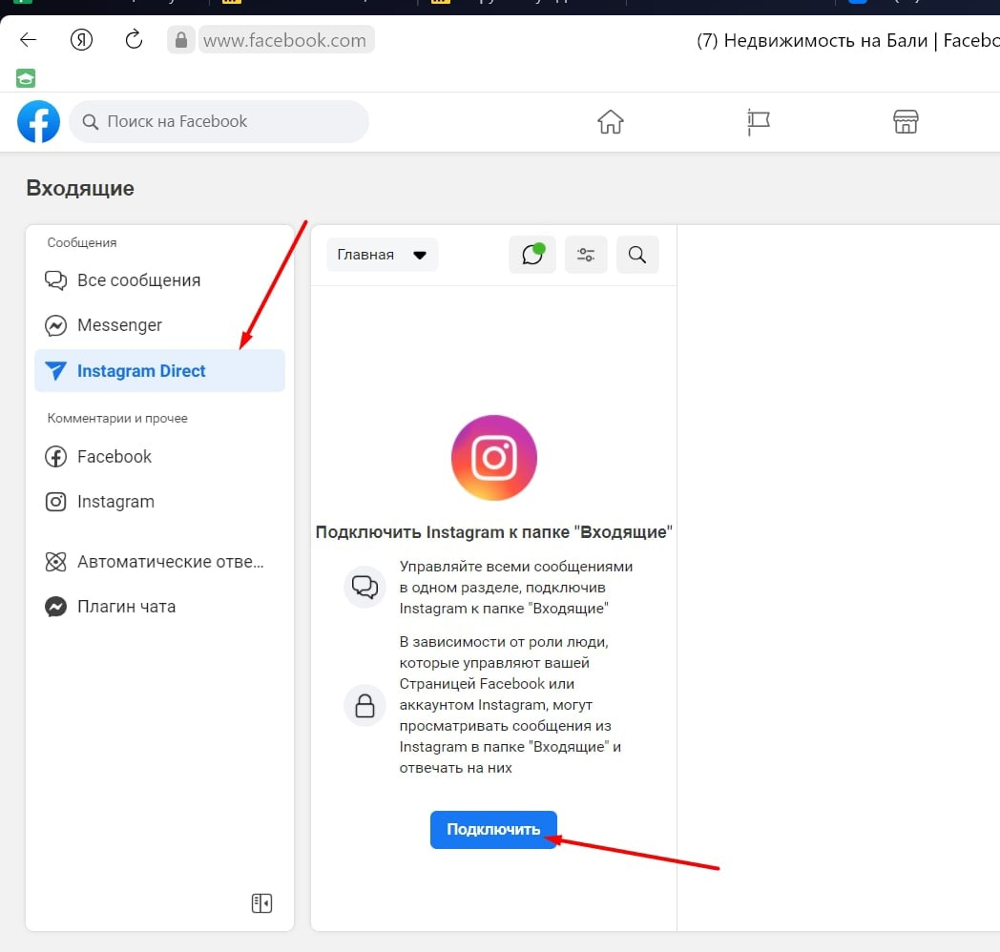

# FAQ \*\*stagram\*


\*— принадлежит компании Meta Platforms Inc.,деятельность которой признана экстремистской в РФ и запрещена!



Мы не призываем Пользователей к использованию ресурса.

Помните!

1. Действия, связанные с приобретением товаров или услуг у запрещенной организации могут быть расценены как финансирование экстремистской деятельности, согласно ст. 282.3 УК РФ.
2. Также с 1 сентября 2025 запрещено распространять рекламу на информационных ресурсах тех организаций, деятельность которых запрещена в РФ (согласно ч. 3 ст. 12 ФЗ от 25 июля 2002 № 114-ФЗ).


## Ошибки, возникающие при работе с Instagram<mark style="color:red;">\*</mark>

### Ошибка **#200 The account owner has disabled access to instagram**<mark style="color:red;">**\***</mark>**&#x20;direct messages (при подключении (запрещены сообщения в директ)**

Если бот не реагирует на сообщения в директ, а при установке вводных фраз вы видите следующую ошибку

 (1) (1).png>)

то вам нужно зайти в приложение Instagram<mark style="color:red;">\*</mark>, там открыть Настройки Конфиденциальность Сообщения и там переключить ползунок “Разрешить доступ к сообщениям”

 (1) (1).png>)

Если доступ к сообщениям разрешен, а ошибка 200 еще возникает, необходимо зайти на бизнес страницу в Facebook<mark style="color:red;">\*</mark> и подключить инстаграм к папке "Входящие"

### **Ошибка #10 The user is not an Instagram**<mark style="color:red;">\*</mark> **Business / Уведомление "НЕ БИЗНЕС-АККАУНТ"**

 (1) (1).png>)

Проверьте настройки в самом приложении, скорее всего, у вас выставлен Аккаунт автора или Личный аккаунт, а не Бизнес. Для этого зайдите в Настройки / Аккаунт / Сменить тип аккаунта

 (1) (1).png>)

### Ошибка Any of the pages... permission(s) must be granted  before impersonating a user's page

В данном случае не выданы все необходимые разрешения.&#x20;

<figure><figcaption></figcaption></figure>

Проверьте все ли верно выполнено при подключении.&#x20;

### **Ошибка “к вашему Facebook**<mark style="color:red;">**\***</mark>**&#x20;не подключено ни одного инстаграм- аккаунта”, но все подключено внутри Facebook**<mark style="color:red;">**\***</mark>**, что делать?**

При подключении мессенджера нажмите “Нет нужного аккаунта в списке? Нажмите сюда”, далее введите пароль от Facebook<mark style="color:red;">\*</mark> и потом нажмите на серую кнопку слева. У вас откроются настройки, где нужно проставить галочки на нужных аккаунтах Instagram<mark style="color:red;">\*</mark> и бизнес-страницах Facebook<mark style="color:red;">\*</mark>.

## Частые вопросы&#x20;

### **Как сделать кнопки, которые появляются при первом заходе в директ?**

Для этого у вас должна быть подключена Instagram<mark style="color:red;">\*</mark> Direct API, в подключенном мессенджере увидите “Установка вводных фраз”

 (1) (1).png>)

 (1) (1).png>)

Заполняете вводные фразы, в схеме ставите их в условие блока "Первостепенная проверка условия" для запуска нужной цепочки.

### **Как сделать карусель в директе?**

Подробно о создании карусели в социальной сети рассказано в статье "[Официальный Instagram](/broken/pages/-MeuKCcotqACy9qlKplH)<mark style="color:red;">\*</mark>" в разделе "Как создать карусель?".&#x20;

### **Как подключать Инстаграм**<mark style="color:red;">**\***</mark>**&#x20;заказчика?**

Есть два способа:

1. Настроить удаленно (например, через управление экраном в ZOOM или Anydesk). Заказчику нужно будет зайти в свой профиль Facebook<mark style="color:red;">\*</mark> и Salebot.
2. Присылаете заказчику [документацию](https://docs.salebot.pro/integracii/messendzhery-i-chaty/oficialnyi-instagram) по настройке и он подключает мессенджер самостоятельно

### Что такое "окно 24 часа"?

Это период после последнего сообщения пользователя. В этом “окне” бот может взаимодействовать с пользователем, присылать сообщения с кнопками, присылать рассылки. После 24 часов эта возможность пропадает, у вас ещё есть 7 дней, чтобы вручную (из раздела Клиенты) прислать напоминание или помочь решить вопрос клиента. Как только он отвечает — окно 24 часа снова активируется.

Например, вы отправили сообщение с кнопкой. Эта кнопка будет активна даже спустя 24 часа. Но вы не сможете отправлять клиенту другие сообщения до тех пор пока он не нажмет кнопку или не напишет вам текстовое сообщение.

### **Как сделать в одном посте картинку, текст и кнопки?**

Для этого вам нужно прописать инлайн-кнопки, в Настройках вложений прикрепить нужную картинку (обязательно выбрать Тип вложения - Картинка) и добавить нужный текст.

### **Есть ли возможность удалять ботом ранее отправленное  сообщение?**

В Instagram<mark style="color:red;">\*</mark> такой возможности нет

### **Как сделать рандомный текст комментария под постом в Instagram**<mark style="color:red;">**\***</mark>**?**


<mark style="color:red;">**\***</mark>**На территории Российской Федерации&#x20;**<mark style="color:red;">**запрещена деятельность**</mark>**&#x20;социальных сетей&#x20;**<mark style="color:red;">**Facebook**</mark>**&#x20;и&#x20;**<mark style="color:red;">**Instagram**</mark>**, принадлежащих компании Meta Platforms Inc**., признанные экстремистскими!



О том, как работать с комментариями очень подробно описано в нашей документации вот [тут](https://docs.salebot.pro/messendzhery-i-chaty/oficialnyi-instagram#kak-rabotat-s-kommentariyami-v-instagram)


Рассмотрим на примере как отправить комментарий клиенту, выбранный случайным образом:

.JPG>)

За выбор случайной строки отвечает метод **select\_random('str1|str2')**\
За отправку ответа на комментарий под постом, который прокомментировал клиент - **insta\_create**_**\_**_**comment("str")\***
