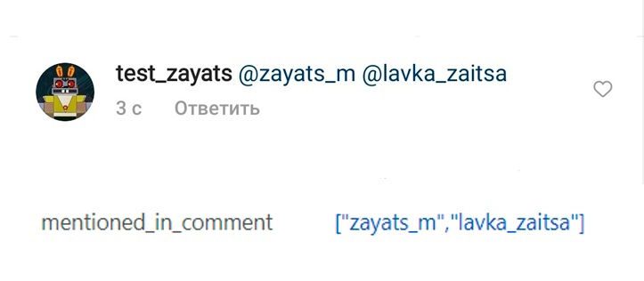

# Как настраивать ответы в Директ


\*Социальная сеть Instagram **принадлежат компании Meta Platforms Inc**., деятельность которой признана **на территории Российской Федерации&#x20;**<mark style="color:red;">**экстремистской и**</mark> <mark style="color:red;">**запрещена!**</mark>&#x20;



Мы не призываем Пользователей к использованию ресурса.

Помните!

1. Действия, связанные с приобретением товаров или услуг у запрещенной организации могут быть расценены как финансирование экстремистской деятельности, согласно ст. 282.3 УК РФ.
2. Также с 1 сентября 2025 запрещено распространять рекламу на информационных ресурсах тех организаций, деятельность которых запрещена в РФ (согласно ч. 3 ст. 12 ФЗ от 25 июля 2002 № 114-ФЗ).


## Как создать прямую ссылку на Директ

Ссылка записывается в формате https://ig.me/m/<mark style="color:$danger;">**salebotpro**</mark> , то есть для формирования ссылки вместо <mark style="color:$danger;">**'salebotpro'**</mark> вставьте логин от вашего аккаунта Инстаграм<mark style="color:red;">**\***</mark>.


Прямая ссылка работает ТОЛЬКО при открытии через приложение на мобильном устройстве.&#x20;

С браузера не работает!


## Настроить ответ по ключевым словам в Директ

Чтобы настроить автоответы по ключевым словам в Директ используйте блоки с условием (Стартовое условие). Также будет работать блок "Не состояние с условием".

Выбор соответствия  - По наличию ключевых слов или Полное совпадение (рекомендованные варианты).

<figure><figcaption></figcaption></figure>

В поле Условие укажите  одно или несколько (через точку с запятой) условий для запуска бота. \
В поле "Текст сообщения" пропишите ответ бота, который получит пользователь. Можно добавлять вложения, кнопки и ссылки.

## **Как проверить подписку на аккаунт**

Есть два варианта проверки подписки:

### Проверка подписки через калькулятор

**result = check\_insta\_subscription()**

**result** - название переменной, в которую запишется результат проверки, вы можете задать другое имя данной переменной, если это необходимо. Получает значение: **True** если подписан, **False** если не подписан.

<figure><figcaption></figcaption></figure>

Проверку необходимо делать в поле "Переменная для сравнения". Как в стрелке, так и в блоке.\
&#xNAN;**`result == True`**  - выражение в поле "Переменная для сравнения" если клиент подписан на аккаунт. \
&#xNAN;**`result == False`** - выражение, если клиент не подписан. \
\
Вы можете использовать и другие выражения сравнения, например,  **result != False**  (result не равен False, значит пользователь подписан на аккаунт)

<figure><figcaption></figcaption></figure>

### Проверка через данные из карточки клиента

Когда пользователь взаимодействует с ботом, в карточке клиента (подраздел Переменные клиента) отображаются переменные **follow**, **verified** и **followers**.

<figure><figcaption></figcaption></figure>

Переменная **follow** — это и есть проверка подписки. Она принимает значение **True**, если клиент подписан на аккаунт, **False** — если не подписан и **None**, если аккаунт клиента закрыт.

**verified** обозначает есть ли у пользователя верификация (галочка у аккаунта).&#x20;

Принимает значение **True**, если верификация есть, и **False**, если ее нет

**followers** обозначает количество подписчиков у клиента

Для проверки подписки или ограничения прохождения по воронке можно использовать переменную f**ollow** в блоках с условиями или в условии стрелки в поле "Переменная для сравнения":

Настройка в блоке:

<figure><figcaption></figcaption></figure>

В Условие прописываем любое слово, которое запустит вашу воронку.&#x20;

1. В переменную для сравнения прописываем: `follow == True`

ИЛИ

2. В переменную для сравнения прописываем: `follow != False`

В первом случае будет проверка на факт подписки человека на ваш аккаунт, во втором случае на факт отсутствия подписки на ваш аккаунт.


Обратите внимание, что статусы **True** и **False** обязательно были написаны с большой буквы. В противном случае проверка не сработает корректно.


Для выдачи разных сообщений при подписке и ее отсутствии нужно будет создавать 2 блока с противоположными решениями. Если вы не любите громоздкие решения, то рекомендуем прописывать условия в стрелке.&#x20;

**Условие в стрелке:**

<figure><figcaption></figcaption></figure>

В стрелке из блока в строке “Переменная для сравнения” прописываем условие&#x20;

**follow** == True или **follow** != False&#x20;

В случае соответствия условию мы переводим клиента дальше по воронке.

Если клиент не подписался, то он переходит в блок, где условия проверки не совпадают (follow == False или follow != True)

Если вы хотите, чтобы проверка осуществлялась динамично, то рекомендуем поставить кнопку. Например “Я подписался” и т д. Чтобы проверка была осуществлена и человек прошел далее.


В замкнутой стрелке НЕ рекомендуем ставить таймер без кнопки, так как человеку будут постоянно приходить сообщения и ваш лимит на сообщения быстро исчерпается.


## Реакции в сторис

Когда кто-то отправляет реакцию или комментарий в ответ на вашу сторис, в разделе Клиенты появляется колбек вида:

<figure><figcaption></figcaption></figure>

Сначала идет сообщение, которое прислали (или эмодзи):

<figure><figcaption></figcaption></figure>

&#x20;Затем ссылка на сторис:

<figure><figcaption></figcaption></figure>

Если вы хотите настроить ответ на любую реакцию конкретно этой сторис, вам нужно скопировать часть ссылки до символа &:

<figure><figcaption></figcaption></figure>

Далее переходите в раздел Конструктор и создаете блок с условием (Стартовое условие или Не состояние с условием).&#x20;

<figure><figcaption></figcaption></figure>


Если вы не хотите выбивать клиента из основной схемы чат-бота, воспользуйтесь блоком "Не состояние с условием" — в этот блок нельзя перейти, поэтому клиента не выбьет из основной воронки и при этом он получит ответ в директ на реакцию на сторис

А если вам нужно продолжить воронку с ответа в директ, то используйте блок "Стартовое условие", тогда клиент из блока оплаты перейдет в блок "Стартовое условие", с которого вы можете продолжить воронку.


В поле "Условие" вставляете скопированное, а в поле для ответа вставляете текст, который будет приходить в директ.

<figure><figcaption></figcaption></figure>

Если нужно настроить ответ на определенное слово, перед скопированной ссылкой указываете это слово. В поле для ответа пишете нужный текст.

<figure><figcaption></figcaption></figure>

Если нужно настроить одинаковые реакции для любых ваших сторис, то нужно скопировать вот эту часть ссылки:&#x20;

<figure><figcaption></figcaption></figure>

И далее прописать данную часть колбека в условии блока.

### Какой колбек будет получен, если реакция выполнена с использованием аватара

Не так давно в[ Instagram ](#user-content-fn-1)[^1]появилась возможность в качестве реакции на сторис ставить не только смайлы, но и аватар:

<figure><figcaption>
Аватар в реакции сторис
</figcaption></figure>

В этом случае будет получен колбек instagram\_**reaction\_to\_story** <mark style="color:red;">\*</mark>

Если в каналах для Вашего бота Instagram<mark style="color:red;">\*</mark> была подключена возможность получения ссылок для ответов на сторис и комментарии:

<figure><figcaption></figcaption></figure>

То колбек будет содержать ссылку:

<figure><figcaption></figcaption></figure>

## Упоминание в сторис

Когда вас упоминают в сторис, приходит коллбэк вида

<figure><figcaption></figcaption></figure>

где ссылка - это ссылка на историю, где вас упомянули.&#x20;

Чтобы настроить ответы на упоминание в сторис, переходите в раздел Воронки и создаете блок Первостепенная проверка условия или Не состояние с условием. В поле "Условие" прописываете "Упоминание в истории", а в поле для ответа пишете текст, который будет приходить в директ.

Также вы можете присылать картинки или ссылки вместе с текстом (например, чтобы выдать бонус за упоминание вашего аккаунта)

<figure><figcaption></figcaption></figure>

И тогда при упоминании в сторис пользователь получит сообщение:

 (1) (1).png>)

## Как работать с упоминаниями аккаунта

### Упоминания аккаунта в посте

Когда пользователь отметит ваш профиль в своем посте, в вашего бота придет коллбэк:

<figure><figcaption></figcaption></figure>

И появляются переменные:

 (1) (1).png>)

**mention\_caption** — текст поста&#x20;

**post\_url** — ссылка на пост&#x20;

**mention\_comments\_count** — количество комментариев&#x20;

**mention\_like\_count** — количество лайков&#x20;

**mention\_media\_id** — id поста

Настроим реакцию для ответа на упоминание.&#x20;

Для этого создаем блок "Первостепенная проверка условия" или "Не состояние с условием". В поле "Условие" прописываете **mention\_in\_media** и ставите тип соответствия "По наличию ключевых слов"

В поле "Калькулятор" прописываете следующий метод:

**reply\_to\_mention**(text)

где text - текст комментария, который появится под данным постом. Вы можете задать переменную (вставлять в скобки без кавычек) или сразу текст (взять в кавычки).

Пример:

Шаг 1. В редакторе блока нажмите на "Конструктор условий" и выберите вкладку "Мессенджеры" в открывшемся окне:

<figure><figcaption></figcaption></figure>

В списке условие выберите "Упоминание в посте", а в качестве метода калькулятора — "Ответный комментарий к посту". Затем пропишите текст ответного комментария.

Шаг 2. Нажмите на "Добавить условие". Тогда условие вместе с методом будут прописаны в блоке:

<figure><figcaption></figcaption></figure>

Результат

<figure><figcaption></figcaption></figure>

### Упоминания вашего профиля в комментариях под постами  (mention\_in\_comment)

Когда кто-то из пользователей отметит ваш аккаунт в комментариях, в диалог придет коллбэк вида:

<figure><figcaption></figcaption></figure>


Если ваш аккаунт отметят в закрытом профиле, коллбэк не придет.


Также в карточке клиента появятся переменные:

**mention\_like\_count** — количество лайков

**mention\_media\_id** — id поста

Настроим реакцию для ответа на упоминание в комментарии.

Для этого создаете блок "Первостепенная проверка условия" или "Не состояние с условием". В поле "Условие" прописываете mention\_in\_comment и ставите тип соответствия "По наличию ключевых слов"

В поле "Калькулятор" прописываете следующий метод:

**reply\_to\_mention**(text)

где text - текст комментария, который появится в ответ на комментарий.. Вы можете задать переменную (вставлять в скобки без кавычек) или сразу текст (взять в кавычки).

Пример:

Шаг 1. Переходим в конструктор условий в блоке и выбираем вкладку мессенджеры:

<figure><figcaption></figcaption></figure>

Далее выбираем условие "Упоминание в комментарии".&#x20;

Шаг 2. Выбираем метод калькулятора "Ответный комментарий к посту" и прописыаем текст ответного комментария:

<figure><figcaption></figcaption></figure>

Шаг 3. Далее нажмите "Добавить условие", тогда все необходимые условия будут&#x20;

<figure><figcaption></figcaption></figure>


Если в диалоге с пользователем не открыто 24 часовое окно, то написать в директ в ответ на упоминание ничего нельзя! Только ответным комментарием



Если окно 24 часа открыто, то в поле Ответ вы можете написать текст, который пользователи получит в директ после отметки вашего аккаунта.


### Упоминание чужих профилей в комментариях под вашими постами

Если под вашим аккаунтом отмечают человека , в карточке клиента создается переменная **mentioned\_in\_comment** . в нее записывается логин того, кого отметили. если отмечено больше 2 человек, то логины записываются в массив:

Если вам нужно сегментировать тех, кто упомянул 2 и более друзей, вы можете присвоить переменную типа len = arr\_len(mentioned\_in\_comment) и дальше сравнивать переменную с нужным значением. Подробнее о работе с массивами [тут](https://docs.salebot.pro/peremennye-1/rabota-s-massivami-i-slovaryami#dlinna-massiva-ili-kolichestvo-elementov-v-slovare)


Если в диалоге с пользователем не открыто 24 часовое окно, то написать в директ в ответ на упоминание ничего нельзя! Только ответным комментарием


[^1]: <mark style="color:red;">**! ЗАПРЕЩЕНА НА ТЕРРИТОРИИ РФ!**</mark>
