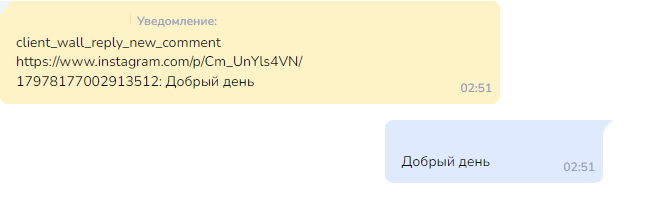

# Как работать с комментариями

## Колбек **client\_wall\_reply\_new**


<mark style="color:red;">**\***</mark>**Принадлежат компании Meta Platforms Inc**., деятельность которой признана **на территории Российской Федерации&#x20;**<mark style="color:red;">**экстремистской и**</mark> <mark style="color:red;">**запрещена!**</mark>&#x20;



Мы не призываем Пользователей к использованию ресурса.

Помните!

1. Действия, связанные с приобретением товаров или услуг у запрещенной организации могут быть расценены как финансирование экстремистской деятельности, согласно ст. 282.3 УК РФ.
2. Также с 1 сентября 2025 запрещено распространять рекламу на информационных ресурсах тех организаций, деятельность которых запрещена в РФ (согласно ч. 3 ст. 12 ФЗ от 25 июля 2002 № 114-ФЗ).


Для того, чтобы ваш бот реагировал на комментарии, нужно переключить бегунок в подключенном Instagram<mark style="color:red;">\*</mark> в разделе “Каналы”

<figure><figcaption></figcaption></figure>

Если под вашим подключением Official Instagram<mark style="color:red;">\*</mark> вы видите надпись "Переподключите Instagram<mark style="color:red;">\*</mark> работы с комментариями", вам нужно переподключить Instagram<mark style="color:red;">\*</mark>, чтобы обновить необходимые разрешения. Для этого нажимаете на значок корзины в нижнем правом углу (удалить бот)

<figure><figcaption></figcaption></figure>

И подключаете аккаунт Instagram<mark style="color:red;">\*</mark> заново. Как подключить Instagram<mark style="color:red;">\*</mark>смотрите [здесь ](kak-rabotat-s-kommentariyami.md#kak-podklyuchit-messendzher-videoinstrukciya)


При публикации постов в соавторстве все уведомления о комментариях придут в тот аккаунт, в котором СОЗДАЕТЕ публикацию.&#x20;


✅ Настройка завершена

> Пошаговый разбор бота для Instagram можно посмотреть в теме 2 проекта Репетитор. [Перейти к описанию](https://docs.salebot.pro/nashi-uslugi/obuchenie/obuchenie#tema-2-vebinarnaya-voronka-v-inst-ram-s-geimifikaciei)


C комментариями под Reels работает также как и под постами


Когда пользователь оставляет комментарий под постом, то в бот приходит callback (смотреть нужно в разделе “Клиенты” в диалоге с пользователем)

Callback имеет вид:&#x20;

**client\_wall\_reply\_new link id: text**

где **link** - ссылка на пост, **id** — id записи, **text** — текст комментария

<figure><figcaption></figcaption></figure>

С комментариями мы можем работать в двух вариантах: отвечать своим комментарием или написать одно сообщение в Direct.

**client\_wall\_reply\_new** - это общая часть колбека.&#x20;

**client\_wall\_reply\_new\_comment -** если нас интересует комментарии только на пост

**client\_wall\_reply\_new\_live -** если комментарии только под прямыми эфирами

### Как настроить автоответ на комментарии в Direct


Автоматический ответ на комментарий НЕ открывает 24-часовое окно


Копируем callback и переходим в раздел Конструктор воронок. Создаём блок типа "Первостепенная проверка условия" или "Не состояние с условием" и вставляем скопированный callback в условие. Выставляем проверку "По наличию ключевых слов"


ВАЖНО! **Не рекомендуется** использовать **цифры** как условие для запуска бота. \
\
ID поста может содержать эти цифры. Бот может реагировать на любой колбэк, в котором есть эти цифры, если выбор соответствия По наличию ключевых слов.


Если вы хотите настроить реакцию на комментарии под любым постом на любой комментарий, то в условиях вы указываете только **client\_wall\_reply\_new\_comment.**&#x20;

В выборе соответствия устанавливает “**По наличию ключевых слов**”.

<figure><figcaption></figcaption></figure>


Обращаем внимание!&#x20;

Мы советуем использовать **Выбор соответствия** "<mark style="color:green;">**По наличию ключевых слов**</mark>" при настройке реакции на колбек.

Напоминаем, что выбор соответствия в условии блока указывается исходя из настроек и потребностей вашего проекта. Поэтому обязательно тестируйте схему чат-бота!&#x20;

Про выбор соответствия в условии блока читайте в статье "[Условия и выбор соответствия](/broken/pages/-M5QU0ZLA1A6QhyOaMzP)".&#x20;


Если планируете настроить реакцию на конкретный пост, то в условиях прописываете **client\_wall\_reply\_new\_comment + ID поста**.&#x20;


ВАЖНО! **Не рекомендуется** использовать **цифры** как условие для запуска бота. \
\
ID поста может содержать эти цифры. Бот может реагировать на любой колбэк, в котором есть эти цифры, если выбор соответствия По наличию ключевых слов.                                          &#x20;


<figure><figcaption></figcaption></figure>

Если планируется настройка реакции так, чтобы бот реагировал на определенное слово под конкретным постом, то в условиях надо прописать **client\_wall\_reply\_new\_comment+ID поста+нужный текст**.


ВАЖНО! **Не рекомендуется** использовать **цифры** как условие для запуска бота. \
\
ID поста может содержать эти цифры. Бот может реагировать на любой колбэк, в котором есть эти цифры, если выбор соответствия По наличию ключевых слов.


<figure><figcaption></figcaption></figure>

В поле для ответа пишите текст, который хотите рассылать в ответ на этот комментарий.

Над сообщением указывается, что оно пришло в ответ на комментарий. Если нажмете на "Посмотреть публикацию", то вас перекинет под ту запись, которую комментировали.

&#x20;                                         

Если пользователь оставил комментарий, на который у вас **не** настроена реакция (или вы их вообще не настраивали), вы можете ему ответить одним сообщением в Direct через раздел "Клиенты"                       &#x20;

<figure><figcaption></figcaption></figure>

При этом если мы повторно напишем пользователю в Direct, второе сообщение не отправится, т.к при реакции на комментарии не открывают 24-часовое окно

<figure><figcaption>
Ошибка, если в ответ на комментарий отправить больше одного сообщения
</figcaption></figure>

### Как настраивать реакции на комментарии (видеоинструкция):



### Как использовать прямые ссылки на посты Инстаграм<mark style="color:red;">**\***</mark> в работе с комментариями


Необходимо включить ползунок "Реагировать на комментарии" в разделе Каналы для Instagram<mark style="color:red;">\*</mark>, чтобы работать с комментариями.


Когда пользователь пишет комментарий под постом, в диалог в разделе Клиента приходит уведомление с текстом комментария появляется переменная instagram\_**media\_url&#x20;**<mark style="color:red;">**\***</mark> с ссылкой на публикацию.

<figure><figcaption></figcaption></figure>

Можно использовать  переменную **instagram\_media\_url&#x20;**<mark style="color:red;">**\***</mark>**,** чтобы настроить реакции на комментарии под определенными постами в Instagram<mark style="color:red;">\*</mark>.

Рассмотрим пример.

#### Настройка разных ответов в зависимости от того, какую публикацию прокомментировали

<mark style="color:orange;">**Задача:**</mark> В аккаунте несколько постов, три поста с товарами разными по стоимости. На эти три поста настроить реакцию с точной суммой, на остальные "По договоренности".  Ответ  присылать в Директ и в комментарий под постом.&#x20;

<mark style="color:green;">**Решение:**</mark>&#x20;

Реакцию настраиваем по ключевым словам  в комментарии под постами. Т.е. реакция будет для всех постов, если в тексте комментария есть ключевое слово.&#x20;

Мы будем присылать пользователю разную стоимость в комментарии и в директ одновременно. Для этого в поле Текст сообщения будет ответ и в Калькуляторе используем функцию `insta_create_comment` для отправки комментария под постом.

Функция insta\_create\_comment(text, comment\_id)

<table><thead><tr><th width="305.2265625">Параметр</th><th>Описание</th></tr></thead><tbody><tr><td>text</td><td>текст ответного комментария под постом</td></tr><tr><td>comment_id</td><td>ID комментария, на который необходимо ответить</td></tr></tbody></table>

\
Если комментарий с нужными ключевыми словами придет под другой пост, пользователю придет сообщение с текстом "по договоренности".&#x20;

<figure><figcaption></figcaption></figure>

**Шаг 1.** В поле Условие стартового блока пишем **client\_wall\_reply\_new**  и перечисляем слова, на которые будем отвечать. Выбор соответствия  - "По наличию ключевых слов"

_Пример для копирования:_

`client_wall_reply_new_comment (цен|сколько|стоимость|узнать)`


Если нас интересуют комментарии только под постами, пишем **client\_wall\_reply\_new\_comment**, а если комментарии только под прямыми эфирами, пишем **client\_wall\_reply\_new\_live**



С комментариями под Reels работает также, как и под простыми постами


**Шаг 2.** В поле "Калькулятор" мы объявим переменную text. Значение переменной определим с помощью проверки условия IF, в зависимости от значения переменной _**instagram\_media\_url**_&#x20;

_Пример для копирования. Не забудьте заменить ссылки на ваши актуальные. Скопировать можно в переменной **instagram\_media\_url** в диалоге с клиентом (раздел Клиенты) после комментирования нужного поста :_&#x20;

`text = if(instagram_media_url == "https://www.instagram.com/reel/Cagzkx", "1000 руб", if(instagram_media_url == "https://www.instagram.com/p/CqvCq4", "20000 руб", if(instagram_media_url == "https://www.instagram.com/p/CocLhN", "45000 руб", "По договоренности")))`&#x20;

Шаг 3. Затем используем метод **insta\_create\_comment,** чтобы отправить комментарий.

_Пример для копирования:_&#x20;

`insta_create_comment("#{text}")`

где **#{text}** — наш текст, который мы присылаем пользователю.

Шаг 4. в поле Текст сообщения пишем переменную с текстом ответа в Директ.

В данном примере - переменная  **#{text}**

Ответ приходит одинаковый  в ответном комментарии и дублируется в Директ. Вы можете настроить разные ответы.


**client\_wall\_reply\_new** - это общая часть колбека. Если нас интересуют комментарии только под постами, пишем **client\_wall\_reply\_new\_comment**, а если комментарии только под прямыми эфирами, пишем **client\_wall\_reply\_new\_live**



Пример работы с прямыми ссылками на посты в ответ на комментарии


_В видеоинструкции рассмотрели один из возможных вариантов как использовать значение переменной **instagram\_media\_url****&#x20;**<mark style="color:red;">**\***</mark>**;** как оставить комментарий под постом в ответ на комментарий; настройку случайного текста комментария и ответа в Директ в зависимости от поста, на который получен комментарий_

### **Как написать комментарий в ответ на сообщение под постом или прямым эфиром**


При работе с комментариями и настройке ответа под постом используйте функцию random и отправляйте вариативный текст. Если бот будет отправлять одинаковый текст, то вы можете столкнуться с ошибкой **This API call does not support the requested response format.** Подробнее о работе с функцией random рассказали [тут.](https://docs.salebot.pro/osnovnye-ponyatiya.-kak-sozdavat-botov-na-salebot.pro/sluchainye-otvety-v-bote#otpravka-sluchainogo-otveta)


<figure><figcaption></figcaption></figure>

_<mark style="color:green;">**Ответ бота на КОНКРЕТНУЮ ФРАЗУ под КОНКРЕТНЫМ постом.**</mark>_

Скопируйте полный колбэк из раздела клиенты и поставьте его в поле Условие блока

**Шаг 1.** В разделе Клиенты копируем коллбэк (уведомление) о том, что оставлен комментарий под постом и переходим в раздел Конструктор воронок.&#x20;

**Шаг 2.** Создаём блок типа "Первостепенная проверка условия" или "Не состояние с условием" и вставляем скопированный коллбэк в поле Условие.&#x20;

Существуют разные варианты настройки условия срабатывания бота. [Они рассмотрены ниже в данной статье.](https://docs.salebot.pro/messendzhery-i-chaty/oficialnyi-instagram#varianty-nastroiki-usloviya-reagirovaniya-na-kommentarii-pod-postom)

В примере бот отвечает на комментарии под всеми постами на сообщение "ответь в комментарии". Для этого в поле условие указываем основную часть колбэка и ключевую фразу:

`client_wall_reply_new_comment ответь в комментариях`


ВАЖНО! **Не рекомендуется** использовать **цифры** как условие для запуска бота. \
\
ID поста может содержать эти цифры. Бот может реагировать на любой колбэк, в котором есть эти цифры, если выбор соответствия По наличию ключевых слов.



**Важно! Выбор соответствия указываем  "По наличию ключевых слов"**



**client\_wall\_reply\_new** - это общая часть колбека, которая реагирует и на посты и на прямые эфиры. \
Если нас интересуют комментарии только под постами, пишем **client\_wall\_reply\_new\_comment**, а если комментарии только под прямыми эфирами, пишем **client\_wall\_reply\_new\_live**



Для прямого эфира (**client\_wall\_reply\_new\_live**) есть одна особенность: бот отреагирует только во время эфира. Если эфир закончился, то комментарии под этим эфиром бот не увидит и ответить не сможет.


**Шаг 3.** В поле для ответа оставляем #{none}.

**Шаг 4.** В поле "Калькулятор" пишем:

`insta_create_comment("ваш текст комментария в ответ"),`&#x20;

где в скобках указывается текст вашего комментария.

&#x20;Далее нажимаем "Сохранить":

<figure><figcaption></figcaption></figure>

При такой настройке как в примере комментарий созданный ботом будет приходить в ответ на комментарий **под любой записью и ключевыми словами** "ответь в комментариях":

#### Варианты настройки Условия реагирования на комментарий под постом:&#x20;

#### _<mark style="color:green;">**Ответ бота на ЛЮБОЙ комментарий под КОНКРЕТНЫМ постом.**</mark>_

Чтобы бот отвечал на **все комментарии под конкретной записью**, в поле "Условие" вставляем коллбэк с номером публикации БЕЗ текста комментария:&#x20;

<figure><figcaption></figcaption></figure>

Тогда конкретно под этой записью будет приходить автоматический ответ на любой комментарий:

<figure><figcaption>
Пример ответа на любое сообщение под конкретным постом
</figcaption></figure>

#### _<mark style="color:green;">**Ответ бота на ЛЮБОЙ комментарий под ЛЮБЫМ постом.**</mark>_

Если в поле "Условие" оставите только общую часть колбэка **`client_wall_reply_new`**, то ваш комментарий будет приходить в **ответ на комментарии под всеми записями** (и не важно, какой текст пользователь написал)

<figure><figcaption></figcaption></figure>

_<mark style="color:green;">**Ответ бота на КОНКРЕТНУЮ ФРАЗУ под ЛЮБЫМ постом.**</mark>_

Если в поле "Условие" оставите **`client_wall_reply_new`**` ``и ключевое слово`, то ваш комментарий будет приходить в **ответ на комментарии с ключевым словом под всеми записями**.

<figure><figcaption></figcaption></figure>


Точно таким же способом вы можете реагировать на комментарии, которые оставляют пользователи во время **прямого эфира (для него есть отдельный ключ client\_wall\_reply\_new\_live)**.

Для прямого эфира есть одна особенность: бот отреагирует только во время эфира. Если эфир закончился, то комментарии под этим эфиром бот не увидит и ответить не сможет.


### Как сохранить текст комментария в переменную

Для того чтобы сохранить текст комментария пользователя, воспользуемся методом **comment\_text()**

В поле Условие вставим коллбек **client\_wall\_reply\_new**, а в поле  "Калькулятор" назначим переменную comm (вы можете взять любое другое название)

`comm = comment_text()`

Пример:

В редакторе блока нажмите на "Конструктор условий", выберите вкладку мессенджеры:

<figure><figcaption></figcaption></figure>

Далее выберите мессенджер и в выпадающем списке условий нажмите на "Автоответ на комментарий под постом".&#x20;

В конструкторе условий можно сразу прописать ID поста, чтобы блок отрабатывался только на конкретный пост.

Далее нажмите на добавить условие в калькуляторе укажите `comm = comment_text()`:

<figure><figcaption></figcaption></figure>

<figure><figcaption></figcaption></figure>

### Как удалить комментарий

Функция **insta\_delete\_comment(comment\_id - необязательный)**

Если comment\_id не передан, функция использует переменную клиента instagram\_last\_comment\_id.&#x20;

При успешном выполнеини возвращает {"success":true} или {"An unexpected error has occurred. Please retry your request later."} — если передан несуществующий comment\_id.&#x20;
