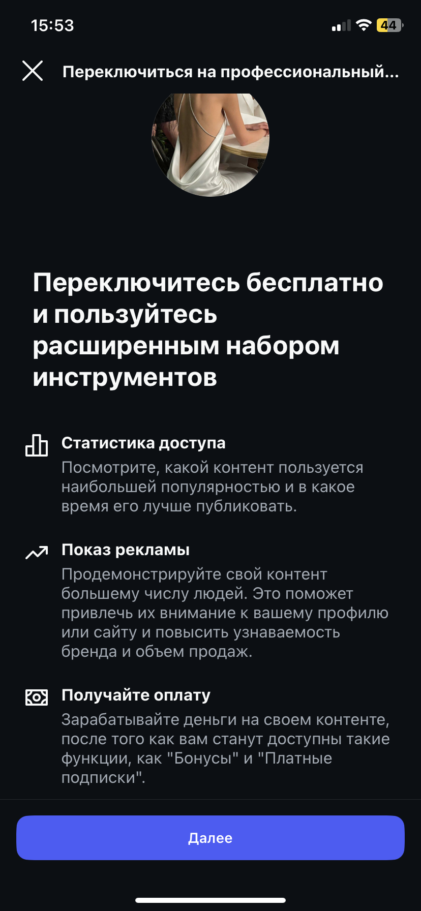
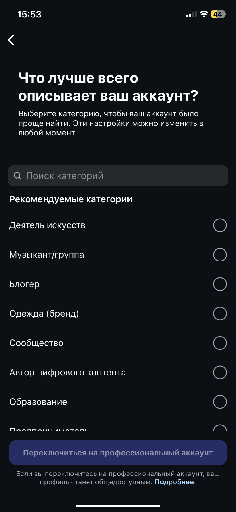
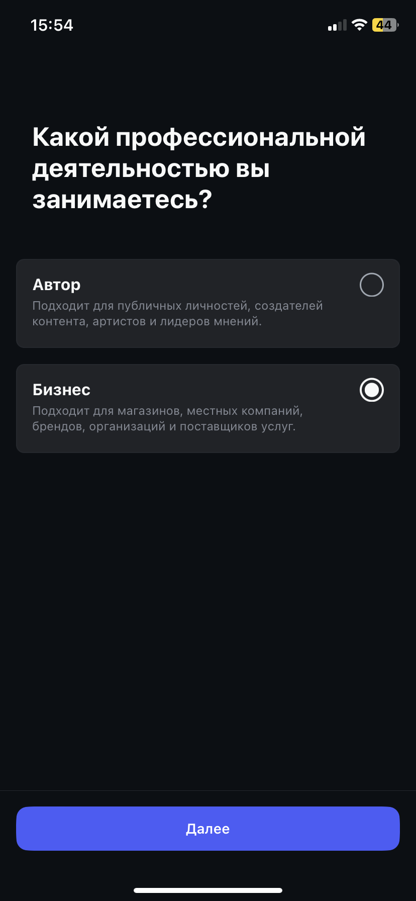

# Как создать чат-бота для \*\*stagram\*


\***Принадлежат компании Meta Platforms Inc**., деятельность которой признана **на территории Российской Федерации&#x20;**<mark style="color:red;">**экстремистской и**</mark> <mark style="color:red;">**запрещена!**</mark>&#x20;



Мы не призываем Пользователей к использованию ресурса.

Помните!

1. Действия, связанные с приобретением товаров или услуг у запрещенной организации могут быть расценены как финансирование экстремистской деятельности, согласно ст. 282.3 УК РФ.
2. Также с 1 сентября 2025 запрещено распространять рекламу на информационных ресурсах тех организаций, деятельность которых запрещена в РФ (согласно ч. 3 ст. 12 ФЗ от 25 июля 2002 № 114-ФЗ).


## Как подготовить свой аккаунт Instagram<mark style="color:red;">\*</mark>

Вам необходимо нажать на кнопку "Изменить" в профиле социальной сети.

Далее найдите кнопку "Переключиться на профессиональный аккаунт" и нажмите на нее:

<figure><figcaption></figcaption></figure> <figure><figcaption></figcaption></figure> <figure><figcaption></figcaption></figure>


Тип аккаунта нужно поменять на БИЗНЕС. Если у вас "Аккаунт автора", то интеграция работать НЕ будет. Нужен именно "Бизнес"


<figure><figcaption></figcaption></figure>

Далее проверьте свои данные, при необходимости нужно их заполнить:

<figure><figcaption></figcaption></figure>

Далее необходимо подождать до 30 секунд для переключения аккаунта, в остальном настройки завершены. После переключения вы увидите соответствующее уведомление, что вам доступны профессиональные инструменты. Можно посмотреть предлагаемые 8 шагов, а можно закрыть настройки:

<figure><figcaption></figcaption></figure>

После переключения на бизнес-аккаунт вы увидите информацию об этом в своем профиле:

<figure><figcaption></figcaption></figure>

## Как подключить аккаунт к Salebot

Чтобы подключить аккаунт Instagram<mark style="color:red;">**\***</mark> к Salebot, вам необходимо сначала подготовить свой аккаунт, переключив его на профессиональный (как это сделать, [рассказали выше](kak-sozdat-chat-bota-dlya-stagram.md#kak-podgotovit-svoi-akkaunt-instagram)).&#x20;

Далее перейдите в раздел "Каналы" в Salebot:

<figure><figcaption></figcaption></figure>

После чего найдите плашку Instagram для подключения к Salebot:

<figure><figcaption></figcaption></figure>

Вам откроется модальное окно следующего вида:

<figure><figcaption></figcaption></figure>

Далее вам остается кликнуть по кнопке "Вход", чтобы перейти непосредственно на официальный сайт социальной сети и ввести свой логин и пароль:

<figure><figcaption></figcaption></figure>

Далее вам остается разрешение на подключение Аккаунта к Salebot:

<figure><figcaption></figcaption></figure>

При успешном подключении будет уведомление:

<figure><figcaption></figcaption></figure>


**У API нет доступа к аккаунтам Instagram**<mark style="color:red;">**\***</mark>**, не являющимся бизнес-аккаунтами.**

Перед тем, как подключить чат-бота к Instagram<mark style="color:red;">**\***</mark>, вы должны перевести аккаунт в тип бизнес.

_Аккаунт должен быть именно бизнес аккаунтом, а не аккаунтом автора!_


Если вы всё настроили по инструкции, но бот не работает, проверьте подключение в самом аккаунте Инстаграм<mark style="color:red;">\*</mark>. Настройки - Конфиденциальность - Сообщения.

&#x20;Там в самом низу нужно включить ползунок "Разрешить доступ к сообщениям".

<figure><figcaption></figcaption></figure>

ff
