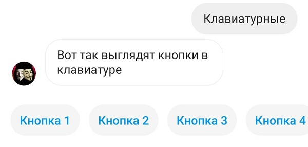
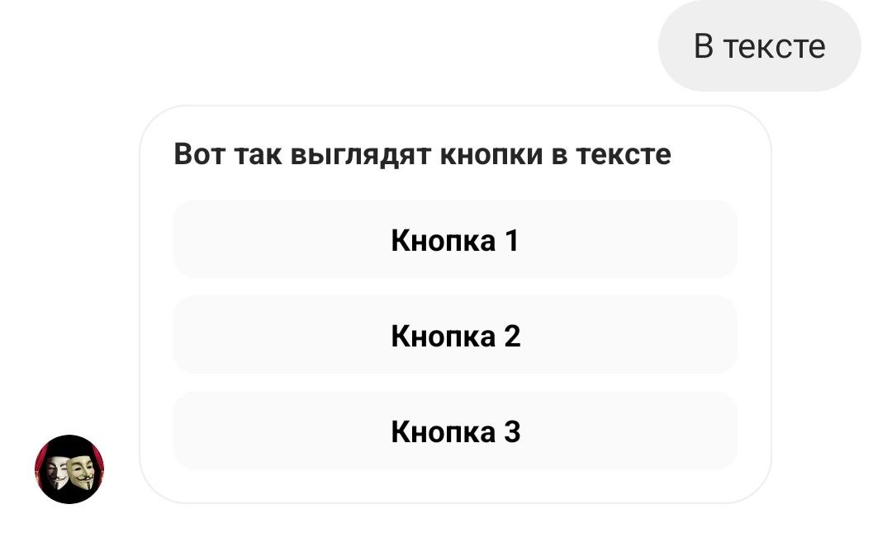

# Кнопки и вложения в \*\*\*stagram\*


\***Принадлежат компании Meta Platforms Inc**., которая признана **на территории Российской Федерации&#x20;**<mark style="color:red;">**экстремистской и**</mark> <mark style="color:red;">**запрещена!**</mark>&#x20;



Мы не призываем Пользователей к использованию ресурса.

Помните!

1. Действия, связанные с приобретением товаров или услуг у запрещенной организации могут быть расценены как финансирование экстремистской деятельности, согласно ст. 282.3 УК РФ.
2. Также с 1 сентября 2025 запрещено распространять рекламу на информационных ресурсах тех организаций, деятельность которых запрещена в РФ (согласно ч. 3 ст. 12 ФЗ от 25 июля 2002 № 114-ФЗ).


## **Как работать с кнопками**


Instagram<mark style="color:red;">**\***</mark> не поддерживает одновременную отправку inline и reply кнопок


### **Клавиатурные (reply)**


Instagram<mark style="color:red;">\*</mark> поддерживает до 11 кнопок reply



Кнопки могут располагаться только в линию


<figure><figcaption></figcaption></figure>

<figure><figcaption></figcaption></figure>

### В тексте (inline)

<figure><figcaption></figcaption></figure>

<figure><figcaption></figcaption></figure>


Instagram<mark style="color:red;">\*</mark> поддерживает не более 3 кнопок inline


<figure><figcaption></figcaption></figure>

Кнопки могут вести на сторонние ресурсы. Визуально эти кнопки ничем не отличаются.


Как настраивать кнопки, смотрите в статьях "[Вкладка: Кнопки](/broken/pages/mEiHpf4gAofvQxjN0pPh)" и "[Типы кнопок"](/broken/pages/xeepnRj969zW3xRimkdg).


## **Как задать вводные фразы**

Вводные фразы позволяют человеку начать беседу с компанией, используя список часто задаваемых запросов. Можно задать до четырех запросов.

<figure><figcaption></figcaption></figure>

Для настройки вводных фраз необходимо поставить бегунок в подключенном аккаунте Instagram<mark style="color:red;">\*</mark>, в разделе "Каналы"

<figure><figcaption></figcaption></figure>

При нажатии на этот бегунок появляется всплывающее окно, где можно задать нужные вводные фразы

<figure><figcaption></figcaption></figure>

После этого в вашей воронке настраиваете реакцию на фразы — нужные блоки переводите в состояние "Первостепенная проверка условия" и в условие записываете текст вводной фразы.


<mark style="color:red;">**Внимание!**</mark> Вводные фразы появляются у пользователей, которые ранее не контактировали с вашим аккаунтом Instagram\* (или в случае полного удаления предыдущего диалога)


## **Как работать с вложениями**

В сообщении можно отправлять вложения.  Подробно о том, какие вложения и как добавлять  описано в  разделе документации  [Отправка вложений. Отслеживание перехода по ссылкам](/broken/pages/-LxuPG8zMq42ZhsWKXOK)

&#x20;                                            &#x20;

<figure><figcaption></figcaption></figure>

<figure><figcaption></figcaption></figure>

<figure><figcaption></figcaption></figure>


В блок можно загружать вложения файлом или используя ссылку на файл.&#x20;

Загружаемый  видео файл должен быть не больше 20 MB, аудио и изображение  до 5 МВ.


**Требования к вложениям:**

| Тип медиафайла | Поддерживаемый формат | Максимальный размер |
| -------------- | --------------------- | ------------------- |
| Аудио          | M4A                   | 5 МБ                |
| Изображение    | JPEG, PNG             | 5 МБ                |
| Видео          | MP4                   | 20 МБ               |


Для аудио вложений НЕ рекомендуется использовать формат mp4, а в формате mp3 аудио не будет отправлено вообще.


## **Как создать карусель**

Как сделать такую карусель в Direct:

&#x20;                                     


В карусели может быть от 2 до 10 карточек(слайдов).


Рассмотрим на примере карусели из 3 карточек. Для создания карточек вам нужно в поле "Калькулятор" написать следующее:

p = \[{"title":"ЗАГОЛОВОК", "description": "ОПИСАНИЕ КАРТОЧКИ 1", "image": "ССЫЛКА НА КАРТИНКУ 1", "buttons":\[{"text":"ТЕКСТ КНОПКИ 1"}]},{"title":"ЗАГОЛОВОК", "description": "ОПИСАНИЕ КАРТОЧКИ 2", "image": "ССЫЛКА НА КАРТИНКУ 2", "buttons":\[{"text":"ТЕКСТ КНОПКИ 2"}]}, {"title":"ЗАГОЛОВОК", "description": "ОПИСАНИЕ КАРТОЧКИ 3", "image": "ССЫЛКА НА КАРТИНКУ 3", "buttons":\[{"text":"ТЕКСТ КНОПКИ 3"}]}]                                               &#x20;

r = send\_carousel(p, '')                                        &#x20;

<figure><figcaption></figcaption></figure>


Обратите внимание: выражение r = send\_carousel(p, '') - должно быть с новой строки в калькуляторе


То есть сначала записываем массив с title, description, image, buttons в переменную p (вы можете назвать переменную иначе), а далее используем ее в методе send\_carousel(p, '')                             &#x20;

В поле "Ответ" оставляет #{None}:                                         &#x20;

<figure><figcaption></figcaption></figure>


В кнопки карточек карусели вы можете вставлять ссылки, тогда при нажатии на кнопку пользователь перейдет по ссылке


Чтобы вставить ссылку в кнопку на карточке, запишите в массив:

p = \[{"title":"заголовок", "description": "ОПИСАНИЕ КАРТОЧКИ 1", "image": "ССЫЛКА НА КАРТИНКУ 1", "buttons":\[{"text":"ТЕКСТ КНОПКИ 1", "url":"ССЫЛКА ДЛЯ КНОПКИ" }]}]

&#x20;                                       (1).png>)

&#x20;                                     


В кнопки карточек карусели добавлен еще один необязательный параметр payload, который не будет отображаться клиенту, но позволит проанализировать сделанный клиентом выбор&#x20;


Поскольку часто требуется размещение карточек карусели с одинаковым текстом кнопки, то был добавлен еще один параметр **payload**, который не будет отображаться клиенту, но позволит проанализировать сделанный им выбор:

<figure><figcaption></figcaption></figure>

<figure><figcaption></figcaption></figure>

Обратите внимание на правильность его применения:\
p = \[{"title":"заголовок", "description": "ОПИСАНИЕ КАРТОЧКИ 1", "image": "ССЫЛКА НА КАРТИНКУ 1", "buttons":\[{"text":"ТЕКСТ КНОПКИ 1"**,"payload":"1"**}]},{"title":"заголовок", "description": "ОПИСАНИЕ КАРТОЧКИ 2", "image": "ССЫЛКА НА КАРТИНКУ 2", "buttons":\[{"text":"ТЕКСТ КНОПКИ 1"**,"payload":"2"**}]}, {"title":"заголовок", "description": "ОПИСАНИЕ КАРТОЧКИ 3", "image": "ССЫЛКА НА КАРТИНКУ 3", "buttons":\[{"text":"ТЕКСТ КНОПКИ 1"}]}]&#x20;

Параметр **payload** - может быть опущен, как показано на рисунке в кнопке 3
